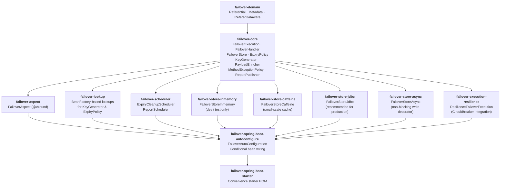
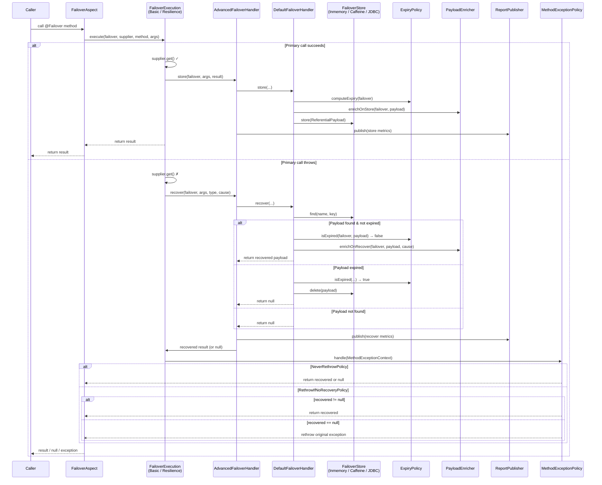

# **Failover**

[](https://codecov.io/gh/societe-generale/failover)
[](https://www.codacy.com/gh/societe-generale/failover/dashboard?utm_source=github.com&amp;utm_medium=referral&amp;utm_content=societe-generale/failover&amp;utm_campaign=Badge_Grade)
[](https://maven-badges.herokuapp.com/maven-central/com.societegenerale.failover/failover)
[](https://central.sonatype.com/artifact/com.societegenerale.failover/failover)
[](https://sourcespy.com/github/societegeneralefailover/)
> ***Failover library - To manage the failover on referential systems***

**"This library is to help to enable a failover to handle the failures on external services by keeping a local store for such api responses"**

- <small>Support </small>**Failover**<small> needs for your domain services</small>
- <small>Simple to use by simply annotating with</small> **@Failover(name="client-by-id")**
- <small>Support for various failover store</small> **Inmemory**, **Caffeine**, **Jdbc** etc
- <small>Support for various failover execution</small> **Basic**, **Resilience** etc
- <small>Easy to </small>**customize**<small>  and use by providing your own</small> **Expiry Policy**, **Failover Store**, **RecoveredPayloadHandler**<small> or many other providers</small>

---

## Spring Boot Starter Dependency

You can configure the failover module with your project by adding the below starter dependency and the configurations
 
```pom.xml
    <dependency>
        <groupId>com.societegenerale.failover</groupId>
        <artifactId>failover-spring-boot-starter</artifactId>
        <version> <!-- add latest version --> </version>
    </dependency>
```

For more details, please go to [Getting Started](https://societe-generale.github.io/failover/#/documentation/quick-start)

---


---

## Key Features  

  

- **A light framework ( Domain and Core modules )** : No external frameworks  ( Just by @Failover Annotation )
  - Easy integration with any jvm base project with no spring framework. 
  - **Spring Boot Starter** : Spring boot starter for easy spring integration
- **Failover Execution Strategy** :  ( Eliminate tightly coupling with other frameworks )
  - With simple Try Catch  ( No heavy framework )
  - Support for resilience4j-circuitbreaker 	
  - Easily pluggable architecture for custom Failover Execution Strategy 
- **Failover Store** :  
  - In-memory : Not recommended for production 
  - Cache : With caffeine cache ( for very small-scale use case )
  - JDBC : For any database support ( recommended for most common use cases )
  - CUSTOM : For any other custom failover store
- **Failover Expiry Policy** :
  - With simple time duration ( SECONDS, MINUTES, HOURS, DAYS, etc. )
  - Custom expiry policy : Team can configure any specific custom expiry policy for their need. Ex: For not to expire on weekends
- **Monitoring** : Various failover metrics are available for effective monitoring
  - **Failover Configuration Dashboard** : Shows all configurations on failover
  - **Failover Rates** : Shows overall failover on external service call 
  - **Failover Recovery Rates** : Shows recovery on failover  
  - **Failover NonRecovery Rates** : Shows non recovery on failover ( actual impact or exception on application )
---
 
## Use case 

### Context
In microservice architecture, many types of microservices are present in a platofrm. In this example, we have 3 category of microservices.

1. **Internal Microservices** :  
   - Full ownership is with the application teams. 
   - If there is any issue in Internal Services, the team has full control of it and easy to improve. 
2. **Transversal Services** :
   - Ownership is not with application team, but managed by other teams in the organization. 
   - If there is any issue in such service, the application team has to escalate the issues with the respective owners/teams and wait for the resolution. Most of the time this take some time. 
3. **External Service** : 
   - Ownership is with external organization
   - If there is any issue in such service, the application team has to escalate the issues with the respective teams in other organization and wait for the resolution. Most of the time this take some time. 


### Scenario 
**When a referential services having some issues where the application teams does not have a control ?**
- In such condition, the impact will be cascaded to each applications. 
- If referential service is down, the application will have some exception. ( *500 : Internal Server Error* )
- If the referential service is slow, our application will also have the slowness. 

### Solution 
- Apply **failover** 
- Define the expiry for each referential **with the acceptance of business**
- Define **acceptable expiry policy**


### Benefit
The solution **will not eliminate such failures completely (not 100%)**. 
However, this will help us to **reduce the impact** on the business on a large scale.


---

## MONITORING

    The failover lib comes with good monitoring metrics which help the teams to understand the various insights of overall failures on the application

### Failover Configuration Dashboard

> For this dashboard, you must provide below configuration :
```yaml
failover:
  package-to-scan: <your base package> # Your base package where @Failover annotations are declared
```

### Failover Rates


### Failover Recovery Rates


### Failover NonRecovery Rates 


---

## Architecture

### Module Structure



---

### Request Flow



---

### Key Abstractions & Extension Points

```mermaid
classDiagram
    direction TB

    class FailoverExecution {
        <<interface>>
        +execute(failover, supplier, method, args) T
        +decorateSupplier(failover, supplier, args) Supplier~T~
    }
    class BasicFailoverExecution {
        store on success
        recover + policy on exception
    }
    class ResilienceFailoverExecution {
        wraps supplier with CircuitBreaker
    }
    FailoverExecution <|.. BasicFailoverExecution
    FailoverExecution <|.. ResilienceFailoverExecution

    class FailoverHandler {
        <<interface>>
        +store(failover, args, payload) T
        +recover(failover, args, type, cause) T
        +clean()
    }
    class DefaultFailoverHandler {
        KeyGenerator · ExpiryPolicy
        FailoverStore · PayloadEnricher
    }
    class AdvancedFailoverHandler {
        decorates DefaultFailoverHandler
        adds reporting + RecoveredPayloadHandler
    }
    FailoverHandler <|.. DefaultFailoverHandler
    FailoverHandler <|.. AdvancedFailoverHandler

    class FailoverStore {
        <<interface>>
        +store(ReferentialPayload)
        +find(name, key) Optional
        +delete(ReferentialPayload)
        +cleanByExpiry(now)
    }
    FailoverStore <|.. FailoverStoreInmemory
    FailoverStore <|.. FailoverStoreCaffeine
    FailoverStore <|.. FailoverStoreJdbc
    FailoverStore <|.. FailoverStoreAsync

    class MethodExceptionPolicy {
        <<interface>>
        +handle(MethodExceptionContext) T
    }
    class NeverRethrowMethodExceptionPolicy {
        return recovered or null, never throw
    }
    class RethrowIfNoRecoveryMethodExceptionPolicy {
        return recovered if present
        else rethrow original cause
    }
    MethodExceptionPolicy <|.. NeverRethrowMethodExceptionPolicy
    MethodExceptionPolicy <|.. RethrowIfNoRecoveryMethodExceptionPolicy

    class ExpiryPolicy {
        <<interface>>
        +computeExpiry(failover) LocalDateTime
        +isExpired(failover, payload) boolean
    }

    class KeyGenerator {
        <<interface>>
        +key(failover, args) String
    }

    class PayloadEnricher {
        <<interface>>
        +enrichOnStore(failover, payload)
        +enrichOnRecover(failover, payload, cause)
    }

    class ReportPublisher {
        <<interface>>
        +publish(Metrics)
    }
    class CompositeReportPublisher {
        delegates to LoggerReportPublisher
        and MetricsReportPublisher
    }
    ReportPublisher <|.. CompositeReportPublisher
```



---

### Store Options

| Store | Module | Use Case |
|---|---|---|
| `FailoverStoreInmemory` | `failover-store-inmemory` | Development & testing only |
| `FailoverStoreCaffeine` | `failover-store-caffeine` | Small-scale, single-node with cache TTL |
| `FailoverStoreJdbc` | `failover-store-jdbc` | Production — any SQL database |
| `FailoverStoreAsync` | `failover-store-async` | Decorator — non-blocking writes around any store |

### Exception Policies

| Policy | Behaviour |
|---|---|
| `RethrowIfNoRecoveryMethodExceptionPolicy` *(default)* | Serves stale data when available; rethrows original exception when recovery returns null |
| `NeverRethrowMethodExceptionPolicy` | Always returns recovered data or null, never propagates the exception |
| Custom bean | Implement `MethodExceptionPolicy` and register as a Spring bean |

---

## Code Owners
- [Anand MANISSERY](https://github.com/anandmnair)

## Thanks and acknowledgement 
- [Vincent FUCHS](https://github.com/vincent-fuchs) 
- Patrice FRICARD
- Igor LOVICH
- Abilash TITUS

---
