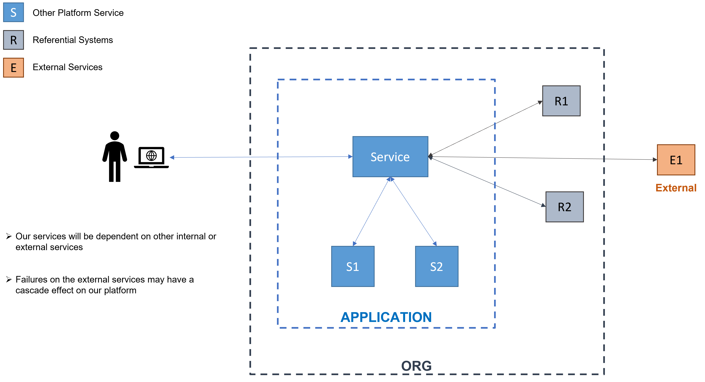
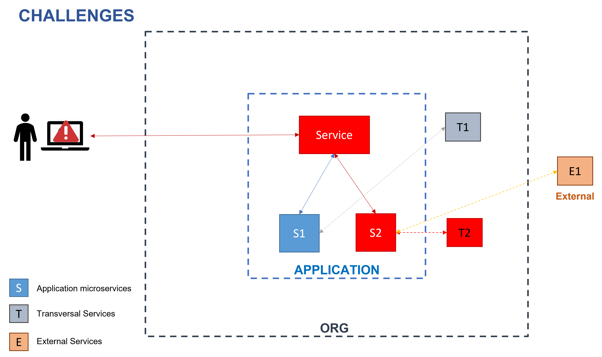
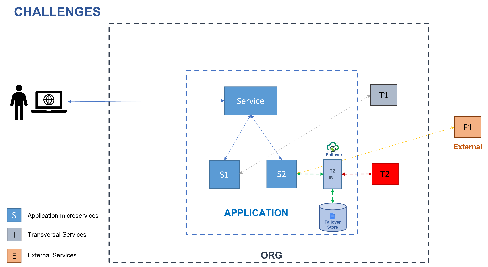
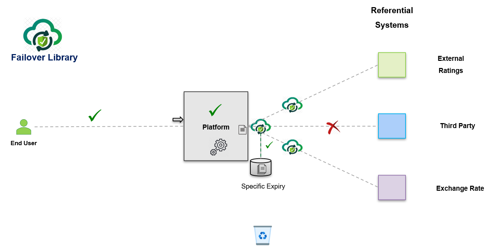
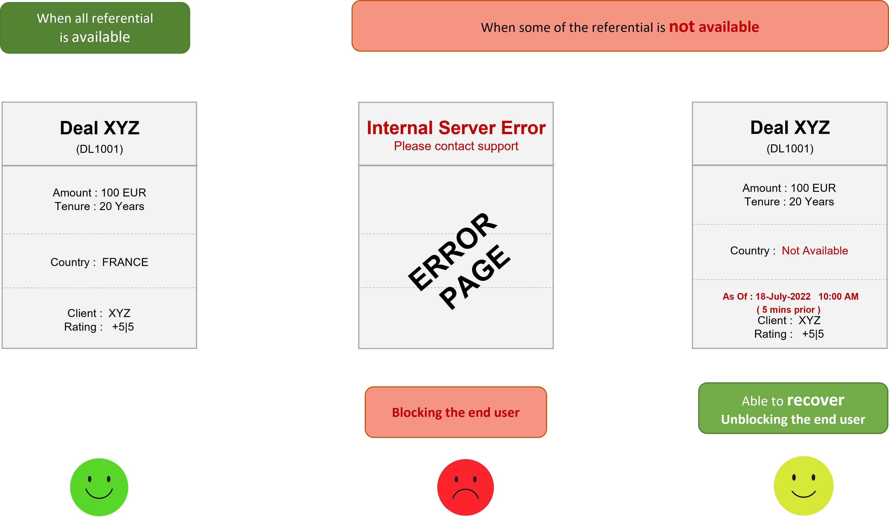
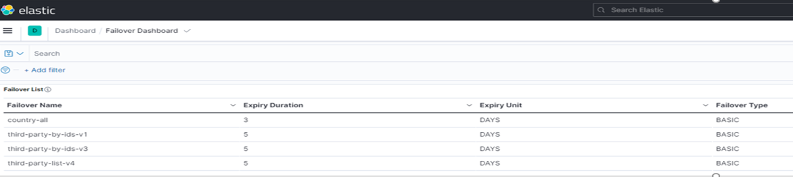
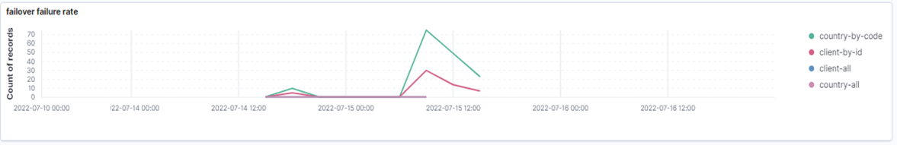
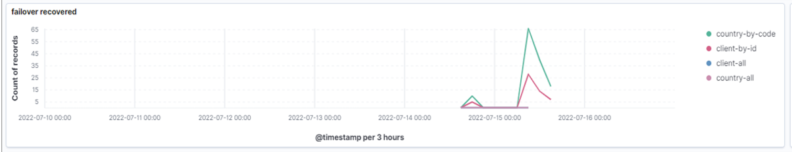
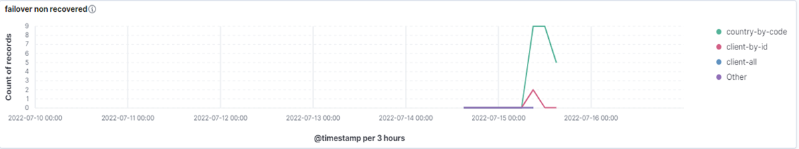

<p align="center">
  <a href="https://github.com/societe-generale/failover/actions/workflows/java-maven-ci.yml">
    
  </a>
  <a href="https://codecov.io/gh/societe-generale/failover">
    
  </a>
  <a href="https://central.sonatype.com/artifact/com.societegenerale.failover/failover">
    
  </a>
  
  
  
</p>

---

<p align="center">
  
</p>

<h1 align="center">Failover</h1>

<h3 align="center">Stop cascading outages. One annotation.</h3>

<p align="center">
  Transparent failover for referential services — annotation-driven, Spring Boot native.
</p>

---

## The problem

In microservice platforms your application calls services it doesn't own — currency tables, country lists, client profiles. When those fail the cascade reaches your users, and there is nothing you can do to fix the upstream.

<p align="center">
  
</p>

One outage in a transversal or external service cascades through every dependent service, returning 500s to users who have no visibility into why.

<p align="center">
  
</p>

---

## The solution

Failover sits between your service and the referential system. On success it stores the result with a configured TTL. On failure it serves the last known-good value — transparently, with zero boilerplate.

<p align="center">
  
</p>

<p align="center">
  
</p>

```java
// Before: bespoke, brittle, repeated everywhere
public Country findByCode(String code) {
    try {
        Country c = upstream.findByCode(code);
        localRepo.save(c, computeExpiry());
        return c;
    } catch (Exception e) {
        Country cached = localRepo.findByCode(code);
        if (cached == null || isExpired(cached)) throw e;
        cached.setUpToDate(false);
        return cached;
    }
}

// After: declarative, consistent, zero boilerplate
@Failover(name = "country-by-code", expiryDuration = 24, expiryUnit = ChronoUnit.HOURS)
Country findByCode(String code);
```

---

## User impact

Without Failover a referential failure returns a 500 and blocks the user completely. With Failover the last stored result is served — marked with its cached timestamp, but fully functional.

<p align="center">
  
</p>

---

## Quick start

Add the starter:

```xml
<dependency>
    <groupId>com.societegenerale.failover</groupId>
    <artifactId>failover-spring-boot-starter</artifactId>
    <version><!-- latest --></version>
</dependency>
```

Configure a store:

```yaml
failover:
  store: jdbc                     # inmemory | caffeine | jdbc
  package-to-scan: com.example    # package where @Failover interfaces live
```

Annotate your interface:

```java
@Failover(name = "country-by-code", expiryDuration = 24, expiryUnit = ChronoUnit.HOURS)
Country findByCode(String code);
```

> Full walkthrough → [**Quickstart guide**](https://societegenerale.github.io/failover/getting-started/quickstart/)

---

## Key features

| Feature | Description |
|---|---|
| **Automatic store on success** | Every successful response persisted under a derived key — no explicit save calls |
| **Transparent recovery on failure** | Last stored result returned when upstream throws — callers never see the exception |
| **Business-configured TTL** | Fixed duration, SpEL expression, or a custom `ExpiryPolicy` |
| **Pluggable backing stores** | InMemory · Caffeine · JDBC (H2 / PostgreSQL / MySQL / Oracle) · custom `FailoverStore` |
| **Scatter / Gather** | Collection-returning methods split into per-entity entries; partial recovery handled automatically |
| **Multi-tenant isolation** | `TABLE_PREFIX` or `SCHEMA` strategy routes each request to the correct tenant store |
| **Async non-blocking writes** | Store operations offloaded to a virtual-thread executor; read path stays synchronous |
| **Observable out of the box** | Every store/recover event emits SLF4J logs and Micrometer counters — no extra instrumentation |
| **Resilience4j integration** | Circuit-breaker wraps upstream calls when `type: resilience` |

---

## Module structure

```
failover-spring-boot-starter          ← the only dependency you need
├── failover-domain                   @Failover · Referential · ReferentialAware · Metadata
├── failover-core                     FailoverHandler · KeyGenerator · ExpiryPolicy · PayloadEnricher
├── failover-aspect                   Spring AOP @Around interceptor
├── failover-store-inmemory           ConcurrentHashMap store — dev/test only
├── failover-store-caffeine           Caffeine-backed in-process store
├── failover-store-jdbc               JDBC store — H2 · PostgreSQL · MySQL · MariaDB · Oracle
├── failover-store-async              Non-blocking write decorator (virtual-thread executor)
├── failover-store-multitenant        TABLE_PREFIX / SCHEMA per-tenant routing
├── failover-execution-resilience     Resilience4j circuit-breaker integration
├── failover-scheduler                Expiry-cleanup · report-publisher schedulers
└── failover-spring-boot-autoconfigure  Zero-config Spring Boot auto-configuration
```

---

## Monitoring

Failover emits Micrometer counters for every store and recover event. Connect to Elastic, Grafana, or any compatible backend.

<p align="center">
  
</p>

Enable the configuration dashboard by setting `failover.package-to-scan` — it shows all active `@Failover` configurations at a glance.

| Chart | Description |
|---|---|
|  | **Failover rate** — total upstream failures intercepted per referential |
|  | **Recovery rate** — failures resolved with a stored result (users unblocked) |
|  | **Non-recovery rate** — failures with no stored result (actual user impact) |

---

## Documentation

| Page | Description |
|---|---|
| [Quickstart](https://societegenerale.github.io/failover/getting-started/quickstart/) | Working end-to-end example in 5 minutes |
| [Installation](https://societegenerale.github.io/failover/getting-started/installation/) | Maven and Gradle coordinates for every module |
| [Concepts](https://societegenerale.github.io/failover/concepts/how-it-works/) | Store/recover lifecycle, key derivation, expiry policies |
| [Configuration reference](https://societegenerale.github.io/failover/configuration/properties-reference/) | Every `failover.*` property with types and defaults |
| [ADR index](https://societegenerale.github.io/failover/adr/) | 25 architecture decisions — the why behind every design choice |

---

## Contributing

Bug reports, feature proposals, and pull requests are welcome. See [CONTRIBUTING](https://societegenerale.github.io/failover/contributing/) for guidelines.

## Acknowledgements

Built at Société Générale to break referential-outage cascades once, reusably, across every service.

- [Anand Manissery](https://github.com/anandmnair) — creator and maintainer
- [Vincent Fuchs](https://github.com/vincent-fuchs) — contributions and review
- Patrice Fricard, Igor Lovich, Abilash Titus — early contributors

---

Licensed under [Apache 2.0](LICENSE).