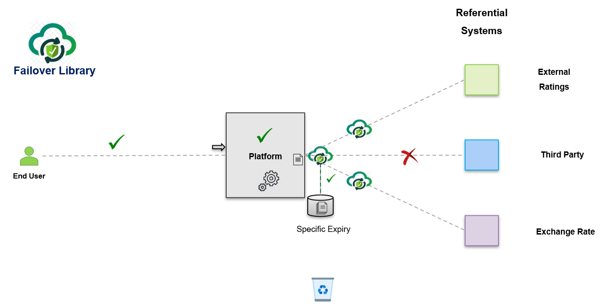

 

# **Failover** <small>***1.0.x***</small>

> ***Failover library - To manage the failover on referential systems***

- <small>Support </small>**Failover**<small> needs for your domain services</small>
- <small>Simple to use by simply annotating with </small>**@Failover(name="client-by-id")**
- <small>Support for various failover store</small>**Inmemory**, **Caffeine**, **Jdbc** etc
- <small>Support for various failover execution</small>**Basic**, **Resilience** etc
- <small>Easy to </small>**customize**<small>  and use by providing your own </small>**Expiry Policy**, **Failover Store**, **RecoveredPayloadHandler**<small> or many other providers</small>

[GitHub](https://github.com/societe-generale/failover-lib)

[Getting Started](documentation/quick-start.md)  

---

---

## Features
- **A light framework ( Domain and Core modules )** : No external frameworks  ( Just by @Failover Annotation ) 
- **Failover Execution Strategy** :  ( Eliminate tightly coupling with other frameworks )
  - With simple Try Catch  ( No heavy framework )
  - Support for resilience4j-circuitbreaker 	
  - Easily pluggable architecture for custom Failover Execution Strategy 
- **Failover Store** :  
  - In-memory : Not recommended for production 
  - Cache : With caffeine cache ( for very small-scale use case )
  - JDBC : For any database support ( recommended for most common use cases )
  - CUSTOM : For any other custom failover store
- **Monitoring** : Various failover metrics are available for effective monitoring
- **Spring Boot Starter** : Support for spring boot starter for easy integration
