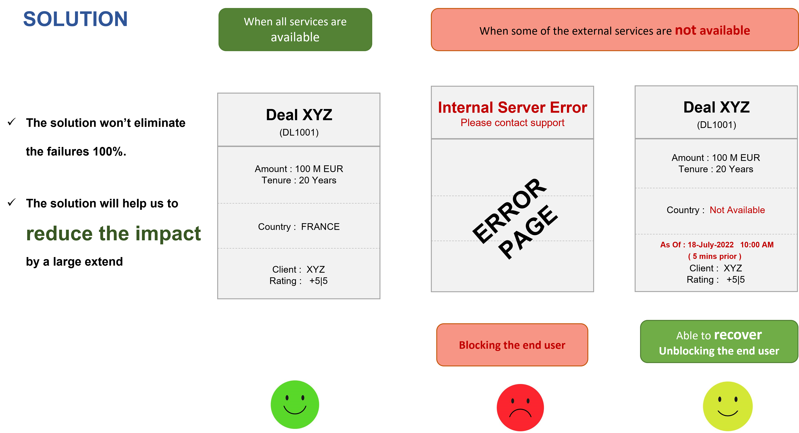

 

# **Failover** <small>***1.0.x***</small>

> ***Failover library - To manage the failover on referential systems***

- <small>Support </small>**Failover**<small> needs for your domain services</small>
- <small>Simple to use by simply annotating with </small>**@Failover(name="client-by-id")**
- <small>Support for various failover store</small>**Inmemory**, **Caffeine**, **Jdbc** etc
- <small>Support for various failover execution</small>**Basic**, **Resilience** etc
- <small>Easy to </small>**customize**<small>  and use by providing your own </small>**Expiry Policy**, **Failover Store**, **RecoveredPayloadHandler**<small> or many other providers</small>

---
## Spring Boot Starter Dependency

You can configure the failover module with your project by adding the below starter dependency and the configurations
 
```pom.xml
    <dependency>
        <groupId>com.societegenerale.failover</groupId>
        <artifactId>failover-spring-boot-starter</artifactId>
        <version> <!-- add latest version --> </version>
    </dependency>
```

For more details, please go to [Getting Started](https://societe-generale.github.io/failover/#/documentation/quick-start)

---


---

## Key Features
- **A light framework ( Domain and Core modules )** : No external frameworks  ( Just by @Failover Annotation ) 
- **Failover Execution Strategy** :  ( Eliminate tightly coupling with other frameworks )
  - With simple Try Catch  ( No heavy framework )
  - Support for resilience4j-circuitbreaker 	
  - Easily pluggable architecture for custom Failover Execution Strategy 
- **Failover Store** :  
  - In-memory : Not recommended for production 
  - Cache : With caffeine cache ( for very small-scale use case )
  - JDBC : For any database support ( recommended for most common use cases )
  - CUSTOM : For any other custom failover store
- **Monitoring** : Various failover metrics are available for effective monitoring
- **Spring Boot Starter** : Support for spring boot starter for easy integration

---

## Use case 

### Context
There will be many microservices will be in a platform. In this example, we have 3 category of services. 
1. **Internal microservices** :  
   - Full ownership is with the application teams. 
   - If there is any issue in Internal Services, the team has full control of it and easy to improve. 
2. **Referential Services** :
   - Ownership is not with application team, but managed by other teams in the organization. 
   - If there is any issue in such service, the application team has to escalate the issues with the respective owners/teams and wait for the resolution. Most of the time this take some time. 
3. **External Service** : 
   - Ownership is with external organization
   - If there is any issue in such service, the application team has to escalate the issues with the respective teams in other organization and wait for the resolution. Most of the time this take some time. 


### Scenario 
**When a referential services ( or external service ) having some issues where the application teams does not have a control ?**
- In such condition, the impact will be cascaded to each applications. 
- If referential service is down, the application will have some exception. ( *500 : Internal Server Error* )
- If the referential service is slow, our application will also have the slowness. 

### Solution 
- Apply **failover** 
- Define the expiry for each referential **with the acceptance of business**
- Define **acceptable expiry policy**


### Benefit
The solution **will not eliminate such failures completely (not 100%)**.
However, this will help us to **reduce the impact** on the business on a large scale.



### Key Features


---

### Code Owners
- [Anand MANISSERY](https://github.com/anandmnair)

### Thanks and acknowledgement 
- [Vincent FUCHS](https://github.com/vincent-fuchs) 
- Patrice FRICARD
- Igor LOVICH
- Abilash TITUS
---

