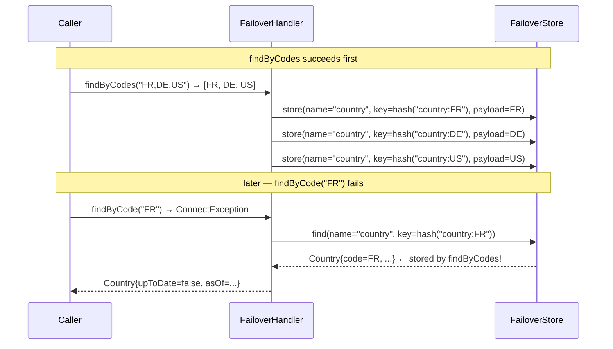

# Domain Grouping

The `domain` attribute on `@Failover` lets two or more annotations share the same store namespace. This is the mechanism that enables a scatter/gather list endpoint and a single-entity endpoint to serve each other's cached data.

---

## The Problem Without Domain

Without domain grouping, two failovers for the same business entity have independent stores:

```java
@Failover(name = "country-by-code")      // FAILOVER_NAME = "country-by-code"
Country findByCode(String code);

@Failover(name = "countries-by-codes", payloadSplitter = "countrySplitter")
List<Country> findByCodes(String codes); // FAILOVER_NAME = "countries-by-codes"
```

- `findByCodes("FR,DE,US")` succeeds → stores FR, DE, US under `"countries-by-codes"`.
- `findByCode("FR")` fails → looks in `"country-by-code"` → empty → no recovery.

The scatter store is never consulted for the single-entity lookup.

---

## The Solution — Shared Domain

```java
@Failover(
    name = "country-by-code",
    domain = "country"                           // effectiveName = "country"
)
Country findByCode(String code);

@Failover(
    name = "countries-by-codes",
    domain = "country",                          // effectiveName = "country"
    payloadSplitter = "countrySplitter",
    expiryDuration = 24, expiryUnit = ChronoUnit.HOURS
)
List<Country> findByCodes(String codes);
```

Both annotations now use `"country"` as `FAILOVER_NAME`. The UUID key hash also prefixes with `"country"`, so `findByCode("FR")` and the FR slice from `findByCodes("FR,DE")` produce the same store address.

---

## Cross-Recovery Sequence



---

## effectiveName Resolution

`FailoverNameResolver.effectiveName(failover)` computes the effective namespace:

```java
String effectiveName = failover.domain().isBlank()
    ? failover.name()
    : failover.domain();
```

This value is used in two places:

1. **Key hashing** (`FailoverKeyGenerator`) — prefixed to the raw key before UUID conversion.
2. **Store operations** (`DefaultFailoverHandler`) — written to / read from `FAILOVER_NAME`.

!!! note "Logging still uses `name`, not `effectiveName`"
    INFO/WARN log messages use `failover.name()`, not `effectiveName`. This keeps logs readable and lets you trace which specific annotation triggered the operation.

---

## Expiry Consistency Requirement

All `@Failover` annotations sharing a domain should use the same expiry configuration. Entries are stored with the TTL of whichever annotation last wrote them. The startup scanner warns when mismatched expiry is detected:

```
WARN  FailoverScanner: Domain 'country' has mismatched expiry:
      country-by-code=24h, countries-by-codes=48h — last writer wins
```

!!! warning "Expiry mismatch behaviour"
    The last writer overwrites `EXPIRE_ON` for that key. An entry stored by `findByCodes` at 48h will have its expiry overwritten to 24h when `findByCode` next stores the same key. Align expiry within a domain.

---

## Summary

| Without `domain` | With `domain` |
|---|---|
| Each failover has its own `FAILOVER_NAME` namespace | All failovers in the domain share one `FAILOVER_NAME` |
| Store/recover operations are isolated | Any successful call populates data any other can recover |
| Partial recovery not possible across failovers | Scatter/gather slices accessible from single-entity lookups |

---

## Next Steps

- [Scatter / Gather](scatter-gather.md) — per-entity storage that pairs with domain grouping
- [Key Generation](key-generation.md) — how `effectiveName` feeds into the key hash
- [Properties Reference](../configuration/properties-reference.md) — complete `@Failover` attribute reference
