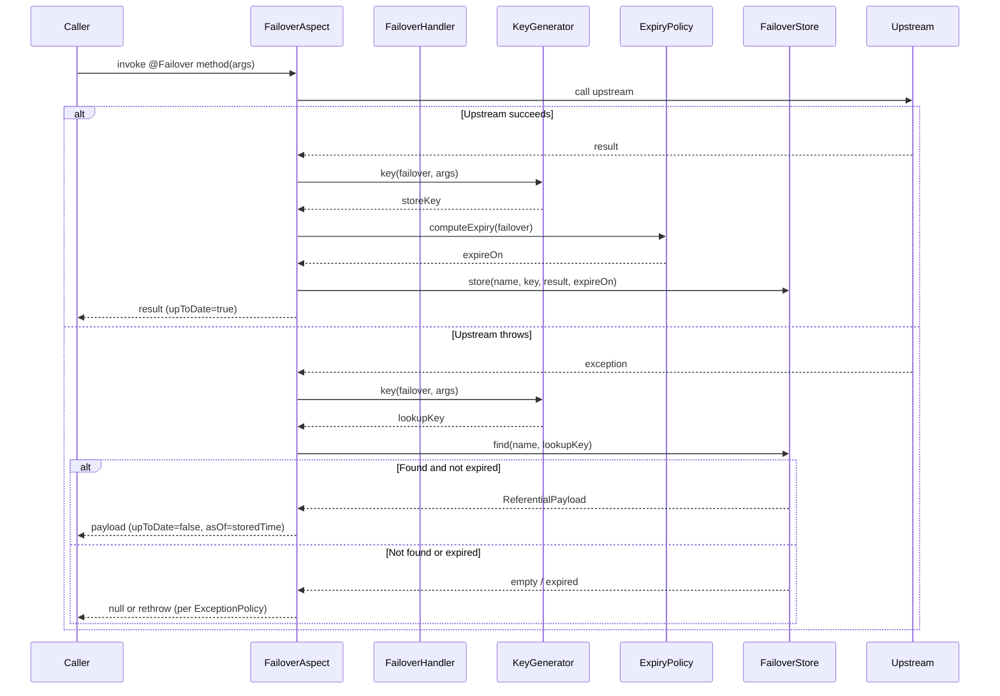

# How It Works

## The Store / Recover Lifecycle

Every `@Failover`-annotated method is intercepted by a Spring AOP aspect. The aspect delegates to a `FailoverHandler` which orchestrates storing, recovering, and cleaning.



---

## Key Components

### FailoverAspect

`FailoverAspect` is a Spring AOP `@Around` advice that intercepts every method annotated with `@Failover`. It:

1. Calls the method.
2. On success → delegates to `FailoverHandler.store(failover, args, result)`.
3. On exception → delegates to `FailoverHandler.recover(failover, args, clazz, throwable)`.

The aspect applies to any Spring-proxied bean — Feign clients, `@Service`, `@Component`, `@Repository`, anything managed by the Spring container.

### FailoverHandler

The handler is the central coordinator. The default implementation (`DefaultFailoverHandler`) performs:

- **Store path**: generates the key, computes expiry, enriches the payload with `asOf` and `upToDate=true`, persists to the store.
- **Recover path**: looks up the stored entry, checks expiry, enriches with `upToDate=false`, returns the payload.
- **Clean**: removes entries whose `EXPIRE_ON` is before the current timestamp.

For scatter/gather methods, `ScatterGatherFailoverHandler` wraps the default handler to split and merge payloads (see [Scatter / Gather](scatter-gather.md)).

### FailoverStore

The store abstraction (`FailoverStore<T>`) has three operations:

| Method | Description |
|---|---|
| `store(ReferentialPayload<T>)` | Persist a payload entry |
| `find(name, key)` | Look up an entry by failover name and key |
| `cleanByExpiry(Instant)` | Delete all entries expired before the given instant |
| `delete(ReferentialPayload<T>)` | Delete a specific entry |

Implementations: [InMemory](../modules/core.md), [Caffeine](../modules/store-caffeine.md), [JDBC](../modules/store-jdbc.md), or custom.

---

## ReferentialPayload

`ReferentialPayload<T>` is the envelope stored in the backing store. It carries:

| Field | Type | Description |
|---|---|---|
| `name` | `String` | The `@Failover` name |
| `key` | `String` | Derived from method arguments |
| `upToDate` | `Boolean` | `true` when stored; `false` after recovery |
| `asOf` | `Instant` | Timestamp of original successful call |
| `expireOn` | `Instant` | When this entry expires |
| `payload` | `T` | The actual method return value |

---

## Payload Enrichment

When returning recovered data, the `PayloadEnricher` sets `upToDate=false` and `asOf` on the payload object if it implements `Referential` or `ReferentialAware`. This makes it easy for callers to distinguish live data from recovered data.

```java
// Live call → upToDate=true, asOf=now
Country fr = client.findByCode("FR");
fr.isUpToDate(); // true

// After upstream failure
Country frRecovered = client.findByCode("FR");
frRecovered.isUpToDate(); // false
frRecovered.getAsOf();    // timestamp of the original successful call
```

If your type implements neither `Referential` nor `ReferentialAware`, enrichment is skipped and the payload is returned as-is.

---

## Exception Policy

What happens when recovery fails (no entry found or entry expired) is controlled by `failover.exception-policy`:

| Policy | Behaviour |
|---|---|
| `RETHROW` (default) | The original upstream exception is re-thrown |
| `NEVER_THROW` | `null` is returned (or the result of a custom `RecoveredPayloadHandler`) |
| `CUSTOM` | Provide your own `FailoverExecution` bean |

---

## Scheduler

Two background jobs run on configurable cron schedules:

- **Expiry cleanup** (`ExpiryCleanupScheduler`) — calls `FailoverHandler.clean()` hourly by default.
- **Report publisher** (`ReportScheduler`) — emits store health metrics daily by default.

Both are controlled by `failover.scheduler.*` properties and can be disabled independently.
