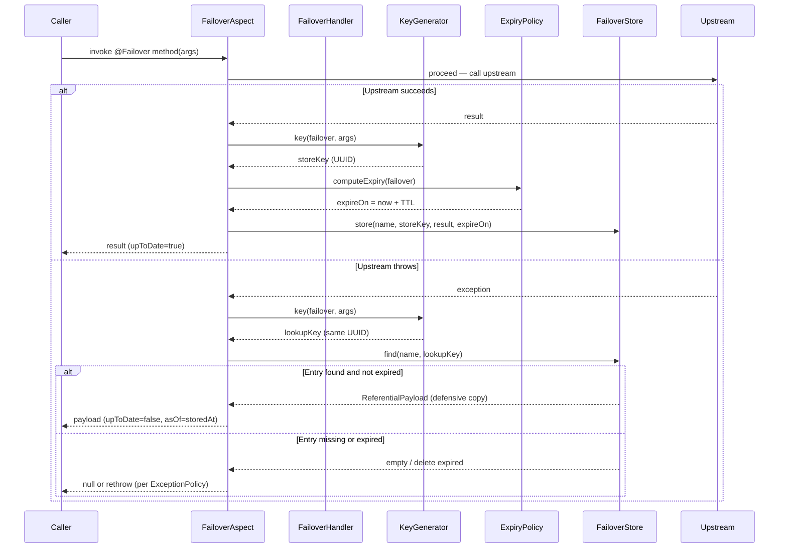
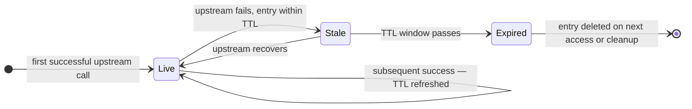
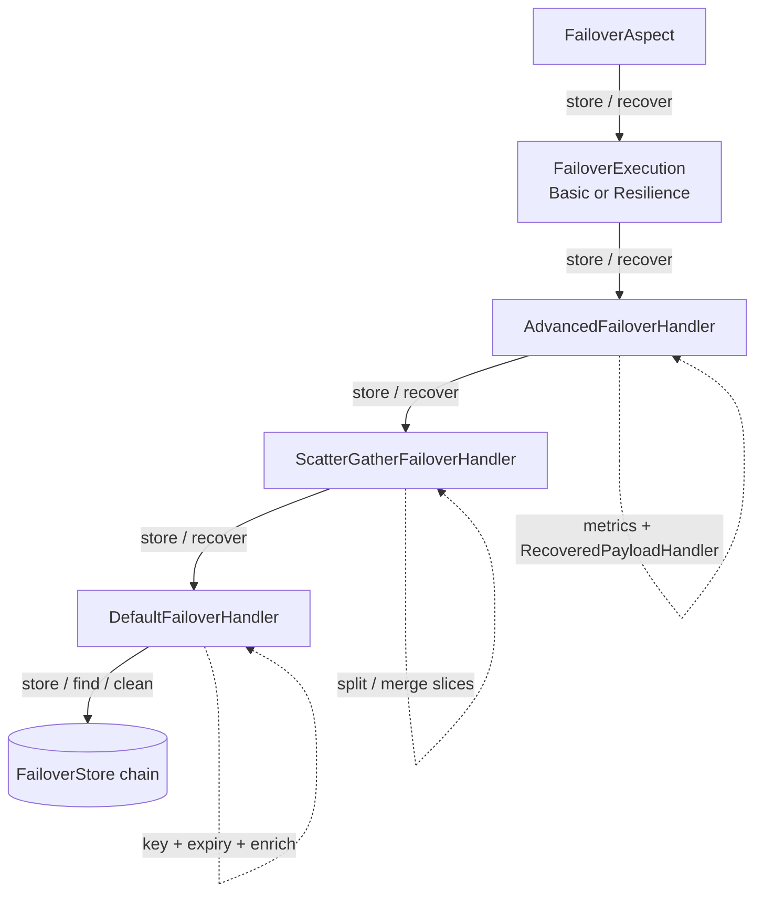
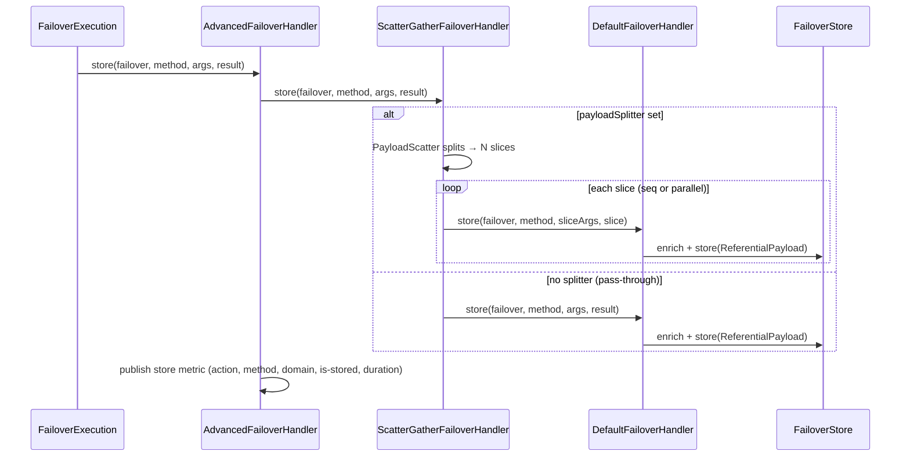
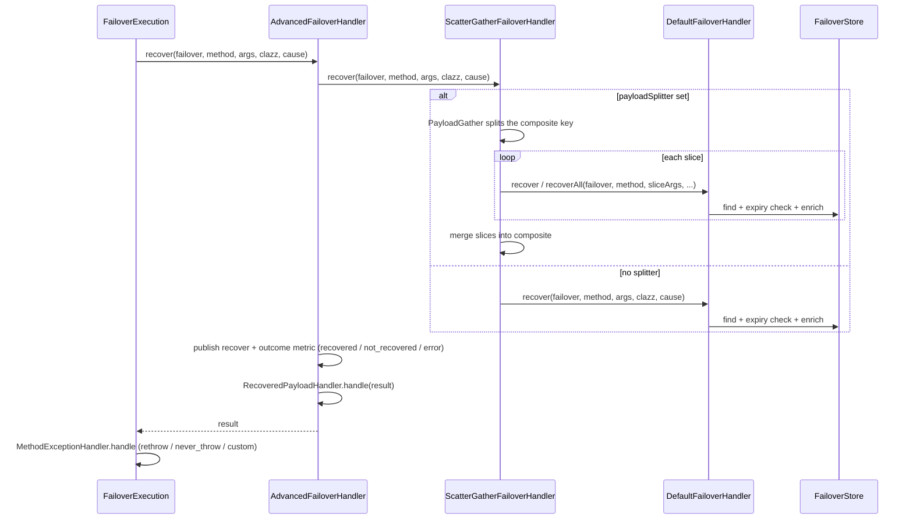
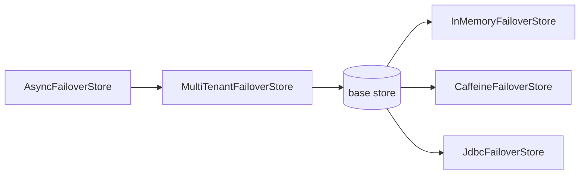

# How It Works

Failover sits between your Spring bean and its upstream dependency. On success it saves the result; on failure it serves the last saved result — transparently, with no changes to calling code.

---

## Store / Recover Lifecycle



---

## Entry Lifecycle States



Callers receive `upToDate=true` in **Live** state and `upToDate=false` in **Stale** state. Expired entries are never served.

---

## Handler Chain and Execution Order

Three handlers compose in a decorator chain. Each delegates **inward** to the next, then does its own
work on the way **out**:



| Layer | Class | Responsibility |
|---|---|---|
| Outermost | `AdvancedFailoverHandler` | Publishes Micrometer metrics (per-method `failover.recovery.outcome.total`, store/recover counters); invokes `RecoveredPayloadHandler` on the recovered result |
| Middle | `ScatterGatherFailoverHandler` | When `payloadSplitter` is set, splits the composite into per-entity slices and merges on recover (via `PayloadScatter` / `PayloadGather` / `SliceDispatcher`); otherwise a transparent pass-through |
| Innermost | `DefaultFailoverHandler` | Core logic: key derivation, expiry compute/check, store/find/enrich against the `FailoverStore` |

### Assembly order (build) vs invocation order (runtime)

The chain is **built inside-out** but **invoked outside-in**. Assembly happens once at startup in the
`failoverHandler` bean (see [Auto-configuration](#auto-configuration-cross-check)):

```text
build  (startup):   DefaultFailoverHandler
                  → ScatterGatherFailoverHandler(delegateT = default, delegateR = default)
                  → AdvancedFailoverHandler(scatter)
                  → FailoverExecution (Basic | Resilience) → FailoverAspect

invoke (per call):  FailoverAspect → FailoverExecution → Advanced → ScatterGather → Default → Store
```

> `delegateT` and `delegateR` are the **same** `DefaultFailoverHandler` instance — the composite and
> the per-slice paths share one inner handler.

### Store path (upstream succeeded)



1. `FailoverExecution` (after the upstream call succeeds) calls `failoverHandler.store(failover, method, args, result)`.
2. `AdvancedFailoverHandler` times the call, delegates inward, then publishes the store metric.
3. `ScatterGatherFailoverHandler` either scatters into slices (each routed to `DefaultFailoverHandler.store`) or passes through.
4. `DefaultFailoverHandler` derives the key, enriches the payload, and writes through the [store assembly chain](#store-assembly-chain).

### Recover path (upstream threw)



1. On any `Exception`, `FailoverExecution` calls `failoverHandler.recover(failover, method, args, clazz, cause)`.
2. `AdvancedFailoverHandler` times it, delegates inward (catching any recover-path error so it never breaks the caller), publishes the recover + outcome metric, then runs `RecoveredPayloadHandler`. **The `is-recovered` flag is captured here — before `RecoveredPayloadHandler` — so it reflects the true store hit/miss.**
3. `ScatterGatherFailoverHandler` gathers and merges slices (or passes through).
4. `DefaultFailoverHandler` finds the entry, checks expiry (deleting if expired), and enriches.
5. Back in `FailoverExecution`, `MethodExceptionHandler` applies the configured exception policy.

### Method identity (`@NonNull`)

The reflected `Method` is resolved by `FailoverAspect`, passed to `FailoverExecution`, and threaded
through the whole chain (`@NonNull`, never null) — including down to each scatter slice. Only
`AdvancedFailoverHandler` consumes it (to tag the per-method metric); the rest forward it unchanged.
See [ADR 52](../adr/adr.md#adr-52-failoverhandler-method-aware-contract-abstractfailoverhandler-refines-adr-51-threading).

### Cleanup path

`ExpiryCleanupScheduler` calls `failoverHandler.clean()`, which flows `Advanced → ScatterGather → Default → FailoverStore.cleanByExpiry`. Because `delegateT` and `delegateR` are the same instance, `ScatterGatherFailoverHandler.clean()` cleans once, not twice.

### Auto-configuration cross-check

The order above is wired in `FailoverAutoConfiguration` (every bean is `@ConditionalOnMissingBean`, so any layer can be replaced). The `failoverHandler` bean assembles the chain explicitly:

```java
var defaultHandler = new DefaultFailoverHandler<>(keyGenerator, clock, failoverStore, expiryPolicy, payloadEnricher);
var scatterHandler = new ScatterGatherFailoverHandler<>(defaultHandler, defaultHandler, payloadSplitterLookup,
        scatterGatherExecutor, contextPropagator, scatterTimeout);
return new AdvancedFailoverHandler<>(scatterHandler, recoveredPayloadHandler, observablePublisher, failoverExpiryExtractor);
```

| Bean | Wires | Condition |
|---|---|---|
| `failoverHandler` | `Advanced → ScatterGather → Default` (above) | `@ConditionalOnMissingBean` |
| `failoverExecution` | wraps `failoverHandler` in `BasicFailoverExecution` | `failover.type=basic` (default), `@ConditionalOnMissingBean` |
| `failoverExecution` (resilience) | wraps it in `ResilienceFailoverExecution` (circuit breaker) | `failover.type=resilience` **and** Resilience4j on classpath (`ResilienceFailoverExecutionAutoConfiguration`) |
| `failoverAspect` | wraps `failoverExecution` in `FailoverAspect` | `failover.aspect.enabled=true` (default) |
| `expiryCleanupScheduler` | calls `failoverHandler.clean()` on a schedule | scheduler enabled |

So the runtime path `Aspect → Execution → Advanced → ScatterGather → Default → Store` is exactly the
reverse of the bean build order. `FailoverStore` itself is assembled separately as the
[store assembly chain](#store-assembly-chain) (`Async → MultiTenant → base`). `ResilienceFailoverExecution`
extends `BasicFailoverExecution`, so it only wraps the upstream supplier in a circuit breaker — the
recover path (and thus the handler order) is identical for both execution types.

---

## Store Assembly Chain



`AsyncFailoverStore` offloads writes to a virtual-thread executor (active when `failover.store.async=true`). `MultiTenantFailoverStore` routes each operation to the correct tenant's base store (active when `failover.store.multitenant.enabled=true`). Both are transparent decorators.

---

## Key Components

### FailoverAspect

`FailoverAspect` is a Spring AOP `@Around` advice that intercepts every method annotated with `@Failover`. It resolves the reflected `Method` and hands control to the configured `FailoverExecution` (`execute(failover, supplier, method, args)`), which calls the upstream and routes the outcome to the handler chain:

- **Success path** → `FailoverHandler.store(failover, method, args, result)`
- **Exception path** → `FailoverHandler.recover(failover, method, args, clazz, throwable)`, then `MethodExceptionHandler` applies the exception policy

Only `Exception` triggers the recovery path. A `java.lang.Error` (`OutOfMemoryError`, `StackOverflowError`, …) is rethrown unwrapped — recovery never runs on a failing JVM. See [Exception Policy](../how-to/exception-policy.md#error-is-never-recovered).

The aspect is activated on any Spring-proxied bean regardless of type (Feign client, `@Service`, `@Component`, `@Repository`).

### DefaultFailoverHandler

Core store/recover logic:

- **`store`** — generates the key via `KeyGenerator`, computes `expireOn` via `ExpiryPolicy`, enriches the payload via `PayloadEnricher`, then calls `FailoverStore.store`.
- **`recover`** — looks up the entry, checks `ExpiryPolicy.isExpired`, enriches on recovery, deletes expired entries.
- **`clean`** — calls `FailoverStore.cleanByExpiry(now)` to purge all expired entries.

### ReferentialPayload

The envelope that wraps every stored entry:

| Field | Type | Description |
|---|---|---|
| `name` | `String` | Effective name (`domain` or `name` from annotation) |
| `key` | `String` | UUID-derived store key from method args |
| `upToDate` | `boolean` | `true` when stored from live upstream result |
| `asOf` | `Instant` | When this payload was stored |
| `expireOn` | `Instant` | When the entry expires |
| `payload` | `T` | The actual upstream response |

!!! note "Defensive copy contract"
    `FailoverStore.find()` must return a defensive copy of the stored entry. Callers mutate `upToDate` and `asOf` on the returned object without affecting what is persisted.

### Referential and ReferentialAware

Two ways to expose failover metadata in your domain type:

- `Referential` — abstract class; adds `upToDate`, `asOf`, `metadata` fields via inheritance.
- `ReferentialAware` — interface; implement it when inheritance is not possible.

`PayloadEnricher.enrichOnRecover` sets `upToDate=false` and `asOf` on the recovered payload using whichever contract is present.

---

## Next Steps

- [Expiry Policies](expiry.md) — configuring TTL
- [Key Generation](key-generation.md) — how store keys are derived
- [Scatter / Gather](scatter-gather.md) — per-entity storage for collections
