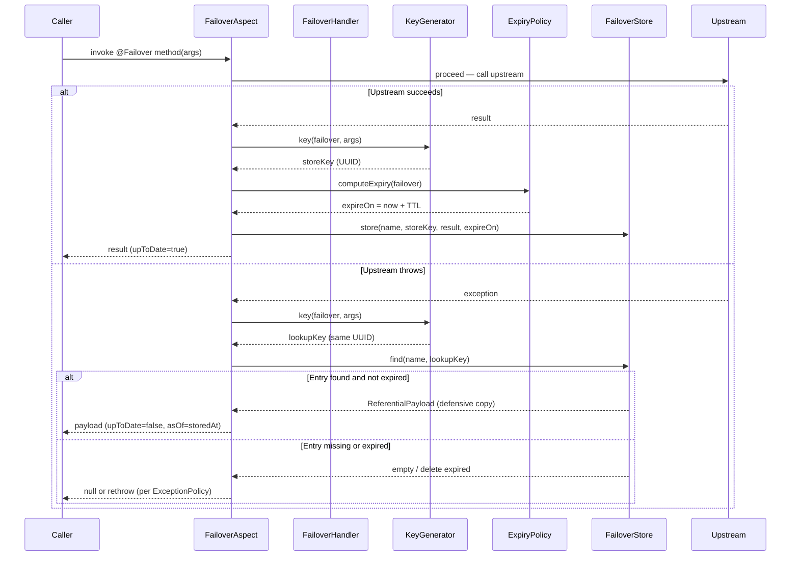
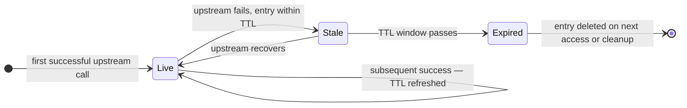
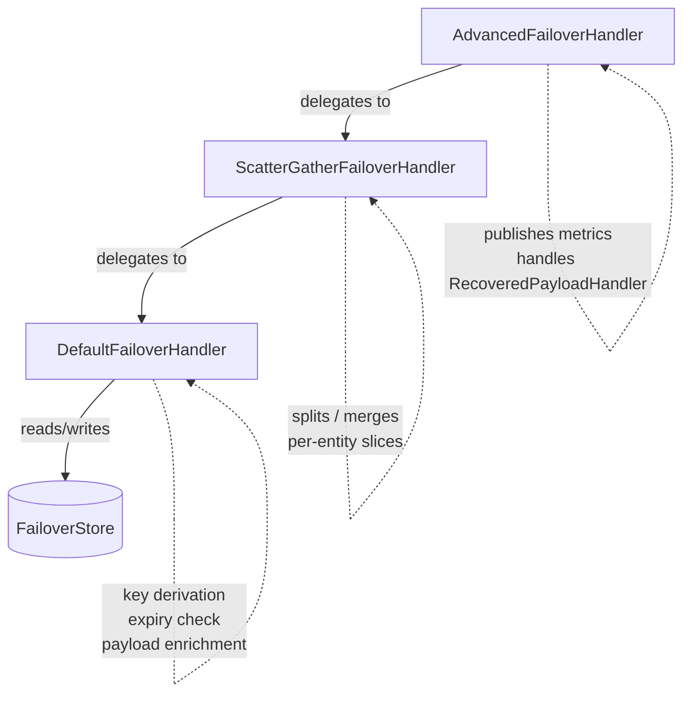
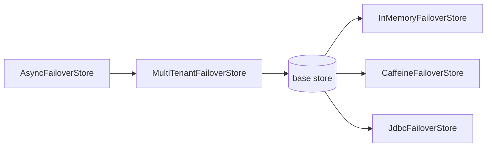

# How It Works

Failover sits between your Spring bean and its upstream dependency. On success it saves the result; on failure it serves the last saved result — transparently, with no changes to calling code.

---

## Store / Recover Lifecycle

---

## Entry Lifecycle States

Callers receive `upToDate=true` in **Live** state and `upToDate=false` in **Stale** state. Expired entries are never served.

---

## Handler Chain

Three handlers compose in a decorator chain:

| Layer | Class | Responsibility |
|---|---|---|
| Outermost | `AdvancedFailoverHandler` | Publishes Micrometer metrics; invokes `RecoveredPayloadHandler` on null result |
| Middle | `ScatterGatherFailoverHandler` | Scatter/gather: splits composite payload into per-entity slices; parallel dispatch via virtual threads |
| Innermost | `DefaultFailoverHandler` | Core logic: key derivation, expiry compute/check, store/find/enrich |

---

## Store Assembly Chain

`AsyncFailoverStore` offloads writes to a virtual-thread executor (active when `failover.store.async=true`). `MultiTenantFailoverStore` routes each operation to the correct tenant's base store (active when `failover.store.multitenant.enabled=true`). Both are transparent decorators.

---

## Key Components

### FailoverAspect

`FailoverAspect` is a Spring AOP `@Around` advice that intercepts every method annotated with `@Failover`. It calls the upstream method and routes the outcome to the handler chain:

- **Success path** → `FailoverHandler.store(failover, args, result)`
- **Exception path** → `FailoverHandler.recover(failover, args, clazz, throwable)`

Only `Exception` triggers the recovery path. A `java.lang.Error` (`OutOfMemoryError`, `StackOverflowError`, …) is rethrown unwrapped — recovery never runs on a failing JVM. See [Exception Policy](../how-to/exception-policy.md#error-is-never-recovered).

The aspect is activated on any Spring-proxied bean regardless of type (Feign client, `@Service`, `@Component`, `@Repository`).

### DefaultFailoverHandler

Core store/recover logic:

- **`store`** — generates the key via `KeyGenerator`, computes `expireOn` via `ExpiryPolicy`, enriches the payload via `PayloadEnricher`, then calls `FailoverStore.store`.
- **`recover`** — looks up the entry, checks `ExpiryPolicy.isExpired`, enriches on recovery, deletes expired entries.
- **`clean`** — calls `FailoverStore.cleanByExpiry(now)` to purge all expired entries.

### ReferentialPayload

The envelope that wraps every stored entry:

| Field | Type | Description |
|---|---|---|
| `name` | `String` | Effective name (`domain` or `name` from annotation) |
| `key` | `String` | UUID-derived store key from method args |
| `upToDate` | `boolean` | `true` when stored from live upstream result |
| `asOf` | `Instant` | When this payload was stored |
| `expireOn` | `Instant` | When the entry expires |
| `payload` | `T` | The actual upstream response |

!!! note "Defensive copy contract"
    `FailoverStore.find()` must return a defensive copy of the stored entry. Callers mutate `upToDate` and `asOf` on the returned object without affecting what is persisted.

### Referential and ReferentialAware

Two ways to expose failover metadata in your domain type:

- `Referential` — abstract class; adds `upToDate`, `asOf`, `metadata` fields via inheritance.
- `ReferentialAware` — interface; implement it when inheritance is not possible.

`PayloadEnricher.enrichOnRecover` sets `upToDate=false` and `asOf` on the recovered payload using whichever contract is present.

---

## Next Steps

- [Expiry Policies](expiry.md) — configuring TTL
- [Key Generation](key-generation.md) — how store keys are derived
- [Scatter / Gather](scatter-gather.md) — per-entity storage for collections
