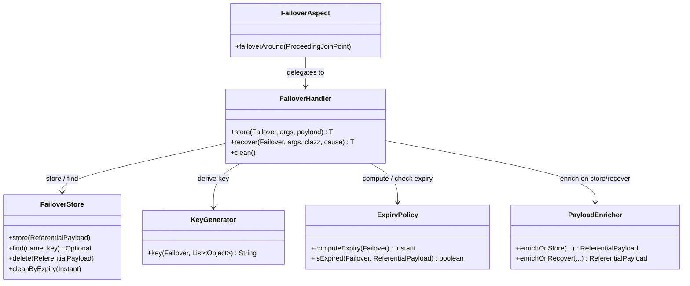

# Concepts

Core ideas that explain how Failover stores, recovers, and expires referential data.

---

| Concept | Description |
|---|---|
| [How It Works](how-it-works.md) | End-to-end store/recover lifecycle with sequence diagrams |
| [Expiry Policies](expiry.md) | TTL computation, SpEL expressions, custom ExpiryPolicy |
| [Key Generation](key-generation.md) | Three-layer key architecture, UUID hashing, custom generators |
| [Scatter / Gather](scatter-gather.md) | Per-entity storage for collection-returning methods |
| [Domain Grouping](domain.md) | Cross-failover store sharing via the `domain` attribute |

---

## Next Steps

- [How It Works](how-it-works.md) — start here for the full picture
- [Getting Started](../getting-started/index.md) — add Failover to your project
