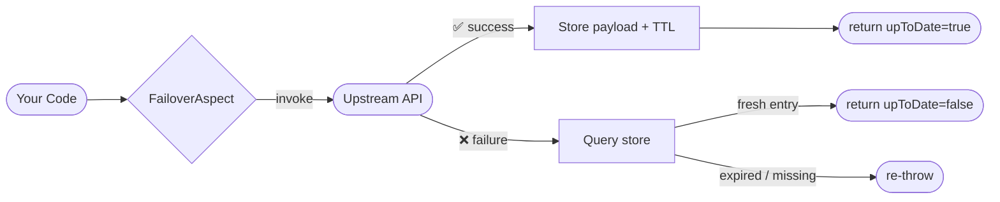
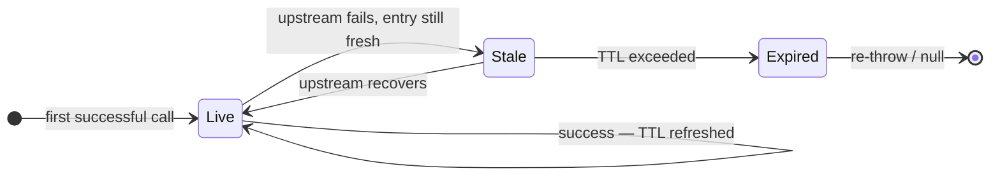

# Concepts

Core ideas behind the Failover framework.

## How failover works

## Entry lifecycle

## Topic reference

| Concept | Description |
|---|---|
| [How It Works](how-it-works.md) | End-to-end lifecycle: interceptor → handler → store → recover |
| [Expiry Policies](expiry.md) | TTL computation, SpEL expressions, custom policy |
| [Key Generation](key-generation.md) | How store keys are derived from method arguments |
| [Scatter / Gather](scatter-gather.md) | Per-entity storage for collection-returning methods |

Understanding the [store/recover lifecycle](how-it-works.md) first makes everything else click.
