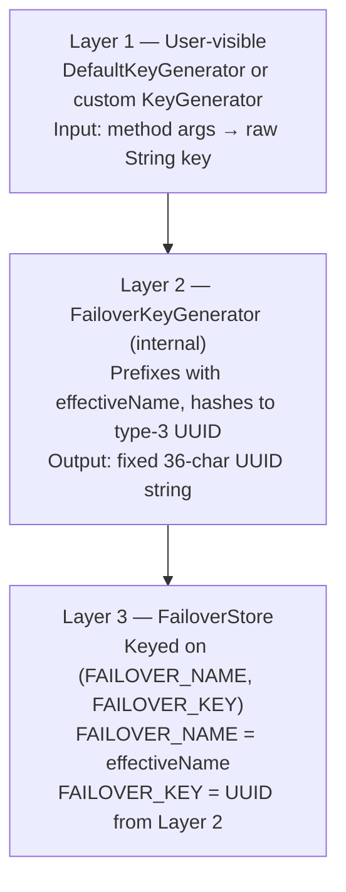

# Key Generation

The store key uniquely identifies an entry within a named failover. Failover uses a three-layer architecture to derive it — the outermost layer is visible to application code; the inner two layers are automatic.

---

## Three-Layer Architecture



Only **Layer 1** is user-controlled. Layers 2 and 3 are applied automatically by `FailoverKeyGenerator` (injected by auto-configuration) and the store implementation.

---

## Layer 1 — DefaultKeyGenerator

`DefaultKeyGenerator` converts method arguments to a raw string key:

| Argument type | Key segment |
|---|---|
| No arguments | `NO-ARG` |
| `String`, `Number`, `Boolean`, primitive | `String.valueOf(arg)` |
| `Collection` | elements joined by `,` |
| Array | elements joined by `,` |
| Any other type | `ClassName@hexHashCode` *(warning logged)* |

Multiple arguments are joined with `:`.

**Examples:**

| Call | Raw key |
|---|---|
| `findByCode("FR")` | `FR` |
| `findByIds(List.of(1, 2, 3))` | `1,2,3` |
| `findByCriteria("active", "EU")` | `active:EU` |
| `findAll()` (no args) | `NO-ARG` |

!!! warning "Complex object arguments"
    If a method argument is a custom object (not a String/Number/Collection), `DefaultKeyGenerator` falls back to `ClassName@hashCode`. This is unstable unless `hashCode()` is deterministic. Use a custom `KeyGenerator` for complex argument types.

---

## Layer 2 — FailoverKeyGenerator (UUID Hashing)

`FailoverKeyGenerator` wraps the raw key from Layer 1:

```
finalKey = UUID.nameUUIDFromBytes( (effectiveName + ":" + rawKey).getBytes(UTF-8) )
```

This produces a fixed-length 36-character UUID string, preventing `VARCHAR(256)` overflow in the JDBC store and obscuring business data at rest. The hash is deterministic — the same inputs always produce the same UUID.

---

## Effective Name Resolution

`FailoverNameResolver.effectiveName(failover)` determines the namespace used in both key hashing and `FAILOVER_NAME` storage:

```java
effectiveName = domain.isBlank() ? name : domain
```

| `@Failover` attributes | `effectiveName` | `FAILOVER_NAME` stored |
|---|---|---|
| `name="tp-by-id"` (no domain) | `"tp-by-id"` | `"tp-by-id"` |
| `name="tp-list"` (no domain) | `"tp-list"` | `"tp-list"` |
| `name="tp-by-id"`, `domain="tp"` | `"tp"` | `"tp"` |
| `name="tp-list"`, `domain="tp"` | `"tp"` | `"tp"` |

Two `@Failover` annotations sharing the same `domain` hash their raw keys with the same namespace prefix and store under the same `FAILOVER_NAME` — enabling cross-failover data sharing. See [Domain Grouping](domain.md).

!!! note "Logging uses `name`, not `effectiveName`"
    Log messages and the scanner always use `failover.name()` — the unique annotation identifier — not `effectiveName`. This keeps logs readable and distinguishes definitions even when they share a domain.

---

## Custom KeyGenerator

Provide a Spring bean implementing `KeyGenerator` and reference it by name on the annotation.

```java title="SortedCsvKeyGenerator.java"
@Component("sortedCsvKeyGenerator")
public class SortedCsvKeyGenerator implements KeyGenerator {

    @Override
    public String key(Failover failover, List<Object> args) {
        // normalise CSV arg so "1,2,3" and "3,2,1" map to the same key
        String csv = (String) args.get(0);
        return Arrays.stream(csv.split(","))
                .map(String::trim)
                .sorted()
                .collect(Collectors.joining(","));
    }
}
```

```java
@Failover(name = "entities-by-ids", keyGenerator = "sortedCsvKeyGenerator")
List<Entity> findByIds(String csvIds);
```

The custom generator completely replaces `DefaultKeyGenerator` — there is no partial delegation.

---

## Key Stability Requirement

The same arguments must produce the same key at both store time and recover time. If your method args are mutable, order-dependent, or contain non-deterministic components (e.g. timestamps), normalise them in your custom key generator.

---

## Next Steps

- [Domain Grouping](domain.md) — sharing store entries across failovers via `domain`
- [Custom Key Generator](../how-to/custom-key-generator.md) — step-by-step guide
- [Scatter / Gather](scatter-gather.md) — per-entity key generation for collections
