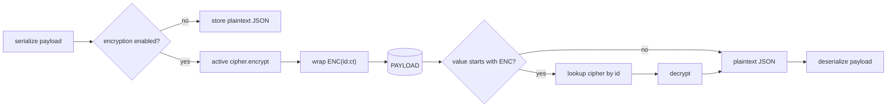

# Payload Encryption at Rest

The JDBC store persists each referential payload as a serialized string in the `PAYLOAD` column. For
deployments where that data is sensitive, Failover can **encrypt the payload at rest** so the column
holds ciphertext rather than readable JSON — without touching the rest of the failover flow.

This page explains the design. For configuration, see the
[Payload Encryption how-to](../how-to/payload-encryption.md) and [ADR 56](../adr/adr.md).

---

## Where it sits

Encryption is a **decorator over the `Serializer`** — the single boundary where a payload becomes a
persisted string. It transforms only the `PAYLOAD` column; everything else is untouched.

```
ReferentialPayloadRowMapper / QueryResolver
        │
        ▼
EncryptingSerializer  ← owns the ENC(...) envelope, dispatches to ciphers
        │
        ▼
JsonSerializer        ← payload <-> JSON, deserialization allowlist
```

Only the **JDBC** store serializes payloads to strings, so encryption is scoped to it. In-memory and
Caffeine stores hold live objects and never persist a string — there is nothing to encrypt, and no
configuration appears under them.

---

## The `ENC(<id>:<ciphertext>)` envelope

Every encrypted value is wrapped in a self-describing envelope:

```
ENC(b64:eyJuYW1lIjoiYWNtZSJ9)
ENC(aesgcm:9b1f…)
```

The leading `ENC(` is a reserved marker (a plaintext JSON value always starts with `{`, `[`, `"`, a
digit or `t/f/n`, never `ENC(`). The `id` segment names the `PayloadCipher` that produced the row.

This single design choice yields three properties:

1. **Self-describing reads.** The reader picks the decryptor from the envelope, not from configuration.
2. **Mixed stores.** Plaintext, `ENC(b64:…)` and `ENC(aesgcm:…)` rows can coexist and each reads back
   correctly — the foundation for rotation.
3. **Safe toggling.** Turning encryption on/off changes only *new writes*; existing rows stay readable.

---

## Cipher SPI and the registry

```java
public interface PayloadCipher {
    String id();
    @Nullable String encrypt(@Nullable String plaintext);
    @Nullable String decrypt(@Nullable String ciphertext);
}
```

Ciphers deal in **raw** ciphertext only — the `EncryptingSerializer` owns the envelope. All
`PayloadCipher` beans are indexed by `id()` into a read **registry**; one of them (chosen by
`failover.store.jdbc.encryption.cipher`) is the **active write cipher**.

* **Write** (when enabled): `ENC(<activeId>:<active.encrypt(json)>)`.
* **Read**: parse the id → look it up in the registry → decrypt. Unknown id → `FailoverStoreException`.
* **Disabled**: write bare plaintext; reads still honour any `ENC(...)` marker.



---

## Default cipher: Base64 (encoding, not encryption)

The built-in `Base64PayloadCipher` (id `b64`) is the zero-dependency default and a worked example of
the SPI. It provides **no confidentiality** — it is reversible by anyone. The auto-configuration emits a
loud `WARN` whenever Base64 is the active write cipher. Real protection requires a user-supplied
`PayloadCipher` bean (AES-GCM, KMS/Jasypt, …).

Why give the harmless encoder a cipher *id* at all? So mismatches fail loudly. A bare Base64 decoder
never errors — it would happily "decode" AES ciphertext into garbage and surface a confusing JSON error
three layers away. The envelope id turns that into a clear *"row encrypted with `aesgcm`, that cipher is
not registered"*.

---

## Interaction with the deserialization allowlist

Encryption and the [payload-class allowlist](../support/security.md) are orthogonal and compose cleanly:

* `PAYLOAD` (data) is encrypted; `PAYLOAD_CLASS` (type name) is **not**.
* On read, the payload is **decrypted first**, then the allowlist gates `toClass(PAYLOAD_CLASS)` on the
  real, plaintext class name before deserialization.

So encryption hides the data, and the allowlist still constrains which classes may be instantiated.

---

## What it is *not*

* **Not transport security.** It protects data at rest in the store, not in flight.
* **Not a substitute for DB/disk encryption or access control** — it is defense in depth.
* **Not key management.** Failover provides the SPI and envelope; your `PayloadCipher` owns the keys.
* **Not for other stores.** JDBC only.
