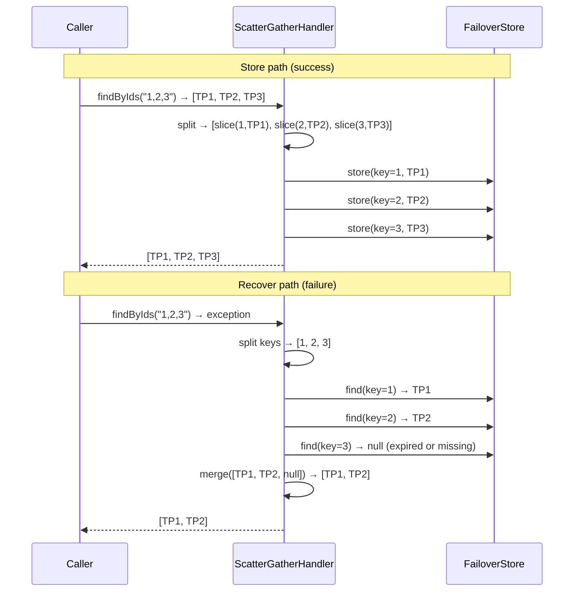
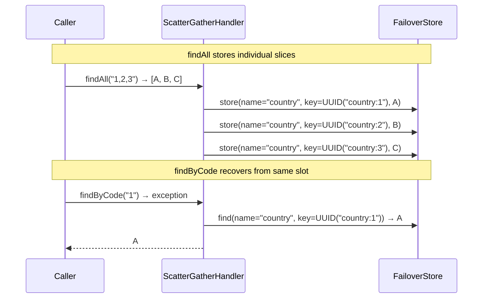

# Scatter / Gather

Standard failover stores the entire method result under one key. For methods that return a collection of entities keyed by ID, this means:

- A single upstream failure wipes out all IDs at once.
- A partial upstream failure (e.g. some IDs available, some not) cannot be expressed.

**Scatter/gather** solves this by storing each entity individually under its own key. On recovery, each key is fetched independently and the results are merged — partial recovery is handled gracefully.

---

## How It Works



---

## Enabling Scatter / Gather

### 1. Implement PayloadSplitter

```java
@Component("thirdPartySplitter")
public class ThirdPartySplitter implements PayloadSplitter<List<ThirdParty>, ThirdParty> {

    @Override
    public List<StoreContext<ThirdParty>> splitOnStore(StoreContext<List<ThirdParty>> ctx) {
        // args[0] is the CSV of IDs: "1,2,3"
        String[] ids = ((String) ctx.getArgs().get(0)).split(",");
        List<ThirdParty> entities = ctx.getPayload();

        return IntStream.range(0, entities.size())
            .mapToObj(i -> StoreContext.<ThirdParty>builder()
                .failover(ctx.getFailover())
                .args(List.of(ids[i].trim()))   // (1) single-ID args for key derivation
                .payload(entities.get(i))
                .build())
            .toList();
    }

    @Override
    public List<RecoverContext<ThirdParty>> splitOnRecover(RecoverContext<List<ThirdParty>> ctx) {
        // same CSV → individual recover contexts per ID
        String csv = (String) ctx.getArgs().get(0);
        return Arrays.stream(csv.split(","))
            .map(id -> RecoverContext.<ThirdParty>builder()
                .failover(ctx.getFailover())
                .args(List.of(id.trim()))
                .clazz(ThirdParty.class)
                .cause(ctx.getCause())
                .build())
            .toList();
    }

    @Override
    public RecoverContext<List<ThirdParty>> merge(List<RecoverContext<ThirdParty>> slices) {
        List<ThirdParty> result = slices.stream()
            .map(RecoverContext::getPayload)
            .filter(Objects::nonNull)
            .toList();
        return RecoverContext.<List<ThirdParty>>builder().payload(result).build();
    }
}
```

1. Each slice uses a single-element args list. `DefaultKeyGenerator` converts `"1"` → key `"1"`.

### 2. Reference the Splitter on the Annotation

```java
@Failover(
    name = "third-parties-by-ids",
    expiryDuration = 1,
    expiryUnit = ChronoUnit.HOURS,
    payloadSplitter = "thirdPartySplitter"   // bean name
)
List<ThirdParty> findByIds(String csvIds);
```

---

## Parallel Scatter

By default, slices are stored and recovered sequentially. Enable parallel dispatch via virtual threads:

```yaml
failover:
  scatter:
    parallel: true   # default
```

Each slice is submitted to the `scatterGatherExecutor` (a virtual-thread executor auto-configured by the framework). `CompletableFuture.allOf` waits for all slices before returning.

!!! warning "Context propagation"
    When parallel scatter is enabled, thread-bound context (tenant ID, MDC, security principal) must be propagated to each slice thread. Provide a `ContextPropagator` bean — see [Context Propagation](../guides/context-propagation.md).

---

## Order Independence

If CSV argument order varies across callers (`"1,2,3"` vs `"3,2,1"`), normalise the IDs in `splitOnRecover` before deriving keys. The merge phase assembles results in whatever order the store returns them.

---

## Partial Recovery

The `merge` method receives all slice contexts, including those whose `payload` is `null` (expired or missing). Filter out `null` entries and return whatever is available — callers should handle a shorter-than-requested list.

---

## Domain Sharing

Scatter/gather stores individual entity slices under the `FAILOVER_NAME` of the scatter endpoint (`findByIds`). A separate single-entity endpoint (`findByCode`) stores its results under its own `FAILOVER_NAME`. Even when both store the same entity with the same key, the composite `(FAILOVER_NAME, FAILOVER_KEY)` store address differs — they never share data.

The `domain` attribute solves this. When two `@Failover` annotations declare the same `domain`, they share the same `FAILOVER_NAME` and the same UUID prefix in `FailoverKeyGenerator`. An entity stored by either endpoint is recoverable by both.

### When to use domain sharing

The primary use case is **pre-population via a bulk endpoint that feeds single-entity recovery**:

- `findByIds("1,2,3")` with scatter/gather populates three store entries, one per ID.
- `findByCode("1")` fails later and recovers entry stored by `findByIds`.

Without `domain`, `findByCode` misses — the scatter stores under `"country-all"`, single-entity looks up under `"country-by-code"`.

With `domain = "country"`:

```java
@Failover(
    name = "country-by-code",
    domain = "country",   //same domain name
    expiryDuration = 1, expiryUnit = ChronoUnit.HOURS
)
Country findByCode(String code);

@Failover(
    name = "country-all",
    domain = "country",   //same domain name
    expiryDuration = 1, expiryUnit = ChronoUnit.HOURS,
    payloadSplitter = "countrySplitter"
)
List<Country> findAll(String csvIds);
```

Both `name` values remain unique (required by the scanner). The `domain` value is what the store and key generator use as the shared namespace. The `PayloadSplitter` on `findAll` must produce single-element args that match the args `findByCode` uses — typically a single ID string — so the UUID keys are identical.



### Expiry alignment

All `@Failover` annotations sharing a domain must configure the same expiry. The store uses the expiry written by whichever endpoint stores last — mismatched expiry causes the last writer to silently override the intended expiry for all readers. `SpringContextFailoverScanner` logs a warning at startup if domain members have different expiry values.

```
WARN — Failover domain 'country' contains 2 failovers with different expiry configurations.
       Last writer wins per store entry — align expiry to avoid inconsistency.
```

---

## Configuration Reference

| Property | Default | Description |
|---|---|---|
| `failover.scatter.parallel` | `true` | Dispatch slices concurrently on virtual threads |
