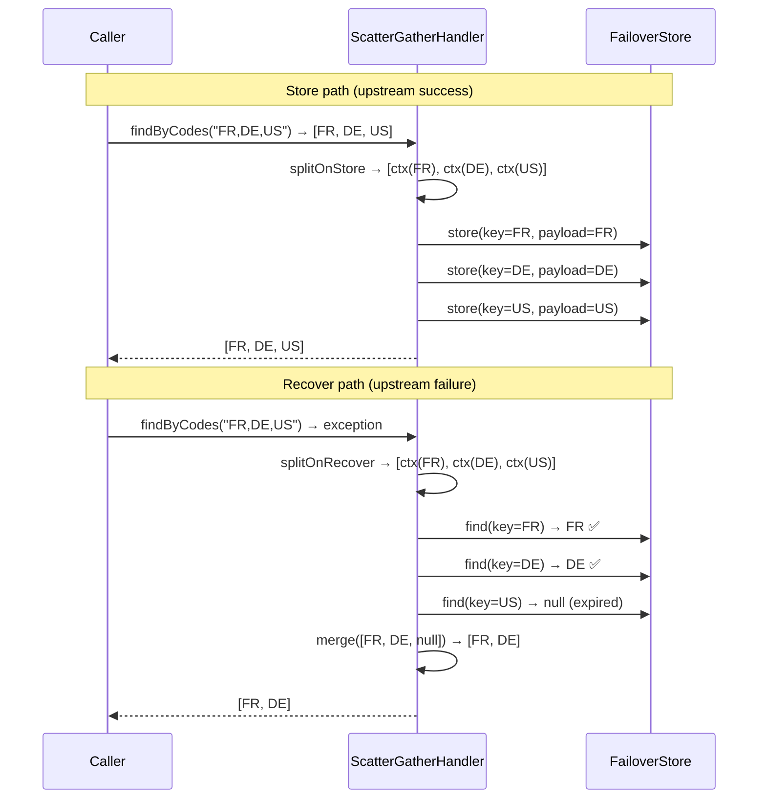

# Scatter / Gather

Standard failover stores the entire method result under one key. For collection-returning methods this means a single upstream failure wipes out all cached entries at once and partial recovery is impossible. Scatter/gather solves both problems.

---

## The Problem with Single-Key Collections

Without scatter/gather:

```
store: findAll() → stores ALL countries under ONE key "NO-ARG"
fail:  one country service error → ALL countries lost together
```

With scatter/gather:

```
store: findAll() → splits → stores FR, DE, US, ... each under its own key
fail:  partial failure → FR and DE recovered; US missing → partial result returned
```

---

## How It Works



---

## PayloadSplitter Interface

```java
public interface PayloadSplitter<T, R> {

    // splits composite result into per-entity store contexts
    List<StoreContext<R>> splitOnStore(StoreContext<T> context);

    // splits composite args into per-entity recover contexts
    List<RecoverContext<R>> splitOnRecover(RecoverContext<T> context);

    // merges per-entity recovered contexts back into composite result
    RecoverContext<T> merge(List<RecoverContext<R>> contexts);
}
```

| Type parameter | Meaning |
|---|---|
| `T` | The composite type — what the annotated method returns |
| `R` | The slice type — what is stored per individual entity |

### StoreContext Fields

| Field | Type | Description |
|---|---|---|
| `failover` | `Failover` | The annotation metadata |
| `args` | `List<Object>` | Method arguments (full composite args on input; single-entity args per slice) |
| `payload` | `T` | The composite payload (full list on input; single entity per slice) |

### RecoverContext Fields

| Field | Type | Description |
|---|---|---|
| `failover` | `Failover` | The annotation metadata |
| `args` | `List<Object>` | Method arguments |
| `clazz` | `Class<T>` | The slice type |
| `cause` | `Throwable` | The upstream exception that triggered recovery |

---

## Full Implementation Example

```java title="CountrySplitter.java"
@Component("countrySplitter")
public class CountrySplitter implements PayloadSplitter<List<Country>, Country> {

    @Override
    public List<StoreContext<Country>> splitOnStore(StoreContext<List<Country>> ctx) {
        String[] codes = ((String) ctx.getArgs().get(0)).split(",");
        List<Country> countries = ctx.getPayload();

        return IntStream.range(0, countries.size())
            .mapToObj(i -> StoreContext.<Country>builder()
                .failover(ctx.getFailover())
                .args(List.of(codes[i].trim()))   // single-code args for key derivation
                .payload(countries.get(i))
                .build())
            .toList();
    }

    @Override
    public List<RecoverContext<Country>> splitOnRecover(RecoverContext<List<Country>> ctx) {
        String csv = (String) ctx.getArgs().get(0);
        return Arrays.stream(csv.split(","))
            .map(code -> RecoverContext.<Country>builder()
                .failover(ctx.getFailover())
                .args(List.of(code.trim()))
                .clazz(Country.class)
                .cause(ctx.getCause())
                .build())
            .toList();
    }

    @Override
    public RecoverContext<List<Country>> merge(List<RecoverContext<Country>> contexts) {
        List<Country> result = contexts.stream()
            .map(RecoverContext::getPayload)
            .filter(Objects::nonNull)
            .toList();
        return contexts.get(0).toBuilder()
            .clazz((Class) List.class)
            .payload(result)
            .build();
    }
}
```

### Wire to the Annotation

```java
@Failover(
    name = "countries-by-codes",
    domain = "country",                    // shares store with country-by-code
    payloadSplitter = "countrySplitter",
    expiryDuration = 24,
    expiryUnit = ChronoUnit.HOURS
)
List<Country> findByCodes(@RequestParam String codes);
```

---

## Parallel Dispatch

By default, per-entity store and recover operations run in parallel via a virtual-thread executor:

```yaml title="application.yml"
failover:
  scatter:
    parallel: true   # default — CompletableFuture per slice on virtual threads
```

Set `parallel: false` for sequential per-entity processing (useful for debugging or low-throughput scenarios).

### Per-slice timeout

On the parallel path a single hung slice (e.g. a slice store with an exhausted JDBC connection pool) would otherwise block the business thread indefinitely on `join()`. `failover.scatter.timeout` bounds each slice:

```yaml title="application.yml"
failover:
  scatter:
    parallel: true
    timeout: 10s     # default; empty/null = wait indefinitely
```

On timeout:

- **Recover path** — the slice is treated as *not recovered* (contributes a `null` payload, exactly like a cache miss), so the rest of the result still merges. The caller is never blocked.
- **Store path** — the timeout surfaces to the caller, where it is isolated by the execution layer (the business call still returns; the store failure is logged/metered).

The timeout is ignored when `parallel: false` (sequential calls cannot be interrupted this way).

---

## Partial Recovery Behaviour

When some slices are missing, expired, or timed out, `merge()` receives a mix of populated and `null` payloads. The framework does **not** filter nulls for you — it only short-circuits to `null` when *every* slice context is empty (then `merge` is not called at all). Your `merge` implementation owns the null policy:

- **Keep positionally** — preserve `null` at the slice's index (the default per-id behaviour; lets the caller see which entries are missing).
- **Drop / deduplicate** — `filter(Objects::nonNull)` to return only what is available (as the example above does).

A timed-out slice is indistinguishable from a cache miss at `merge` time — both arrive as a `null` payload.

### Partial recovery is logged

When some (but not all) slices are missing, the gather logs a `WARN` before merging:

```
Failover scatter-recover: 'countries' — PARTIAL recovery, 2 of 5 slices missing;
the merged result may be incomplete (PayloadSplitter.merge owns the policy).
```

so a partial response is never silent. The `INFO` gather line also reports the recovered/missing counts.

!!! danger "Partial data can be worse than no data"
    In some domains an incomplete collection (e.g. 3 of 5 countries) is more dangerous than a clean
    failure, because the caller cannot tell it is incomplete. If your callers must not act on partial
    data, make `merge` **reject the whole composite** when any slice is missing:

    ```java
    @Override
    public RecoverContext<List<Country>> merge(List<RecoverContext<Country>> contexts) {
        boolean anyMissing = contexts.stream().anyMatch(c -> c.getPayload() == null);
        if (anyMissing) {
            return RecoverContext.<List<Country>>builder()
                    .payload(null)            // null → treated as a non-recovery by the caller / ExceptionPolicy
                    .build();
        }
        // ... merge the complete set ...
    }
    ```

    This makes partial recovery behave like a full miss (subject to your `ExceptionPolicy`), rather
    than silently returning a short list.

!!! tip "Combined with `domain`"
    When scatter/gather and domain are combined, a `findByCode("FR")` call can recover from an entry previously stored by `findByCodes("FR,DE,US")`. The domain ensures both failovers share the same `FAILOVER_NAME`, and scatter stores each code under its own key. See [Domain Grouping](domain.md).

---

## findAll() — Recover All Slices

Standard scatter/gather splits method args (e.g. a CSV of IDs) into per-entity keys on both store and recover. This works well for `findByIds("1,2,3")` but breaks for two patterns:

1. **No-arg `findAll()`** — there are no args to split into per-entity keys.
2. **Filter-only args** — `findByStatus("active", "EU")` has args, but they are filters, not entity identifiers. Splitting them into entity keys produces wrong results.

For both cases, the recover path must fetch **all stored slices by failover name** rather than looking up individual keys. This is the **recover-all path**.

### Trigger conditions

| Condition | Recovery path taken |
|---|---|
| `args` is `null` or empty | Recover-all (automatic) |
| `@Failover(recoverAll = true)` | Recover-all (explicit) |
| `args` non-empty, `recoverAll = false` | Normal scatter recover (split on args) |

### How the recover-all path works

```
recover(args=[], clazz=List<Country>)
  → doRecoverAll(splitter, compositeCtx)
    → splitter.splitOnRecover(compositeCtx)     ← returns ONE placeholder context
      → delegateR.recoverAll(failover, method, args, Country.class, cause)
        → failoverStore.findAll("country")      ← fetches all slices by name
    → [ctx(FR), ctx(DE), ctx(US)]
  → splitter.merge([ctx(FR), ctx(DE), ctx(US)])
  → List<Country>[FR, DE, US]
```

The `splitOnRecover` implementation for the recover-all path must return a **single placeholder context** carrying `clazz = Country.class` (so the store knows the slice type). The placeholder's args are forwarded verbatim to `failoverStore.findAll` — they are not used as a key.

### Two-splitter pattern

A method with ID args (batch by ID) and a separate `findAll()` should use **two different `PayloadSplitter` beans** — one for each method:

```java
// Batch fetch: splits CSV of IDs into per-entity keys
@Failover(name="countries-by-ids", domain="country",
          payloadSplitter="countrySplitter",
          expiryDuration=24, expiryUnit=ChronoUnit.HOURS)
List<Country> findByIds(String csvIds);

// FindAll: no args — uses dedicated splitter for recover-all path
@Failover(name="all-countries", domain="country",
          payloadSplitter="countryAllSplitter",
          expiryDuration=24, expiryUnit=ChronoUnit.HOURS)
List<Country> findAll();
```

Both share `domain="country"` so `findAll()` store path populates entries that `findByIds` can also recover, and vice versa.

### N-slice recover-all and deduplication

`doRecoverAll` calls `recoverSliceForAll` for **each** context returned by `splitOnRecover`. With the default `DefaultFailoverHandler`, `recoverAll` ignores args and returns all entries by name — so N contexts produce N×all-entries (duplicates).

**Rule:** when using the default handler, `splitOnRecover` must return exactly **one** placeholder. Return multiple contexts only when a custom `delegateR.recoverAll` implementation partitions results by the context's args (e.g. by tenant or region).

If duplicates reach `merge()`, deduplication is the splitter's responsibility:

```java
@Override
public RecoverContext<List<Country>> merge(List<RecoverContext<Country>> contexts) {
    List<Country> deduped = contexts.stream()
        .map(RecoverContext::getPayload)
        .filter(Objects::nonNull)
        .collect(Collectors.toMap(Country::getId, c -> c, (a, b) -> a))
        .values().stream().toList();
    // build and return composite RecoverContext...
}
```

---

## PayloadSplitterExecutionException

Any exception thrown by a user-provided `PayloadSplitter` (`splitOnStore`, `splitOnRecover`, `merge`) is wrapped in `PayloadSplitterExecutionException` with full diagnostic context:

```
PayloadSplitter 'countrySplitter' failed during 'splitOnRecover'
  for failover 'countries-by-codes'
  [payloadSplitter='countrySplitter', expiryDuration=24, expiryUnit='HOURS', domain='country']:
  Index 1 out of bounds for length 0
```

The exception includes:

- **operation** — `splitOnStore` / `splitOnRecover` / `merge`
- **splitter bean name** — from `@Failover(payloadSplitter = "...")`
- **failover name** — `@Failover.name()`
- **full annotation config** — `expiryDuration`, `expiryUnit`, `domain`
- **original cause** — the exception thrown by the splitter

This makes it straightforward to identify whether the error occurred in split or merge, which annotation triggered it, and what the splitter's configuration was.

---

## Next Steps

- [Domain Grouping](domain.md) — cross-failover store sharing
- [Payload Splitter How-to](../how-to/payload-splitter.md) — `findAll()` and `recoverAll` step-by-step
- [Context Propagation](../how-to/context-propagation.md) — propagate thread-local context across parallel slices
