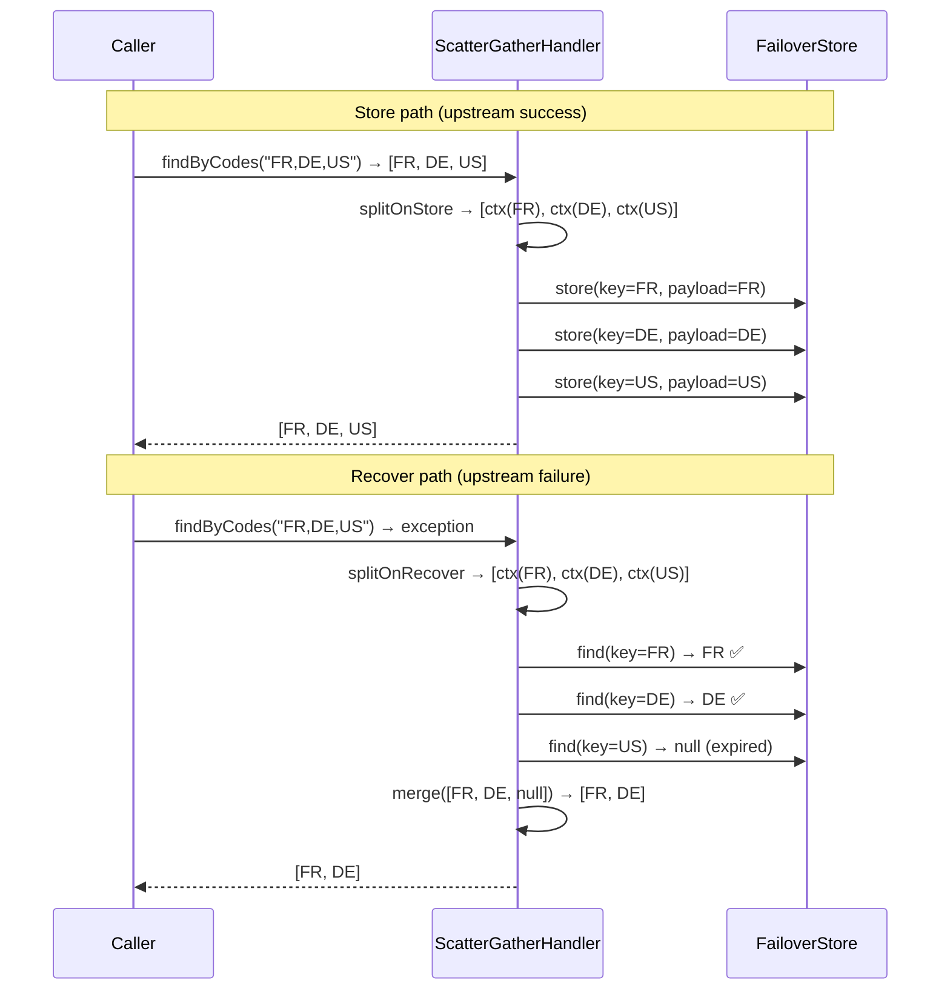

# Scatter / Gather

Standard failover stores the entire method result under one key. For collection-returning methods this means a single upstream failure wipes out all cached entries at once and partial recovery is impossible. Scatter/gather solves both problems.

---

## The Problem with Single-Key Collections

Without scatter/gather:

```
store: findAll() → stores ALL countries under ONE key "NO-ARG"
fail:  one country service error → ALL countries lost together
```

With scatter/gather:

```
store: findAll() → splits → stores FR, DE, US, ... each under its own key
fail:  partial failure → FR and DE recovered; US missing → partial result returned
```

---

## How It Works



---

## PayloadSplitter Interface

```java
public interface PayloadSplitter<T, R> {

    // splits composite result into per-entity store contexts
    List<StoreContext<R>> splitOnStore(StoreContext<T> context);

    // splits composite args into per-entity recover contexts
    List<RecoverContext<R>> splitOnRecover(RecoverContext<T> context);

    // merges per-entity recovered contexts back into composite result
    RecoverContext<T> merge(List<RecoverContext<R>> contexts);
}
```

| Type parameter | Meaning |
|---|---|
| `T` | The composite type — what the annotated method returns |
| `R` | The slice type — what is stored per individual entity |

### StoreContext Fields

| Field | Type | Description |
|---|---|---|
| `failover` | `Failover` | The annotation metadata |
| `args` | `List<Object>` | Method arguments (full composite args on input; single-entity args per slice) |
| `payload` | `T` | The composite payload (full list on input; single entity per slice) |

### RecoverContext Fields

| Field | Type | Description |
|---|---|---|
| `failover` | `Failover` | The annotation metadata |
| `args` | `List<Object>` | Method arguments |
| `clazz` | `Class<T>` | The slice type |
| `cause` | `Throwable` | The upstream exception that triggered recovery |

---

## Full Implementation Example

```java title="CountrySplitter.java"
@Component("countrySplitter")
public class CountrySplitter implements PayloadSplitter<List<Country>, Country> {

    @Override
    public List<StoreContext<Country>> splitOnStore(StoreContext<List<Country>> ctx) {
        String[] codes = ((String) ctx.getArgs().get(0)).split(",");
        List<Country> countries = ctx.getPayload();

        return IntStream.range(0, countries.size())
            .mapToObj(i -> StoreContext.<Country>builder()
                .failover(ctx.getFailover())
                .args(List.of(codes[i].trim()))   // single-code args for key derivation
                .payload(countries.get(i))
                .build())
            .toList();
    }

    @Override
    public List<RecoverContext<Country>> splitOnRecover(RecoverContext<List<Country>> ctx) {
        String csv = (String) ctx.getArgs().get(0);
        return Arrays.stream(csv.split(","))
            .map(code -> RecoverContext.<Country>builder()
                .failover(ctx.getFailover())
                .args(List.of(code.trim()))
                .clazz(Country.class)
                .cause(ctx.getCause())
                .build())
            .toList();
    }

    @Override
    public RecoverContext<List<Country>> merge(List<RecoverContext<Country>> contexts) {
        List<Country> result = contexts.stream()
            .map(RecoverContext::getPayload)
            .filter(Objects::nonNull)
            .toList();
        return contexts.get(0).toBuilder()
            .clazz((Class) List.class)
            .payload(result)
            .build();
    }
}
```

### Wire to the Annotation

```java
@Failover(
    name = "countries-by-codes",
    domain = "country",                    // shares store with country-by-code
    payloadSplitter = "countrySplitter",
    expiryDuration = 24,
    expiryUnit = ChronoUnit.HOURS
)
List<Country> findByCodes(@RequestParam String codes);
```

---

## Parallel Dispatch

By default, per-entity store and recover operations run in parallel via a virtual-thread executor:

```yaml title="application.yml"
failover:
  scatter:
    parallel: true   # default — CompletableFuture per slice on virtual threads
```

Set `parallel: false` for sequential per-entity processing (useful for debugging or low-throughput scenarios).

---

## Partial Recovery Behaviour

When some slices are missing or expired, `merge()` receives a mix of populated and `null` payloads. Your `merge` implementation decides how to handle nulls — return a partial list, substitute defaults, or propagate null. The default behaviour (as shown above) filters out null entries and returns whatever is available.

!!! tip "Combined with `domain`"
    When scatter/gather and domain are combined, a `findByCode("FR")` call can recover from an entry previously stored by `findByCodes("FR,DE,US")`. The domain ensures both failovers share the same `FAILOVER_NAME`, and scatter stores each code under its own key. See [Domain Grouping](domain.md).

---

## Next Steps

- [Domain Grouping](domain.md) — cross-failover store sharing
- [Payload Splitter How-to](../how-to/payload-splitter.md) — step-by-step implementation
- [Context Propagation](../how-to/context-propagation.md) — propagate thread-local context across parallel slices
