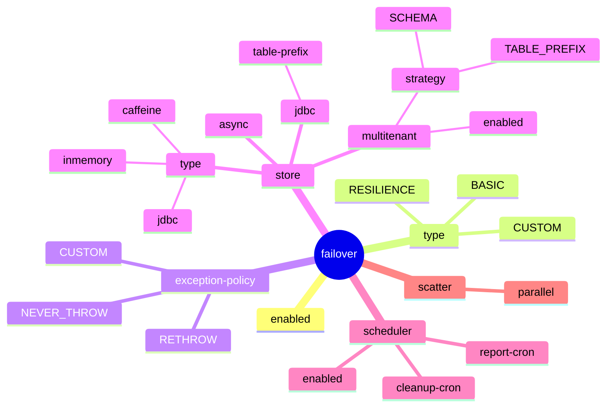

# Configuration

All failover properties are bound to the `failover.*` prefix — YAML, properties files, or environment variables. There are **no mandatory properties**; the framework starts with safe defaults.

## Property hierarchy

## Sections

| Section | Description |
|---|---|
| [Properties Reference](properties-reference.md) | Complete list of every `failover.*` property |
| [Store Types](store-types.md) | Choosing and configuring the backing store |
| [Multi-Tenant](multi-tenant.md) | Isolating stores by tenant (TABLE_PREFIX or SCHEMA) |

Start with [Properties Reference](properties-reference.md) for a quick overview, then drill into the specific section you need.
