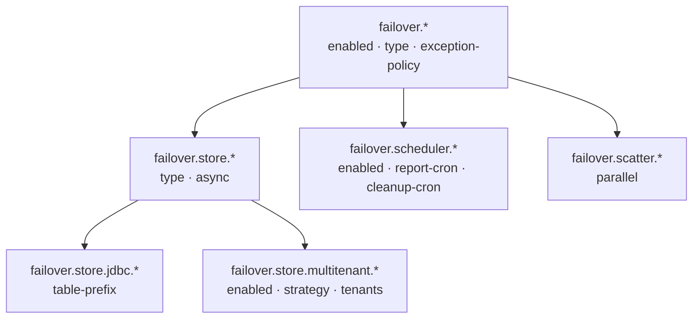

# Configuration

All Failover configuration is grouped under the `failover.*` prefix. There are no mandatory properties — the framework starts with production-safe defaults on first use.



---

| Section | Properties | Default |
|---|---|---|
| [Root](properties-reference.md#root-properties) | `enabled`, `type`, `exception-policy` | `true`, `BASIC`, `RETHROW` |
| [Store](properties-reference.md#store-properties) | `store.type`, `store.async` | `INMEMORY`, `true` |
| [JDBC](properties-reference.md#jdbc-properties) | `store.jdbc.table-prefix` | `""` |
| [Multi-Tenant](multi-tenant.md) | `store.multitenant.*` | disabled |
| [Scheduler](properties-reference.md#scheduler-properties) | `scheduler.enabled`, `scheduler.cleanup-cron` | `true`, hourly |
| [Scatter](properties-reference.md#scatter-properties) | `scatter.parallel` | `true` |

---

## Minimal Production Config

```yaml title="application.yml"
failover:
  store:
    type: jdbc
    jdbc:
      table-prefix: MYAPP_
```

---

## Next Steps

- [Properties Reference](properties-reference.md) — every property with types, defaults, and descriptions
- [Store Types](store-types.md) — choose between InMemory, Caffeine, JDBC, or Custom
- [Multi-Tenant](multi-tenant.md) — tenant-aware store routing
