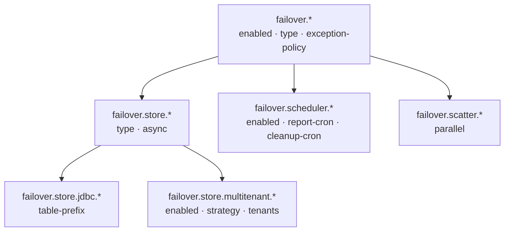

# Configuration

All Failover configuration lives under the `failover.*` prefix. No mandatory properties — the framework starts with production-safe defaults.



<div class="grid cards" markdown>

-   :material-tune:{ .lg .middle } **Properties Reference**

    ---

    Every `failover.*` property with type, default value, and description. The authoritative list.

    [:octicons-arrow-right-24: Browse all properties](properties-reference.md)

-   :material-database-outline:{ .lg .middle } **Store Types**

    ---

    Choose between InMemory, Caffeine, JDBC (H2 / PostgreSQL / MySQL / Oracle), or a custom bean.

    [:octicons-arrow-right-24: Pick a store](store-types.md)

-   :material-office-building-cog-outline:{ .lg .middle } **Multi-Tenant**

    ---

    `TABLE_PREFIX` or `SCHEMA` strategy routes each request to the correct tenant store.

    [:octicons-arrow-right-24: Configure multi-tenancy](multi-tenant.md)

</div>

## Minimal Production Config

```yaml title="application.yml"
failover:
  store:
    type: jdbc
    jdbc:
      table-prefix: MYAPP_
```

---

## Next Steps

- [Properties Reference](properties-reference.md) — every property with types, defaults, and descriptions
- [Store Types](store-types.md) — choose between InMemory, Caffeine, JDBC, or Custom
- [Multi-Tenant](multi-tenant.md) — tenant-aware store routing
