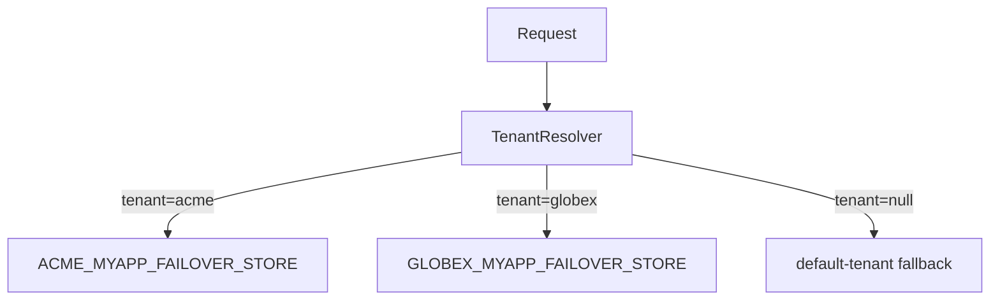

# Multi-Tenant

Multi-tenant mode routes each request to the correct tenant store based on the current thread's tenant context.

---

## Overview



---

## Enable Multi-Tenant

```yaml
failover:
  store:
    type: jdbc
    jdbc:
      table-prefix: MYAPP_
    multitenant:
      enabled: true
      strategy: table_prefix        # (1)
      default-tenant: default       # (2)
      tenants:
        acme:
          table-prefix: ACME_       # effective table: ACME_MYAPP_FAILOVER_STORE
        globex:
          table-prefix: GLOBEX_     # effective table: GLOBEX_MYAPP_FAILOVER_STORE
```

1. `TABLE_PREFIX` creates a separate table per tenant. `SCHEMA` requires a custom `TenantStoreFactory`.
2. `default-tenant` is used when `TenantResolver` returns `null`. Leave blank to throw instead.

---

## Implement TenantResolver

You must provide a `TenantResolver` bean. The framework has no built-in resolver — tenant resolution is always an application concern.

```java
@Component
public class RequestScopedTenantResolver implements TenantResolver {

    private final TenantContext tenantContext;

    public RequestScopedTenantResolver(TenantContext tenantContext) {
        this.tenantContext = tenantContext;
    }

    @Override
    public String resolve() {
        return tenantContext.getCurrentTenant();   // return null to fall back to default-tenant
    }
}
```

---

## Strategies

### TABLE_PREFIX (default)

Each tenant gets its own table:

```
{tenant.table-prefix} + {store.jdbc.table-prefix} + FAILOVER_STORE
```

For `acme` with `table-prefix: MYAPP_`:
- Tenant prefix: `ACME_`
- Effective table: `ACME_MYAPP_FAILOVER_STORE`

Create one table per tenant before starting the application:

```sql
CREATE TABLE ACME_MYAPP_FAILOVER_STORE ( ... );
CREATE TABLE GLOBEX_MYAPP_FAILOVER_STORE ( ... );
```

### SCHEMA

Each tenant gets its own database schema (or separate database). The auto-configured `TenantStoreFactory` supports `TABLE_PREFIX` only. For `SCHEMA`, provide your own `TenantStoreFactory` bean:

```java
@Bean
public TenantStoreFactory<Object> myTenantStoreFactory(Map<String, DataSource> tenantDataSources) {
    return tenantId -> {
        DataSource ds = tenantDataSources.get(tenantId);
        return new FailoverStoreJdbc<>(new JdbcTemplate(ds), "FAILOVER_STORE");
    };
}
```

!!! warning "Why not AbstractRoutingDataSource for SCHEMA?"
    The expiry-cleanup scheduler runs on its own thread where `TenantContext.get()` is `null`. A routing DataSource would resolve `null` to the default schema and clean only that tenant's rows. Per-tenant `DataSource` instances eliminate this problem — each store queries its own database directly.

    Also set `failover.store.async=false` with SCHEMA strategy to avoid context loss across thread boundaries.

---

## Context Propagation

In async mode, the tenant context must be propagated to executor threads. Provide a `ContextPropagator` bean:

```java
@Bean
public ContextPropagator tenantContextPropagator(TenantContext ctx) {
    return new TenantContextPropagator(ctx);
}
```

`TenantContextPropagator` is provided by `failover-store-multitenant` — it captures the current tenant on the calling thread and restores it on the executor thread.

---

## TenantConfig Reference

Each entry under `failover.store.multitenant.tenants` is a `TenantConfig`:

| Field | Type | Description |
|---|---|---|
| `table-prefix` | `String` | Tenant-specific table prefix. Combined with `failover.store.jdbc.table-prefix`. |
