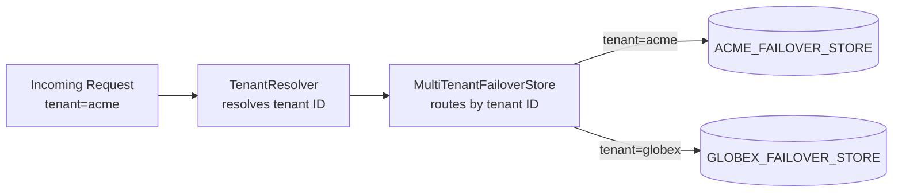

# Multi-Tenant Configuration

Multi-tenant mode routes each failover store operation to the correct tenant's table or schema. It is transparent to `@Failover` annotations — no annotation changes are required.

---

## How It Works



`MultiTenantFailoverStore` wraps the base store and calls `TenantResolver.resolve()` on every operation. The resolved tenant ID selects the appropriate table prefix or schema.

---

## Strategy Comparison

| Strategy | Isolation | Config |
|---|---|---|
| `TABLE_PREFIX` | Separate table per tenant in the same schema | Built-in — configure per-tenant `table-prefix` |
| `SCHEMA` | Separate schema or database per tenant | Requires custom `TenantStoreFactory` bean |

---

## TABLE_PREFIX Strategy

Each tenant gets its own `{prefix}FAILOVER_STORE` table in the same schema.

### Configuration

```yaml title="application.yml"
failover:
  store:
    type: jdbc
    multitenant:
      enabled: true
      strategy: table_prefix
      default-tenant: acme
      tenants:
        acme:
          table-prefix: ACME_DEMO_
        globex:
          table-prefix: GLOBEX_DEMO_
```

### Create Tables

```sql title="multitenant_tables.sql"
CREATE TABLE ACME_DEMO_FAILOVER_STORE (
    FAILOVER_NAME  VARCHAR(50)                      NOT NULL,
    FAILOVER_KEY   VARCHAR(256)                     NOT NULL,
    AS_OF          TIMESTAMP(9) WITH TIME ZONE      NOT NULL,
    EXPIRE_ON      TIMESTAMP(9) WITH TIME ZONE      NOT NULL,
    PAYLOAD        VARCHAR(2000),
    PAYLOAD_CLASS  VARCHAR(256),
    PRIMARY KEY (FAILOVER_NAME, FAILOVER_KEY)
);

CREATE TABLE GLOBEX_DEMO_FAILOVER_STORE (
    FAILOVER_NAME  VARCHAR(50)                      NOT NULL,
    FAILOVER_KEY   VARCHAR(256)                     NOT NULL,
    AS_OF          TIMESTAMP(9) WITH TIME ZONE      NOT NULL,
    EXPIRE_ON      TIMESTAMP(9) WITH TIME ZONE      NOT NULL,
    PAYLOAD        VARCHAR(2000),
    PAYLOAD_CLASS  VARCHAR(256),
    PRIMARY KEY (FAILOVER_NAME, FAILOVER_KEY)
);
```

### Implement TenantResolver

`TenantResolver` extracts the current tenant ID from the request context:

```java title="RequestTenantResolver.java"
@Component
public class RequestTenantResolver implements TenantResolver {

    @Override
    public String resolve() {
        // extract from HTTP header, SecurityContext, ThreadLocal, etc.
        return TenantContext.current();   // your thread-local tenant context
    }
}
```

Register it as a `@Bean` — auto-configuration picks it up via `@ConditionalOnMissingBean`.

---

## SCHEMA Strategy

Each tenant uses a separate schema or database. Requires a custom `TenantStoreFactory` that creates a `FailoverStore` per tenant.

```yaml title="application.yml"
failover:
  store:
    type: jdbc
    multitenant:
      enabled: true
      strategy: schema
      default-tenant: acme
```

```java title="DataSourceTenantStoreFactory.java"
@Component
public class DataSourceTenantStoreFactory implements TenantStoreFactory<Object> {

    private final Map<String, DataSource> dataSources;   // tenant → DataSource

    @Override
    public FailoverStore<Object> create(String tenantId) {
        DataSource ds = dataSources.get(tenantId);
        if (ds == null) throw new FailoverStoreException("Unknown tenant: " + tenantId);
        return new JdbcFailoverStore<>(new JdbcTemplate(ds), "FAILOVER_STORE");
    }
}
```

!!! warning "Disable async with SCHEMA strategy"
    Set `failover.store.async=false` when using the SCHEMA strategy. Async writes use a shared virtual-thread executor that may execute on a different thread — losing the thread-local tenant context used by `TenantResolver`.

---

## Default Tenant Fallback

When `TenantResolver` returns `null`, the `default-tenant` value is used. If `default-tenant` is blank and the resolver returns `null`, a `FailoverStoreException` is thrown.

---

## Next Steps

- [Database Resolver](../how-to/database-resolver.md) — custom DataSource per tenant
- [Properties Reference](properties-reference.md) — full `failover.store.multitenant.*` reference
- [Multi-Tenant Store Module](../modules/store-multitenant.md) — module details
