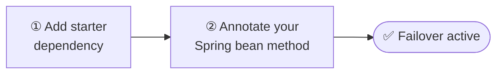

# Getting Started

Add transparent failover to any Spring Boot service in two steps — one dependency, one annotation.

-   :material-package-variant-closed:{ .lg .middle } **Installation**

    ---

    Maven and Gradle coordinates for the starter and every individual module. Covers BOM imports and optional module declarations.

    [:octicons-arrow-right-24: Add the dependency](installation.md)

-   :material-rocket-launch-outline:{ .lg .middle } **Quickstart**

    ---

    Working end-to-end example in 5 minutes — one dependency, one annotation, one config block, and a failing test to prove it works.

    [:octicons-arrow-right-24: Follow the guide](quickstart.md)

!!! tip "Spring beans only"
    `@Failover` intercepts calls through the Spring AOP proxy. Annotate methods on `@Service`, `@Component`, `@FeignClient`, or any Spring-managed bean. Self-invocation (calling a `@Failover` method from within the same class) bypasses the proxy and has no effect.

---

## Next Steps

- [How It Works](../concepts/how-it-works.md) — store/recover lifecycle explained in detail
- [Properties Reference](../configuration/properties-reference.md) — every configuration option
