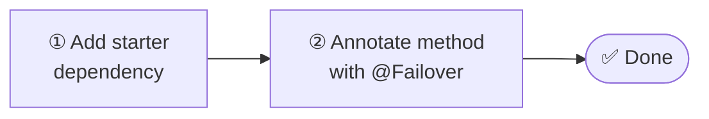

# Getting Started

Two steps to add transparent failover to any Spring Boot application.

1. **[Install](installation.md)** — add `failover-spring-boot-starter` to Maven or Gradle.
2. **[Annotate](quickstart.md)** — add `@Failover` to any Spring-managed bean method.

!!! note "Spring beans only"
    `@Failover` works on Spring-managed beans only. The annotation must be on a method of a `@Service`, `@Component`, `@Repository`, `@FeignClient`, or similar bean, and called through the Spring proxy.

Start with the [Quickstart](quickstart.md) for a complete working example, or go straight to [Installation](installation.md) if you prefer to integrate module by module.
