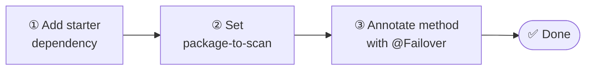

# Getting Started

Three steps to add transparent failover to any Spring Boot application.

1. **[Install](installation.md)** — add `failover-spring-boot-starter` to Maven or Gradle.
2. **[Configure](installation.md#minimal-configuration)** — set `failover.package-to-scan` (the only mandatory property).
3. **[Annotate](quickstart.md)** — add `@Failover` to any Spring-proxied method.

Start with the [Quickstart](quickstart.md) for a complete working example, or go straight to [Installation](installation.md) if you prefer to integrate module by module.
