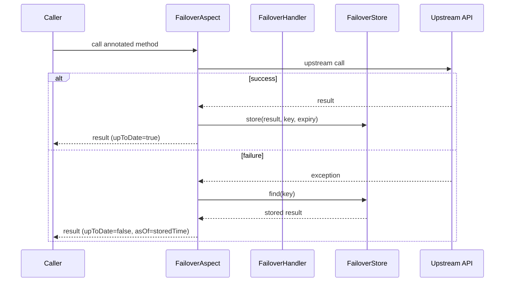

# Quickstart

Build a complete failover-enabled service in 5 minutes.

---

## 1. Add the Dependency

=== "Maven"

    ```xml
    <dependency>
        <groupId>com.societegenerale.failover</groupId>
        <artifactId>failover-spring-boot-starter</artifactId>
        <version>3.0.0</version>
    </dependency>
    ```

=== "Gradle"

    ```kotlin
    implementation("com.societegenerale.failover:failover-spring-boot-starter:3.0.0")
    ```

---

## 2. Configure

```yaml title="application.yml"
failover:
  package-to-scan: com.example.myapp
  store:
    type: jdbc
    jdbc:
      table-prefix: DEMO_
```

Create the database table:

```sql
CREATE TABLE DEMO_FAILOVER_STORE (
    FAILOVER_NAME  VARCHAR(50)  NOT NULL,
    FAILOVER_KEY   VARCHAR(256) NOT NULL,
    AS_OF          TIMESTAMP    NOT NULL,
    EXPIRE_ON      TIMESTAMP    NOT NULL,
    PAYLOAD        VARCHAR(4000),
    PAYLOAD_CLASS  VARCHAR(256),
    PRIMARY KEY (FAILOVER_NAME, FAILOVER_KEY)
);
```

---

## 3. Define Your Domain Type (Optional)

If you want failover metadata (`upToDate`, `asOf`) embedded in your response object, extend `Referential` or implement `ReferentialAware`.

```java
// Option A: extend Referential (adds upToDate, asOf, metadata fields)
@Data
@EqualsAndHashCode(callSuper = false)
public class Country extends Referential {
    private String code;
    private String name;
    private String currency;
}

// Option B: implement ReferentialAware (any existing class, no inheritance)
@Data
public class Country implements ReferentialAware {
    private String code;
    private String name;
    private String currency;

    // failover metadata — populated automatically on recovery
    private Boolean upToDate;
    private LocalDateTime asOf;
    private Metadata metadata = new Metadata();

    @Override public void setUpToDate(Boolean upToDate) { this.upToDate = upToDate; }
    @Override public void setAsOf(LocalDateTime asOf)   { this.asOf = asOf; }
    @Override public void setMetadata(Metadata metadata){ this.metadata = metadata; }
}
```

Both options are optional. If your domain type implements neither, failover still works — you just won't get the `upToDate`/`asOf` fields populated on recovery.

---

## 4. Annotate Your Client

```java
@FeignClient(name = "country-service", url = "${country.service.url}")
public interface CountryClient {

    /**
     * Look up a country by its ISO code.
     * Failover: store for 24 hours, recover on any exception.
     */
    @Failover(name = "country-by-code", expiryDuration = 24, expiryUnit = ChronoUnit.HOURS) // (1)
    @GetMapping("/api/v1/countries/{code}")
    Country findByCode(@PathVariable String code);

    /**
     * List all active countries.
     * Failover: store for 1 hour (default).
     */
    @Failover(name = "country-all") // (2)
    @GetMapping("/api/v1/countries")
    List<Country> findAll();
}
```

1. `name` must be unique across your application. `expiryDuration` + `expiryUnit` define how long the stored data is considered valid.
2. Default expiry is `1 HOUR`. Change it globally via properties or per-method via annotation.

!!! warning "Unique names"
    Every `@Failover` annotation must have a unique `name`. Duplicates will cause a startup failure.

---

## 5. Externalise Expiry (Optional)

Hard-coded durations in annotations are inconvenient to change. Use SpEL expressions to read from application properties:

```yaml title="application.yml"
myapp:
  failover:
    country-by-code:
      duration: 48
      unit: HOURS
```

```java
@Failover(
    name = "country-by-code",
    expiryDurationExpression = "${myapp.failover.country-by-code.duration}",
    expiryUnitExpression     = "${myapp.failover.country-by-code.unit}"
)
@GetMapping("/api/v1/countries/{code}")
Country findByCode(@PathVariable String code);
```

---

## 6. Start the Application

```
  Failover started
  ─────────────────────────────────────────────
  enabled          : true
  type             : BASIC
  store.type       : JDBC
  store.table      : DEMO_FAILOVER_STORE
  scheduler        : enabled
  ─────────────────────────────────────────────
```

The startup banner confirms which store and scheduler are active.

---

## What Happens at Runtime



**On success:** the result is stored under the derived key with the configured expiry.  
**On failure:** the last stored result for the same key is returned. If none exists (first call ever) or the stored value has expired, the exception is re-thrown (default) or `null` is returned (`failover.exception-policy: never_throw`).

---

## Verify It Works

Write an integration test using the real store:

```java
@SpringBootTest
@TestPropertySource(properties = {
    "failover.package-to-scan=com.example.myapp",
    "failover.store.type=jdbc",
    "failover.store.async=false",        // synchronous writes for deterministic assertions
    "failover.exception-policy=never_throw"
})
class CountryClientFailoverIT {

    @Autowired CountryClient client;
    @MockitoBean CountryServiceStub stub;   // the upstream

    @Test
    void recovers_stored_country_on_failure() {
        // prime the store with a successful call
        given(stub.findByCode("FR")).willReturn(new Country("FR", "France", "EUR"));
        Country live = client.findByCode("FR");
        assertThat(live.isUpToDate()).isTrue();

        // simulate upstream failure
        given(stub.findByCode("FR")).willThrow(new RuntimeException("upstream down"));
        Country recovered = client.findByCode("FR");

        assertThat(recovered.getCode()).isEqualTo("FR");
        assertThat(recovered.isUpToDate()).isFalse();
    }
}
```

---

## Next Steps

- [Properties Reference](../configuration/properties-reference.md) — tune every aspect of failover behaviour.
- [Store Types](../configuration/store-types.md) — choose the right backing store for production.
- [Scatter / Gather](../concepts/scatter-gather.md) — per-entity storage for collection-returning methods.
- [Multi-Tenant](../configuration/multi-tenant.md) — isolate stores by tenant.
