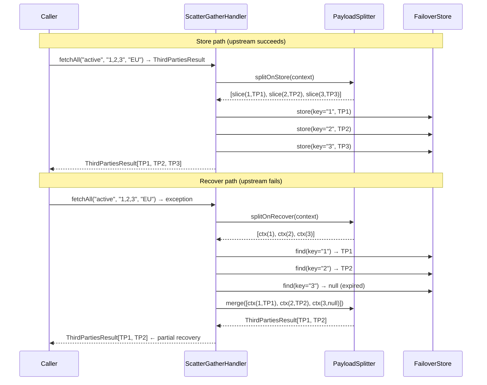

# Payload Splitter

`PayloadSplitter<T, R>` enables **scatter/gather** failover for methods that return a collection of entities. Instead of storing the entire collection under one key, the splitter breaks it into per-entity slices. On recovery, each slice is fetched independently and the results are merged — so partial recovery is possible even when some entries have expired.

Use `PayloadSplitter` when:

- Your method returns a collection of entities keyed by individual IDs.
- Callers pass a CSV or list of IDs and expect an entity per ID.
- You need partial recovery — return whatever is still cached rather than all-or-nothing.
- A single upstream failure should not evict the entire collection from the store.

---

## How It Works



---

## Domain Model

Define two types — the **composite** (`T`) returned by the annotated method, and the **slice** (`R`) stored per entity:

```java
// Slice type — stored individually per ID
@Data
@NoArgsConstructor
@AllArgsConstructor
@EqualsAndHashCode(callSuper = true)
public class ThirdParty extends Referential {
    private Long   id;
    private String name;
    private int    score;
}

// Composite type — the method return type
@Data
@NoArgsConstructor
@EqualsAndHashCode(callSuper = true)
public class ThirdPartiesResult extends Referential {
    private List<ThirdParty> thirdParties;
}
```

Both extend `Referential` so the framework can set `upToDate` and `asOf` on recovery.

---

## Implement PayloadSplitter

Implement `PayloadSplitter<T, R>` and register it as a Spring bean. The bean name is what you reference in the `@Failover` annotation.

```java
@Component("thirdPartyPayloadSplitter")
public class ThirdPartyPayloadSplitter
        implements PayloadSplitter<ThirdPartiesResult, ThirdParty> {

    /**
     * Store path — called once after a successful upstream call.
     *
     * The incoming context carries the full composite result and the original
     * method args. Return one StoreContext per entity, each with single-ID args
     * so the key generator derives a unique key per entity.
     *
     * Args shape: ["status", "1,2,3", "region"]
     *   → slice:  ["status", "1",     "region"]   (one context per ID)
     */
    @Override
    public List<StoreContext<ThirdParty>> splitOnStore(
            StoreContext<ThirdPartiesResult> context) {

        String status = (String) context.getArgs().getFirst();   // args[0]
        String region = (String) context.getArgs().getLast();    // args[2]

        return context.getPayload().getThirdParties().stream()
                .map(tp -> StoreContext.<ThirdParty>builder()
                        .failover(context.getFailover())
                        .args(List.of(status, String.valueOf(tp.getId()), region)) // (1)
                        .payload(tp)
                        .build())
                .toList();
    }

    /**
     * Recover path — called once when the upstream throws.
     *
     * The incoming context carries the composite args and the exception cause.
     * Split the CSV arg into individual recover contexts — one per ID to look up.
     * Do NOT set payload here; the framework sets it after finding each slice in the store.
     */
    @Override
    public List<RecoverContext<ThirdParty>> splitOnRecover(
            RecoverContext<ThirdPartiesResult> context) {

        String status = (String) context.getArgs().getFirst();   // args[0]
        String csvIds = (String) context.getArgs().get(1);       // args[1] — "1,2,3"
        String region = (String) context.getArgs().getLast();    // args[2]

        return Arrays.stream(csvIds.split(","))
                .map(String::trim)
                .map(id -> RecoverContext.<ThirdParty>builder()
                        .failover(context.getFailover())
                        .args(List.of(status, id, region))       // (2)
                        .clazz(ThirdParty.class)
                        .cause(context.getCause())
                        .build())
                .toList();
    }

    /**
     * Merge — called after every slice has been recovered (or not found).
     *
     * Contexts arrive with their payload set by the framework:
     *   - found and not expired → payload is the stored ThirdParty
     *   - expired or missing    → payload is null
     *
     * Filter nulls and assemble the composite result.
     * Rebuild the merged CSV arg from the individual IDs so the returned
     * RecoverContext accurately reflects what was recovered.
     */
    @Override
    public RecoverContext<ThirdPartiesResult> merge(
            List<RecoverContext<ThirdParty>> contexts) {

        List<ThirdParty> recovered = contexts.stream()
                .map(RecoverContext::getPayload)
                .filter(Objects::nonNull)               // (3) drop expired / missing
                .toList();

        ThirdPartiesResult result = new ThirdPartiesResult();
        result.setThirdParties(recovered);

        String status    = (String) contexts.getFirst().getArgs().getFirst();
        String mergedIds = contexts.stream()
                .filter(ctx -> ctx.getPayload() != null)
                .map(ctx -> (String) ctx.getArgs().get(1))
                .collect(Collectors.joining(","));
        String region    = (String) contexts.getFirst().getArgs().getLast();

        return RecoverContext.<ThirdPartiesResult>builder()
                .failover(contexts.getFirst().getFailover())
                .args(List.of(status, mergedIds, region))
                .clazz(ThirdPartiesResult.class)
                .cause(contexts.getFirst().getCause())
                .payload(result)
                .build();
    }
}
```

1. Single-ID args per slice — the default `KeyGenerator` uses `args[1]` (the individual ID) to derive a unique store key per entity.
2. Same args shape as store — each recover context must produce the same key the store used, so the store lookup finds the right row.
3. `payload` is `null` when a slice was not found or has expired — filter before merging.

---

## Annotate the Method

Reference the splitter by its bean name in `payloadSplitter`:

```java
@Failover(
    name             = "third-parties-by-ids",
    expiryDuration   = 1,
    expiryUnit       = ChronoUnit.HOURS,
    payloadSplitter  = "thirdPartyPayloadSplitter"  // (1)
)
ThirdPartiesResult fetchAll(String status, String csvIds, String region);
```

1. Must match the Spring bean name or `@Component` value exactly.

When `payloadSplitter` is set, the framework activates `ScatterGatherFailoverHandler` for this method. Standard single-key behaviour applies when the attribute is empty (the default).

---

## How Keys Are Derived Per Slice

The `DefaultKeyGenerator` derives the store key from `args`. Each slice context you build in `splitOnStore` and `splitOnRecover` must produce **identical args** for the same entity so both paths resolve to the same key.

For the example above:

| Path | args | Derived key |
|---|---|---|
| Store | `["active", "1", "EU"]` | MD5/UUID of `active-1-EU` |
| Recover | `["active", "1", "EU"]` | MD5/UUID of `active-1-EU` ← same |

If your entity ID is the only distinguishing arg, use a single-element args list and ignore the other method arguments in both paths:

```java
// Store — single-element args, ID only
.args(List.of(String.valueOf(tp.getId())))

// Recover — same shape
.args(List.of(id.trim()))
```

---

## Partial Recovery

`merge()` always receives the full list of contexts — one per ID requested. Contexts for entities that were not found or have expired have `payload == null`. Filter them before assembling the result:

```java
List<ThirdParty> recovered = contexts.stream()
    .map(RecoverContext::getPayload)
    .filter(Objects::nonNull)
    .toList();
```

Callers receive a shorter list than they requested. This is intentional — partial data is better than a total failure. Callers that require all-or-nothing should check the size of the returned collection.

---

## Order Independence

If callers may pass IDs in any order (`"1,2,3"` vs `"3,2,1"`), normalise the IDs in `splitOnRecover` to match the order used in `splitOnStore`. The simplest approach is to sort:

```java
return Arrays.stream(csvIds.split(","))
    .map(String::trim)
    .sorted()                               // normalise order
    .map(id -> RecoverContext.<ThirdParty>builder()
            .args(List.of(id))
            .clazz(ThirdParty.class)
            .cause(context.getCause())
            .failover(context.getFailover())
            .build())
    .toList();
```

Or delegate key normalisation to a [custom key generator](custom-key-generator.md) so the splitter stays order-agnostic.

---

## Parallel Scatter

By default, slices are stored and recovered sequentially. Enable parallel dispatch via virtual threads:

```yaml
failover:
  scatter:
    parallel: true   # default: true
```

With parallel enabled, each slice is submitted as a `CompletableFuture` to the `scatterGatherExecutor` (a virtual-thread executor auto-configured by the framework). All futures are awaited before `merge()` is called.

!!! warning "Thread-local context propagation"
    Parallel scatter runs slices on different threads. Any thread-bound context — tenant ID, MDC diagnostic map, Spring Security principal — is **not** automatically propagated. Provide a `ContextPropagator` bean to carry context into each slice thread.

    See [Context Propagation](context-propagation.md) for the implementation guide.

---

## Testing

### Unit-test the splitter in isolation

Test each method independently without Spring context:

```java
class ThirdPartyPayloadSplitterTest {

    private final ThirdPartyPayloadSplitter splitter = new ThirdPartyPayloadSplitter();
    private final Failover failover = mock(Failover.class);

    @Test
    void splitOnStore_produces_one_context_per_entity() {
        ThirdPartiesResult composite = new ThirdPartiesResult();
        composite.setThirdParties(List.of(
            new ThirdParty(1L, "Alpha", 90),
            new ThirdParty(2L, "Beta",  75)
        ));
        StoreContext<ThirdPartiesResult> ctx = StoreContext.<ThirdPartiesResult>builder()
            .failover(failover)
            .args(List.of("active", "1,2", "EU"))
            .payload(composite)
            .build();

        List<StoreContext<ThirdParty>> slices = splitter.splitOnStore(ctx);

        assertThat(slices).hasSize(2);
        assertThat(slices.get(0).getArgs()).containsExactly("active", "1", "EU");
        assertThat(slices.get(0).getPayload().getId()).isEqualTo(1L);
        assertThat(slices.get(1).getArgs()).containsExactly("active", "2", "EU");
    }

    @Test
    void splitOnRecover_produces_one_context_per_id_in_csv() {
        RecoverContext<ThirdPartiesResult> ctx = RecoverContext.<ThirdPartiesResult>builder()
            .failover(failover)
            .args(List.of("active", "1,2,3", "EU"))
            .clazz(ThirdPartiesResult.class)
            .cause(new RuntimeException("upstream down"))
            .build();

        List<RecoverContext<ThirdParty>> slices = splitter.splitOnRecover(ctx);

        assertThat(slices).hasSize(3);
        assertThat(slices.get(0).getArgs()).containsExactly("active", "1", "EU");
        assertThat(slices.get(2).getArgs()).containsExactly("active", "3", "EU");
    }

    @Test
    void merge_filters_null_payloads_for_partial_recovery() {
        ThirdParty tp1 = new ThirdParty(1L, "Alpha", 90);
        List<RecoverContext<ThirdParty>> slices = List.of(
            RecoverContext.<ThirdParty>builder()
                .failover(failover).args(List.of("active", "1", "EU"))
                .clazz(ThirdParty.class).cause(null).payload(tp1).build(),
            RecoverContext.<ThirdParty>builder()
                .failover(failover).args(List.of("active", "2", "EU"))
                .clazz(ThirdParty.class).cause(null).payload(null)    // expired/missing
                .build()
        );

        RecoverContext<ThirdPartiesResult> merged = splitter.merge(slices);

        assertThat(merged.getPayload().getThirdParties()).containsExactly(tp1);
        assertThat(merged.getArgs().get(1)).isEqualTo("1"); // only recovered ID in args
    }
}
```

### Integration test against a real store

Wire the full scatter/gather stack with an in-memory or H2 store and verify end-to-end:

```java
@SpringBootTest
class ThirdPartyScatterGatherIT {

    @Autowired ThirdPartyService service;
    @Autowired ThirdPartyUpstreamMock upstream;

    @Test
    void partial_recovery_returns_available_slices_when_upstream_fails() {
        // 1. upstream succeeds — scatter stores IDs 1, 2, 3 individually
        upstream.givenSuccess(List.of(
            new ThirdParty(1L, "Alpha", 90),
            new ThirdParty(2L, "Beta",  75),
            new ThirdParty(3L, "Gamma", 60)
        ));
        service.fetchAll("active", "1,2,3", "EU");

        // 2. expire slice 3 in the store
        upstream.expireSlice("3");

        // 3. upstream fails — gather recovers IDs 1 and 2; 3 is expired
        upstream.givenFailure();
        ThirdPartiesResult result = service.fetchAll("active", "1,2,3", "EU");

        assertThat(result.getThirdParties()).hasSize(2);
        assertThat(result.getThirdParties())
            .extracting(ThirdParty::getId)
            .containsExactlyInAnyOrder(1L, 2L);
        assertThat(result.isUpToDate()).isFalse();
    }
}
```

---

## API Reference

| Type | Role |
|---|---|
| `PayloadSplitter<T, R>` | Interface to implement — three methods: `splitOnStore`, `splitOnRecover`, `merge` |
| `StoreContext<T>` | Immutable context: `failover`, `args`, `payload` — used in store path |
| `RecoverContext<T>` | Mutable context: `failover`, `args`, `clazz`, `cause`, `payload` — used in recover + merge |
| `ScatterGatherFailoverHandler` | Framework class that orchestrates scatter/gather — created automatically |
| `PayloadSplitterLookup` | Internal strategy that resolves the splitter bean by name — no action required |

Full Javadoc → [API Reference](../api/javadocs.md).

---

## See Also

- [Scatter / Gather](../concepts/scatter-gather.md) — concept-level explanation with sequence diagrams
- [Context Propagation](context-propagation.md) — required when `failover.scatter.parallel=true`
- [Custom Key Generator](custom-key-generator.md) — customise how per-slice keys are derived
