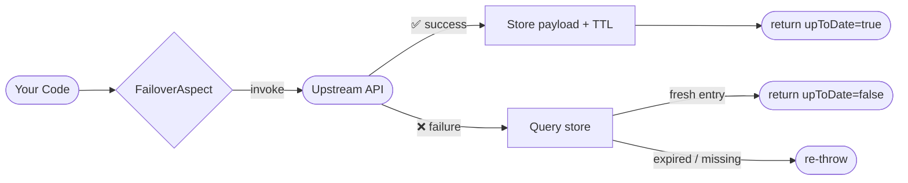
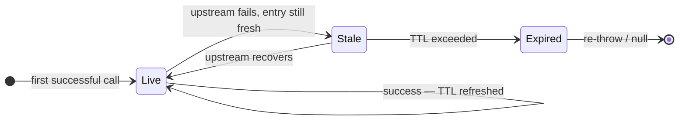
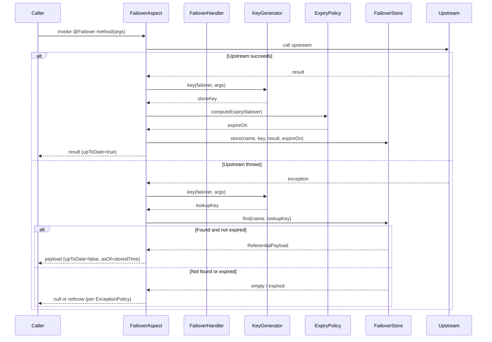

---
hide:
  - navigation
  - toc
template: home.html
---

<p class="fo-section-eyebrow">THE PROBLEM → THE SOLUTION</p>

## Replace fragile try/catch with one annotation

Every team reinvents the same resilience wheel. Failover removes it entirely.

<div class="fo-compare">
<div class="fo-compare-panel before">
<div class="fo-compare-header">❌ Without Failover — bespoke, brittle, repeated everywhere</div>

```java
public Country findByCode(String code) {
    try {
        Country c = upstream.findByCode(code);
        localRepo.save(c, computeExpiry());
        return c;
    } catch (Exception e) {
        log.warn("upstream failed, trying local cache");
        Country cached = localRepo.findByCode(code);
        if (cached == null || isExpired(cached)) {
            throw e;
        }
        cached.setUpToDate(false);
        return cached;
    }
}
```

</div>
<div class="fo-compare-panel after">
<div class="fo-compare-header">✅ With Failover — declarative, consistent, zero boilerplate</div>

```java
@Failover(
    name = "country-by-code",
    expiryDuration = 24,
    expiryUnit = ChronoUnit.HOURS
)
Country findByCode(String code);
```

</div>
</div>

<p class="fo-section-eyebrow">INTERNALS</p>

## How it works

Spring AOP intercepts every annotated method. The rest is automatic.

<div class="fo-flow-wrap">
<p class="fo-diagram-label">Call flow</p>



</div>

<div class="fo-flow-wrap">
<p class="fo-diagram-label">Entry lifecycle</p>



</div>
    
<div class="fo-flow-wrap">
<p class="fo-diagram-label">Sequence diagram</p>



</div>

<div class="fo-flow-wrap">
<div class="fo-flow-caption">
  <div class="fo-flow-item">
    <div class="fo-flow-dot success"></div>
    <p><strong>On success</strong> — result persisted under the derived key with the configured TTL. <code>upToDate=true</code> set on the returned object.</p>
  </div>
  <div class="fo-flow-item">
    <div class="fo-flow-dot failure"></div>
    <p><strong>On failure</strong> — last stored result returned. If none or expired: re-throw (default) or return <code>null</code> via <code>exception-policy: never_throw</code>.</p>
  </div>
</div>
</div>

<p class="fo-section-eyebrow">CONTEXT</p>

## Why referential services need special care

In microservice platforms your application calls services it doesn't own. When those fail, the cascade reaches your users — and there's nothing you can do to fix the upstream.

<div class="fo-showcase">
<div class="fo-showcase-text">
<h3>Three layers of dependency</h3>
<p>Most platforms share the same pattern: internal services you control, transversal services owned by other teams, and external services owned by third parties.</p>
<ul>
  <li><strong>Internal services</strong> — full ownership, fast resolution</li>
  <li><strong>Transversal services (R)</strong> — managed by other teams, slow escalation path</li>
  <li><strong>External services (E)</strong> — third-party SLA, no direct control</li>
  <li>Failures on referential systems cascade through every dependent service</li>
</ul>
</div>
<div class="fo-img-card">
<p class="fo-diagram-label">Service dependency model</p>

</div>
</div>

<div class="fo-showcase fo-showcase-rev">
<div class="fo-img-card">
<p class="fo-diagram-label">Cascade failure in practice</p>

</div>
<div class="fo-showcase-text">
<p class="fo-section-eyebrow">THE CHALLENGE</p>
<h3>One outage cascades to every user</h3>
<p>When a transversal or external service fails, the error propagates through every dependent service — returning 500s to users who have no visibility into why.</p>
<ul>
  <li>Application team has no control over the upstream failure</li>
  <li>Escalation and resolution take hours or days</li>
  <li>Every team reinvents the same fragile try/catch workaround</li>
  <li>End users are fully blocked until the referential system recovers</li>
</ul>
</div>
</div>

<p class="fo-section-eyebrow">THE SOLUTION</p>

## Failover intercepts — transparently

Failover sits between your service and the referential system. On success it stores the result with a configured TTL. On failure it serves the last known-good value — no 500, no user impact.

<div class="fo-two-img-grid">
<div class="fo-img-card">
<p class="fo-diagram-label">Failover in the platform</p>

</div>
<div class="fo-img-card">
<p class="fo-diagram-label">Store · intercept · replay</p>

</div>
</div>

<p class="fo-section-eyebrow">USER IMPACT</p>

## Users stay unblocked — even during outages

Without Failover a referential failure returns a 500 and blocks the user completely. With Failover the last stored result is served — marked with its cached timestamp, but fully functional.

<div class="fo-img-card fo-img-card-wide">

</div>

<p class="fo-section-eyebrow">OBSERVABILITY</p>

## Built-in metrics — zero extra instrumentation

Every store and recover event emits Micrometer counters automatically. Connect to Elastic, Grafana, or any metrics backend. Three dedicated panels give complete visibility into failure behaviour.

<div class="fo-img-card" style="margin-bottom:1rem">
<p class="fo-diagram-label">Failover configuration dashboard</p>

</div>

<div class="fo-monitor-grid">
<div class="fo-img-card">
<p class="fo-diagram-label">Failover rate</p>

<p class="fo-img-caption">Total upstream failures intercepted per referential over time.</p>
</div>
<div class="fo-img-card">
<p class="fo-diagram-label">Recovery rate</p>

<p class="fo-img-caption">Failures resolved with a stored result — users unblocked.</p>
</div>
<div class="fo-img-card">
<p class="fo-diagram-label">Non-recovery rate</p>

<p class="fo-img-caption">Failures with no stored result — actual user impact needing attention.</p>
</div>
</div>
