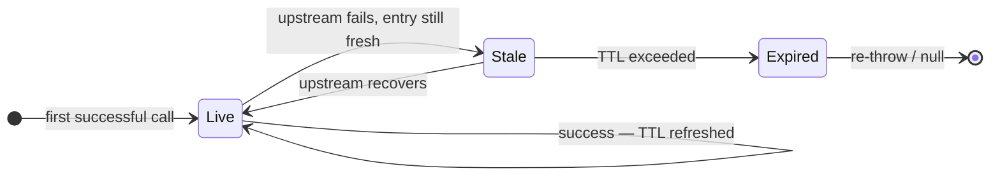
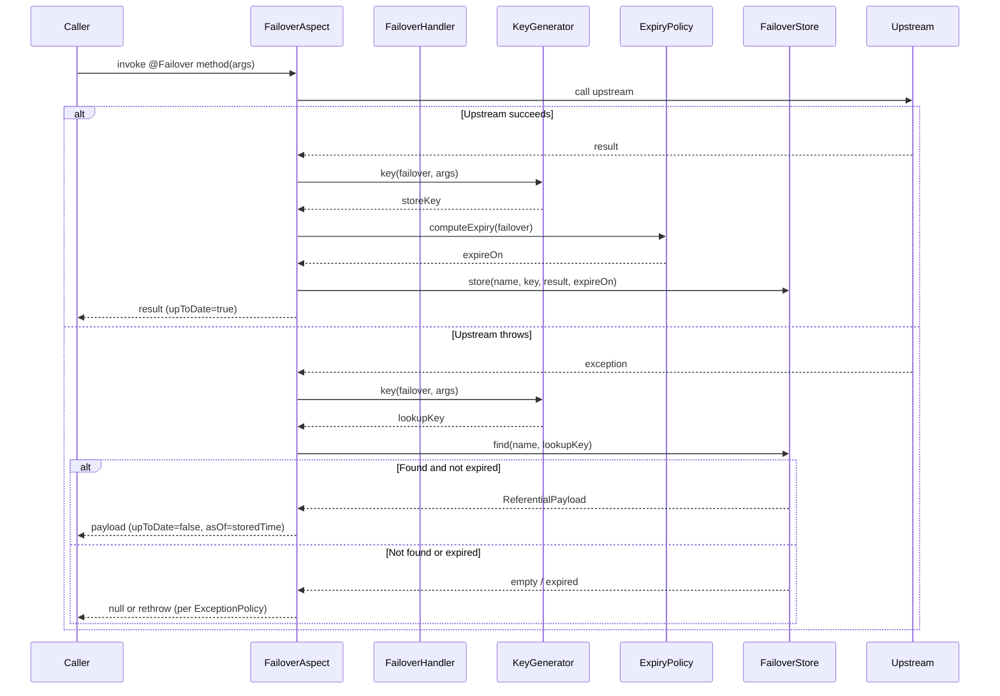

---
hide:
  - navigation
  - toc
template: home.html
---

<p class="fo-section-eyebrow">THE PROBLEM → THE SOLUTION</p>

## Replace fragile try/catch with one annotation

Every team reinvents the same resilience wheel. Failover removes it entirely.

<div class="fo-compare">
<div class="fo-compare-panel before">
<div class="fo-compare-header">❌ Without Failover — bespoke, brittle, repeated everywhere</div>

```java
public Country findByCode(String code) {
    try {
        Country c = upstream.findByCode(code);
        localRepo.save(c, computeExpiry());
        return c;
    } catch (Exception e) {
        log.warn("upstream failed, trying local cache");
        Country cached = localRepo.findByCode(code);
        if (cached == null || isExpired(cached)) {
            throw e;
        }
        cached.setUpToDate(false);
        return cached;
    }
}
```

</div>
<div class="fo-compare-panel after">
<div class="fo-compare-header">✅ With Failover — declarative, consistent, zero boilerplate</div>

```java
@Failover(
    name = "country-by-code",
    expiryDuration = 24,
    expiryUnit = ChronoUnit.HOURS
)
Country findByCode(String code);
```

</div>
</div>

<p class="fo-section-eyebrow">INTERNALS</p>

## How it works

Spring AOP intercepts every annotated method. The rest is automatic.

<div class="fo-flow-wrap">
<p class="fo-diagram-label">Call flow</p>


</div>

<div class="fo-flow-wrap">
<p class="fo-diagram-label">Entry lifecycle</p>



</div>
    
<div class="fo-flow-wrap">
<p class="fo-diagram-label">Sequence diagram</p>



</div>

<div class="fo-flow-wrap">
<div class="fo-flow-caption">
  <div class="fo-flow-item">
    <div class="fo-flow-dot success"></div>
    <p><strong>On success</strong> — result persisted under the derived key with the configured TTL. <code>upToDate=true</code> set on the returned object.</p>
  </div>
  <div class="fo-flow-item">
    <div class="fo-flow-dot failure"></div>
    <p><strong>On failure</strong> — last stored result returned. If none or expired: re-throw (default) or return <code>null</code> via <code>exception-policy: never_throw</code>.</p>
  </div>
</div>
</div>
