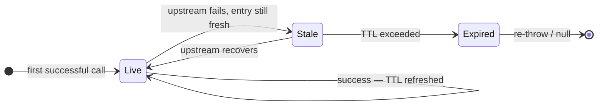
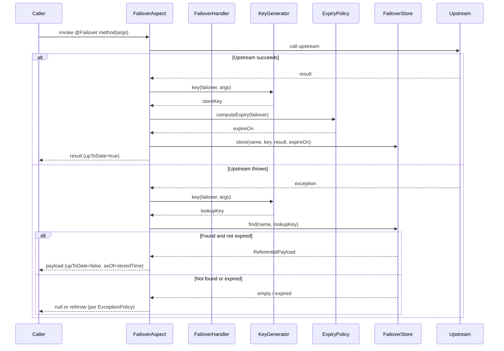

---
hide:
  - navigation
  - toc
template: home.html
---

```mermaid
flowchart LR
    C([Your Code]) --> A{FailoverAspect}
    A -->|invoke| U([Upstream API])
    U -- "✅ success" --> ST[Store payload + TTL]
    ST --> R1([return upToDate=true])
    U -- "❌ failure" --> Q[Query store]
    Q -- "fresh entry" --> R2([return upToDate=false])
    Q -- "expired / missing" --> R3([re-throw])
```

```mermaid
stateDiagram-v2
    direction LR
    [*]     --> Live    : first successful call
    Live    --> Live    : success — TTL refreshed
    Live    --> Stale   : upstream fails, entry still fresh
    Stale   --> Live    : upstream recovers
    Stale   --> Expired : TTL exceeded
    Expired --> [*]     : re-throw / null
```

```mermaid
sequenceDiagram
    participant C as Caller
    participant A as FailoverAspect
    participant H as FailoverHandler
    participant K as KeyGenerator
    participant E as ExpiryPolicy
    participant S as FailoverStore
    participant U as Upstream

    C->>A: invoke @Failover method(args)
    A->>U: call upstream
    alt Upstream succeeds
        U-->>A: result
        A->>K: key(failover, args)
        K-->>A: storeKey
        A->>E: computeExpiry(failover)
        E-->>A: expireOn
        A->>S: store(name, key, result, expireOn)
        A-->>C: result (upToDate=true)
    else Upstream throws
        U-->>A: exception
        A->>K: key(failover, args)
        K-->>A: lookupKey
        A->>S: find(name, lookupKey)
        alt Found and not expired
            S-->>A: ReferentialPayload
            A-->>C: payload (upToDate=false, asOf=storedTime)
        else Not found or expired
            S-->>A: empty / expired
            A-->>C: null or rethrow (per ExceptionPolicy)
        end
    end
```
