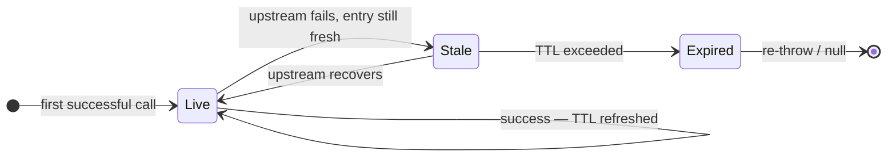

---
hide:
  - navigation
  - toc
---

<!-- ══════════════════ HERO ══════════════════ -->
<div class="fo-hero">
<div class="fo-hero-inner">

<span class="fo-hero-eyebrow">☕ Spring Boot 4 · Java 21 · Apache 2.0</span>

<h1>Stop cascading outages.<br>One annotation.</h1>

<p class="fo-hero-sub">
  Failover stores every successful response from your referential services and
  replays the last known-good result when upstream calls fail —
  transparently, with zero boilerplate.
</p>

<div class="fo-badges">
  
  
  
  
  
</div>

<div class="fo-hero-btns">
  <a href="getting-started/quickstart/" class="fo-btn fo-btn-primary">🚀 Quickstart</a>
  <a href="concepts/how-it-works/" class="fo-btn fo-btn-accent">📐 How it works</a>
  <a href="https://github.com/societegenerale/failover" class="fo-btn fo-btn-ghost">⭐ GitHub</a>
</div>

</div>
</div>

<!-- ══════════════════ STATS ══════════════════ -->
<div class="fo-stats">
  <div class="fo-stat">
    <span class="fo-stat-num">11</span>
    <span class="fo-stat-label">Modules</span>
  </div>
  <div class="fo-stat">
    <span class="fo-stat-num">25</span>
    <span class="fo-stat-label">ADRs</span>
  </div>
  <div class="fo-stat">
    <span class="fo-stat-num">1</span>
    <span class="fo-stat-label">Annotation</span>
  </div>
  <div class="fo-stat">
    <span class="fo-stat-num">4</span>
    <span class="fo-stat-label">Store types</span>
  </div>
  <div class="fo-stat">
    <span class="fo-stat-num">0</span>
    <span class="fo-stat-label">Boilerplate</span>
  </div>
</div>

<!-- ══════════════════ BEFORE / AFTER ══════════════════ -->
<div class="fo-section">
<p class="fo-section-eyebrow">THE PROBLEM → THE SOLUTION</p>
<h2>Replace fragile try/catch with one annotation</h2>
<p>Every team reinvents the same resilience wheel. Failover removes it entirely.</p>
</div>

<div class="fo-compare">

<div class="fo-compare-panel before">
<div class="fo-compare-header">❌ Without Failover — bespoke, brittle, repeated everywhere</div>

```java
public Country findByCode(String code) {
    try {
        Country c = upstream.findByCode(code);
        // remember to save to local DB...
        localRepo.save(c, computeExpiry());
        return c;
    } catch (Exception e) {
        log.warn("upstream failed, trying local cache");
        Country cached = localRepo.findByCode(code);
        if (cached == null || isExpired(cached)) {
            throw e;             // ← silent data gaps
        }
        cached.setUpToDate(false);
        return cached;
    }
}
```

</div>

<div class="fo-compare-panel after">
<div class="fo-compare-header">✅ With Failover — declarative, consistent, zero boilerplate</div>

```java
@Failover(
    name = "country-by-code",
    expiryDuration = 24,
    expiryUnit = ChronoUnit.HOURS
)
Country findByCode(String code);
```

</div>

</div>

<!-- ══════════════════ FEATURES ══════════════════ -->
<div class="fo-section">
<p class="fo-section-eyebrow">CAPABILITIES</p>
<h2>Everything you need, nothing you don't</h2>
<p>Every extension point is a pluggable SPI — swap, extend, or replace any behaviour.</p>
</div>

<div class="fo-feat-grid">

<div class="fo-feat-card">
<div class="fo-feat-icon purple">💾</div>
<h3>Automatic store on success</h3>
<p>Every successful response is persisted under a derived key. No explicit save calls. No repository wiring.</p>
</div>

<div class="fo-feat-card">
<div class="fo-feat-icon blue">🔄</div>
<h3>Transparent recovery on failure</h3>
<p>When upstream throws, the last stored result for that key is returned. Callers never see the exception.</p>
</div>

<div class="fo-feat-card">
<div class="fo-feat-icon green">⏱️</div>
<h3>Business-configured TTL</h3>
<p>Fixed duration, SpEL expressions, or a custom <code>ExpiryPolicy</code>. Expired entries are never served.</p>
</div>

<div class="fo-feat-card">
<div class="fo-feat-icon orange">🗄️</div>
<h3>Pluggable backing stores</h3>
<p>InMemory · Caffeine · JDBC (H2, PostgreSQL, MySQL, Oracle…) · or any custom <code>FailoverStore</code> bean.</p>
</div>

<div class="fo-feat-card">
<div class="fo-feat-icon pink">🧩</div>
<h3>Scatter / Gather</h3>
<p>Collection-returning methods split into per-entity store entries. Partial recovery handled gracefully.</p>
</div>

<div class="fo-feat-card">
<div class="fo-feat-icon teal">🏢</div>
<h3>Multi-tenant isolation</h3>
<p><code>TABLE_PREFIX</code> or <code>SCHEMA</code> strategy routes each request to the correct tenant store automatically.</p>
</div>

<div class="fo-feat-card">
<div class="fo-feat-icon amber">⚡</div>
<h3>Async non-blocking writes</h3>
<p>Store operations offloaded to a virtual-thread executor. Read path stays synchronous. Zero added latency.</p>
</div>

<div class="fo-feat-card">
<div class="fo-feat-icon red">📊</div>
<h3>Observable out of the box</h3>
<p>Every store/recover event emits structured SLF4J logs and Micrometer counters. No extra instrumentation.</p>
</div>

<div class="fo-feat-card">
<div class="fo-feat-icon purple">🔌</div>
<h3>Resilience4j integration</h3>
<p>Circuit-breaker wraps upstream calls when <code>type: resilience</code>. Trips fast on repeated failures.</p>
</div>

</div>

<!-- ══════════════════ HOW IT WORKS ══════════════════ -->
<div class="fo-section">
<p class="fo-section-eyebrow">INTERNALS</p>
<h2>How it works</h2>
<p>Spring AOP intercepts every annotated method. The rest is automatic.</p>
</div>


<div class="fo-flow-wrap">
<p class="fo-diagram-label">Call flow</p>


</div>

<div class="fo-flow-wrap">
<p class="fo-diagram-label">Entry lifecycle</p>



</div>


<div class="fo-flow-wrap">
    <div class="fo-flow-caption">
      <div class="fo-flow-item">
        <div class="fo-flow-dot success"></div>
        <p><strong>On success</strong> — result persisted under the derived key with the configured TTL. <code>upToDate=true</code> set on the returned object.</p>
      </div>
      <div class="fo-flow-item">
        <div class="fo-flow-dot failure"></div>
        <p><strong>On failure</strong> — last stored result returned. If none or expired: re-throw (default) or return <code>null</code> via <code>exception-policy: never_throw</code>.</p>
      </div>
    </div>
</div>

<!-- ══════════════════ INTEGRATIONS ══════════════════ -->
<div class="fo-section">
<p class="fo-section-eyebrow">INTEGRATIONS</p>
<h2>Works with your existing stack</h2>
<p>No new runtime dependencies forced on you — every integration is opt-in via the corresponding module.</p>
</div>

<div class="fo-integrations">
  <span class="fo-int-badge"><span class="dot"></span> Spring Boot 4.x</span>
  <span class="fo-int-badge"><span class="dot"></span> Spring AOP</span>
  <span class="fo-int-badge"><span class="dot"></span> Spring Cloud OpenFeign</span>
  <span class="fo-int-badge"><span class="dot"></span> Resilience4j</span>
  <span class="fo-int-badge"><span class="dot"></span> Micrometer</span>
  <span class="fo-int-badge"><span class="dot"></span> Caffeine Cache</span>
  <span class="fo-int-badge"><span class="dot"></span> JDBC / H2 / PostgreSQL / MySQL / Oracle</span>
  <span class="fo-int-badge"><span class="dot"></span> SLF4J / Logback</span>
  <span class="fo-int-badge"><span class="dot"></span> Virtual Threads (Java 21)</span>
</div>

<!-- ══════════════════ ORIGIN ══════════════════ -->
<div class="fo-origin">
<p>
  Dozens of services at Société Générale depend on the same small set of referential systems —
  currency tables, country lists, client profiles — that change slowly but are queried constantly.
  A single referential outage cascades into a full-platform incident. Failover was built to break
  that coupling once, reusably, across every service.
</p>
<cite>— Origins of Failover · See <a href="adr/index.md">ADR 1</a> for the founding decision</cite>
</div>

<!-- ══════════════════ MODULE TREE ══════════════════ -->
<div class="fo-section">
<p class="fo-section-eyebrow">ARCHITECTURE</p>
<h2>Module overview</h2>
<p>One starter pulls in everything. Pick individual modules when you need fine-grained control.</p>
</div>

<div class="fo-module-tree">
<span class="starter">failover-spring-boot-starter</span>   <span class="tag">← the only dependency you need</span><br>
├── failover-domain               <span class="tag">@Failover annotation · Referential · ReferentialAware · Metadata</span><br>
├── failover-core                 <span class="tag">FailoverHandler · KeyGenerator · ExpiryPolicy · PayloadEnricher · ContextPropagator</span><br>
├── failover-aspect               <span class="tag">Spring AOP @Around interceptor</span><br>
├── failover-store-inmemory       <span class="tag">ConcurrentHashMap store — dev / test only, not persistent</span><br>
├── failover-store-caffeine       <span class="tag">Caffeine-backed in-process store</span><br>
├── failover-store-jdbc           <span class="tag">JDBC store — H2 · PostgreSQL · MySQL · MariaDB · Oracle · SQL Server</span><br>
├── failover-store-async          <span class="tag">non-blocking write decorator (virtual-thread executor)</span><br>
├── failover-store-multitenant    <span class="tag">TABLE_PREFIX / SCHEMA per-tenant routing</span><br>
├── failover-execution-resilience <span class="tag">Resilience4j circuit-breaker integration</span><br>
├── failover-scheduler            <span class="tag">expiry-cleanup scheduler · report-publisher scheduler</span><br>
└── failover-spring-boot-autoconfigure  <span class="tag">zero-config Spring Boot auto-configuration assembler</span>
</div>

<!-- ══════════════════ GET STARTED ══════════════════ -->
<div class="fo-section">
<p class="fo-section-eyebrow">DOCS</p>
<h2>Where to go next</h2>
</div>

<div class="fo-cta-grid">

<div class="fo-cta-card">
<div class="fo-cta-icon">🚀</div>
<h3>Quickstart</h3>
<p>Working end-to-end example in 5 minutes — one dependency, one annotation, one config block.</p>
<a href="getting-started/quickstart/" class="fo-cta-link">Get started →</a>
</div>

<div class="fo-cta-card">
<div class="fo-cta-icon">📦</div>
<h3>Installation</h3>
<p>Maven and Gradle coordinates for the starter and every individual module.</p>
<a href="getting-started/installation/" class="fo-cta-link">View dependencies →</a>
</div>

<div class="fo-cta-card">
<div class="fo-cta-icon">🧠</div>
<h3>Concepts</h3>
<p>Store/recover lifecycle, key derivation, expiry policies, scatter/gather internals.</p>
<a href="concepts/how-it-works/" class="fo-cta-link">Learn how it works →</a>
</div>

<div class="fo-cta-card">
<div class="fo-cta-icon">⚙️</div>
<h3>Configuration</h3>
<p>Every <code>failover.*</code> property with types, defaults, and full examples.</p>
<a href="configuration/properties-reference/" class="fo-cta-link">Browse properties →</a>
</div>

<div class="fo-cta-card">
<div class="fo-cta-icon">🏗️</div>
<h3>ADR Index</h3>
<p>25 architecture decisions — the why behind every design choice in the framework.</p>
<a href="adr/" class="fo-cta-link">Browse decisions →</a>
</div>

<div class="fo-cta-card">
<div class="fo-cta-icon">🤝</div>
<h3>Contributing</h3>
<p>Bug reports, feature proposals, pull requests — all welcome.</p>
<a href="contributing/" class="fo-cta-link">How to contribute →</a>
</div>

</div>
