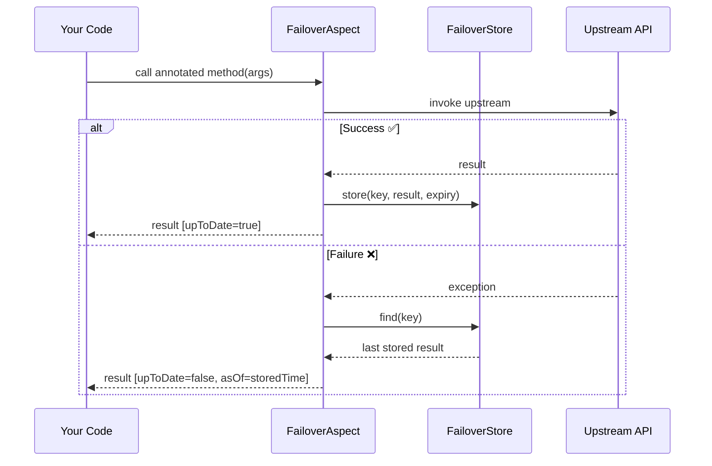

---
hide:
  - navigation
  - toc
---

<div class="fo-hero" markdown>

# :shield: Failover

**Transparent failover for referential data.**  
One annotation. Zero boilerplate. No cascading outages.

<div class="fo-badges">
  
  
  
  
</div>

<div class="fo-hero-btns" markdown>
[🚀 Get Started](getting-started/quickstart.md){ .fo-btn .fo-btn-primary }
[📖 How It Works](concepts/how-it-works.md){ .fo-btn .fo-btn-secondary }
[GitHub](https://github.com/societegenerale/failover){ .fo-btn .fo-btn-secondary }
</div>

</div>

---

## In a nutshell

=== "Java"

    ```java
    @FeignClient(name = "country-service", url = "${country.service.url}")
    public interface CountryClient {

        // Store every successful response for 24 hours.
        // On any failure → replay the last known-good result.
        @Failover(name = "country-by-code", expiryDuration = 24, expiryUnit = ChronoUnit.HOURS)
        @GetMapping("/api/v1/countries/{code}")
        Country findByCode(@PathVariable String code);
    }
    ```

=== "application.yml"

    ```yaml
    failover:
      package-to-scan: com.example.myapp   # scan for @Failover annotations
      store:
        type: jdbc
        jdbc:
          table-prefix: MYAPP_
    ```

=== "Maven"

    ```xml
    <dependency>
        <groupId>com.societegenerale.failover</groupId>
        <artifactId>failover-spring-boot-starter</artifactId>
        <version>3.0.0</version>
    </dependency>
    ```

<p class="fo-oneliner">That is the entire integration — no extra config class, no custom beans, no framework lock-in.</p>

---

## Why Failover?

<div class="fo-why-grid" markdown>

<div class="fo-why-card" markdown>
<span class="fo-icon">💾</span>
**Store on success**

Every live response is persisted automatically. No explicit save calls, no repository wiring.
</div>

<div class="fo-why-card" markdown>
<span class="fo-icon">🔄</span>
**Recover on failure**

When an upstream call throws, the last stored result is returned transparently — callers never see the error.
</div>

<div class="fo-why-card" markdown>
<span class="fo-icon">⏱️</span>
**Expiry-aware TTL**

Business-configured time-to-live. Expired entries are never served — deleted on first access or by the cleanup scheduler.
</div>

<div class="fo-why-card" markdown>
<span class="fo-icon">📊</span>
**Observable by default**

Every store/recover event emits structured logs and Micrometer metrics. No extra instrumentation code.
</div>

</div>

---

## Features

<div class="fo-features" markdown>

<span class="fo-pill">:material-tag: `@Failover` annotation</span>
<span class="fo-pill">:material-database: JDBC · Caffeine · InMemory stores</span>
<span class="fo-pill">:material-timer: Duration + SpEL expiry</span>
<span class="fo-pill">:material-key: Pluggable key generation</span>
<span class="fo-pill">:material-scatter-plot: Scatter / Gather</span>
<span class="fo-pill">:material-domain: Multi-tenant (TABLE_PREFIX · SCHEMA)</span>
<span class="fo-pill">:material-electric-switch: Resilience4j circuit-breaker</span>
<span class="fo-pill">:material-lightning-bolt: Async non-blocking writes</span>
<span class="fo-pill">:material-chart-bar: Micrometer metrics</span>
<span class="fo-pill">:material-thread-outline: MDC + tenant context propagation</span>

</div>

---

## How it works



**On success** — result is stored under the derived key with the configured TTL.  
**On failure** — last good result for the same key is returned. If none exists or it has expired, the exception is re-thrown (default) or `null` is returned (`exception-policy: never_throw`).

---

## Module overview

<div class="fo-module-tree">
<span class="starter">failover-spring-boot-starter</span>   <span class="tag">← add this single dependency</span><br>
├── failover-domain               <span class="tag">@Failover · Referential · ReferentialAware</span><br>
├── failover-core                 <span class="tag">FailoverHandler · KeyGenerator · ExpiryPolicy · PayloadEnricher</span><br>
├── failover-aspect               <span class="tag">Spring AOP interceptor</span><br>
├── failover-store-inmemory       <span class="tag">ConcurrentHashMap (dev / test only)</span><br>
├── failover-store-caffeine       <span class="tag">Caffeine-backed in-process store</span><br>
├── failover-store-jdbc           <span class="tag">JDBC (H2 · PostgreSQL · MySQL · Oracle · …)</span><br>
├── failover-store-async          <span class="tag">non-blocking write decorator</span><br>
├── failover-store-multitenant    <span class="tag">TABLE_PREFIX / SCHEMA tenant routing</span><br>
├── failover-execution-resilience <span class="tag">Resilience4j circuit-breaker integration</span><br>
├── failover-scheduler            <span class="tag">expiry-cleanup + report schedulers</span><br>
└── failover-spring-boot-autoconfigure  <span class="tag">auto-configuration assembler</span>
</div>

---

## Get started

<div class="grid cards" markdown>

-   :material-rocket-launch:{ .lg .middle } **Quickstart**

    ---

    Working end-to-end example in 5 minutes. One dependency, one annotation, one config block.

    [:octicons-arrow-right-24: Quickstart](getting-started/quickstart.md)

-   :material-package-variant:{ .lg .middle } **Installation**

    ---

    Maven and Gradle coordinates for the starter and every individual module.

    [:octicons-arrow-right-24: Installation](getting-started/installation.md)

-   :material-brain:{ .lg .middle } **Concepts**

    ---

    Understand the store → recover lifecycle, key derivation, expiry, and scatter/gather.

    [:octicons-arrow-right-24: How It Works](concepts/how-it-works.md)

-   :material-cog:{ .lg .middle } **Configuration**

    ---

    Every `failover.*` property documented with types, defaults, and examples.

    [:octicons-arrow-right-24: Properties Reference](configuration/properties-reference.md)

</div>

---

## Project info

<div class="grid cards" markdown>

-   :material-scale-balance:{ .lg .middle } **Apache 2.0**

    Open-source. Free to use, modify, and distribute.

-   :material-github:{ .lg .middle } **GitHub**

    [societegenerale/failover](https://github.com/societegenerale/failover)  
    Issues · Discussions · Pull Requests

-   :material-office-building:{ .lg .middle } **Société Générale**

    Built and maintained by the SG engineering team.

-   :material-history:{ .lg .middle } **25 ADRs**

    Every architecture decision recorded.  
    [Browse ADRs](adr/index.md)

</div>
