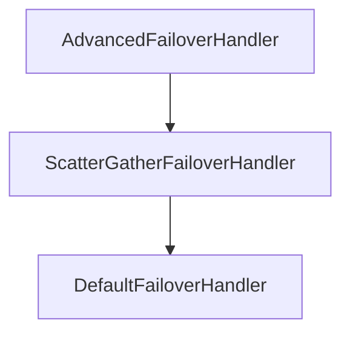

# Core Modules

Three modules form the non-negotiable foundation of every Failover installation: `failover-domain`, `failover-core`, and `failover-aspect`.

---

## failover-domain

Provides the `@Failover` annotation and the two contracts for marking your domain types:

| Type | Kind | Purpose |
|---|---|---|
| `@Failover` | Annotation | Declares failover behaviour on a method |
| `Referential` | Abstract class | Extend to add `upToDate`, `asOf`, `metadata` fields |
| `ReferentialAware` | Interface | Implement when inheritance is not possible |
| `Metadata` | Class | Key/value carrier for optional context in `Referential` |

Add this to any module that annotates methods or defines referential domain types:

```xml
<dependency>
    <groupId>com.societegenerale.failover</groupId>
    <artifactId>failover-domain</artifactId>
    <version>3.0.0</version>
</dependency>
```

---

## failover-core

Contains all SPI interfaces and their default implementations:

| Interface | Default implementation | Purpose |
|---|---|---|
| `FailoverHandler<T>` | `DefaultFailoverHandler` | Store/recover/clean orchestration |
| `FailoverStore<T>` | `DefaultFailoverStore` (delegates to impl) | Persistence contract |
| `KeyGenerator` | `DefaultKeyGenerator` | Raw key from method args |
| `ExpiryPolicy<T>` | `DefaultExpiryPolicy` | TTL computation and check |
| `PayloadEnricher<T>` | `DefaultPayloadEnricher` | Enrich on store/recover |
| `PayloadSplitter<T,R>` | *(none — must provide your own)* | Scatter/gather split/merge |
| `RecoveredPayloadHandler` | *(none — null by default)* | Handle null recovery result |
| `ContextPropagator` | `CompositeContextPropagator(noOp)` | Thread context across async slices |
| `FailoverScanner` | `SpringContextFailoverScanner` *(in `failover-observable-scanner`)* | Discovers `@Failover` methods and their payload types |

All beans use `@ConditionalOnMissingBean` in auto-configuration — declare your own `@Bean` to replace any default.

!!! note "Scanner SPI package"
    `FailoverScanner` lives in `com.societegenerale.failover.core.scanner` (moved from
    `core.observable.scanner` in 3.0.0). It is a neutral shared component: observability reporting
    consumes the discovered annotations, and the JDBC store consumes `findAllPayloadTypes()` to build
    its [deserialization allowlist](store-jdbc.md#deserialization-allowlist). See ADR 42.

### Handler Decorator Chain



- `AdvancedFailoverHandler` — adds metrics publishing and `RecoveredPayloadHandler` invocation.
- `ScatterGatherFailoverHandler` — intercepts when `payloadSplitter` is set; delegates directly to `DefaultFailoverHandler` for plain failovers.
- `DefaultFailoverHandler` — core key/expiry/store/recover logic.

---

## failover-aspect

Contains `FailoverAspect`, a Spring AOP `@Around` advice:

```java
@Around("@annotation(failover)")
public Object failoverAround(ProceedingJoinPoint pjp, Failover failover) throws Throwable
```

The aspect:
1. Resolves the annotated method's `@Failover` metadata.
2. Attempts to proceed (call upstream).
3. On success: calls `failoverExecution.store(failover, args, result)`.
4. On exception: calls `failoverExecution.recover(failover, args, clazz, cause)`.

`FailoverExecution` is the thin wrapper that selects between `BASIC` (try/catch) and `RESILIENCE` (circuit-breaker) modes.

---

## failover-store-inmemory

`ConcurrentHashMap`-backed store. Zero dependencies. Used as the default store when no other store module is on the classpath.

!!! warning "Not for production"
    InMemory store is not persistent. All cached data is lost on restart.

---

## Next Steps

- [JDBC Store](store-jdbc.md) — production-ready persistent store
- [Async Store](store-async.md) — non-blocking write decorator
- [Reference — Interfaces](../reference/interfaces.md) — full SPI method signatures
