# Dashboard

`failover-dashboard` is a self-contained, opt-in, secure-by-default observability dashboard. Drop the dedicated starter on the classpath, enable it in YAML, and open `/failover-dashboard` to see every `@Failover` configuration plus live health metrics — rendered as cards and charts, served straight from the jar (no CDN, no build step).

It introduces **no new instrumentation**: it is a pure consumer of signals the framework already publishes — `FailoverScanner` for configuration and the Micrometer `failover.*` meters for metrics.

---

## Obtaining the Dashboard

The default `failover-spring-boot-starter` ships **none** of this. Add the dedicated starter:

```xml title="pom.xml"
<dependency>
  <groupId>com.societegenerale.failover</groupId>
  <artifactId>failover-dashboard-spring-boot-starter</artifactId>
</dependency>
```

Adding the jar makes the dashboard *available*, not *active*. Nothing is mapped until you enable it.

---

## Enabling It

`enabled` is the **only** switch you must set — everything else has a working default:

```yaml title="application.yml"
failover:
  dashboard:
    enabled: true        # default false (secure-by-default)
```

Once enabled, the UI and the full JSON API are served. The granular flags below exist only to **narrow** exposure, never to opt in to it.

| URL | Serves |
|---|---|
| `/failover-dashboard` | the UI (bare path forwards to `index.html`) |
| `/failover-dashboard/api/config` | every `@Failover` point + global settings |
| `/failover-dashboard/api/config/settings` | effective global `failover.*` / `failover.dashboard.*` config, grouped |
| `/failover-dashboard/api/failover-health` | actuator-style overall status + active configuration |
| `/failover-dashboard/api/metrics` | global + per-API KPIs and rates |
| `/failover-dashboard/api/metrics/source` | metrics provenance (mode, instances reporting, freshness) for the UI source badge |
| `/failover-dashboard/api/health` | per-API health classification |
| `/failover-dashboard/api/metrics/series` | trend samples — local: the in-memory ring (empty unless history is enabled); `mode=prometheus`: cluster-wide via `query_range` |
| `/failover-dashboard/api/instances` | per-instance metrics for the Instances tab — empty in `local` (single JVM); populated in `shared-store` / `prometheus` |
| `/failover-dashboard/api/cluster/snapshot` | *(shared-store only, POST)* peer snapshot ingest |

`base-path` is a single dedicated, non-root namespace covering both the UI and the API; override it to relocate the whole dashboard. `server.servlet.context-path` still prepends as usual.

---

## Configuration

Every `failover.dashboard.*` property in one place. **`enabled` is the only one you need** — the rest have working defaults and exist to narrow exposure, secure the gate, or turn on trend history.

```yaml title="application.yml — full dashboard configuration (all defaults shown)"
failover:
  dashboard:
    enabled: false                   # master switch (secure-by-default) — set true to map anything
    base-path: /failover-dashboard   # single dedicated namespace for the UI + API
    exposure:                        # defaults expose everything; set flags only to NARROW
      ui: true                       # serve the static HTML/JS UI
      api: true                      # serve the JSON API
      include: [config, failover-health, metrics, health, cluster, instances]  # which API endpoints are served
    security:
      role: FAILOVER_ADMIN           # role required for base-path/** when Spring Security is present
      allow-insecure: false          # start unsecured + loud WARN when Spring Security is absent
                                     #   (dev / trusted-network only; REFUSED under the 'prod' profile)
    history:                         # opt-in server-side trend ring buffer (see Trend History below)
      enabled: false                 # enable the sampler + /api/metrics/series endpoint
      samples: 120                   # ring-buffer capacity (retained sample count)
      sample-interval-seconds: 15    # seconds between samples
    health:                          # healthyRate thresholds for the per-API status badge
      degraded-threshold: 0.99       # >= ⇒ HEALTHY; below (down to unhealthy floor) ⇒ DEGRADED
      unhealthy-threshold: 0.90      # >= ⇒ DEGRADED; below ⇒ UNHEALTHY
    cluster:                         # where metrics are read from across instances (see Distributed Deployment)
      mode: local                    # local (default) | prometheus | shared-store
      prometheus:                    # used when mode=prometheus (aggregates failover.* across instances)
        base-url: ""                 # e.g. http://prometheus:9090 (blank ⇒ falls back to local)
        token: ""                    # optional bearer token (blank ⇒ none)
        timeout-seconds: 5           # per-query connect/read timeout
      shared-store:                  # used when mode=shared-store (peers push snapshots, aggregated in-app)
        store: inmemory              # inmemory (default) | jdbc (needs failover-dashboard-snapshotstore-jdbc)
        liveness-seconds: 45         # a peer silent longer than this drops out of the aggregate
        max-instances: 10            # supported ceiling (warns beyond — graduate to prometheus)
        sample-interval-seconds: 30  # cluster-trend sampling cadence
        retention:
          max-age: 7d                # trend-history age bound
          max-entries: 100000        # trend-history size bound (oldest truncated)
        jdbc:                        # used when store=jdbc
          table-prefix: ""           # prepended to FAILOVER_DASHBOARD_SNAPSHOT (validated)
          auto-ddl: true             # create the table on startup if missing
      snapshot:                      # peer-side push (every instance, incl. non-UI nodes)
        publish-url: ""              # dashboard ingest URL (blank ⇒ this instance does not push)
        interval-seconds: 15         # seconds between snapshot pushes
```

| Property | Default | Purpose |
|---|---|---|
| `enabled` | `false` | Master switch. Nothing is mapped until `true`. |
| `base-path` | `/failover-dashboard` | Dedicated namespace for UI + API. Must start with `/`, not be `/`, no trailing `/` — else the context fails fast. |
| `exposure.ui` | `true` | Serve the static UI. `false` = API-only. |
| `exposure.api` | `true` | Serve the JSON API. `false` = UI-only. |
| `exposure.include` | all of them | API endpoints served: `config`, `failover-health`, `metrics`, `health`, `cluster`, `instances`. Trim to narrow; an omitted endpoint returns `404`. `/api/metrics/series` is gated with `metrics`; `/api/cluster/snapshot` (shared-store ingest) with `cluster`; `/api/instances` with `instances`. |
| `security.role` | `FAILOVER_ADMIN` | Role required for `base-path/**` when Spring Security is present. |
| `security.allow-insecure` | `false` | When Spring Security is absent: `false` fails fast (fail-closed); `true` starts unsecured with a loud WARN. **Refused under the `prod` profile.** |
| `history.enabled` | `false` | Turn on the server-side trend ring buffer + `/api/metrics/series`. |
| `history.samples` | `120` | Retained sample count (ring-buffer capacity). |
| `history.sample-interval-seconds` | `15` | Seconds between samples. |
| `health.degraded-threshold` | `0.99` | Healthy-rate floor for `HEALTHY`. |
| `health.unhealthy-threshold` | `0.90` | Healthy-rate floor for `DEGRADED`; below is `UNHEALTHY`. |
| `cluster.mode` | `local` | Where metrics are read from. `local` = this instance's registry (default). `prometheus` aggregates `failover.*` across instances via the Prometheus HTTP API. `shared-store` aggregates pushed per-instance snapshots in-app (small clusters, no Prometheus). See [Distributed Deployment](#distributed-deployment-scenarios). |
| `cluster.prometheus.base-url` | `""` | Prometheus base URL for `mode=prometheus` (e.g. `http://prometheus:9090`). Blank, or unreachable at runtime, falls back to the local registry with a warning. |
| `cluster.prometheus.token` | `""` | Optional bearer token for Prometheus. |
| `cluster.prometheus.timeout-seconds` | `5` | Per-query connect/read timeout. |
| `cluster.shared-store.store` | `inmemory` | `inmemory` (default) or `jdbc` (durable; needs the `failover-dashboard-snapshotstore-jdbc` module + a `DataSource`). |
| `cluster.shared-store.liveness-seconds` | `45` | A peer whose latest snapshot is older than this is excluded from the aggregate. |
| `cluster.shared-store.max-instances` | `10` | Supported small-cluster ceiling; exceeding it logs a warning. |
| `cluster.shared-store.sample-interval-seconds` | `30` | Cluster-trend sampling cadence. |
| `cluster.shared-store.retention.max-age` / `.max-entries` | `7d` / `100000` | Trend-history age and size bounds (oldest truncated). |
| `cluster.shared-store.jdbc.table-prefix` / `.auto-ddl` | `""` / `true` | Snapshot table prefix (validated) + auto-create, when `store=jdbc`. |
| `cluster.snapshot.publish-url` / `.interval-seconds` | `""` / `15` | Peer-side push: dashboard ingest URL + cadence. Blank URL ⇒ this instance does not push. |

See the [Properties Reference](../configuration/properties-reference.md#dashboard-properties) for the canonical table.

---

## The Toolbar

Every view shares the top bar:

- **Status chip** — overall live status (`Healthy` / `Degraded` / `Unhealthy`), derived from the worst per-API health.
- **Tabs** — `Overview`, `Per-API`, `Instances` (cluster modes only — hidden in `local`), `Health`, `Config` (Overview is the default; the open tab is kept in the URL hash, e.g. `#per-api`).
- **Auto-refresh** — selectable cadence: `off`, `10s`, `30s`, `1m`, `10m`, `1h` (default `30s`).
- **Refresh now** (`⟳`) — reload immediately, independent of the cadence.
- **Last-updated** — timestamp of the last successful load.
- **Theme toggle** (`◐`) — switch dark / light (or force it with `?theme=dark` / `?theme=light`).
- **Docs** — the failover icon opens this documentation in a new tab.

All controls carry hover tooltips. Dark is the default "control-room" theme; both themes are shown for each view below.

---

## The Views

### Overview

The at-a-glance health and KPI surface.

- **Health banner** — a closable, colour-coded summary shown on each load: *all APIs healthy* (green), *N need attention* (amber, names listed), or *N unhealthy — action needed* (red).
- **Signals — row 1 (health):** a large **Overall API Health** gauge (the `(success + recovered) / total` healthy-served rate) beside a grid of **per-API health cards**, sorted **worst-first** so a struggling API surfaces top-left. Each card shows its health %, status, calls and failover %.
- **Signals — row 2 (metrics):** one card per KPI — **Overall calls**, **Success rate**, **Failover rate**, **Recovery rate**, **Non-recovery rate** (each rate shows the underlying count too), **Persistence failures** (async store writes that were lost — alert on any non-zero), and **Recover latency** (mean recover-path ms).
- **Charts:** *Did the caller get a result?* (live value / recovered / hard failure), *When failover fired, did it recover?* (full / partial / nothing usable — partial = scatter-gather slices), *Successful vs Recovered*, a full-width **Trend** (calls per tick + success / failover / recovery rate over time), *Why did upstream fail?* (top exception types), and *Latency — store vs recover* per API.

### Per-API

Drill-down per failover point.

- **Per-API health table** — sortable (click any header): calls, healthy-rate bar, success / failover / recovery %, errors, an inline **failover-trend sparkline**, and a `HEALTHY` / `DEGRADED` / `UNHEALTHY` badge.
- **Failover trend — all APIs** — one line per failover point, failover invocations per tick.
- **Per-API breakdown** — grouped bars: overall vs failover vs recovered vs not-recovered.
- **Latency** (on Overview) shows store/recover **mean** plus **p95/p99** when available (`local` + `prometheus`); `shared-store` shows mean/max only (percentiles can't be merged from per-instance snapshots).

### Instances

*Cluster only* — shown when the dashboard reads from a multi-instance source (`shared-store` or `prometheus`); hidden for `local`. Answers the first incident question: **one bad node, or all of them?**

- **Roll-up cards** — Total · Reporting · Silent · Healthy · Degraded · Unhealthy. *Silent* = expected-but-not-reporting (beyond the liveness window in `shared-store`).
- **Per-instance table** — a row per instance: id, live/silent dot, calls, success / failover / recovery %, p95 recover, last-seen, and a status badge. Click a row to drill in.
- **Drill-down** — the selected instance's *own* KPIs (calls, success, failover, users-unblocked, p95) — not the cluster aggregate.

Data comes from `MetricsSource.instances()`: in `shared-store` from the per-instance snapshots the store already holds; in `prometheus` from `sum by (name, instance) (failover_*)` queries.

### Health

Actuator-style subsystem health, mirroring the `/actuator/health/failover` contributor.

- **Cluster roll-up** — healthy / degraded / unhealthy API counts + instances reporting, with a provenance line (local vs cluster aggregate). Cluster-wide via `MetricsSource.health()` across whichever tier is active.
- **Status hero** — `UP` (at least one `@Failover` registered) or `DOWN` (none discovered — a misconfiguration signal).
- **Active configuration** — the global config rendered as small stat cards (registered failovers, type, store type, async, exception policy, scheduler…). Types and flags only — never credentials or connection strings (§9).

### Config

- **Failover configuration** — a sortable, filterable table of every `@Failover` point: name, domain, expiry, store, execution, recover-all, splitter, key generator, expiry policy. Empty per-annotation overrides render as `default`.
- **Global settings** — the effective `failover.*` / `failover.dashboard.*` settings grouped into panels (Core / Store / Scatter / Scheduler / Dashboard). Types, flags, crons, thresholds and paths only.

=== "Dark mode"

    === "Overview"

        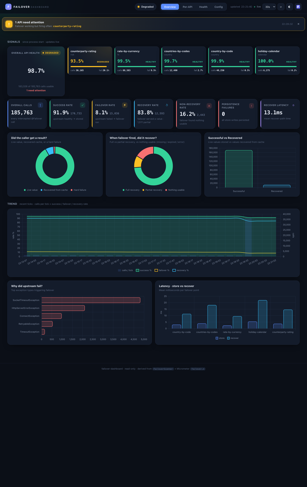

    === "Per-API"

        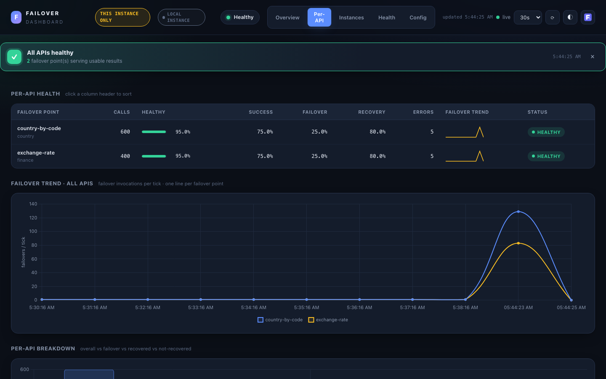

    === "Instances"

        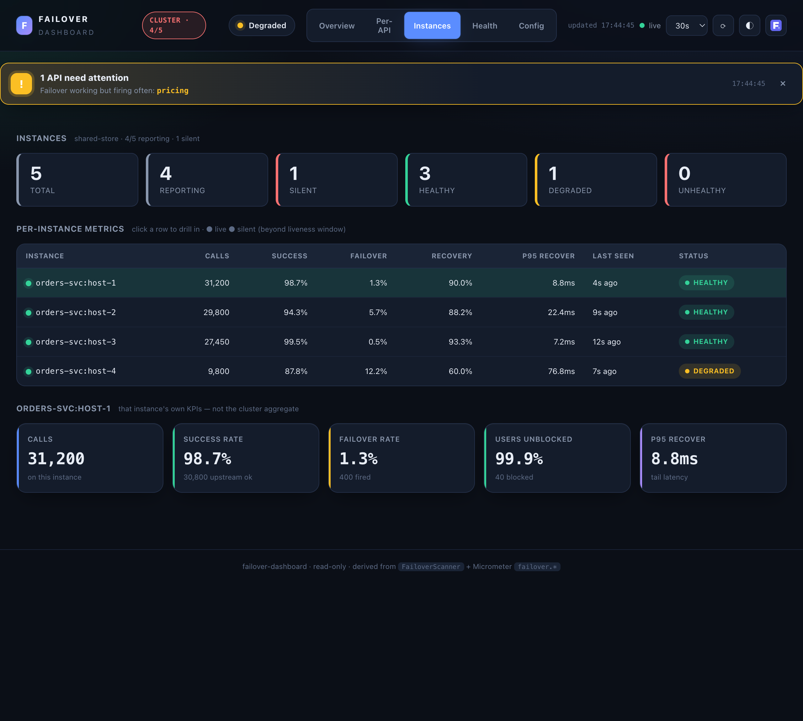

    === "Health"

        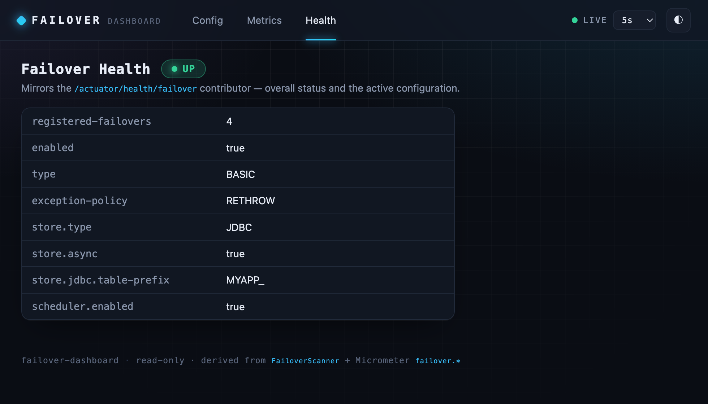

    === "Config"

        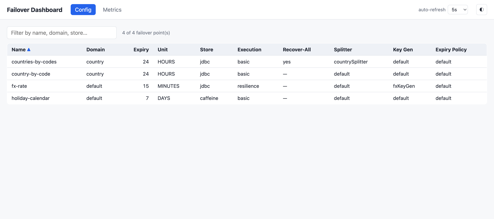

=== "Light mode"

    === "Overview"

        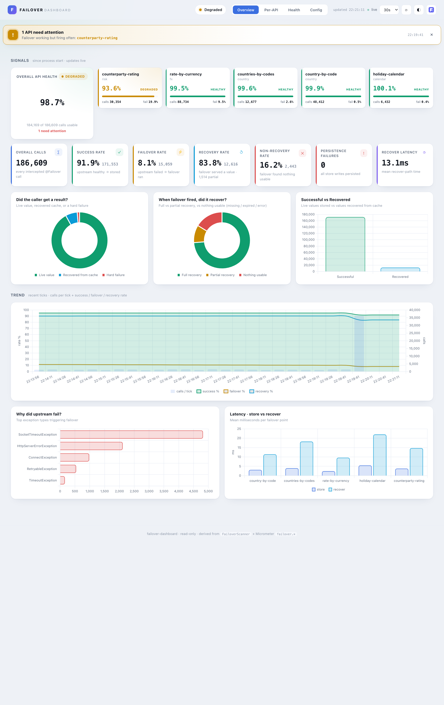

    === "Per-API"

        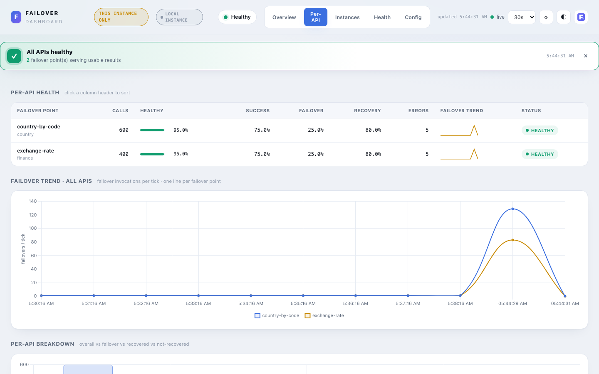

    === "Instances"

        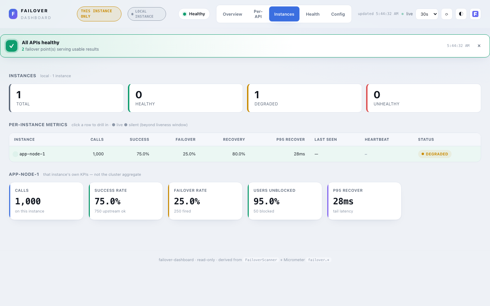

    === "Health"

        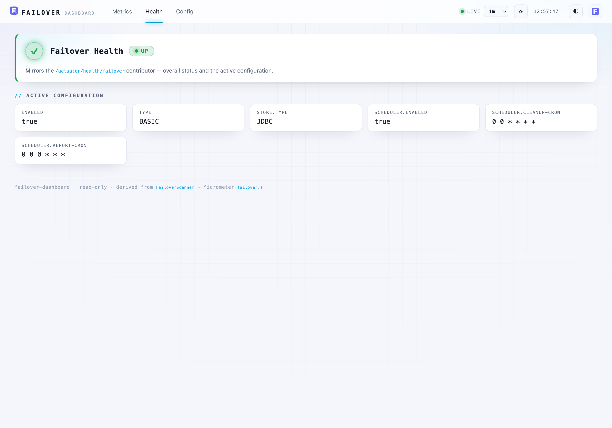

    === "Config"

        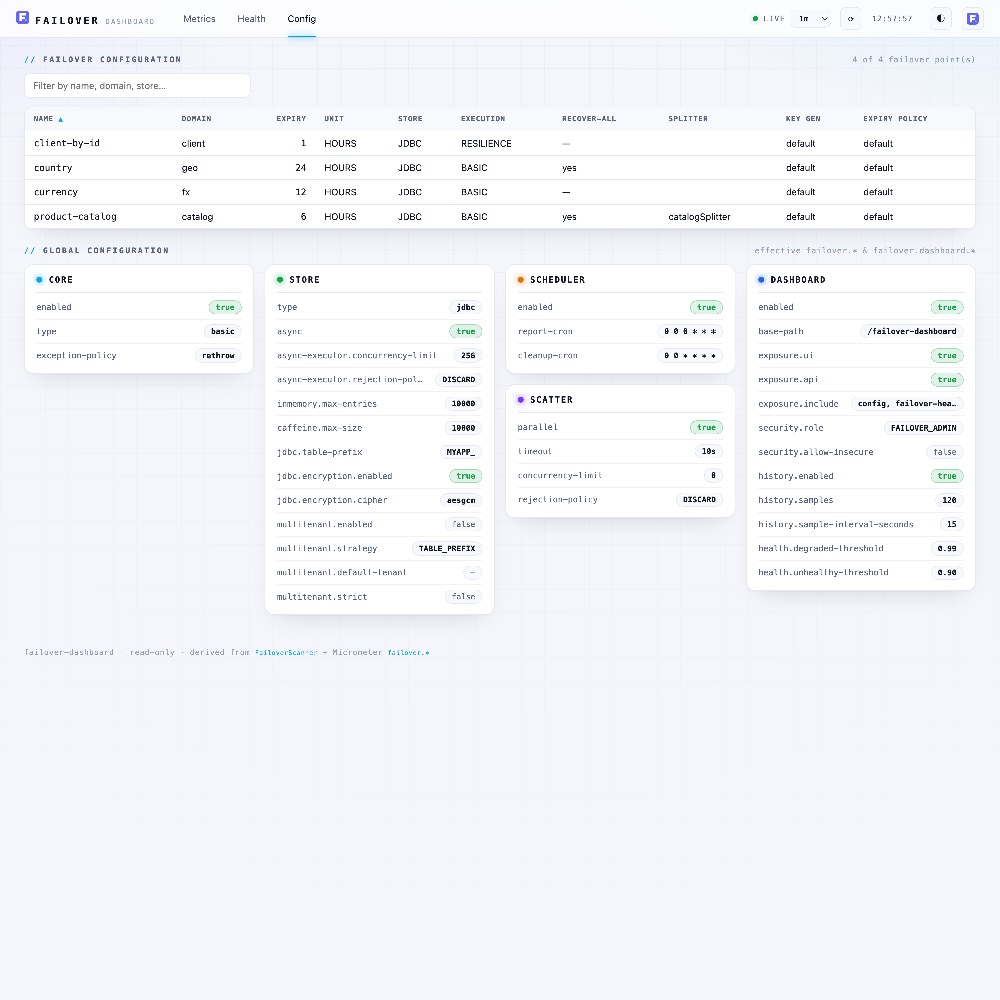

---

## KPIs — Derived, Not Measured

Every KPI is derived from counters that already exist (`failover.store.total`, `failover.recovery.outcome.total`, `failover.recover.total`). Per API, let `S` = stored upstream successes and `F` = recovered + not-recovered + error:

| KPI | Formula | Meaning |
|---|---|---|
| Success rate | `S / (S+F)` | upstream healthy → live value stored |
| Failover rate | `F / (S+F)` | upstream failed → failover flow started |
| Recovery rate | `recovered / F` | failover served a stored, non-expired value |
| Non-recovery rate | `(not_recovered + error) / F` | failover found nothing usable |
| Health (healthy-served) | `(S + recovered) / (S+F)` | caller got a usable result (live or recovered) |

Zero denominators yield `0`, never `NaN`. Health is classified `HEALTHY` / `DEGRADED` / `UNHEALTHY` against configurable thresholds.

Three further operational signals are surfaced from existing meters (still no new instrumentation):

| Signal | Source meter | Why it matters |
|---|---|---|
| **Async write failures** | `failover.store.async.failed` | Async store writes that threw inside the executor — failover data was **not persisted**. Shown as a KPI, a red per-API table column, and a loud banner when non-zero. Alert on any increase. |
| **Latency (mean / max)** | `failover.operation.duration` (timer) | Wall time of the store and recover paths, per API. Mean + max only — the timer has no percentile histogram, so p95/p99 are intentionally absent. |
| **Top exception types** | `failover.exception.total` | Which upstream exception types trigger failover most — quick root-cause triage. |

---

## Security — Fail-Closed (§9)

The dashboard surfaces internal operational data, so the access gate is **not** relaxed by the convenience defaults:

- **Spring Security present** (bundled by the starter): the module contributes a `SecurityFilterChain` scoped to `base-path/**` requiring role `FAILOVER_ADMIN` (configurable). Override it with your own `dashboardSecurityFilterChain` bean.
- **Spring Security absent**: the context **fails fast** at startup — unless `failover.dashboard.security.allow-insecure=true`, which starts unsecured with a loud repeated `WARN` (trusted-network / dev only). The `allow-insecure` escape hatch is **refused outright when the `prod` profile is active**: it can never silently disable the access gate in production.

A strict, static-only `Content-Security-Policy` is applied to every dashboard response (no remote or inline scripts; Chart.js is vendored). The API is read-only — no endpoint mutates state. Only annotation metadata and aggregate counts are exposed — never payload data, keys, credentials, or connection strings.

```java title="Consumer override (same as Actuator)"
http.authorizeHttpRequests(a -> a.requestMatchers("/failover-dashboard/**").hasRole("FAILOVER_ADMIN"));
```

---

## Trend History (opt-in)

By default the trend charts (the call/rate timeline and per-API failures) are buffered **client-side**, so they live only as long as the tab is open — a browser reload clears them and they rebuild from the next poll. This is by design and harmless: the cumulative KPIs, per-API counts and health table are re-derived from the server-side `failover.*` counters on every load, so **none of those numbers are lost** on reload — only the in-tab trend lines reset.

For reload-surviving trends, enable the server-side ring-buffer sampler:

```yaml title="application.yml"
failover:
  dashboard:
    history:
      enabled: true            # default false — registers the sampler + /api/metrics/series
      samples: 120             # ring-buffer capacity (retained sample count)
      sample-interval-seconds: 15   # seconds between samples
```

**How it works.** A scheduled sampler snapshots the global cumulative `failover.*` counters every `sample-interval-seconds` into a bounded in-memory ring of `samples` entries (oldest evicted when full). The retained window is therefore:

```
window ≈ samples × sample-interval-seconds
       = 120 × 15s = 1800s (30 minutes) with the defaults
```

Size it for the span you want visible: e.g. `samples: 240, sample-interval-seconds: 15` ≈ 1 hour; `samples: 120, sample-interval-seconds: 60` ≈ 2 hours at coarser resolution. The buffer is a fixed memory cost (`samples` small records), independent of traffic.

**The `/api/metrics/series` endpoint.** Returns the retained samples (global cumulative totals per timestamp) in chronological order. It accepts an optional `windowSec` query param — only samples within that many seconds of now are returned; `windowSec=0` returns all retained (the UI uses `0` on load). The endpoint is registered **only** when `history.enabled=true`, and is gated by the `metrics` exposure flag (`exposure.include`) and the same access gate as the rest of the dashboard.

**UI behaviour.** When enabled, the Overview **hydrates the call/rate timeline from `/api/metrics/series` on load**, so a browser reload keeps its trend instead of starting blank; live polling then continues seamlessly from the last sample. The chart deltas consecutive cumulative samples (calls per interval) and derives the failover / recovery / non-recovery rates. (The per-API failures chart remains live-only — `/series` carries global totals, not per-API.) With history disabled the endpoint is absent and the UI silently falls back to the client-side buffer.

It is process-local and lost on restart — deliberately **not** a TSDB. For long-term, cross-restart analysis, point Prometheus/Grafana at the existing `failover.*` meters.

---

## Graceful Degradation

If Micrometer is not on the classpath, the **Config and Health views still work**; the Overview / Per-API views show a friendly "metrics unavailable" notice. If the Chart.js asset is missing, KPI cards and tables still render and a notice replaces the charts.

---

## The Read Axis (dashboard service) — how the dashboard collects metrics

The **read axis = the dashboard service**: it never emits `failover.*` meters, it *reads and aggregates* them through a `MetricsSource` chosen by `cluster.mode`. The same UI/API sits on top of all three sources. (The **write axis = the failover service** that emits the meters — see [Observability](observability.md#the-write-axis-failover-service-how-meters-leave-the-app).)

### Single instance (`local`)

One JVM. The dashboard reads its own in-process registry directly — exactly the meters this instance emitted.

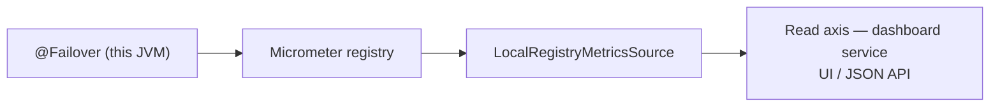

Behind a load balancer this is only **one node's** view — the UI labels it "this instance only". For a true cluster picture, pick `shared-store` or `prometheus`.

### Multiple instances — `shared-store` (no Prometheus)

Each instance **pushes** its own KPI snapshot to the dashboard; the dashboard keeps the latest per instance and aggregates them in memory with the same `DashboardKpis` math. Small clusters (≤ ~10), zero external infra.

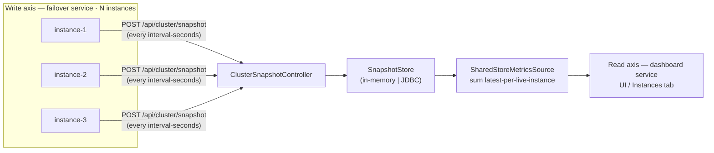

Stale peers (older than `liveness-seconds`) drop out of the aggregate; `store: jdbc` makes the snapshots survive a dashboard restart.

### Multiple instances — `prometheus` (large clusters)

Prometheus scrapes every instance; the dashboard issues read-only PromQL to aggregate cluster-wide (incl. p95/p99 and per-instance) and falls back to `local` if Prometheus is down.

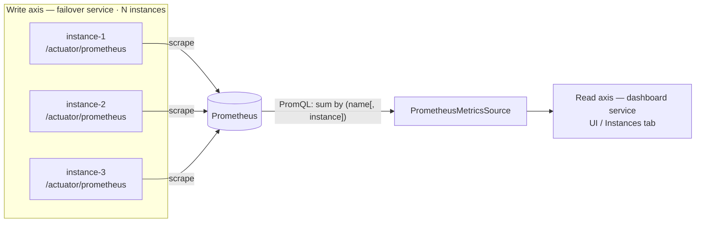

### Picking a mode

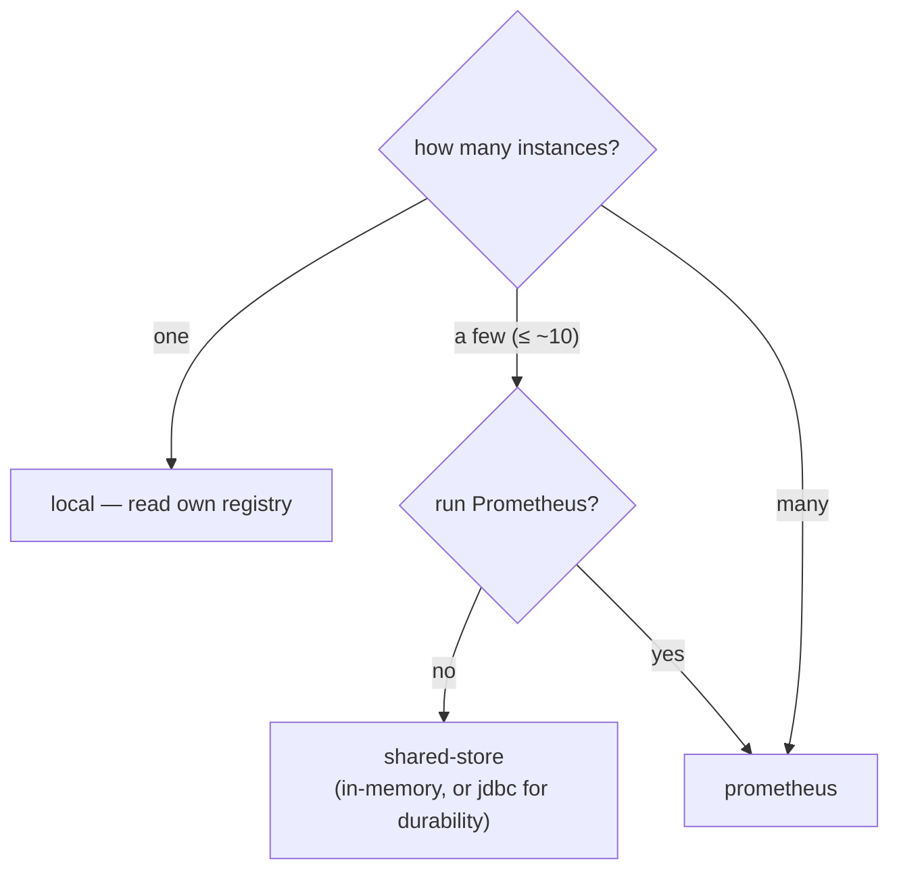

| Mode | Source | Infra | Per-instance view |
|---|---|---|---|
| `local` | in-process registry | none | n/a (single JVM) |
| `shared-store` | pushed snapshots, in-app aggregate | none, or a DB table (jdbc) | yes (snapshot per instance) |
| `prometheus` | PromQL across scraped instances | Prometheus/TSDB | yes (`instance` label) |

### Pairing the read axis with your write-axis backend

The read axis has **only these three sources** — it does **not** read every metrics backend. So the dashboard's `cluster.mode` does not always mirror the Micrometer registry you export with ([Observability → choosing a registry](observability.md#choosing-a-micrometer-registry)). Map it like this:

| Write axis (export registry) | Dashboard read axis | Cluster view comes from |
|---|---|---|
| **Prometheus** (scrape) | `cluster.mode=prometheus` (+ `prometheus.base-url`) | the embedded dashboard, via PromQL — **1:1 pairing** |
| **OTLP / Elastic / Datadog / New Relic / CloudWatch / Influx / Graphite** (push) | `cluster.mode=shared-store` **or** none | the **vendor's own UI** (Grafana / Kibana / Datadog…) for those exported meters; **or** the embedded dashboard via `shared-store` (peers push KPI snapshots straight to it — independent of the metrics backend) |
| **none / SimpleMeterRegistry** (single JVM) | `cluster.mode=local` (default) | this instance only |

Key point: **`shared-store` is independent of the metrics backend.** Its peers POST snapshots directly to the dashboard (`/api/cluster/snapshot`), so you get a cluster view in the embedded UI **regardless of which `micrometer-registry-*` you use** (or even with none). The only registry the dashboard *itself* reads back is Prometheus. There is **no** `MetricsSource` for OTLP/Elastic/Datadog/etc. — for those, either read the cluster picture in that vendor's UI, or run `shared-store` alongside.

Examples:

- **Prometheus everywhere:** apps export `micrometer-registry-prometheus`; dashboard `cluster.mode=prometheus`. One pairing, full cluster view + p95/p99 in the embedded UI.
- **OTLP to Datadog, but still want the embedded dashboard clustered:** apps export `micrometer-registry-otlp` *and* set `cluster.snapshot.publish-url`; dashboard `cluster.mode=shared-store`. Datadog gets the meters; the dashboard gets snapshots — two parallel paths.
- **OTLP to your APM, no embedded cluster view needed:** dashboard left at `local` (or not deployed) — use the APM's dashboards.

---

## Distributed Deployment — Scenarios

The dashboard reads the `failover.*` **meters**; `cluster.mode` chooses *where it reads them from*. Everything else (UI, KPIs, health, security) is identical across modes. The scenarios below are complete, copy-pasteable configs for each.

| Mode | Reads from | Infra | When |
|---|---|---|---|
| `local` (default) | this instance's in-process registry | none | single JVM, dev |
| `shared-store` | peers push snapshots → in-memory or JDBC | none, or a small DB table | small cluster (≤ ~10), no Prometheus |
| `prometheus` | Prometheus HTTP API across all instances | Prometheus/TSDB | large cluster |

Each scenario below is a complete, copy-pasteable example.

### Scenario A — Single JVM (default)

Nothing to configure beyond enabling the dashboard; `cluster.mode` defaults to `local`.

```yaml title="application.yml — the app that has @Failover methods"
failover:
  dashboard:
    enabled: true            # secure-by-default: off unless set
```

Open `http://<app>:<port>/failover-dashboard`. Behind a load balancer this shows only the node that answered (a "this instance only" badge makes that explicit) — use one of the cluster modes below for a true aggregate.

### Scenario B — Cluster via Prometheus (large clusters)

Each instance exposes `/actuator/prometheus`; Prometheus scrapes them; the dashboard aggregates with PromQL (`sum`, `rate`, `histogram_quantile` → cluster-wide p95/p99). Falls back to `local` if Prometheus is unreachable, so it never goes dark.

```yaml title="every app instance"
management:
  endpoints.web.exposure.include: prometheus,health
failover:
  dashboard:
    enabled: true
    cluster:
      mode: prometheus
      prometheus:
        base-url: http://prometheus:9090
        # token: <bearer>      # optional
        # timeout-seconds: 5
```

```yaml title="prometheus.yml (scrape config)"
scrape_configs:
  - job_name: my-service
    metrics_path: /actuator/prometheus
    static_configs:
      - targets: ['app-1:8080', 'app-2:8080', 'app-3:8080']
```

Prometheus adds the `instance` label at scrape time, so the dashboard's per-instance grouping works automatically — you do **not** need the `failover.observable.instance` tag here (that tag is for push backends; see [Observability](observability.md)). The **Instances tab** then breaks the cluster down per node (`sum by (name, instance)`).

### Scenario C — Cluster via shared-store, in-memory (small clusters, no Prometheus)

Each instance **pushes** its local KPI snapshot to the dashboard; the dashboard aggregates them in memory with the same KPI math. Production-supported for ≤ ~10 instances. **Consistency over durability**: one (latest) snapshot per instance, stale peers excluded by a liveness window, reset-aware monotonic trend, age + size retention.

```yaml title="the dashboard host (aggregator + UI)"
failover:
  dashboard:
    enabled: true
    cluster:
      mode: shared-store
      shared-store:
        store: inmemory          # default
        liveness-seconds: 45     # a peer silent longer than this drops out of the aggregate
        max-instances: 10        # supported ceiling (warning beyond)
        sample-interval-seconds: 30   # cluster trend sampling cadence
        retention:
          max-age: 7d            # trend history age bound
          max-entries: 100000    # trend history size bound (oldest truncated)
```

```yaml title="every peer (including non-UI instances)"
failover:
  dashboard:
    enabled: true
    cluster:
      snapshot:
        publish-url: http://dashboard-host:8080/failover-dashboard/api/cluster/snapshot
        interval-seconds: 15
```

The push endpoint sits behind the dashboard's access gate, so peers authenticate with the configured role (basic auth) — see **Security** below. Lost on dashboard restart (it's in memory); use Scenario D for restart-survival.

Each pushed snapshot is retained per instance, so the **Instances tab** lists every reporting node (and flags silent ones past `liveness-seconds`); the **Health tab** shows the cluster roll-up.

### Scenario D — Cluster via shared-store, JDBC durable

Same as C, but snapshots persist to a database so the aggregate survives a dashboard restart. Add the optional module and flip one property.

```xml title="dashboard host pom.xml"
<dependency>
  <groupId>com.societegenerale.failover</groupId>
  <artifactId>failover-dashboard-snapshotstore-jdbc</artifactId>
</dependency>
```

```yaml title="dashboard host"
failover:
  dashboard:
    enabled: true
    cluster:
      mode: shared-store
      shared-store:
        store: jdbc
        liveness-seconds: 45
        max-instances: 10
        jdbc:
          table-prefix: ""       # prepended to the base table name; "" ⇒ FAILOVER_DASHBOARD_SNAPSHOT
          auto-ddl: true         # create the table on startup if missing
```

Requires a `DataSource` in the dashboard app (the usual `spring.datasource.*`). Peers are configured exactly as in Scenario C (`cluster.snapshot.publish-url`).

!!! question "Is multi-tenancy required for the snapshot store?"
    **No.** The snapshot store holds only **aggregate, non-sensitive failover metrics** (counts, rates, latency means/percentiles) — never business data, payloads, keys or PII. So the per-tenant data-isolation / compliance reasons that drive the *failover store's* multi-tenancy (`failover.store.multitenant`) **do not apply here**. One shared table is correct and simplest.

    If you need to **namespace** the table — e.g. several environments or several independent dashboards sharing one database — use `table-prefix` (validated: letters/digits/underscore only). If you genuinely want per-tenant *dashboards*, run separate dashboard instances each with its own `table-prefix` (or its own schema); the snapshot store itself stays single-table and tenant-agnostic by design.

**Table name.** `table-prefix` + the base `FAILOVER_DASHBOARD_SNAPSHOT` (e.g. prefix `DEMO_` → `DEMO_FAILOVER_DASHBOARD_SNAPSHOT`). The prefix is validated as a safe SQL identifier fragment (no injection).

**DDL.** With `auto-ddl: true` the table is created automatically. To manage the schema yourself (`auto-ddl: false`), create it with the dialect-appropriate type for the JSON column:

```sql title="PostgreSQL"
CREATE TABLE FAILOVER_DASHBOARD_SNAPSHOT (
    INSTANCE_ID  VARCHAR(255) PRIMARY KEY,
    RECEIVED_AT  BIGINT       NOT NULL,
    SUMMARY_JSON TEXT         NOT NULL          -- or JSONB
);
```

```sql title="MySQL / MariaDB"
CREATE TABLE FAILOVER_DASHBOARD_SNAPSHOT (
    INSTANCE_ID  VARCHAR(255) PRIMARY KEY,
    RECEIVED_AT  BIGINT       NOT NULL,
    SUMMARY_JSON LONGTEXT     NOT NULL
);
```

```sql title="Oracle"
CREATE TABLE FAILOVER_DASHBOARD_SNAPSHOT (
    INSTANCE_ID  VARCHAR2(255) PRIMARY KEY,
    RECEIVED_AT  NUMBER(19)    NOT NULL,
    SUMMARY_JSON CLOB          NOT NULL
);
```

```sql title="H2 / generic"
CREATE TABLE IF NOT EXISTS FAILOVER_DASHBOARD_SNAPSHOT (
    INSTANCE_ID  VARCHAR(255) PRIMARY KEY,
    RECEIVED_AT  BIGINT       NOT NULL,
    SUMMARY_JSON CLOB         NOT NULL
);
```

Prepend your `table-prefix` to the table name if you set one. One row per instance (upserted on each push); the dashboard reads only rows within the liveness window.

### Scenario E — Standalone dashboard (its own app)

Run the dashboard as its own small Spring Boot app pointed at a backend, so a cluster has **one** dashboard rather than one embedded per instance. The `@Failover` library is **not** on its classpath.

```yaml title="standalone dashboard app"
spring:
  application.name: failover-dashboard
failover:
  dashboard:
    enabled: true
    cluster:
      mode: prometheus          # or shared-store (then peers push to this app)
      prometheus:
        base-url: http://prometheus:9090
```

The app needs `spring-boot-starter-web`, `spring-boot-starter-security`, a `MeterRegistry`, and the `failover-dashboard` (or its starter) dependency. With no failover library there are no `@Failover` methods to discover, so the **Config view is empty** while all metrics/health/trend views work from the backend — a no-op `FailoverScanner` is supplied automatically. (For `shared-store` mode, also add `failover-dashboard-snapshotstore-jdbc` if you want durability.)

## Configuration How-To

Complete, copy-pasteable YAML for every deployment shape. Each scenario shows **two YAML blocks** —
one for the `@Failover` microservice (the app that uses `@Failover` methods) and one for the dashboard
service (which may be the same process). Sub-scenarios 2.x cover the snapshot ingest authentication options.

### 1. Single JVM

All-in-one: the same process runs the `@Failover` methods **and** serves the dashboard.
`cluster.mode` defaults to `local` (reads the in-process `MeterRegistry`); no cluster config is needed.

```
┌────────────────────────────────────────────────────┐
│  Single JVM                                        │
│                                                    │
│  ┌─────────────────┐    ┌──────────────────────┐   │
│  │ @Failover beans │───►│  MeterRegistry       │   │
│  └─────────────────┘    └──────────┬───────────┘   │
│                                    │               │
│                          ┌─────────▼────────────┐  │
│                          │  Dashboard (local)   │  │
│                          │  /failover-dashboard │  │
│                          └──────────────────────┘  │
└────────────────────────────────────────────────────┘
```

#### 1.1 Minimal — Basic Enable

```yaml title="application.yml"
failover:
  dashboard:
    enabled: true    # everything else defaults; store = whatever failover.store.type is set to
```

With no `security.allow-insecure`, the dashboard requires Spring Security (bundled by the starter).
Grant the `FAILOVER_ADMIN` role to your admin user or override the filter chain.

#### 1.2 With InMemory Failover Store (Dev / Test)

No extra deps; store is cleared on restart.

```yaml title="application.yml"
failover:
  store:
    type: inmemory
  dashboard:
    enabled: true
```

#### 1.3 With Caffeine Store (Single-Node Cache)

```yaml title="application.yml"
failover:
  store:
    type: caffeine
  dashboard:
    enabled: true
```

#### 1.4 With JDBC Failover Store (Production)

Persistence across restarts; shared by all methods in this JVM.

```yaml title="application.yml"
spring:
  datasource:
    url: jdbc:postgresql://db:5432/myapp
    username: myapp
    password: secret

failover:
  store:
    type: jdbc
  dashboard:
    enabled: true
```

#### 1.5 With Trend History (Reload-Surviving Charts)

Enables the server-side ring buffer; trend charts survive a browser reload.

```yaml title="application.yml"
failover:
  dashboard:
    enabled: true
    history:
      enabled: true
      samples: 120
      sample-interval-seconds: 15   # retains ~30 min with these defaults
```

#### 1.6 With Prometheus Registry

`failover.*` meters flow to Prometheus. The dashboard still reads `local` (in-process registry) — use
`cluster.mode=prometheus` only when the **dashboard** needs to aggregate meters **across multiple instances**.

```yaml title="application.yml"
management:
  endpoints:
    web:
      exposure:
        include: prometheus,health

failover:
  dashboard:
    enabled: true
```

#### 1.7 With OTLP / Elastic / Datadog Registry

Same as 1.6: add the Micrometer registry to export meters to your APM; the dashboard reads `local`.
For push registries, auto-tagging adds an instance identity (useful when you later scale out).

```yaml title="application.yml"
management:
  otlp:
    metrics:
      export:
        url: http://otel-collector:4318/v1/metrics
        enabled: true

failover:
  observable:
    instance:
      mode: auto                  # auto-tags push registries; skips Prometheus
      id: ${HOSTNAME:my-service}  # readable stable id on k8s/Docker
  dashboard:
    enabled: true
```

---

### 2. Cluster / Distributed

Multiple JVMs emit `failover.*` metrics; the dashboard must aggregate them.
**Choose a mode:**

```
Is Prometheus already in the infra?
   Yes → cluster.mode=prometheus (large clusters, p95/p99 available)
   No  → cluster.mode=shared-store (small clusters ≤ ~10, no extra infra)

For shared-store — does the aggregate need to survive a dashboard restart?
   Yes → store=jdbc (durable)
   No  → store=inmemory (simple)
```

In cluster mode the **dashboard host** aggregates metrics from all **peers** (the `@Failover` services).
They may be the same process (each instance runs the dashboard and pushes to the others) or a dedicated
standalone app (see scenario 2.7).

The POST endpoint that receives peer snapshots is `/api/cluster/snapshot`; it can be secured with
**Basic Auth**, **OAuth2 Bearer**, or left **open** (dev only). See the [authentication summary](#snapshot-ingest-authentication-options) below.

---

#### 2.1 In-Memory Shared-Store — Open Ingest (Dev / Trusted Network)

Simplest cluster setup. No auth on the ingest endpoint; peers push without credentials.

```
  @Failover Service 1          @Failover Service 2
 ┌───────────────────┐         ┌───────────────────┐
 │ @Failover beans   │         │ @Failover beans   │
 │ MeterRegistry     │         │ MeterRegistry     │
 │ SnapshotPublisher │         │ SnapshotPublisher │
 └────────┬──────────┘         └────────┬──────────┘
          │ POST /api/cluster/snapshot  │
          │ (no credentials)            │
          └────────────┬────────────────┘
                       ▼
          ┌─────────────────────────────┐
          │  Dashboard Host             │
          │  SnapshotStore (inmemory)   │
          │  SharedStoreMetricsSource   │
          │  /failover-dashboard        │
          └─────────────────────────────┘
```

**`@Failover` service YAML (every peer):**

```yaml title="peer-service/application.yml"
failover:
  dashboard:
    enabled: true
    cluster:
      snapshot:
        publish-url: http://dashboard-host:8080/failover-dashboard/api/cluster/snapshot
        interval-seconds: 15
        allow-insecure-ingest: true   # suppresses the publisher-side no-auth startup WARN
        # no username / password / oauth2 (matches open ingest on dashboard)
```

**Dashboard host YAML:**

```yaml title="dashboard-host/application.yml"
failover:
  dashboard:
    enabled: true
    cluster:
      mode: shared-store
      shared-store:
        store: inmemory
        liveness-seconds: 45
        max-instances: 10
      snapshot:
        allow-insecure-ingest: true   # ⚠ dev / trusted-network only — logs startup WARN
                                      # refused under the 'prod' profile
```

!!! warning "Open ingest"
    `allow-insecure-ingest: true` creates a permit-all `POST` endpoint. Use only on a trusted internal
    network or in development. Refused under the `prod` Spring profile.

---

#### 2.2 In-Memory Shared-Store — Basic Auth (Production, No IdP)

Adds HTTP Basic Auth to the ingest endpoint. Password is plain text on both sides (the dashboard applies
`{noop}` internally; the publisher sends it as-is in the `Authorization: Basic` header).

```
  @Failover Service(s)
 ┌──────────────────────────────────┐
 │  MeterRegistry                   │
 │  SnapshotPublisher               │──► POST /api/cluster/snapshot
 │  (Authorization: Basic user:pwd) │    Authorization: Basic base64(u:p)
 └──────────────────────────────────┘
                  │
                  ▼
 ┌────────────────────────────────────────┐
 │  Dashboard Host                        │
 │  dashboardIngestBasicFilterChain       │── validates username + {noop}password
 │  SnapshotStore (inmemory)              │
 │  /failover-dashboard                   │
 └────────────────────────────────────────┘
```

**`@Failover` service YAML (every peer):**

```yaml title="peer-service/application.yml"
failover:
  dashboard:
    enabled: true
    cluster:
      snapshot:
        publish-url: http://dashboard-host:8080/failover-dashboard/api/cluster/snapshot
        interval-seconds: 15
        username: ingest-user   # must match dashboard's snapshot.username
        password: s3cr3t        # plain text — sent as HTTP Basic
```

**Dashboard host YAML:**

```yaml title="dashboard-host/application.yml"
failover:
  dashboard:
    enabled: true
    cluster:
      mode: shared-store
      shared-store:
        store: inmemory
        liveness-seconds: 45
        max-instances: 10
      snapshot:
        username: ingest-user   # creates dashboardIngestBasicFilterChain
        password: s3cr3t        # plain text — {noop} applied internally
```

!!! warning "Password must be plain text"
    Do **not** use Spring Security encoded strings (`{bcrypt}…`) as the password. The publisher sends
    the value as-is in the `Authorization: Basic` header; a `{bcrypt}` hash would be sent literally and
    never match.

---

#### 2.3 In-Memory Shared-Store — OAuth2 Bearer (Production, Existing IdP)

Uses the consumer's **existing** `OAuth2AuthorizedClientManager`; no new dependencies when the app
already has `spring-security-oauth2-client`. The dashboard validates the Bearer token via JWT
(`spring-security-oauth2-resource-server`). Tokens rotate automatically — no shared secret to manage.

```
  @Failover Service(s)          Identity Provider (IdP)
 ┌────────────────────────┐     ┌─────────────────────┐
 │  OAuth2Authorized      │────►│  /token (client_    │
 │  ClientManager         │◄────│   credentials flow) │
 │  SnapshotPublisher     │     └─────────────────────┘
 │  Bearer: <jwt>         │
 └──────────┬─────────────┘
            │ POST /api/cluster/snapshot
            │ Authorization: Bearer <jwt>
            ▼
 ┌─────────────────────────────────────────┐
 │  Dashboard Host                         │
 │  dashboardIngestOAuth2FilterChain       │── JWT validation (issuer-uri)
 │  SnapshotStore (inmemory)               │
 │  /failover-dashboard                    │
 └─────────────────────────────────────────┘
```

**`@Failover` service YAML (every peer):**

```yaml title="peer-service/application.yml"
spring:
  security:
    oauth2:
      client:
        registration:
          failover-dashboard:                  # registration id (your choice)
            provider: my-idp
            client-id: failover-peer
            client-secret: <secret>
            authorization-grant-type: client_credentials
            scope: failover:ingest
        provider:
          my-idp:
            token-uri: https://idp.example.com/realms/myrealm/protocol/openid-connect/token

failover:
  dashboard:
    enabled: true
    cluster:
      snapshot:
        publish-url: http://dashboard-host:8080/failover-dashboard/api/cluster/snapshot
        interval-seconds: 15
        oauth2-client-registration-id: failover-dashboard   # matches the registration above
```

Add to `peer-service/pom.xml`:

```xml
<dependency>
  <groupId>org.springframework.security</groupId>
  <artifactId>spring-security-oauth2-client</artifactId>
</dependency>
```

**Dashboard host YAML:**

```yaml title="dashboard-host/application.yml"
spring:
  security:
    oauth2:
      resourceserver:
        jwt:
          issuer-uri: https://idp.example.com/realms/myrealm

failover:
  dashboard:
    enabled: true
    cluster:
      mode: shared-store
      shared-store:
        store: inmemory
        liveness-seconds: 45
        max-instances: 10
      # no snapshot.username needed — OAuth2 chain activates from the classpath dep below
```

Add to `dashboard-host/pom.xml`:

```xml
<dependency>
  <groupId>org.springframework.security</groupId>
  <artifactId>spring-security-oauth2-resource-server</artifactId>
</dependency>
<dependency>
  <groupId>org.springframework.security</groupId>
  <artifactId>spring-security-oauth2-jose</artifactId>
</dependency>
```

!!! info "Auth priority on the publisher"
    When `oauth2-client-registration-id` is set **and** `OAuth2AuthorizedClientManager` is in the Spring
    context, OAuth2 Bearer takes priority over Basic Auth (even if `username`/`password` are also set).
    If the `OAuth2AuthorizedClientManager` bean is absent, the publisher falls back to Basic Auth.

---

#### 2.4 JDBC Shared-Store — Basic Auth (Durable, Production)

Same as 2.2 but snapshots persist to a database; the cluster aggregate survives a dashboard restart.

```
  @Failover Service(s)
 ┌───────────────────────────┐
 │  SnapshotPublisher        │──► POST /api/cluster/snapshot
 │  (Authorization: Basic)   │    Authorization: Basic base64(u:p)
 └───────────────────────────┘
                 │
                 ▼
 ┌──────────────────────────────────────────┐
 │  Dashboard Host                          │
 │  dashboardIngestBasicFilterChain         │
 │  SnapshotStore (JDBC)                    │──► FAILOVER_DASHBOARD_SNAPSHOT table
 │  /failover-dashboard                     │
 └──────────────────────────────────────────┘
                 │
                 ▼
 ┌──────────────────────────┐
 │  Database                │
 │  (PostgreSQL / MySQL /   │
 │   MariaDB / Oracle / H2) │
 └──────────────────────────┘
```

**`@Failover` service YAML:** identical to scenario 2.2 (just `publish-url` + `username` + `password`).

**Dashboard host YAML:**

```yaml title="dashboard-host/application.yml"
spring:
  datasource:
    url: jdbc:postgresql://db:5432/dashboard
    username: dashboard
    password: secret

failover:
  dashboard:
    enabled: true
    cluster:
      mode: shared-store
      shared-store:
        store: jdbc
        liveness-seconds: 45
        max-instances: 10
        jdbc:
          table-prefix: ""    # "" → FAILOVER_DASHBOARD_SNAPSHOT
          auto-ddl: true      # create the table on startup; set false to manage DDL yourself
      snapshot:
        username: ingest-user
        password: s3cr3t
```

Add to `dashboard-host/pom.xml`:

```xml
<dependency>
  <groupId>com.societegenerale.failover</groupId>
  <artifactId>failover-dashboard-snapshotstore-jdbc</artifactId>
</dependency>
```

---

#### 2.5 JDBC Shared-Store — OAuth2 Bearer (Durable, Production, Existing IdP)

Combine JDBC durability (2.4) with OAuth2 auth (2.3).

**`@Failover` service YAML:** identical to scenario 2.3 (OAuth2 client credentials + `oauth2-client-registration-id`).

**Dashboard host YAML:**

```yaml title="dashboard-host/application.yml"
spring:
  datasource:
    url: jdbc:postgresql://db:5432/dashboard
    username: dashboard
    password: secret
  security:
    oauth2:
      resourceserver:
        jwt:
          issuer-uri: https://idp.example.com/realms/myrealm

failover:
  dashboard:
    enabled: true
    cluster:
      mode: shared-store
      shared-store:
        store: jdbc
        liveness-seconds: 45
        max-instances: 10
        jdbc:
          table-prefix: ""
          auto-ddl: true
```

Dependencies: `failover-dashboard-snapshotstore-jdbc` + `spring-security-oauth2-resource-server` + `spring-security-oauth2-jose`.

---

#### 2.6 Prometheus Mode (Large Clusters, Prometheus in Infra)

No snapshot push from peers. Prometheus scrapes every instance; the dashboard aggregates with PromQL.
Per-instance view and p95/p99 latency are available. Falls back to `local` if Prometheus is unreachable.

```
  @Failover Service 1       @Failover Service 2      @Failover Service 3
 ┌──────────────────┐      ┌──────────────────┐      ┌──────────────────┐
 │ @Failover beans  │      │ @Failover beans  │      │ @Failover beans  │
 │ MeterRegistry    │      │ MeterRegistry    │      │ MeterRegistry    │
 │ /actuator/       │      │ /actuator/       │      │ /actuator/       │
 │  prometheus      │      │  prometheus      │      │  prometheus      │
 └────────┬─────────┘      └────────┬─────────┘      └────────┬─────────┘
          │ scrape                  │ scrape                   │ scrape
          └────────────────┬────────┘──────────────────────────┘
                           ▼
                ┌─────────────────────┐
                │  Prometheus         │
                └──────────┬──────────┘
                           │ PromQL (sum / rate / histogram_quantile)
                           ▼
                ┌──────────────────────────┐
                │  Dashboard Host          │
                │  PrometheusMetricsSource │
                │  /failover-dashboard     │
                └──────────────────────────┘
```

**`@Failover` service YAML (every instance) — no `cluster.snapshot` needed:**

```yaml title="peer-service/application.yml"
management:
  endpoints:
    web:
      exposure:
        include: prometheus,health

# failover config as normal — no dashboard cluster settings required on peers
```

**Dashboard host YAML:**

```yaml title="dashboard-host/application.yml"
failover:
  dashboard:
    enabled: true
    cluster:
      mode: prometheus
      prometheus:
        base-url: http://prometheus:9090
        # token: <bearer>          # optional, when Prometheus is secured
        # timeout-seconds: 5
```

**Prometheus scrape config:**

```yaml title="prometheus.yml"
scrape_configs:
  - job_name: my-failover-service
    metrics_path: /actuator/prometheus
    static_configs:
      - targets:
          - app-1:8080
          - app-2:8080
          - app-3:8080
```

!!! tip "No snapshot.publish-url on peers"
    In `prometheus` mode peers **do not** configure `cluster.snapshot.publish-url`. The dashboard reads
    directly from Prometheus via PromQL; peers only need to expose `/actuator/prometheus`.

!!! tip "Per-instance label in the Instances tab"
    Prometheus adds the `instance` label at scrape time; the dashboard's **Instances** tab groups by it
    automatically. You do **not** need `failover.observable.instance.*` here — that property tags push
    registries (OTLP, Elastic, Datadog) which Prometheus doesn't use.

---

#### 2.7 Standalone Dashboard (Dedicated App, No @Failover on Dashboard Classpath)

The dashboard runs as its own Spring Boot app; `@Failover` services push snapshots to it.
The `failover-spring-boot-starter` is **not** required in the dashboard app; a no-op `FailoverScanner`
is provided automatically (Config view is empty — no `@Failover` methods to discover).

```
  @Failover Service 1      @Failover Service 2
 ┌──────────────────┐      ┌──────────────────┐
 │ @Failover beans  │      │ @Failover beans  │
 │ SnapshotPublisher│      │ SnapshotPublisher│
 └────────┬─────────┘      └────────┬─────────┘
          │ POST /api/cluster/snapshot
          └──────────────┬───────────────────
                         ▼
          ┌──────────────────────────────────────┐
          │  Standalone Dashboard App            │
          │  (no failover library required)      │
          │  Config view: empty (no @Failover)   │
          │  Metrics / Health / Instances: live  │
          │  /failover-dashboard                 │
          └──────────────────────────────────────┘
```

**Standalone dashboard YAML:**

```yaml title="dashboard-app/application.yml"
spring:
  application.name: failover-dashboard
  # datasource only needed when store=jdbc:
  datasource:
    url: jdbc:postgresql://db:5432/dashboard
    username: dashboard
    password: secret

failover:
  dashboard:
    enabled: true
    cluster:
      mode: shared-store        # or prometheus
      shared-store:
        store: inmemory         # or jdbc (add failover-dashboard-snapshotstore-jdbc)
        liveness-seconds: 45
      snapshot:
        username: ingest-user   # or use oauth2, or allow-insecure-ingest for dev
        password: s3cr3t
```

**`@Failover` service YAML (same as scenario 2.2):**

```yaml title="peer-service/application.yml"
failover:
  dashboard:
    enabled: true
    cluster:
      snapshot:
        publish-url: http://dashboard-app:8080/failover-dashboard/api/cluster/snapshot
        interval-seconds: 15
        username: ingest-user
        password: s3cr3t
```

---

### Snapshot Ingest Authentication — Options

The `POST /api/cluster/snapshot` endpoint receives peer metric snapshots. It can be secured three ways.
Choose one; the dashboard activates the matching filter chain automatically.

#### Option 1 — HTTP Basic Auth

**When to use:** peers can't use OAuth2; a shared secret is acceptable; no IdP in the infra.

```
Peer                                  Dashboard
 │──► POST /api/cluster/snapshot           │
 │    Authorization: Basic base64(u:p)     │
 │                              dashboardIngestBasicFilterChain
 │                                         │── InMemoryUserDetailsManager({noop}pwd)
 │                                         │── 401 if credentials mismatch
 │◄── 200 OK ──────────────────────────────│
```

**Dashboard properties:**

```yaml
failover:
  dashboard:
    cluster:
      snapshot:
        username: ingest-user   # activates dashboardIngestBasicFilterChain
        password: s3cr3t        # plain text — {noop} applied internally on the dashboard
```

**Peer properties:**

```yaml
failover:
  dashboard:
    cluster:
      snapshot:
        publish-url: http://dashboard:8080/failover-dashboard/api/cluster/snapshot
        username: ingest-user   # must match dashboard's snapshot.username
        password: s3cr3t        # plain text — sent as-is in Authorization: Basic
```

---

#### Option 2 — OAuth2 Bearer (Recommended when IdP is available)

**When to use:** peers already have `OAuth2AuthorizedClientManager`; IdP manages tokens; no shared secrets; automatic token rotation.

```
Peer                  IdP                     Dashboard
 │──► POST /token ───►│                           │
 │◄── Bearer JWT ─────│                           │
 │──► POST /api/cluster/snapshot ────────────────►│
 │    Authorization: Bearer <jwt>    dashboardIngestOAuth2FilterChain
 │                                               │── jwt().issuerUri validation
 │                                               │── 401 if token invalid / expired
 │◄── 200 OK ────────────────────────────────────│
```

**Dashboard properties:**

```yaml
spring:
  security:
    oauth2:
      resourceserver:
        jwt:
          issuer-uri: https://idp.example.com/realms/myrealm
# No snapshot.username needed — OAuth2 chain activates via classpath dep
```

Dashboard `pom.xml` additions: `spring-security-oauth2-resource-server` + `spring-security-oauth2-jose`.

**Peer properties:**

```yaml
spring:
  security:
    oauth2:
      client:
        registration:
          failover-dashboard:
            client-id: failover-peer
            client-secret: <secret>
            authorization-grant-type: client_credentials
            scope: failover:ingest
        provider:
          my-idp:
            token-uri: https://idp.example.com/realms/myrealm/protocol/openid-connect/token

failover:
  dashboard:
    cluster:
      snapshot:
        publish-url: http://dashboard:8080/failover-dashboard/api/cluster/snapshot
        oauth2-client-registration-id: failover-dashboard
```

Peer `pom.xml` addition: `spring-security-oauth2-client`.

---

#### Option 3 — No Auth / Open Ingest (Dev / Trusted Networks Only)

**When to use:** development, or peers and dashboard share an isolated, trusted network. **Never production without network controls.**

**Dashboard properties:**

```yaml
failover:
  dashboard:
    cluster:
      snapshot:
        allow-insecure-ingest: true   # ⚠ logs WARN at startup; refused under 'prod' profile
```

**Peer properties:**

```yaml
failover:
  dashboard:
    cluster:
      snapshot:
        publish-url: http://dashboard:8080/failover-dashboard/api/cluster/snapshot
        allow-insecure-ingest: true   # suppresses the publisher-side no-auth startup WARN
        # no username / password / oauth2 needed
```

Without `allow-insecure-ingest: true` on the peer, the publisher logs a startup `WARN` on every peer
that no auth is configured — even when the open ingest is intentional. Set this flag to acknowledge
the insecure choice and silence the warn.

---

#### Auth Priority Summary

| Priority | Active when | Filter chain (dashboard) | Publisher sends |
|---|---|---|---|
| **1 — OAuth2 Bearer** | `spring-security-oauth2-resource-server` on dashboard classpath | `dashboardIngestOAuth2FilterChain` `@Order(-10)` | `Authorization: Bearer <jwt>` |
| **2 — Basic Auth** | `snapshot.username` set on dashboard; OAuth2 chain absent | `dashboardIngestBasicFilterChain` `@Order(-10)` | `Authorization: Basic base64(u:p)` |
| **3 — Open** | `snapshot.allow-insecure-ingest: true` on dashboard; both above absent | `dashboardIngestOpenFilterChain` `@Order(-10)` (permit-all + WARN) | (none) — set `allow-insecure-ingest: true` on peer too to suppress the publisher-side WARN |

OAuth2 always wins when both OAuth2 and Basic are configured. The dashboard's main UI/API filter chain
(`dashboardSecurityFilterChain`) operates at `@Order(0)` and is not affected by the ingest chain.

---

## Exporting Metrics Elsewhere (OTLP / Elastic)

The dashboard reads `failover.*` **meters**; how those meters leave each instance is a plain Micrometer concern — **no failover module is required**. Add the matching Micrometer registry to the application and the `failover.*` meters flow with everything else:

- **OTLP** (vendor-neutral → Prometheus / Elastic / Datadog / …): add `micrometer-registry-otlp`.
- **Elastic**: add `micrometer-registry-elastic`.

For these push backends, per-instance attribution is automatic: `failover.observable.instance.mode` defaults to `auto`, which tags push registries (and skips Prometheus). Set `failover.observable.instance.id=${HOSTNAME}` on k8s/Docker for a readable identity. See [Observability](observability.md).

For a metrics **read** source over Elasticsearch (or a log drill-down view), implement the `MetricsSource` SPI in an optional `failover-dashboard-source-elastic` module gated by `@ConditionalOnClass`/`@ConditionalOnProperty` — the same extension pattern as the Prometheus and shared-store sources.

## Next Steps

- [Observability](observability.md) — the meters the dashboard consumes
- [Properties Reference](../configuration/properties-reference.md) — `failover.dashboard.*`
- [Security](../support/security.md) — data-minimisation and the access gate
