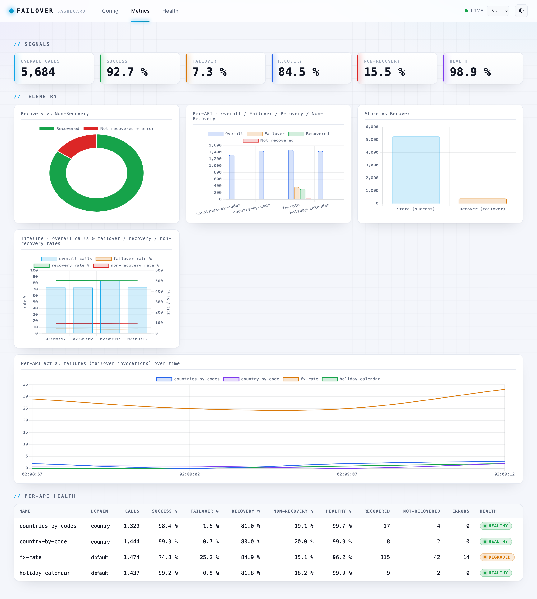

# Dashboard

`failover-dashboard` is a self-contained, opt-in, secure-by-default observability dashboard. Drop the dedicated starter on the classpath, enable it in YAML, and open `/failover-dashboard` to see every `@Failover` configuration plus live health metrics — rendered as cards and charts, served straight from the jar (no CDN, no build step).

It introduces **no new instrumentation**: it is a pure consumer of signals the framework already publishes — `FailoverScanner` for configuration and the Micrometer `failover.*` meters for metrics.

---

## Obtaining the Dashboard

The default `failover-spring-boot-starter` ships **none** of this. Add the dedicated starter:

```xml title="pom.xml"
<dependency>
  <groupId>com.societegenerale.failover</groupId>
  <artifactId>failover-dashboard-spring-boot-starter</artifactId>
</dependency>
```

Adding the jar makes the dashboard *available*, not *active*. Nothing is mapped until you enable it.

---

## Enabling It

`enabled` is the **only** switch you must set — everything else has a working default:

```yaml title="application.yml"
failover:
  dashboard:
    enabled: true        # default false (secure-by-default)
```

Once enabled, the UI and the full JSON API are served. The granular flags below exist only to **narrow** exposure, never to opt in to it.

| URL | Serves |
|---|---|
| `/failover-dashboard` | the UI (bare path forwards to `index.html`) |
| `/failover-dashboard/api/config` | every `@Failover` point + global settings |
| `/failover-dashboard/api/failover-health` | actuator-style overall status + active configuration |
| `/failover-dashboard/api/metrics` | global + per-API KPIs and rates |
| `/failover-dashboard/api/health` | per-API health classification |
| `/failover-dashboard/api/metrics/series` | trend samples (only when history is enabled) |

`base-path` is a single dedicated, non-root namespace covering both the UI and the API; override it to relocate the whole dashboard. `server.servlet.context-path` still prepends as usual.

---

## The Two Views

=== "Config"

    Every `@Failover` point and its settings — sortable and filterable. Empty per-annotation overrides render as `default`.

    

=== "Metrics"

    KPI cards, charts, and a per-API health table. Auto-refreshes on a configurable interval.

    

=== "Health"

    Actuator-style overall failover health — `UP` / `DOWN` plus the active configuration, mirroring the `/actuator/health/failover` contributor.

    

=== "Light mode"

    Dark is the default "control-room" theme; a light theme is one toolbar toggle away (or `?theme=light` / `?theme=dark`).

    

---

## KPIs — Derived, Not Measured

Every KPI is derived from counters that already exist (`failover.store.total`, `failover.recovery.outcome.total`, `failover.recover.total`). Per API, let `S` = stored upstream successes and `F` = recovered + not-recovered + error:

| KPI | Formula | Meaning |
|---|---|---|
| Success rate | `S / (S+F)` | upstream healthy → live value stored |
| Failover rate | `F / (S+F)` | upstream failed → failover flow started |
| Recovery rate | `recovered / F` | failover served a stored, non-expired value |
| Non-recovery rate | `(not_recovered + error) / F` | failover found nothing usable |
| Health (healthy-served) | `(S + recovered) / (S+F)` | caller got a usable result (live or recovered) |

Zero denominators yield `0`, never `NaN`. Health is classified `HEALTHY` / `DEGRADED` / `UNHEALTHY` against configurable thresholds.

---

## Security — Fail-Closed (§9)

The dashboard surfaces internal operational data, so the access gate is **not** relaxed by the convenience defaults:

- **Spring Security present** (bundled by the starter): the module contributes a `SecurityFilterChain` scoped to `base-path/**` requiring role `FAILOVER_ADMIN` (configurable). Override it with your own `dashboardSecurityFilterChain` bean.
- **Spring Security absent**: the context **fails fast** at startup — unless `failover.dashboard.security.allow-insecure=true`, which starts unsecured with a loud repeated `WARN` (trusted-network / dev only).

A strict, static-only `Content-Security-Policy` is applied to every dashboard response (no remote or inline scripts; Chart.js is vendored). The API is read-only — no endpoint mutates state. Only annotation metadata and aggregate counts are exposed — never payload data, keys, credentials, or connection strings.

```java title="Consumer override (same as Actuator)"
http.authorizeHttpRequests(a -> a.requestMatchers("/failover-dashboard/**").hasRole("FAILOVER_ADMIN"));
```

---

## Trend History (opt-in)

By default the trend chart deltas client-side (history only as long as the tab is open). For reload-surviving trends, enable the server-side ring-buffer sampler:

```yaml title="application.yml"
failover:
  dashboard:
    history:
      enabled: true            # default false
      samples: 120             # ring-buffer capacity
      sample-interval-seconds: 15
```

It is process-local and lost on restart — for long-term analysis, point Prometheus/Grafana at the existing meters.

---

## Graceful Degradation

If Micrometer is not on the classpath, the **config view still works**; the metrics view shows a friendly "metrics unavailable" banner. If the Chart.js asset is missing, KPI cards and tables still render and a notice replaces the charts.

---

## Next Steps

- [Observability](observability.md) — the meters the dashboard consumes
- [Properties Reference](../configuration/properties-reference.md) — `failover.dashboard.*`
- [Security](../support/security.md) — data-minimisation and the access gate
