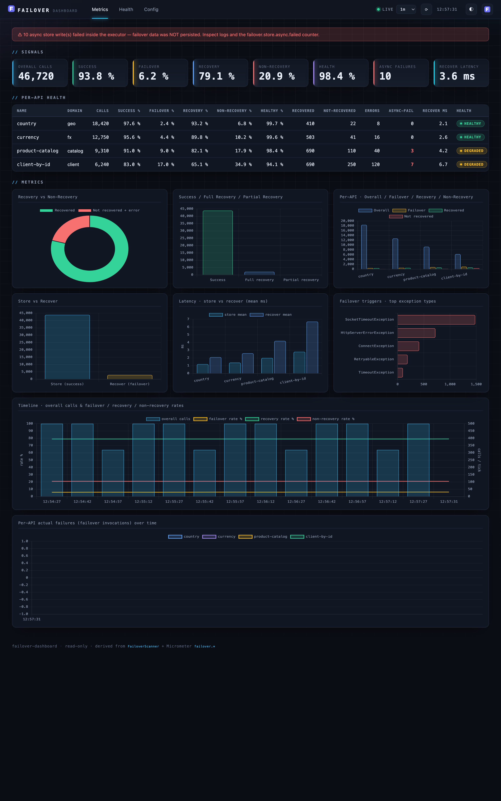
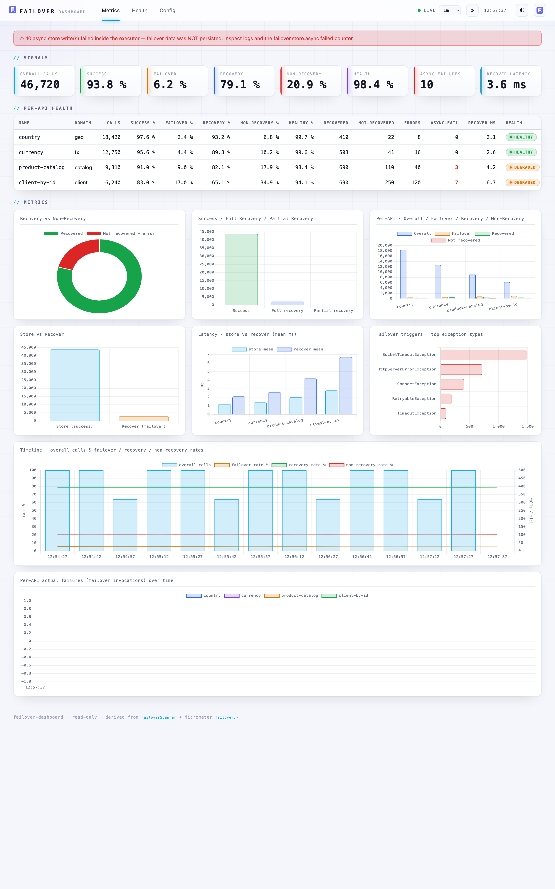

# Dashboard

`failover-dashboard` is a self-contained, opt-in, secure-by-default observability dashboard. Drop the dedicated starter on the classpath, enable it in YAML, and open `/failover-dashboard` to see every `@Failover` configuration plus live health metrics — rendered as cards and charts, served straight from the jar (no CDN, no build step).

It introduces **no new instrumentation**: it is a pure consumer of signals the framework already publishes — `FailoverScanner` for configuration and the Micrometer `failover.*` meters for metrics.

---

## Obtaining the Dashboard

The default `failover-spring-boot-starter` ships **none** of this. Add the dedicated starter:

```xml title="pom.xml"
<dependency>
  <groupId>com.societegenerale.failover</groupId>
  <artifactId>failover-dashboard-spring-boot-starter</artifactId>
</dependency>
```

Adding the jar makes the dashboard *available*, not *active*. Nothing is mapped until you enable it.

---

## Enabling It

`enabled` is the **only** switch you must set — everything else has a working default:

```yaml title="application.yml"
failover:
  dashboard:
    enabled: true        # default false (secure-by-default)
```

Once enabled, the UI and the full JSON API are served. The granular flags below exist only to **narrow** exposure, never to opt in to it.

| URL | Serves |
|---|---|
| `/failover-dashboard` | the UI (bare path forwards to `index.html`) |
| `/failover-dashboard/api/config` | every `@Failover` point + global settings |
| `/failover-dashboard/api/config/settings` | effective global `failover.*` / `failover.dashboard.*` config, grouped |
| `/failover-dashboard/api/failover-health` | actuator-style overall status + active configuration |
| `/failover-dashboard/api/metrics` | global + per-API KPIs and rates |
| `/failover-dashboard/api/health` | per-API health classification |
| `/failover-dashboard/api/metrics/series` | trend samples (only when history is enabled) |

`base-path` is a single dedicated, non-root namespace covering both the UI and the API; override it to relocate the whole dashboard. `server.servlet.context-path` still prepends as usual.

---

## Configuration

Every `failover.dashboard.*` property in one place. **`enabled` is the only one you need** — the rest have working defaults and exist to narrow exposure, secure the gate, or turn on trend history.

```yaml title="application.yml — full dashboard configuration (all defaults shown)"
failover:
  dashboard:
    enabled: false                   # master switch (secure-by-default) — set true to map anything
    base-path: /failover-dashboard   # single dedicated namespace for the UI + API
    exposure:                        # defaults expose everything; set flags only to NARROW
      ui: true                       # serve the static HTML/JS UI
      api: true                      # serve the JSON API
      include: [config, failover-health, metrics, health]   # which API endpoints are served
    security:
      role: FAILOVER_ADMIN           # role required for base-path/** when Spring Security is present
      allow-insecure: false          # start unsecured + loud WARN when Spring Security is absent
                                     #   (dev / trusted-network only; REFUSED under the 'prod' profile)
    history:                         # opt-in server-side trend ring buffer (see Trend History below)
      enabled: false                 # enable the sampler + /api/metrics/series endpoint
      samples: 120                   # ring-buffer capacity (retained sample count)
      sample-interval-seconds: 15    # seconds between samples
    health:                          # healthyRate thresholds for the per-API status badge
      degraded-threshold: 0.99       # >= ⇒ HEALTHY; below (down to unhealthy floor) ⇒ DEGRADED
      unhealthy-threshold: 0.90      # >= ⇒ DEGRADED; below ⇒ UNHEALTHY
```

| Property | Default | Purpose |
|---|---|---|
| `enabled` | `false` | Master switch. Nothing is mapped until `true`. |
| `base-path` | `/failover-dashboard` | Dedicated namespace for UI + API. Must start with `/`, not be `/`, no trailing `/` — else the context fails fast. |
| `exposure.ui` | `true` | Serve the static UI. `false` = API-only. |
| `exposure.api` | `true` | Serve the JSON API. `false` = UI-only. |
| `exposure.include` | all four | API endpoints served: `config`, `failover-health`, `metrics`, `health`. Trim to narrow; an omitted endpoint returns `404`. `/api/metrics/series` is gated together with `metrics`. |
| `security.role` | `FAILOVER_ADMIN` | Role required for `base-path/**` when Spring Security is present. |
| `security.allow-insecure` | `false` | When Spring Security is absent: `false` fails fast (fail-closed); `true` starts unsecured with a loud WARN. **Refused under the `prod` profile.** |
| `history.enabled` | `false` | Turn on the server-side trend ring buffer + `/api/metrics/series`. |
| `history.samples` | `120` | Retained sample count (ring-buffer capacity). |
| `history.sample-interval-seconds` | `15` | Seconds between samples. |
| `health.degraded-threshold` | `0.99` | Healthy-rate floor for `HEALTHY`. |
| `health.unhealthy-threshold` | `0.90` | Healthy-rate floor for `DEGRADED`; below is `UNHEALTHY`. |

See the [Properties Reference](../configuration/properties-reference.md#dashboard-properties) for the canonical table.

---

## The Views

Three tabs in the UI — **Metrics**, **Health**, **Config** (Metrics is the default). Dark is the
default "control-room" theme; a light theme is one toolbar toggle away (or `?theme=light` /
`?theme=dark`). Each theme is shown below with all three views.

- **Metrics** — KPI cards (incl. **async write failures** and **recover latency**), six charts in a
  3-up grid (recovery mix; success / full-recovery / partial-recovery; per-API breakdown;
  store-vs-recover; **store/recover latency**; **top failover-trigger exception types**), two full-width
  charts (call/rate timeline and per-API failures over time) and a per-API health table. A loud banner
  appears if any async store write has failed (data not persisted). Auto-refresh is selectable (`off`,
  `10s`, `30s`, `1m`, `10m`, `1h`; default `1m`) with a manual refresh button and a "last updated" timestamp.
- **Health** — actuator-style overall failover health (`UP` / `DOWN`) in a status hero plus the active
  configuration as cards, mirroring the `/actuator/health/failover` contributor.
- **Config** — every `@Failover` point (sortable, filterable; empty overrides render as `default`), and a
  **Global configuration** panel of the effective `failover.*` / `failover.dashboard.*` settings grouped
  (Core / Store / Scheduler / Scatter / Dashboard) with values as chips. Types, flags, crons, thresholds
  and paths only — never credentials or connection strings (§9).

=== "Dark mode"

    === "Metrics"

        

    === "Health"

        

    === "Config"

        

=== "Light mode"

    === "Metrics"

        

    === "Health"

        

    === "Config"

        

---

## KPIs — Derived, Not Measured

Every KPI is derived from counters that already exist (`failover.store.total`, `failover.recovery.outcome.total`, `failover.recover.total`). Per API, let `S` = stored upstream successes and `F` = recovered + not-recovered + error:

| KPI | Formula | Meaning |
|---|---|---|
| Success rate | `S / (S+F)` | upstream healthy → live value stored |
| Failover rate | `F / (S+F)` | upstream failed → failover flow started |
| Recovery rate | `recovered / F` | failover served a stored, non-expired value |
| Non-recovery rate | `(not_recovered + error) / F` | failover found nothing usable |
| Health (healthy-served) | `(S + recovered) / (S+F)` | caller got a usable result (live or recovered) |

Zero denominators yield `0`, never `NaN`. Health is classified `HEALTHY` / `DEGRADED` / `UNHEALTHY` against configurable thresholds.

Three further operational signals are surfaced from existing meters (still no new instrumentation):

| Signal | Source meter | Why it matters |
|---|---|---|
| **Async write failures** | `failover.store.async.failed` | Async store writes that threw inside the executor — failover data was **not persisted**. Shown as a KPI, a red per-API table column, and a loud banner when non-zero. Alert on any increase. |
| **Latency (mean / max)** | `failover.operation.duration` (timer) | Wall time of the store and recover paths, per API. Mean + max only — the timer has no percentile histogram, so p95/p99 are intentionally absent. |
| **Top exception types** | `failover.exception.total` | Which upstream exception types trigger failover most — quick root-cause triage. |

---

## Security — Fail-Closed (§9)

The dashboard surfaces internal operational data, so the access gate is **not** relaxed by the convenience defaults:

- **Spring Security present** (bundled by the starter): the module contributes a `SecurityFilterChain` scoped to `base-path/**` requiring role `FAILOVER_ADMIN` (configurable). Override it with your own `dashboardSecurityFilterChain` bean.
- **Spring Security absent**: the context **fails fast** at startup — unless `failover.dashboard.security.allow-insecure=true`, which starts unsecured with a loud repeated `WARN` (trusted-network / dev only). The `allow-insecure` escape hatch is **refused outright when the `prod` profile is active**: it can never silently disable the access gate in production.

A strict, static-only `Content-Security-Policy` is applied to every dashboard response (no remote or inline scripts; Chart.js is vendored). The API is read-only — no endpoint mutates state. Only annotation metadata and aggregate counts are exposed — never payload data, keys, credentials, or connection strings.

```java title="Consumer override (same as Actuator)"
http.authorizeHttpRequests(a -> a.requestMatchers("/failover-dashboard/**").hasRole("FAILOVER_ADMIN"));
```

---

## Trend History (opt-in)

By default the trend charts (the call/rate timeline and per-API failures) are buffered **client-side**, so they live only as long as the tab is open — a browser reload clears them and they rebuild from the next poll. This is by design and harmless: the cumulative KPIs, per-API counts and health table are re-derived from the server-side `failover.*` counters on every load, so **none of those numbers are lost** on reload — only the in-tab trend lines reset.

For reload-surviving trends, enable the server-side ring-buffer sampler:

```yaml title="application.yml"
failover:
  dashboard:
    history:
      enabled: true            # default false — registers the sampler + /api/metrics/series
      samples: 120             # ring-buffer capacity (retained sample count)
      sample-interval-seconds: 15   # seconds between samples
```

**How it works.** A scheduled sampler snapshots the global cumulative `failover.*` counters every `sample-interval-seconds` into a bounded in-memory ring of `samples` entries (oldest evicted when full). The retained window is therefore:

```
window ≈ samples × sample-interval-seconds
       = 120 × 15s = 1800s (30 minutes) with the defaults
```

Size it for the span you want visible: e.g. `samples: 240, sample-interval-seconds: 15` ≈ 1 hour; `samples: 120, sample-interval-seconds: 60` ≈ 2 hours at coarser resolution. The buffer is a fixed memory cost (`samples` small records), independent of traffic.

**The `/api/metrics/series` endpoint.** Returns the retained samples (global cumulative totals per timestamp) in chronological order. It accepts an optional `windowSec` query param — only samples within that many seconds of now are returned; `windowSec=0` returns all retained (the UI uses `0` on load). The endpoint is registered **only** when `history.enabled=true`, and is gated by the `metrics` exposure flag (`exposure.include`) and the same access gate as the rest of the dashboard.

**UI behaviour.** When enabled, the metrics view **hydrates the call/rate timeline from `/api/metrics/series` on load**, so a browser reload keeps its trend instead of starting blank; live polling then continues seamlessly from the last sample. The chart deltas consecutive cumulative samples (calls per interval) and derives the failover / recovery / non-recovery rates. (The per-API failures chart remains live-only — `/series` carries global totals, not per-API.) With history disabled the endpoint is absent and the UI silently falls back to the client-side buffer.

It is process-local and lost on restart — deliberately **not** a TSDB. For long-term, cross-restart analysis, point Prometheus/Grafana at the existing `failover.*` meters.

---

## Graceful Degradation

If Micrometer is not on the classpath, the **config view still works**; the metrics view shows a friendly "metrics unavailable" banner. If the Chart.js asset is missing, KPI cards and tables still render and a notice replaces the charts.

---

## Next Steps

- [Observability](observability.md) — the meters the dashboard consumes
- [Properties Reference](../configuration/properties-reference.md) — `failover.dashboard.*`
- [Security](../support/security.md) — data-minimisation and the access gate
