# Dashboard

`failover-dashboard` is a self-contained, opt-in, secure-by-default observability dashboard. Drop the dedicated starter
on the classpath, enable it in YAML, and open `/failover-dashboard` to see every `@Failover` configuration plus live
health metrics — rendered as cards and charts, served straight from the jar (no CDN, no build step).

It introduces **no new instrumentation**: it is a pure consumer of signals the framework already publishes —
`FailoverScanner` for configuration and the Micrometer `failover.*` meters for metrics.

---

## Obtaining the Dashboard

The default `failover-spring-boot-starter` ships **none** of this. Add the dedicated starter:

```xml title="pom.xml"

<dependency>
    <groupId>com.societegenerale.failover</groupId>
    <artifactId>failover-dashboard-spring-boot-starter</artifactId>
</dependency>
```

Adding the jar makes the dashboard *available*, not *active*. Nothing is mapped until you enable it.

---

## Enabling It

`enabled` is the **only** switch you must set — everything else has a working default:

```yaml title="application.yml"
failover:
  dashboard:
    enabled: true        # default false (secure-by-default)
```

Once enabled, the UI and the full JSON API are served. The granular flags below exist only to **narrow** exposure, never
to opt in to it.

| URL                                        | Serves                                                                                                                         |
|--------------------------------------------|--------------------------------------------------------------------------------------------------------------------------------|
| `/failover-dashboard`                      | the UI (bare path forwards to `index.html`)                                                                                    |
| `/failover-dashboard/api/config`           | every `@Failover` point + global settings                                                                                      |
| `/failover-dashboard/api/config/settings`  | effective global `failover.*` / `failover.dashboard.*` config, grouped                                                         |
| `/failover-dashboard/api/failover-health`  | actuator-style overall status + active configuration                                                                           |
| `/failover-dashboard/api/metrics`          | global + per-API KPIs and rates                                                                                                |
| `/failover-dashboard/api/metrics/source`   | metrics provenance (mode, instances reporting, freshness) for the UI source badge                                              |
| `/failover-dashboard/api/health`           | per-API health classification — windowed (last `health.sample-size` calls), not lifetime-cumulative                           |
| `/failover-dashboard/api/health/upstream`  | rolling last-N-calls rates per failover point, scored on the upstream call alone (not masked by recovery) — powers the Upstream call health cards; empty map on sources with no per-call window (Prometheus / shared-store) |
| `/failover-dashboard/api/metrics/exceptions` | per-failover-endpoint exception counts (local source only; empty map otherwise) — powers the Overview exceptions-per-endpoint chart and the Health tab's per-card top exception |
| `/failover-dashboard/api/metrics/series`   | trend samples — local: the in-memory ring (empty unless history is enabled); `mode=prometheus`: cluster-wide via `query_range` |
| `/failover-dashboard/api/instances`        | per-instance metrics for the Instances tab — empty in `local` (single JVM); populated in `shared-store` / `prometheus`         |
| `/failover-dashboard/api/cluster/snapshot` | *(shared-store only, POST)* peer snapshot ingest                                                                               |

`base-path` is a single dedicated, non-root namespace covering both the UI and the API; override it to relocate the
whole dashboard. `server.servlet.context-path` still prepends as usual.

---

## Configuration

Every `failover.dashboard.*` property in one place. **`enabled` is the only one you need** — the rest have working
defaults and exist to narrow exposure, secure the gate, or turn on trend history.

```yaml title="application.yml — full dashboard configuration (all defaults shown)"
failover:
  dashboard:
    enabled: false                   # master switch (secure-by-default) — set true to map anything
    base-path: /failover-dashboard   # single dedicated namespace for the UI + API
    exposure: # defaults expose everything; set flags only to NARROW
      ui: true                       # serve the static HTML/JS UI
      api: true                      # serve the JSON API
      include: [ config, failover-health, metrics, health, cluster, instances ]  # which API endpoints are served
    security:
      type: AUTHORITY                # ROLE (hasRole) | AUTHORITY (hasAuthority, default) | EXPRESSION (SpEL)
      role: FAILOVER_ADMIN           # role used when type=ROLE
      authority: FAILOVER_ADMIN      # authority used when type=AUTHORITY (default)
      expression: ""                 # SpEL used when type=EXPRESSION, e.g. "hasAnyRole('ADMIN') or hasAnyAuthority('WRITE_PRIVILEGE')"
      #   required (non-blank) when type=EXPRESSION — fails fast at startup otherwise
      allow-insecure: false          # start unsecured + loud WARN when Spring Security is absent
      #   (dev / trusted-network only; REFUSED under the 'prod' profile)
    history: # opt-in server-side trend ring buffer (see Trend History below)
      enabled: false                 # enable the sampler + /api/metrics/series endpoint
      samples: 120                   # ring-buffer capacity (retained sample count)
      sample-interval-seconds: 15    # seconds between samples
    health: # healthyRate thresholds for the per-API status badge
      degraded-threshold: 0.99       # >= ⇒ HEALTHY; below (down to unhealthy floor) ⇒ DEGRADED
      unhealthy-threshold: 0.90      # >= ⇒ DEGRADED; below ⇒ UNHEALTHY
      sample-size: 100               # rate computed over only the last N calls per failover point, not the lifetime total (must be > 0)
    cluster: # where metrics are read from across instances (see Distributed Deployment)
      mode: local                    # local (default) | prometheus | shared-store
      prometheus: # used when mode=prometheus (aggregates failover.* across instances)
        base-url: ""                 # e.g. http://prometheus:9090 (blank ⇒ falls back to local)
        token: ""                    # optional bearer token (blank ⇒ none)
        timeout-seconds: 5           # per-query connect/read timeout
      shared-store: # used when mode=shared-store (peers push snapshots, aggregated in-app)
        store: inmemory              # inmemory (default) | jdbc (needs failover-dashboard-snapshotstore-jdbc)
        liveness-seconds: 180        # heartbeat age before an instance is DOWN (≈ 3 × peer heartbeat interval)
        max-instances: 10            # supported ceiling (warns beyond — graduate to prometheus)
        instance-retention: 7d       # retire unseen instances from the Instances tab (counts stay in the aggregate; 0 ⇒ never)
        sample-interval-seconds: 30  # cluster-trend sampling cadence
        retention:
          max-age: 7d                # trend-history age bound
          max-entries: 100000        # trend-history size bound (oldest truncated)
        jdbc: # used when store=jdbc; table must be created by the consuming service — see Scenario D for DDL
          table-prefix: ""           # prepended to FAILOVER_DASHBOARD_SNAPSHOT (validated)
      snapshot: # peer-side push (every instance, incl. non-UI nodes)
        publish-url: ""              # dashboard ingest URL (blank ⇒ this instance does not push)
        interval-seconds: 15         # at most one push per interval (event-driven, throttled)
        retry-interval-seconds: 300  # suppress push attempts for this long after a failure
        username: ""                 # ingest Basic-auth (set with password; ignored when oauth2 id set)
        password: ""
        oauth2-client-registration-id: ""  # Bearer auth via OAuth2 client (takes priority over Basic)
        allow-insecure-ingest: false # suppress the no-auth ingest warning (trusted networks only)
        heartbeat:
          enabled: false             # lightweight liveness pings to the dashboard
          interval-seconds: 60       # keep ≤ ⅓ of the dashboard liveness-seconds
        ingest:
          enabled: true              # dashboard-side: map POST /api/cluster/snapshot at all.
          #   set false once every peer writes JDBC-direct instead (see Scenario D2) — the
          #   dashboard still reads from SnapshotStore, this only stops mapping the HTTP path.
        jdbc:                        # peer-side JDBC-direct transport (Scenario D2) — mutually
          enabled: false             # exclusive with publish-url; requires this peer's own DataSource
          table-prefix: ""           # MUST match the dashboard's shared-store.jdbc.table-prefix
```

| Property                                                  | Default               | Purpose                                                                                                                                                                                                                                                                                                                        |
|-----------------------------------------------------------|-----------------------|--------------------------------------------------------------------------------------------------------------------------------------------------------------------------------------------------------------------------------------------------------------------------------------------------------------------------------|
| `enabled`                                                 | `false`               | Master switch. Nothing is mapped until `true`.                                                                                                                                                                                                                                                                                 |
| `base-path`                                               | `/failover-dashboard` | Dedicated namespace for UI + API. Must start with `/`, not be `/`, no trailing `/` — else the context fails fast.                                                                                                                                                                                                              |
| `exposure.ui`                                             | `true`                | Serve the static UI. `false` = API-only.                                                                                                                                                                                                                                                                                       |
| `exposure.api`                                            | `true`                | Serve the JSON API. `false` = UI-only.                                                                                                                                                                                                                                                                                         |
| `exposure.include`                                        | all of them           | **UI-facing read** API endpoints served: `config`, `failover-health`, `metrics`, `health`, `cluster`, `instances`. Trim to narrow; an omitted endpoint returns `404`. `/api/metrics/series` is gated with `metrics`; `/api/instances` with `instances`; **cluster read views** (e.g. the Instances tab's cluster data) with `cluster`. Does **not** gate `POST /api/cluster/snapshot` (peer ingest) — that write path is exempt from exposure narrowing on purpose and has its own dedicated access control; see [exposure.include vs. ingest access control](#exposureinclude-vs-ingest-access-control). |
| `security.type`                                           | `AUTHORITY`           | Authorization strategy: `ROLE` (role-based, `hasRole`), `AUTHORITY` (authority-based, `hasAuthority`; default), or `EXPRESSION` (SpEL, `WebExpressionAuthorizationManager`).                                                                                                                                                   |
| `security.role`                                           | `FAILOVER_ADMIN`      | Role required for `base-path/**` when `type=ROLE` and Spring Security is present. Ignored otherwise.                                                                                                                                                                                                                           |
| `security.authority`                                      | `FAILOVER_ADMIN`      | Authority required for `base-path/**` when `type=AUTHORITY` (default) and Spring Security is present. Ignored otherwise.                                                                                                                                                                                                       |
| `security.expression`                                     | *(none)*              | SpEL expression evaluated for `base-path/**` when `type=EXPRESSION`. **Required (non-blank) when `type=EXPRESSION`** — the context fails fast at startup otherwise. Ignored otherwise. See [Expression-based access control](#expression-based-access-control) below.                                                        |
| `security.allow-insecure`                                 | `false`               | When Spring Security is absent: `false` fails fast (fail-closed); `true` starts unsecured with a loud WARN. **Refused under the `prod` profile.**                                                                                                                                                                              |
| `history.enabled`                                         | `false`               | Turn on the server-side trend ring buffer + `/api/metrics/series`.                                                                                                                                                                                                                                                             |
| `history.samples`                                         | `120`                 | Retained sample count (ring-buffer capacity).                                                                                                                                                                                                                                                                                  |
| `history.sample-interval-seconds`                         | `15`                  | Seconds between samples.                                                                                                                                                                                                                                                                                                       |
| `health.degraded-threshold`                               | `0.99`                | Healthy-rate floor for `HEALTHY`.                                                                                                                                                                                                                                                                                              |
| `health.unhealthy-threshold`                              | `0.90`                | Healthy-rate floor for `DEGRADED`; below is `UNHEALTHY`.                                                                                                                                                                                                                                                                       |
| `health.sample-size`                                      | `100`                 | The healthy-rate above is computed over only the most recent `sample-size` calls per failover point, not the lifetime total — a cumulative rate never fully recovers from an old bad spell. Also sizes the rolling window backing the [Upstream call health](#upstream-call-health) cards. Rejected (context fails fast) if `<= 0`.                                                                                       |
| `cluster.mode`                                            | `local`               | Where metrics are read from. `local` = this instance's registry (default). `prometheus` aggregates `failover.*` across instances via the Prometheus HTTP API. `shared-store` aggregates pushed per-instance snapshots in-app (small clusters, no Prometheus). See [Distributed Deployment](#distributed-deployment-scenarios). |
| `cluster.prometheus.base-url`                             | `""`                  | Prometheus base URL for `mode=prometheus` (e.g. `http://prometheus:9090`). Blank, or unreachable at runtime, falls back to the local registry with a warning.                                                                                                                                                                  |
| `cluster.prometheus.token`                                | `""`                  | Optional bearer token for Prometheus.                                                                                                                                                                                                                                                                                          |
| `cluster.prometheus.timeout-seconds`                      | `5`                   | Per-query connect/read timeout.                                                                                                                                                                                                                                                                                                |
| `cluster.shared-store.store`                              | `inmemory`            | `inmemory` (default) or `jdbc` (durable; needs the `failover-dashboard-snapshotstore-jdbc` module + a `DataSource`).                                                                                                                                                                                                           |
| `cluster.shared-store.liveness.enabled`                   | `false`               | Dashboard-side toggle for heartbeat liveness tracking (ADR 66) — off by default, independent of the peer-side `cluster.snapshot.heartbeat.enabled`. See [Instance Live Tracking](#28-instance-live-tracking-heartbeat).                                                                                                        |
| `cluster.shared-store.liveness-seconds`                   | `180`                 | Heartbeat age threshold — instance is `DOWN` after this many seconds without a heartbeat ping. Default matches 3 × the peer default `heartbeat.interval-seconds` (60s). Only relevant when `liveness.enabled=true`.                                                                                                            |
| `cluster.shared-store.max-instances`                      | `10`                  | Supported small-cluster ceiling; exceeding it logs a warning.                                                                                                                                                                                                                                                                  |
| `cluster.shared-store.instance-retention`                 | `7d`                  | Retire instances not seen for this long from the Instances tab (their counts stay in the aggregate; `0` keeps every instance forever).                                                                                                                                                                                         |
| `cluster.shared-store.sample-interval-seconds`            | `30`                  | Cluster-trend sampling cadence.                                                                                                                                                                                                                                                                                                |
| `cluster.shared-store.retention.max-age` / `.max-entries` | `7d` / `100000`       | Trend-history age and size bounds (oldest truncated).                                                                                                                                                                                                                                                                          |
| `cluster.shared-store.jdbc.table-prefix`                  | `""`                  | Snapshot table prefix (validated), when `store=jdbc`. The table is never created or altered by the module — see Scenario D for the DDL to provision it yourself.                                                                                                                                                              |
| `cluster.snapshot.publish-url` / `.interval-seconds`      | `""` / `15`           | Peer-side push. Set to the dashboard's **base URL** (same as `base-path` on the dashboard host): `http://<host>:<port>/failover-dashboard`. The snapshot and heartbeat endpoints are derived automatically (`/api/cluster/snapshot`, `/api/cluster/heartbeat`). Blank ⇒ this instance does not push.                           |
| `cluster.snapshot.retry-interval-seconds`                 | `300`                 | After a push failure, further push attempts are suppressed for this many seconds (one WARN on first failure, INFO on recovery).                                                                                                                                                                                                |
| `cluster.snapshot.username` / `.password`                 | `""`                  | HTTP Basic Auth credentials for the ingest endpoint. Ignored when `oauth2-client-registration-id` is set.                                                                                                                                                                                                                      |
| `cluster.snapshot.oauth2-client-registration-id`          | `""`                  | Spring OAuth2 client id for Bearer auth (takes priority over Basic).                                                                                                                                                                                                                                                           |
| `cluster.snapshot.allow-insecure-ingest`                  | `false`               | Suppress the no-auth startup warning (dev / trusted network only).                                                                                                                                                                                                                                                             |
| `cluster.snapshot.heartbeat.enabled`                      | `false`               | Send lightweight heartbeat pings from this peer. Off by default. `publish-url` must be set; heartbeat URL is always derived as `{publish-url}/api/cluster/heartbeat`.                                                                                                                                                          |
| `cluster.snapshot.heartbeat.interval-seconds`             | `60`                  | Ping cadence. Keep ≤ ⅓ of the dashboard `liveness-seconds`.                                                                                                                                                                                                                                                                    |
| `cluster.snapshot.ingest.enabled` *(dashboard-side)*      | `true`                | Whether `POST /api/cluster/snapshot` (`ClusterSnapshotController`) is mapped at all. Set `false` once every peer writes JDBC-direct instead (Scenario D2) — the dashboard still reads from `SnapshotStore`, this only stops mapping the HTTP path (and its ingest security gate). Not read by peers.                        |
| `cluster.snapshot.jdbc.enabled` *(peer-side)*             | `false`               | JDBC-direct transport (Scenario D2): this peer writes its snapshot straight into `FAILOVER_DASHBOARD_SNAPSHOT` instead of POSTing. Requires this peer's own `DataSource` pointed at the dashboard's database. **Mutually exclusive with `publish-url`** — setting both fails fast at startup. Not read by the dashboard.    |
| `cluster.snapshot.jdbc.table-prefix` *(peer-side)*        | `""`                  | Table prefix for JDBC-direct writes; **must match** the dashboard's `cluster.shared-store.jdbc.table-prefix` — both sides read/write the same table. Not read by the dashboard.                                                                                                                                                |

See the [Properties Reference](../configuration/properties-reference.md#dashboard-properties) for the canonical table.

---

## The Toolbar

Every view shares the top bar:

- **Status chip** — overall live status (`Healthy` / `Degraded` / `Unhealthy`), derived from the worst per-API health.
- **Tabs** — `Overview`, `Per-API`, `Instances` (cluster modes only — hidden in `local`), `Health`, `Config` (Overview
  is the default; the open tab is kept in the URL hash, e.g. `#per-api`).
- **Auto-refresh** — selectable cadence: `off`, `10s`, `30s`, `1m`, `10m`, `1h` (default `30s`).
- **Refresh now** (`⟳`) — reload immediately, independent of the cadence.
- **Last-updated** — timestamp of the last successful load.
- **Theme toggle** (`◐`) — switch dark / light (or force it with `?theme=dark` / `?theme=light`).
- **Docs** — the failover icon opens this documentation in a new tab.

All controls carry hover tooltips. Dark is the default "control-room" theme; both themes are shown for each view below.

---

## The Views

### Overview

The at-a-glance health and KPI surface.

- **Health banner** — a closable, colour-coded summary shown on each load: *all APIs healthy* (green), *N need
  attention* (amber, names listed), or *N unhealthy — action needed* (red).
- **Signals — row 1 (health):** a large **Overall API Health** gauge (the `(success + recovered) / total` healthy-served
  rate) beside a grid of **per-API health cards**, sorted **worst-first** so a struggling API surfaces top-left. Each
  card shows its health %, status, calls and failover %.
- **Signals — row 2 (metrics):** one card per KPI — **Overall calls**, **Success rate**, **Failover rate**, **Recovery
  rate**, **Non-recovery rate** (each rate shows the underlying count too), **Persistence failures** (async store writes
  that were lost — alert on any non-zero), and **Recover latency** (mean recover-path ms).
- **Charts:** *Did the caller get a result?* (live value / recovered / hard failure), *When failover fired, did it
  recover?* (full / partial / nothing usable — partial = scatter-gather slices), *Successful vs Recovered*, a full-width
  **Trend** (calls per tick + success / failover / recovery rate over time), *Why did upstream fail?* (top exception
  types), and *Latency — store vs recover* per API.

### Per-API

Drill-down per failover point.

- **Per-API health table** — sortable (click any header): calls, healthy-rate bar, success / failover / recovery %,
  **not-recovered** (missing/expired cache entry) and **errors** (threw during recovery) as separate columns — a row
  can be `UNHEALTHY` with `errors=0` when every failure is a miss/expiry, not a thrown exception — an inline
  **failover-trend sparkline**, and a `HEALTHY` / `DEGRADED` / `UNHEALTHY` badge.
- **Failover trend — all APIs** — one line per failover point, failover invocations per tick.
- **Per-API breakdown** — grouped bars: overall vs failover vs recovered vs not-recovered.
- **Latency** (on Overview) shows store/recover **mean** plus **p95/p99** when available (`local` + `prometheus`);
  `shared-store` shows mean/max only (percentiles can't be merged from per-instance snapshots).

### Instances

*Cluster only* — shown when the dashboard reads from a multi-instance source (`shared-store` or `prometheus`); hidden
for `local`. Answers the first incident question: **one bad node, or all of them?**

- **Roll-up cards** — Total · Reporting · Silent · Healthy · Degraded · Unhealthy. *Silent* =
  expected-but-not-reporting (beyond the liveness window in `shared-store`).
- **Per-instance table** — a row per instance: id, live/silent dot, calls, success / failover / recovery %, p95 recover,
  last-seen, and a status badge. Click a row to drill in.
- **Drill-down** — the selected instance's *own* KPIs (calls, success, failover, users-unblocked, p95) — not the cluster
  aggregate.

Data comes from `MetricsSource.instances()`: in `shared-store` from the per-instance snapshots the store already holds;
in `prometheus` from `sum by (name, instance) (failover_*)` queries. In `shared-store`, instances unseen past
`instance-retention` are retired from this tab (their counts remain in the cluster aggregate —
see [Instance churn](#instance-churn-bounded-retirement)).

### Health

Actuator-style subsystem health, mirroring the `/actuator/health/failover` contributor.

- **Cluster roll-up** — healthy / degraded / unhealthy API counts + instances reporting, with a provenance line (local
  vs cluster aggregate). Cluster-wide via `MetricsSource.health()` across whichever tier is active.
- **Status hero** — `UP` (at least one `@Failover` registered) or `DOWN` (none discovered — a misconfiguration signal).
  Two quick-glance metrics sit under the hero note: **Upstream failing** (how many endpoints have had at least one
  upstream failure) and **Top upstream exception** — both windowed (see below), so they surface even when every
  failure has been fully recovered and the hero itself still reads `UP`.
- **Active configuration** — the global config rendered as small stat cards (registered failovers, type, store type,
  async, exception policy, scheduler…). Types and flags only — never credentials or connection strings (§9).

#### Upstream call health

One card per `@Failover` point, sorted worst-first, scored on the **upstream call alone** — recovery is deliberately
**not** factored in. This exists to close a real blind spot: a `healthyRate`-based status (the hero above, the Per-API
table, the banner) counts a fully-recovered call as healthy, so an endpoint whose upstream fails 100% of the time but
is always served from cache reads as green everywhere else in the dashboard. A card here still flags it.

- **Severity** — `STABLE` (no upstream failures), `WATCH` (up to 10% of calls failing upstream), `FAILING` (above
  10%) — based on `failoverRate` alone, not `healthyRate`.
- **Composition bar** — a 3-segment strip (fresh / recovered / blocked) showing what the last `health.sample-size`
  calls actually looked like, derived from the windowed rates — no extra data fetched.
- **Sparkline** — the windowed `failoverRate` across recent dashboard refreshes (client-accumulated; distinct from the
  composition bar, which is a snapshot of the current window rather than a trend over time).
- **Top exception** — from `/api/metrics/exceptions` (local source only).
- **Expiry hint** — when an endpoint is masked (100% recovered so far), the card names the failover point's configured
  expiry (from `/api/config`) and prompts notifying the upstream owner before that cache entry ages out and the call
  starts failing for real.

Both this view and the `healthyRate` used everywhere else in the dashboard are computed over a rolling window of the
last `failover.dashboard.health.sample-size` calls per failover point (default `100`), not the lifetime-cumulative
total — see [`health.sample-size`](#configuration) above. Without windowing, a cumulative rate never fully recovers
from an old bad spell: a handful of errors from hours ago keep dragging an endpoint that has been fine for the last
10,000 calls into `DEGRADED`. The window is reconstructed server-side from counter deltas on every poll (no per-call
event hook needed), so it works for any local-source deployment without extra instrumentation. Cluster-aware sources
(`prometheus`, `shared-store`) do not yet support this window — `/api/health/upstream` returns an empty map for them
and the card falls back to the cumulative `failoverRate`.

### Config

- **Failover configuration** — a sortable, filterable table of every `@Failover` point: name, domain, expiry, store,
  execution, recover-all, splitter, key generator, expiry policy. Empty per-annotation overrides render as `default`.
- **Global settings** — the effective `failover.*` / `failover.dashboard.*` settings grouped into panels (Core / Store /
  Scatter / Scheduler / Dashboard). Types, flags, crons, thresholds and paths only.

=== "Dark mode"

    === "Overview"

        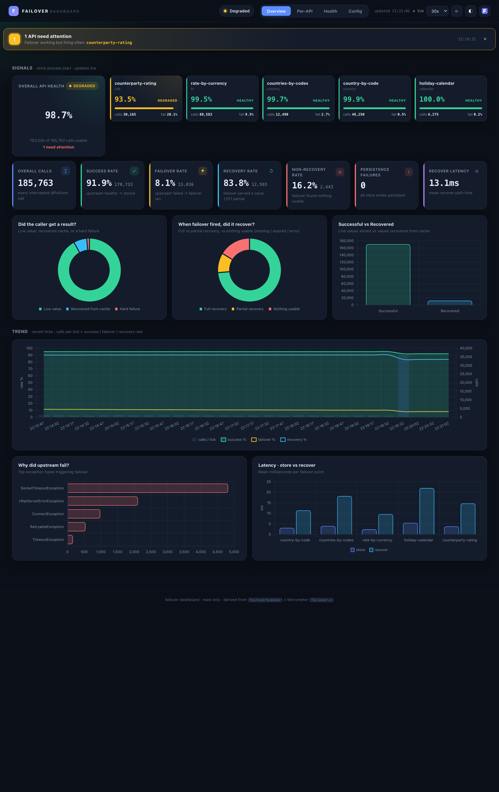

    === "Per-API"

        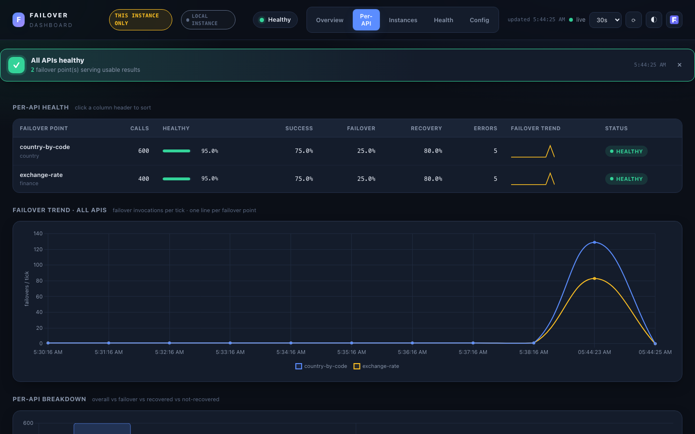

    === "Instances"

        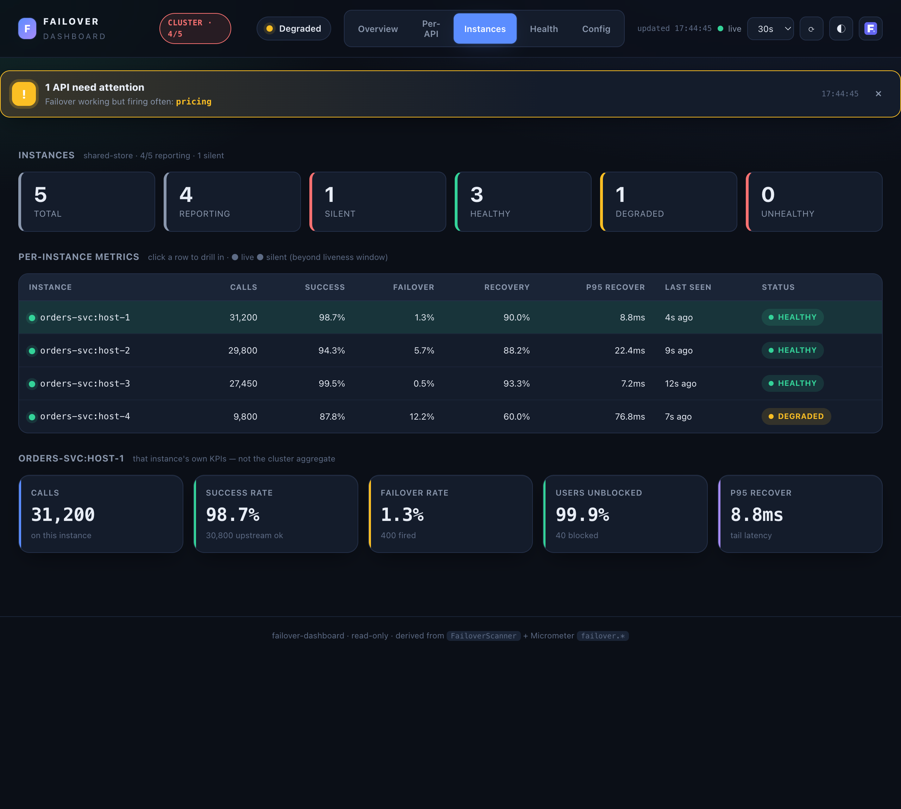

    === "Health"

        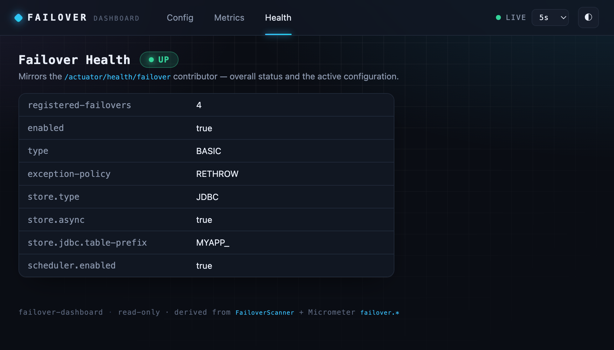

    === "Config"

        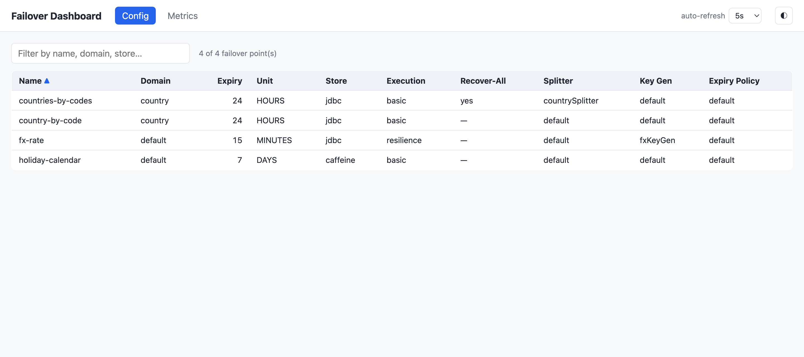

=== "Light mode"

    === "Overview"

        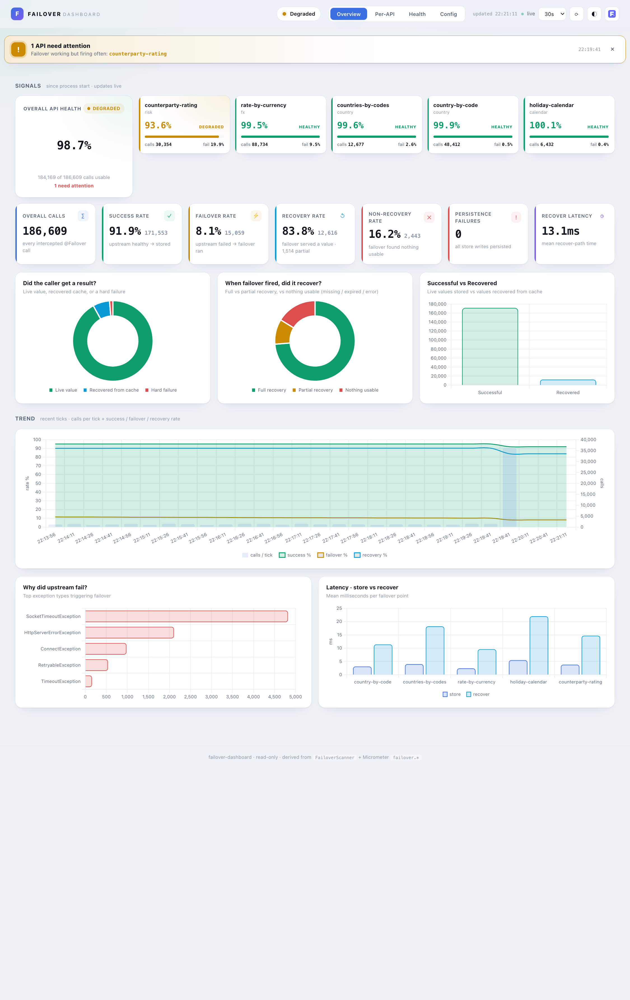

    === "Per-API"

        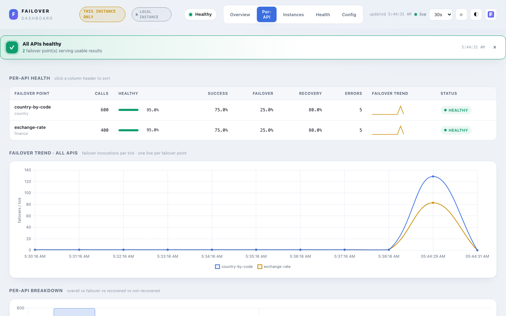

    === "Instances"

        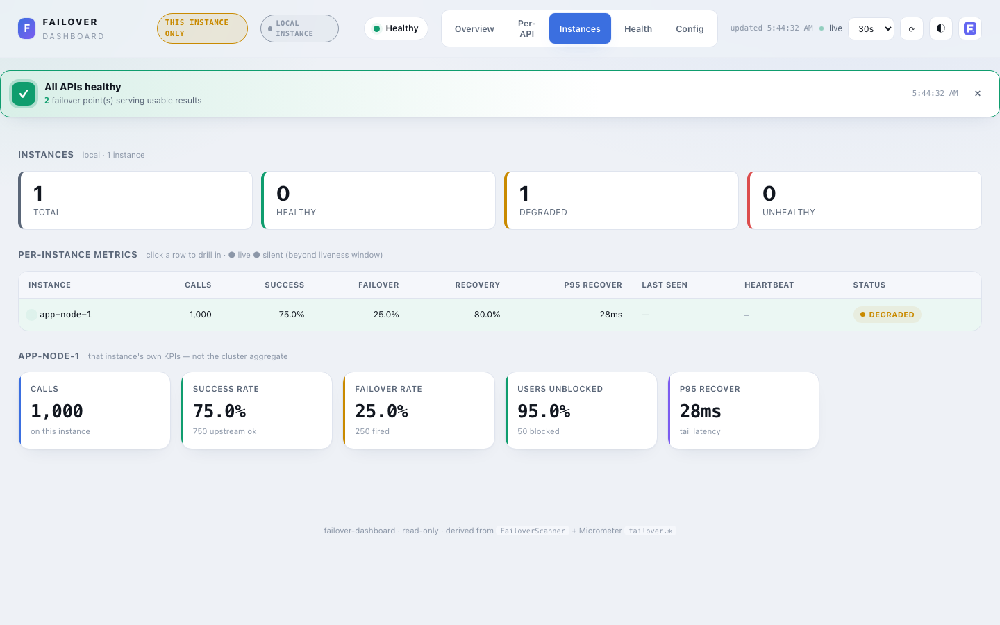

    === "Health"

        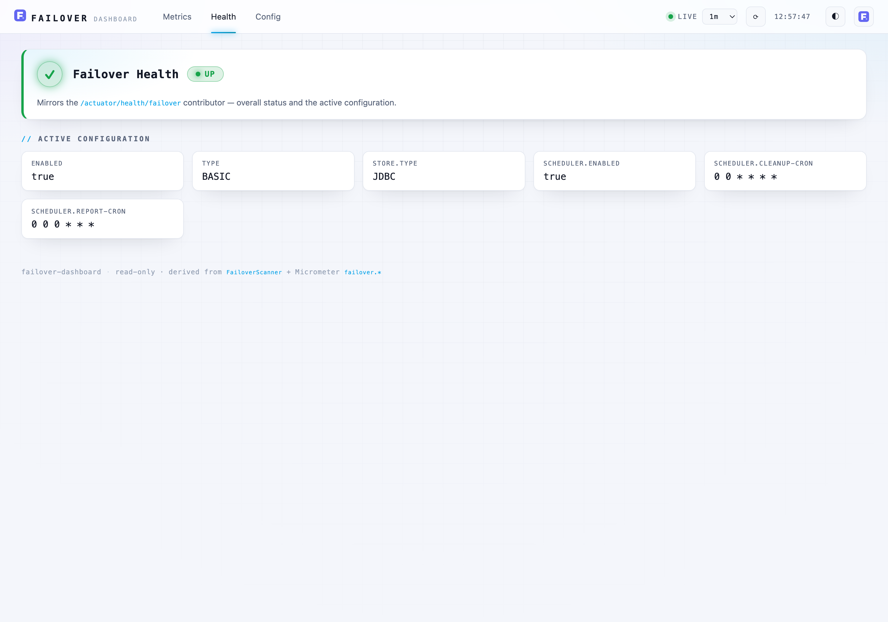

    === "Config"

        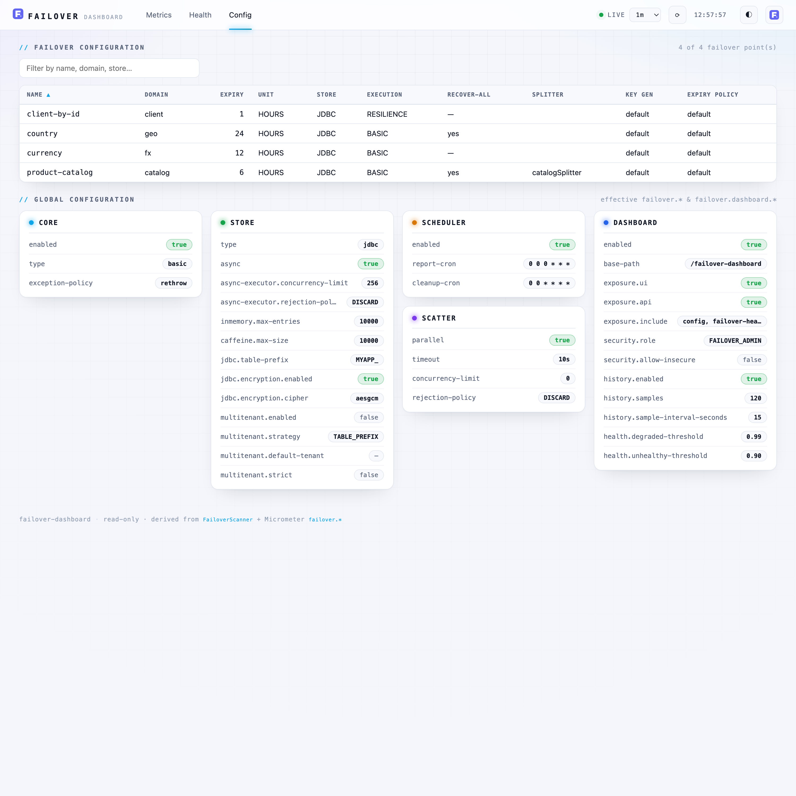

---

## KPIs — Derived, Not Measured

Every KPI is derived from counters that already exist (`failover.store.total`, `failover.recovery.outcome.total`,
`failover.recover.total`). Per API, let `S` = stored upstream successes and `F` = recovered + not-recovered + error:

| KPI                     | Formula                       | Meaning                                        |
|-------------------------|-------------------------------|------------------------------------------------|
| Success rate            | `S / (S+F)`                   | upstream healthy → live value stored           |
| Failover rate           | `F / (S+F)`                   | upstream failed → failover flow started        |
| Recovery rate           | `recovered / F`               | failover served a stored, non-expired value    |
| Non-recovery rate       | `(not_recovered + error) / F` | failover found nothing usable                  |
| Health (healthy-served) | `(S + recovered) / (S+F)`     | caller got a usable result (live or recovered) |

Zero denominators yield `0`, never `NaN`. Health is classified `HEALTHY` / `DEGRADED` / `UNHEALTHY` against configurable
thresholds.

Three further operational signals are surfaced from existing meters (still no new instrumentation):

| Signal                   | Source meter                          | Why it matters                                                                                                                                                                               |
|--------------------------|---------------------------------------|----------------------------------------------------------------------------------------------------------------------------------------------------------------------------------------------|
| **Async write failures** | `failover.store.async.failed`         | Async store writes that threw inside the executor — failover data was **not persisted**. Shown as a KPI, a red per-API table column, and a loud banner when non-zero. Alert on any increase. |
| **Latency (mean / max)** | `failover.operation.duration` (timer) | Wall time of the store and recover paths, per API. Mean + max only — the timer has no percentile histogram, so p95/p99 are intentionally absent.                                             |
| **Top exception types**  | `failover.exception.total`            | Which upstream exception types trigger failover most — quick root-cause triage.                                                                                                              |

---

## Security

The dashboard surfaces internal operational data, so the access gate is **not** relaxed by the convenience
defaults: every request is denied unless explicitly allowed, at every layer, from the first line of config.

### Security model at a glance

Two **independent** gates protect the dashboard, plus one **narrowing** filter that isn't a gate at all —
keeping these three straight is the key to reasoning about who can reach what:

```
                         ┌─────────────────────────────────────────────┐
  Browser / API caller   │  1. Main gate — dashboardSecurityFilterChain │
  GET  base-path/**  ───►│     security.type: ROLE | AUTHORITY |        │───► UI + read API
                         │     EXPRESSION. Who may VIEW the dashboard.  │
                         └─────────────────────────────────────────────┘

                         ┌─────────────────────────────────────────────┐
  Peer instance          │  2. Ingest gate — dashboardIngest*FilterChain│
  POST base-path/api/    │     Basic | OAuth2 | Open. Who may PUSH a    │───► SnapshotStore /
       cluster/snapshot  │     snapshot/heartbeat. Independent of #1 —  │     HeartbeatStore
       cluster/heartbeat │     evaluated first, main gate never runs.   │
  ───────────────────────┴─────────────────────────────────────────────┘

                         ┌─────────────────────────────────────────────┐
  (after gate 1 or 2     │  3. exposure.include — NOT a security gate   │
   already let it in)    │     Narrows which already-authorized reads   │───► 404 if narrowed out
                         │     are served. Never applies to ingest.     │
                         └─────────────────────────────────────────────┘
```

- **Gate 1 — who may *view* the dashboard** (UI + `GET` read API): [Main dashboard access control](#main-dashboard-access-control) below.
- **Gate 2 — who may *push* a peer snapshot/heartbeat** (`cluster.mode=shared-store` only): [Peer ingest access control](#peer-ingest-access-control) below. Fully independent of gate 1 — a peer never needs UI credentials, and a UI viewer never needs ingest credentials.
- **Not a gate — `exposure.include`**: narrows which *already-authorized* read endpoints are served; explained in [`exposure.include` vs. ingest access control](#exposureinclude-vs-ingest-access-control) below.

!!! info "Deployment topology: two instances, two different security needs"
`failover-dashboard` is meant to run as its **own deployment**, separate from the `@Failover`-instrumented
services it monitors — the dashboard reads metrics from peers over the network (`cluster.mode=shared-store`
push, or `cluster.mode=prometheus` pull). Gate 1 protects *that* dashboard instance; gate 2 protects it from
*peer instances* pushing data in. Running the dashboard **in the same JVM** as `@Failover` business logic
(`cluster.mode=local`) is a supported but rare exception — typically a single-instance app or local dev — not
the primary scenario. See [Distributed Deployment: Scenarios](#distributed-deployment-scenarios) below for the
full picture, and [Picking a mode](#picking-a-mode) to choose between `local` / `shared-store` / `prometheus`.

### Fail-closed by construction

- **Spring Security present** (bundled by the starter, the expected case): gate 1 is always registered — there
  is no configuration that removes it. `security.allow-insecure=true` is a *narrower* escape hatch (below), not
  an absence of the gate.
- **Spring Security absent from the classpath**: the context **refuses to start** — enabling the dashboard
  without any way to gate it is treated as a startup error, not a silent open door. The only way past this is
  the explicit `allow-insecure=true` escape hatch (dev / trusted-network only).
- **The `allow-insecure` escape hatches are refused under the `prod` profile** — both
  `security.allow-insecure` (gate 1) and `cluster.snapshot.allow-insecure-ingest` (gate 2). This holds
  **regardless of whether Spring Security is present or absent** on the classpath: the context fails fast at
  startup rather than silently running unsecured in production (I-14).
- **Never a soft-fail**: every gate either explicitly permits or the request is rejected — there is no code
  path where a misconfiguration is treated as "allow".

### Should the consuming application secure these endpoints?

**Short answer: yes, in every scenario except local development and CI.** There is no supported production
topology where either gate is left open. The table below is the concrete "which scenario am I in, what do I
turn on" reference:

| Scenario                                                              | Gate 1 — main UI/API                                            | Gate 2 — peer ingest (`shared-store` only)                                                    |
|------------------------------------------------------------------------|-------------------------------------------------------------------|--------------------------------------------------------------------------------------------------|
| **Production** — any topology, any `cluster.mode`                      | **Must secure.** `security.type=ROLE\|AUTHORITY\|EXPRESSION` with real credentials/IdP integration. `allow-insecure=true` is **refused outright** if `spring.profiles.active` includes `prod` — the app fails to start. | **Must secure**, if `cluster.mode=shared-store` is used at all. `snapshot.username+password` (Basic) or `snapshot.oauth2-client-registration-id` (OAuth2). `allow-insecure-ingest=true` is likewise **refused under `prod`**. |
| **Staging / pre-prod that mirrors production**                        | Secure it the same way as production — staging environments are routinely reachable from wider networks than assumed. | Same reasoning — secure it.                                                                       |
| **Local development** (`localhost`, no shared network)                 | `allow-insecure=true` is fine — nothing outside your machine can reach it, and it's not the `prod` profile so the guard doesn't fire. | `allow-insecure-ingest=true` is fine, same reasoning.                                             |
| **CI / integration tests**                                             | `allow-insecure=true` is the norm — tests assert dashboard behavior without wiring a full auth stack. See the integration tests in `failover-dashboard` for the pattern. | `allow-insecure-ingest=true`, same reasoning.                                                     |
| **Trusted internal network** (e.g. a Kubernetes namespace with `NetworkPolicy` denying external ingress, peers and dashboard both inside it) | Still recommend securing it — it's cheap (a role check) and defends against lateral movement *within* the trusted zone, which network policy alone doesn't stop. If you accept the risk, `allow-insecure=true` works outside the `prod` profile. | `allow-insecure-ingest=true` is the one place a *reasoned* exception is common — service-to-service traffic fully inside a network boundary you control. Still gated by the same `prod`-profile refusal as a backstop against this reasoning being applied to an internet-facing deployment by mistake. |
| **Single-JVM co-location** (`cluster.mode=local`, dashboard and `@Failover` in the same app — the rare topology, see [Security model at a glance](#security-model-at-a-glance) above) | **Must secure**, same as any production app — this is still an HTTP endpoint on the same app, reachable by whatever can reach the app. | N/A — no ingest endpoint exists in `local` mode; there's nothing to secure or leave open. |

**How to secure gate 1** (production checklist):

1. Keep `spring-boot-starter-security` (or equivalent) on the classpath — the starter brings it in by default.
2. Pick a `security.type` — `AUTHORITY` (default) for permission-based systems, `ROLE` for RBAC, `EXPRESSION` for
   composite rules. See [Main dashboard access control](#main-dashboard-access-control) below for the config and
   examples for each.
3. Wire real authentication (the dashboard doesn't provide a login mechanism — it authorizes whatever
   `Authentication` your app's Spring Security setup already produces: form login, SSO, an upstream gateway
   injecting a principal, etc.).
4. Leave `security.allow-insecure` at its default `false`. Never set it `true` under the `prod` profile — the
   context will refuse to start if you do, by design.

**How to secure gate 2** (production checklist, `cluster.mode=shared-store` only):

1. Pick one: `snapshot.username` + `snapshot.password` (Basic, no IdP needed) or
   `snapshot.oauth2-client-registration-id` (OAuth2 Bearer, recommended when an IdP is already in play). See
   [Peer ingest access control](#peer-ingest-access-control) below for both, with peer-side and dashboard-side
   config pairs.
2. Leave `cluster.snapshot.allow-insecure-ingest` at its default `false`. Same `prod`-profile refusal as gate 1.
3. If you're on `cluster.mode=local` or `cluster.mode=prometheus`, there's no ingest endpoint — this checklist
   doesn't apply; skip straight to gate 1.

### Main dashboard access control

Three authorization strategies are supported, selected via `security.type`:

- **`security.type=ROLE`** — role-based access control. Checks `hasRole(security.role)`. Suitable when roles are the
  primary grouping mechanism. Example: `role=ADMIN`, and the user must have the `ADMIN` role.
- **`security.type=AUTHORITY`** (default) — authority/permission-based access control. Checks
  `hasAuthority(security.authority)`. Suitable for fine-grained permission models. Example: `authority=FAILOVER_ADMIN`,
  and the user must have the `FAILOVER_ADMIN` authority.
- **`security.type=EXPRESSION`** — evaluates a SpEL web-security expression via Spring Security's
  `WebExpressionAuthorizationManager`. Suitable for composite rules (e.g. "role OR authority", IP allow-listing,
  custom bean-backed checks) that don't fit a single role or authority check. See
  [Expression-based access control](#expression-based-access-control) below for a full walkthrough and examples.

ROLE and AUTHORITY are both plain Spring Security concepts; the choice depends on your authentication scheme.
**ROLE is prefixed internally by Spring Security; AUTHORITY is not.** So a user with role `ADMIN` has the authority
`ROLE_ADMIN`. When using `type=ROLE`, set `security.role` to the name without the `ROLE_` prefix (e.g., `ADMIN`);
Spring Security adds it automatically. When using `type=AUTHORITY`, use the full authority string (e.g.,
`FAILOVER_ADMIN`, or `ROLE_ADMIN` if your authorities include the prefix).

```yaml title="Example — Role-based (RBAC)"
failover:
  dashboard:
    security:
      type: ROLE
      role: ADMIN
      # Users with role ADMIN can access the dashboard
```

```yaml title="Example — Authority-based (permission-based)"
failover:
  dashboard:
    security:
      type: AUTHORITY
      authority: FAILOVER_ADMIN
      # Users with authority FAILOVER_ADMIN can access the dashboard
```

```yaml title="Example — Expression-based (SpEL)"
failover:
  dashboard:
    security:
      type: EXPRESSION
      expression: "hasAnyRole('ADMIN') or hasAnyAuthority('WRITE_PRIVILEGE')"
      # Users with role ADMIN, OR authority WRITE_PRIVILEGE, can access the dashboard
```

#### Authentication mechanism: HTTP Basic, OAuth2 login, OAuth2 resource server, or bring your own

`security.type` (above) controls **authorization** — who's allowed in. It's independent of **authentication** —
how someone proves who they are — which is a separate choice, and one of **four** mechanisms, tried in this
priority order (each backs off cleanly when a higher-priority one is active):

1. **A custom [`DashboardAuthenticationConfigurer`](#bring-your-own-mechanism-dashboardauthenticationconfigurer)
   bean** — bring any mechanism the other three don't cover.
2. **OAuth2 login** — a browser-native SSO redirect flow (session-based).
3. **OAuth2 resource server** — stateless JWT Bearer validation, for SSO terminated upstream of the dashboard.
4. **HTTP Basic** (default) — a native browser credential prompt, checked against whatever
   `UserDetailsService` / `AuthenticationProvider` your app supplies.

**OAuth2 login** — browser redirects to an IdP (GitHub, Okta, Azure AD, your own OIDC provider, etc.) for a
proper login page, session, and logout, instead of a native Basic-Auth prompt. Activate it by setting
`security.oauth2-client-registration-id` to a registration under the standard
`spring.security.oauth2.client.registration.<id>` map:

```yaml title="Example — OAuth2 login (e.g. GitHub) with ROLE-based authorization"
spring:
  security:
    oauth2:
      client:
        registration:
          github:
            client-id: <github-oauth-app-id>
            client-secret: <github-oauth-app-secret>
            authorization-grant-type: authorization_code
            scope: read:user

failover:
  dashboard:
    security:
      type: ROLE                            # or AUTHORITY / EXPRESSION — unchanged
      role: ADMIN
      oauth2-client-registration-id: github  # switches httpBasic() → oauth2Login()
```

**OAuth2 resource server** — validates a JWT `Authorization: Bearer` header on every request, including the
initial page load. No session, no login page — this only works when whatever sits in front of the dashboard
(an API gateway, service-mesh sidecar, or reverse proxy such as oauth2-proxy) has already done SSO and
forwards a validated token on the browser's behalf. A bare browser navigating straight to the dashboard has
no token to attach and will just 401 — use OAuth2 login instead for that case. Activate with
`security.oauth2-resource-server=true` plus the standard Spring Boot resource-server properties:

```yaml title="Example — OAuth2 resource server (JWT) with AUTHORITY-based authorization"
spring:
  security:
    oauth2:
      resourceserver:
        jwt:
          issuer-uri: https://idp.example.com/realms/internal   # or jwk-set-uri

failover:
  dashboard:
    security:
      type: AUTHORITY
      authority: FAILOVER_ADMIN
      oauth2-resource-server: true   # switches httpBasic() → oauth2ResourceServer().jwt()
```

Whichever mechanism you pick, `security.type`/`role`/`authority`/`expression` still decide who's authorized —
only the authentication mechanism changes. OAuth2 login requires `spring-security-oauth2-client` on the
classpath; OAuth2 resource server requires `spring-security-oauth2-resource-server` — both already optional
dependencies of `failover-dashboard`.

#### Bring your own mechanism: `DashboardAuthenticationConfigurer`

The three mechanisms above cover HTTP Basic, browser SSO, and gateway-forwarded JWTs — but not everything.
Declare a `DashboardAuthenticationConfigurer` bean to plug in **any** other mechanism — a trusted-header
identity forwarded by a reverse proxy (oauth2-proxy, Envoy), SAML, mTLS-derived principals, an existing
enterprise `AuthenticationProvider`, or a shop whose only OAuth2 registration is `client_credentials` and
wants the dashboard to sit entirely behind its own gateway's authentication — without re-implementing the
`securityMatcher(base-path + "/**")`, the `security.type`/`role`/`authority`/`expression` authorization check,
or the `403` error handling every built-in mechanism already shares:

```java title="Example — trusted-header identity forwarded by an upstream gateway"
@Configuration
public class DashboardAuthConfig {

    @Bean
    public DashboardAuthenticationConfigurer dashboardAuthenticationConfigurer() {
        return (http, context) -> http.addFilterBefore(
                new TrustedHeaderAuthenticationFilter("X-Authenticated-User", "X-Authenticated-Roles"),
                UsernamePasswordAuthenticationFilter.class);
    }
}
```

`configure(http, context)` is called after `securityMatcher` and `authorizeHttpRequests` are already applied
to `http` — add only the authentication step (`http.oauth2ResourceServer(...)`, `http.addFilterBefore(...)`,
`http.x509(...)`, etc.); don't call `securityMatcher` or `authorizeHttpRequests` again. A
`DashboardAuthenticationConfigurer` bean takes priority over every built-in mechanism — including OAuth2
login and OAuth2 resource server, if either is also configured — and, like both of those, is exempt from the
"fail-fast if HTTP Basic has no way to authenticate anyone" check below (it authenticates on its own terms).

!!! warning "Map IdP claims to your role/authority — or every login will be denied"
An OAuth2/OIDC login doesn't automatically grant `FAILOVER_ADMIN` or any other configured role/authority —
GitHub, Okta, etc. hand back their own scopes (`SCOPE_read:user`, `OAUTH2_USER`, ...), which won't match
`hasRole('ADMIN')`/`hasAuthority('FAILOVER_ADMIN')` by default. Supply a standard Spring Security
`GrantedAuthoritiesMapper` bean to map IdP claims/scopes onto the role or authority `security.type` checks —
this is a normal Spring Security extension point, not something the dashboard invents. Without one, every
successfully-authenticated OAuth2 user is still denied (`403`, not `401` — authentication succeeded,
authorization didn't).

!!! note "Not the same property as the peer-ingest OAuth2 setting"
`security.oauth2-client-registration-id` (above) is for **browsers logging into the UI** — a human,
`authorization_code` grant. It is a different property from
`cluster.snapshot.oauth2-client-registration-id` (see [Peer ingest access control](#peer-ingest-access-control)
below), which is for **peer instances pushing snapshots** — machine-to-machine, `client_credentials` grant.
Both reference registrations under the same `spring.security.oauth2.client.registration.<id>` map, but they
identify different registrations for different purposes — there's no reason they'd share a value, and most
deployments that use both will point them at two entirely different IdP configurations (or even different
IdPs).

!!! info "Fail-fast if HTTP Basic has no way to authenticate anyone"
With the default HTTP Basic mechanism and `security.type=ROLE` or `AUTHORITY` (either requires a real,
non-anonymous authenticated principal), the dashboard **fails to start** unless a `UserDetailsService` or
`AuthenticationProvider` bean exists somewhere in the app — without one, every credential 401s and there is
no correct password to find. This is deliberately fail-fast rather than a silent dead end: define one of
those beans (`spring.security.user.name`/`password` is enough for a quick dev user), switch to OAuth2 login
or OAuth2 resource server above, declare a `DashboardAuthenticationConfigurer` bean, override
`dashboardSecurityFilterChain` with your own mechanism, or set `security.allow-insecure=true` for
trusted-network/dev use. `security.type=EXPRESSION` only warns instead of failing, since a SpEL expression
might legitimately grant access without real authentication (e.g. an IP-based rule) — something that can't
be determined statically at startup. OAuth2 login, OAuth2 resource server, and a custom
`DashboardAuthenticationConfigurer` are all exempt from this check — each authenticates on its own terms and
needs no `UserDetailsService`.

!!! info "Specific 403 messages, not Spring Security's blank default"
When someone authenticates fine but lacks the required role/authority, the main gate returns a `403` with a
body naming exactly what's missing — `{"error":"Forbidden","message":"Authorization failed: missing
required role 'FAILOVER_ADMIN'"}` (or `missing required authority '...'`; `denied by the configured access
expression` for `type=EXPRESSION`, since a SpEL failure reason can't be introspected generically) — instead
of Spring Security's default blank `403`. The authenticated principal's name and actual authorities are
logged server-side (`DashboardAccessDeniedHandler`, `INFO` level) for operator diagnosis, but deliberately
left out of the client-facing body. Declare your own `DashboardAccessDeniedHandler` (or a plain Spring
Security `AccessDeniedHandler`) bean to override.

#### If your app has endpoints outside `base-path` — you need your own `SecurityFilterChain` too

This isn't specific to the dashboard — it's how Spring Security works whenever more than one
`SecurityFilterChain` bean exists. Whichever of `dashboardSecurityFilterChain`,
`dashboardOAuth2SecurityFilterChain`, `dashboardOAuth2ResourceServerFilterChain`, or
`dashboardCustomAuthFilterChain` is active only ever calls `securityMatcher(base-path + "/**")`. If your app
has its **own** endpoints outside that namespace (`/`, `/api/**`, `/actuator/health`, `/error`, and — with
OAuth2 login — the redirect endpoints Spring Security itself exposes like
`/oauth2/authorization/<registration-id>`), none of them match the dashboard's chain, and **no other chain
exists unless you add one**. Spring Security's own catch-all default chain only auto-registers when *no*
`SecurityFilterChain` bean is present anywhere in the app — the dashboard's own bean already counts, so that
fallback never kicks in.

Unmatched here doesn't mean "permitted" — it means **not filtered at all**: the request never passes through
Spring Security, so `SecurityContextHolder` is never populated (an endpoint like `/api/me` reading the
current principal sees nothing), and `/oauth2/authorization/<registration-id>` — not a real MVC endpoint,
just a path `OAuth2AuthorizationRequestRedirectFilter` intercepts — 404s as an unmapped static resource
instead of triggering the IdP redirect, since that filter only runs inside whichever chain configured
`oauth2Login()`.

**Fix:** add your own `SecurityFilterChain` bean covering everything else. The same `GrantedAuthoritiesMapper`
bean (above) applies automatically to it too, with no extra wiring — Spring Security's `OAuth2LoginConfigurer`
looks up any `GrantedAuthoritiesMapper` bean from the application context on its own.

```java title="Example — catch-all chain for the rest of the app (GitHub OAuth2 login)"
@Configuration
public class SecurityConfig {

    @Bean
    public SecurityFilterChain securityFilterChain(HttpSecurity http) throws Exception {
        http.authorizeHttpRequests(auth -> auth
                        .requestMatchers("/actuator/health", "/api/info", "/error").permitAll()
                        .anyRequest().authenticated())
                .oauth2Login(oauth2 -> oauth2.defaultSuccessUrl("/failover-dashboard", true));
        return http.build();
    }

    // GitHub hands back its own scopes, never FAILOVER_ADMIN — map it explicitly.
    // (Optional here since Spring Security auto-detects this bean for oauth2Login() chains anyway —
    // shown for clarity. A real deployment would check org/team membership, not "any GitHub user".)
    @Bean
    public GrantedAuthoritiesMapper failoverAdminAuthoritiesMapper() {
        return authorities -> {
            Set<GrantedAuthority> mapped = new HashSet<>(authorities);
            for (GrantedAuthority authority : authorities) {
                if (authority instanceof OAuth2UserAuthority || authority instanceof OidcUserAuthority) {
                    mapped.add(new SimpleGrantedAuthority("ROLE_FAILOVER_ADMIN"));
                    break;
                }
            }
            return mapped;
        };
    }
}
```

If the dashboard is the *only* thing your app serves (no other endpoints, [Scenario E — Standalone
dashboard](#scenario-e--standalone-dashboard-its-own-app)), none of this applies — there's nothing outside
`base-path` for a second chain to cover.

### Expression-based access control

`security.type=EXPRESSION` hands `security.expression` straight to Spring Security's
`WebExpressionAuthorizationManager`, which parses it as a **Spring Expression Language (SpEL)** authorization
expression — the same language and function set used by `@PreAuthorize` and the classic
`.access("...")` DSL. Use it whenever a single `hasRole(...)` or `hasAuthority(...)` check isn't enough.

**Requirements:**

- `security.expression` must be **set and non-blank** when `type=EXPRESSION`. If it is blank, the context **fails fast
  at startup** with `failover.dashboard.security.expression must be set (non-blank) when
  failover.dashboard.security.type=EXPRESSION`.
- `security.role` / `security.authority` are ignored when `type=EXPRESSION` — the expression is the single source of
  truth for the rule.
- The expression is evaluated once per request against the current `Authentication` — same runtime semantics as any
  other Spring Security web-expression, including the standard built-in functions below.

**Built-in expression functions available (non-exhaustive):**

| Function                          | Meaning                                                              |
|------------------------------------|-----------------------------------------------------------------------|
| `hasRole('X')`                     | Current user has role `X` (internally checked as authority `ROLE_X`). |
| `hasAnyRole('X','Y',...)`          | Current user has at least one of the listed roles.                    |
| `hasAuthority('X')`                | Current user has authority `X` (exact string, no prefix).             |
| `hasAnyAuthority('X','Y',...)`     | Current user has at least one of the listed authorities.              |
| `isAuthenticated()`                | Current user is authenticated (not anonymous).                        |
| `isFullyAuthenticated()`           | Authenticated via credentials in *this* session — not "remember-me".  |
| `isAnonymous()`                    | Current user is the anonymous (unauthenticated) principal.            |
| `permitAll` / `denyAll`            | Unconditional allow / deny (rarely needed here — use `allow-insecure` for permit-all instead). |
| `hasIpAddress('a.b.c.d/mask')`     | Caller's remote address matches the given IP / CIDR range.            |
| `authentication`                   | The current `Authentication` object — access `.name`, `.principal`, `.authorities`, etc. |
| `principal`                        | The current principal (often a `UserDetails`) — access custom fields. |
| `@beanName.method(...)`            | Delegates to a Spring bean's method for custom, arbitrarily complex logic. |

**Example expressions:**

```yaml title="Role OR authority — either grants access"
security:
  type: EXPRESSION
  expression: "hasAnyRole('ADMIN') or hasAnyAuthority('WRITE_PRIVILEGE')"
```

```yaml title="Any of several roles"
security:
  type: EXPRESSION
  expression: "hasAnyRole('ADMIN', 'OPS', 'SRE')"
```

```yaml title="Any of several authorities"
security:
  type: EXPRESSION
  expression: "hasAnyAuthority('FAILOVER_ADMIN', 'FAILOVER_READ')"
```

```yaml title="Role AND a specific authority — both required"
security:
  type: EXPRESSION
  expression: "hasRole('ADMIN') and hasAuthority('FAILOVER_ADMIN')"
```

```yaml title="Authenticated, full stop — no specific role/authority required"
security:
  type: EXPRESSION
  expression: "isAuthenticated()"
```

```yaml title="Role, but only from a trusted internal network"
security:
  type: EXPRESSION
  expression: "hasRole('ADMIN') and hasIpAddress('10.0.0.0/8')"
```

```yaml title="Exclude anonymous access explicitly, plus a role"
security:
  type: EXPRESSION
  expression: "!isAnonymous() and hasRole('ADMIN')"
```

```yaml title="Match on the authenticated principal's name (e.g. a dedicated service account)"
security:
  type: EXPRESSION
  expression: "authentication.name == 'ops-svc-account'"
```

```yaml title="Delegate to a custom Spring bean for arbitrary logic"
security:
  type: EXPRESSION
  expression: "@dashboardAccessPolicy.check(authentication)"
```

```java title="The bean referenced above — register it like any other @Component"
@Component("dashboardAccessPolicy")
public class DashboardAccessPolicy {
    public boolean check(Authentication authentication) {
        // arbitrary Java logic: LDAP group lookup, feature flag, business hours, etc.
        return authentication.getAuthorities().stream()
                .anyMatch(a -> a.getAuthority().equals("FAILOVER_ADMIN"));
    }
}
```

!!! tip "Prefer the simplest option that fits"
Reach for `EXPRESSION` only when `ROLE`/`AUTHORITY` alone can't express the rule. A single role or authority check is
easier to reason about and to audit than a SpEL string. Composite rules (OR/AND across roles and authorities, IP
scoping, custom bean logic) are exactly what `EXPRESSION` is for.

### Implementation

- **Spring Security present** (bundled by the starter): the module contributes a `SecurityFilterChain` scoped to
  `base-path/**`, applying the role, authority, or expression check based on `security.type`. Override it with your own
  `dashboardSecurityFilterChain` bean, or supply your own `FailoverSecurityProvider` bean to customize just the
  authorization rule while keeping the rest of the chain (see [`FailoverSecurityProvider`](#custom-failoversecurityprovider) below).
- **Spring Security absent**: the context **fails fast** at startup — unless
  `failover.dashboard.security.allow-insecure=true`, which starts unsecured with a loud repeated `WARN` (
  trusted-network / dev only). The `allow-insecure` escape hatch is **refused outright when the `prod` profile is active
  **: it can never silently disable the access gate in production.

A strict, static-only `Content-Security-Policy` is applied to every dashboard response (no remote or inline scripts;
Chart.js is vendored). The API is read-only — no endpoint mutates state. Only annotation metadata and aggregate counts
are exposed — never payload data, keys, credentials, or connection strings.

```java title="Consumer override (same as Actuator)"
// When using type=ROLE
http.authorizeHttpRequests(a -> a
        .requestMatchers("/failover-dashboard/**").hasRole("ADMIN"));

// When using type=AUTHORITY
http.authorizeHttpRequests(a -> a
        .requestMatchers("/failover-dashboard/**").hasAuthority("FAILOVER_ADMIN"));

// When using type=EXPRESSION
http.authorizeHttpRequests(a -> a
        .requestMatchers("/failover-dashboard/**")
        .access(new WebExpressionAuthorizationManager("hasAnyRole('ADMIN') or hasAnyAuthority('WRITE_PRIVILEGE')")));
```

### Custom `FailoverSecurityProvider`

For finer control than a config property (e.g. reading the rule from an external policy service, or applying
different logic per request beyond what SpEL conveniently expresses), declare your own `FailoverSecurityProvider`
bean — it's an `@ConditionalOnMissingBean` extension point, so declaring one replaces `DefaultFailoverSecurityProvider`
without needing to write a whole `SecurityFilterChain`:

```java
@Bean
public FailoverSecurityProvider failoverSecurityProvider() {
    return (auth, context) -> {
        // context.basePath() — the dashboard's base path (informational; matching is
        //                       already scoped to base-path/** by the caller — don't re-match it here)
        // context.security() — the bound DashboardProperties.Security (type/role/authority/expression/allowInsecure)
        auth.anyRequest().access(new WebExpressionAuthorizationManager(
                "hasRole('ADMIN') or @myPolicyBean.allow(authentication)"));
    };
}
```

---

### Peer ingest access control

The peer ingest endpoints — `POST /api/cluster/snapshot` (metrics) and `POST /api/cluster/heartbeat` (liveness, opt-in) — receive peer pushes and share one dedicated gate, secured three ways.
Choose one; the dashboard activates the matching filter chain automatically.

#### Option 1 — HTTP Basic Auth

**When to use:** peers can't use OAuth2; a shared secret is acceptable; no IdP in the infra.

```
Peer                                  Dashboard
 │──► POST /api/cluster/snapshot           │
 │    Authorization: Basic base64(u:p)     │
 │                              dashboardIngestBasicFilterChain
 │                                         │── InMemoryUserDetailsManager({noop}pwd)
 │                                         │── 401 if credentials mismatch
 │◄── 200 OK ──────────────────────────────│
```

**Dashboard properties:**

```yaml
failover:
  dashboard:
    cluster:
      snapshot:
        username: ingest-user   # activates dashboardIngestBasicFilterChain
        password: s3cr3t        # plain text — {noop} applied internally on the dashboard
```

**Peer properties:**

```yaml
failover:
  dashboard:
    cluster:
      snapshot:
        publish-url: http://dashboard:8080/failover-dashboard
        username: ingest-user   # must match dashboard's snapshot.username
        password: s3cr3t        # plain text — sent as-is in Authorization: Basic
```

---

#### Option 2 — OAuth2 Bearer (Recommended when IdP is available)

**When to use:** peers already have `OAuth2AuthorizedClientManager`; IdP manages tokens; no shared secrets; automatic
token rotation.

```
Peer                  IdP                     Dashboard
 │──► POST /token ───►│                           │
 │◄── Bearer JWT ─────│                           │
 │──► POST /api/cluster/snapshot ────────────────►│
 │    Authorization: Bearer <jwt>    dashboardIngestOAuth2FilterChain
 │                                               │── jwt().issuerUri validation
 │                                               │── 401 if token invalid / expired
 │◄── 200 OK ────────────────────────────────────│
```

**Dashboard properties:**

```yaml
spring:
  security:
    oauth2:
      resourceserver:
        jwt:
          issuer-uri: https://idp.example.com/realms/myrealm
# No snapshot.username needed — OAuth2 chain activates via classpath dep
```

Dashboard `pom.xml` additions: `spring-security-oauth2-resource-server` + `spring-security-oauth2-jose`.

**Peer properties:**

```yaml
spring:
  security:
    oauth2:
      client:
        registration:
          failover-dashboard:
            client-id: failover-peer
            client-secret: <secret>
            authorization-grant-type: client_credentials
            scope: failover:ingest
        provider:
          my-idp:
            token-uri: https://idp.example.com/realms/myrealm/protocol/openid-connect/token

failover:
  dashboard:
    cluster:
      snapshot:
        publish-url: http://dashboard:8080/failover-dashboard
        oauth2-client-registration-id: failover-dashboard
```

Peer `pom.xml` addition: `spring-security-oauth2-client`.

---

#### Option 3 — No Auth / Open Ingest (Dev / Trusted Networks Only)

**When to use:** development, or peers and dashboard share an isolated, trusted network. **Never production without
network controls.**

**Dashboard properties:**

```yaml
failover:
  dashboard:
    cluster:
      snapshot:
        allow-insecure-ingest: true   # ⚠ logs WARN at startup; refused under 'prod' profile
```

**Peer properties:**

```yaml
failover:
  dashboard:
    cluster:
      snapshot:
        publish-url: http://dashboard:8080/failover-dashboard
        allow-insecure-ingest: true   # suppresses the publisher-side no-auth startup WARN
        # no username / password / oauth2 needed
```

Without `allow-insecure-ingest: true` on the peer, the publisher logs a startup `WARN` on every peer
that no auth is configured — even when the open ingest is intentional. Set this flag to acknowledge
the insecure choice and silence the warn.

---

#### Auth Priority Summary

| Priority              | Active when                                                            | Filter chain (dashboard)                                           | Publisher sends                                                                            |
|-----------------------|------------------------------------------------------------------------|--------------------------------------------------------------------|--------------------------------------------------------------------------------------------|
| **1 — OAuth2 Bearer** | `spring-security-oauth2-resource-server` on dashboard classpath        | `dashboardIngestOAuth2FilterChain` `@Order(-10)`                   | `Authorization: Bearer <jwt>`                                                              |
| **2 — Basic Auth**    | `snapshot.username` set on dashboard; OAuth2 chain absent              | `dashboardIngestBasicFilterChain` `@Order(-10)`                    | `Authorization: Basic base64(u:p)`                                                         |
| **3 — Open**          | `snapshot.allow-insecure-ingest: true` on dashboard; both above absent | `dashboardIngestOpenFilterChain` `@Order(-10)` (permit-all + WARN) | (none) — set `allow-insecure-ingest: true` on peer too to suppress the publisher-side WARN |

OAuth2 always wins when both OAuth2 and Basic are configured. The dashboard's main UI/API filter chain
(`dashboardSecurityFilterChain`) operates at `@Order(0)` and is not affected by the ingest chain.

---

#### `exposure.include` vs. ingest access control

A request to `POST /api/cluster/snapshot` passes through **two independent gates**, in this order — and it's
important not to conflate them when reasoning about "who can push a snapshot":

```
Peer ──► POST /api/cluster/snapshot
           │
           ▼
   1. Spring Security filter chain (authentication / authorization)
      One of dashboardIngestOAuth2FilterChain | dashboardIngestBasicFilterChain |
      dashboardIngestOpenFilterChain — @Order(-10), matches the ingest path first,
      so the main dashboardSecurityFilterChain (@Order(0), UI/API role check) is
      never consulted for this path. Rejects with 401 on bad/missing credentials.
           │ authenticated / permitted
           ▼
   2. DashboardExposureInterceptor (Spring MVC HandlerInterceptor)
      Runs after Security has already let the request through. Enforces
      exposure.include on read endpoints — config / failover-health / metrics /
      health / cluster / instances. The ClusterSnapshotController handler is
      explicitly exempted from this check: it is a write/ingest path, not a
      UI-facing read, and is already governed by gate 1 above.
           │
           ▼
   3. ClusterSnapshotController.ingest() — recorded into SnapshotStore
```

**Why the exemption exists:** `exposure.include` is meant to narrow what the *dashboard UI and its read API*
serve — e.g. an operator who only wants the `config` and `metrics` tabs reachable, without `cluster`/`instances`.
Before this exemption, narrowing `exposure.include` to exclude `cluster` silently 404'd every peer snapshot push
too, because the interceptor matched the `cluster` path segment in `/api/cluster/snapshot` and treated it as the
same `cluster` read endpoint. That broke `cluster.mode=shared-store` aggregation as a side effect of an unrelated
UI-narrowing change, with **no log line anywhere** — the request never reached the controller, so even
`logging.level.com.societegenerale.failover.dashboard=DEBUG` showed nothing.

**Current behavior:**

- `POST /api/cluster/snapshot` (ingest) is **never** gated by `exposure.include` — only by whichever ingest
  filter chain from the [Auth Priority Summary](#auth-priority-summary) table above is active. Narrowing
  `exposure.include` can no longer break cluster aggregation.
- **Read** endpoints under `/api/cluster/**` (the Instances tab's cluster-aggregated data, `/api/cluster/*`
  views) are still gated by `cluster` in `exposure.include`, same as before — this exemption only applies to
  the ingest write path.
- If `cluster.mode=shared-store` is enabled but `cluster` is missing from `exposure.include`, the dashboard logs
  a startup `WARN` naming the specific consequence (cluster reads will 404; ingest is unaffected), so the
  narrowing choice is visible immediately instead of discovered later via a silent push failure.
- Rejections from the interceptor (for endpoints that *are* still gated) now log at `DEBUG`:
  `Rejecting <uri> — endpoint '<name>' not in exposure.include=<list>` — set
  `logging.level.com.societegenerale.failover.dashboard=DEBUG` to see them.

!!! tip "Diagnosing a peer push that silently doesn't show up"
Enable `DEBUG` logging on **both sides**. On the peer: `ClusterSnapshotPublisher` logs the push attempt, its
target URL, and success/failure (`RestClientSnapshotPushClient` logs the same at the HTTP-client level). On the
dashboard: `ClusterSnapshotController` logs each received snapshot's `instanceId` and config-entry count, and
`DashboardExposureInterceptor` logs any rejection with the reason. If nothing appears on the dashboard side at
all, check the ingest filter chain's own log line at startup (`Failover dashboard ingest [...] secured with ...`
or `... is running WITHOUT an access-control gate`) and verify the peer's credentials / `publish-url` match it.

---

## Trend History (opt-in)

By default the trend charts (the call/rate timeline and per-API failures) are buffered **client-side**, so they live
only as long as the tab is open — a browser reload clears them and they rebuild from the next poll. This is by design
and harmless: the cumulative KPIs, per-API counts and health table are re-derived from the server-side `failover.*`
counters on every load, so **none of those numbers are lost** on reload — only the in-tab trend lines reset.

For reload-surviving trends, enable the server-side ring-buffer sampler:

```yaml title="application.yml"
failover:
  dashboard:
    history:
      enabled: true            # default false — registers the sampler + /api/metrics/series
      samples: 120             # ring-buffer capacity (retained sample count)
      sample-interval-seconds: 15   # seconds between samples
```

**How it works.** A scheduled sampler snapshots the global cumulative `failover.*` counters every
`sample-interval-seconds` into a bounded in-memory ring of `samples` entries (oldest evicted when full). The retained
window is therefore:

```
window ≈ samples × sample-interval-seconds
       = 120 × 15s = 1800s (30 minutes) with the defaults
```

Size it for the span you want visible: e.g. `samples: 240, sample-interval-seconds: 15` ≈ 1 hour;
`samples: 120, sample-interval-seconds: 60` ≈ 2 hours at coarser resolution. The buffer is a fixed memory cost (
`samples` small records), independent of traffic.

**The `/api/metrics/series` endpoint.** Returns the retained samples (global cumulative totals per timestamp) in
chronological order. It accepts an optional `windowSec` query param — only samples within that many seconds of now are
returned; `windowSec=0` returns all retained (the UI uses `0` on load). The endpoint is registered **only** when
`history.enabled=true`, and is gated by the `metrics` exposure flag (`exposure.include`) and the same access gate as the
rest of the dashboard.

**UI behaviour.** When enabled, the Overview **hydrates the call/rate timeline from `/api/metrics/series` on load**, so
a browser reload keeps its trend instead of starting blank; live polling then continues seamlessly from the last sample.
The chart deltas consecutive cumulative samples (calls per interval) and derives the failover / recovery / non-recovery
rates. (The per-API failures chart remains live-only — `/series` carries global totals, not per-API.) With history
disabled the endpoint is absent and the UI silently falls back to the client-side buffer.

It is process-local and lost on restart — deliberately **not** a TSDB. For long-term, cross-restart analysis, point
Prometheus/Grafana at the existing `failover.*` meters.

---

## Graceful Degradation

If Micrometer is not on the classpath, the **Config and Health views still work**; the Overview / Per-API views show a
friendly "metrics unavailable" notice. If the Chart.js asset is missing, KPI cards and tables still render and a notice
replaces the charts.

---

## The Read Axis (dashboard service) — how the dashboard collects metrics

The **read axis = the dashboard service**: it never emits `failover.*` meters, it *reads and aggregates* them through a
`MetricsSource` chosen by `cluster.mode`. The same UI/API sits on top of all three sources. (The **write axis = the
failover service** that emits the meters —
see [Observability](observability.md#the-write-axis-failover-service-how-meters-leave-the-app).)

### Single instance (`local`)

One JVM. The dashboard reads its own in-process registry directly — exactly the meters this instance emitted.

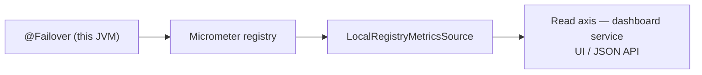
```mermaid
flowchart LR
    A["@Failover (this JVM)"] --> M["Micrometer registry"]
    M --> LS["LocalRegistryMetricsSource"]
    LS --> UI["Read axis — dashboard service<br/>UI / JSON API"]
```

Behind a load balancer this is only **one node's** view — the UI labels it "this instance only". For a true cluster
picture, pick `shared-store` or `prometheus`.

### Multiple instances — `shared-store` (no Prometheus)

Each instance **pushes** its own KPI snapshot to the dashboard; the dashboard keeps the latest per instance and
aggregates them in memory with the same `DashboardKpis` math. Small clusters (≤ ~10), zero external infra.

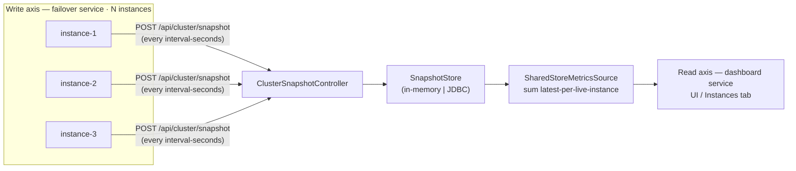
```mermaid
flowchart LR
    subgraph APPS["Write axis — failover service · N instances"]
        I1["instance-1"]; I2["instance-2"]; I3["instance-3"]
    end
    I1 & I2 & I3 -->|"POST /api/cluster/snapshot<br/>(every interval-seconds)"| ING["ClusterSnapshotController"]
    ING --> ST["SnapshotStore<br/>(in-memory | JDBC)"]
    ST --> SS["SharedStoreMetricsSource<br/>sum latest-per-live-instance"]
    SS --> UI["Read axis — dashboard service<br/>UI / Instances tab"]
```

Counts are never dropped from the aggregate: last-known values always contribute, and a peer restart (counter reset)
folds the pre-restart totals into a carried-forward baseline, so cluster totals never shrink. Instances not seen within
`instance-retention` (default 7 days) are retired from the Instances tab — keeping the store bounded under pod churn —
while their counts keep contributing to the aggregate; a retired instance that reports again resumes with its history
intact. Per-instance staleness is visible through each row's last-seen timestamp. `store: jdbc` makes snapshots (
including the carried baseline) survive a dashboard restart.

#### Counter resets — how the aggregate stays monotonic (ADR 67)

Peer snapshots carry **cumulative** Micrometer counter totals, and those totals reset to zero when the peer process
restarts. Two mechanisms keep the two cluster views consistent despite that:

- **Trend graph** — `ClusterSeriesSampler` samples the merged aggregate on a schedule and accumulates a *monotonic
  adjusted* series: per field it adds `max(increase, freshValueAfterReset)`, so a reset never produces a dip or a
  negative delta.
- **Instant aggregate (Overview cards, Health tab)** — on every snapshot ingest the store compares the incoming
  cumulative total against the instance's previous raw snapshot. A drop can only mean a restart, so the previous raw
  totals are folded into a per-instance **baseline** (`SnapshotBaseline`), and the summary served for that instance is
  always `baseline + raw`. Repeated restarts accumulate into the same baseline. With `store: jdbc` the baseline is
  persisted (nullable `BASELINE_JSON` column), so it also survives a dashboard restart.

Both views apply the same detection rule, so cards and graph agree after a peer restart. Known limit: a reset is
invisible if the peer regrows past its previous total within one push interval (15 s by default) — the same theoretical
window Prometheus `rate()` has; at most one interval of events can be undercounted.

#### Instance churn bounded retirement

Under Kubernetes-style deploys every new pod is a new `instanceId`, and the tier's invariant is that a dead peer's
counts must keep contributing. Retirement reconciles the two:

1. An instance with no snapshot for `instance-retention` (default `7d`) moves out of the active map: gone from the
   Instances tab and `allInstances()`, but its `baseline + raw` counts keep contributing via
   `SnapshotStore.retiredAggregate()`.
2. A retired instance that pushes again (e.g. a StatefulSet pod reusing its name) is promoted back with history intact;
   normal reset detection then applies.
3. At most 100 retired entries are kept individually; beyond that the oldest are compacted into a single immutable *
   *tombstone** aggregate — a hard heap bound regardless of churn rate.

Set `instance-retention: 0` to disable retirement (previous retain-forever behaviour). Retirement applies to the
in-memory store only — JDBC rows are durable and cheap, so that store retains all instances.

### Multiple instances — `prometheus` (large clusters)

Prometheus scrapes every instance; the dashboard issues read-only PromQL to aggregate cluster-wide (incl. p95/p99 and
per-instance) and falls back to `local` if Prometheus is down.

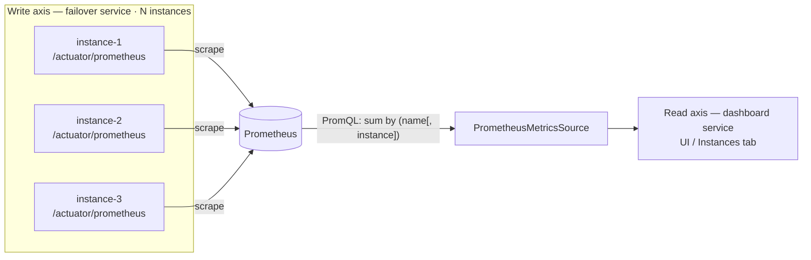
```mermaid
flowchart LR
    subgraph APPS["Write axis — failover service · N instances"]
        I1["instance-1<br/>/actuator/prometheus"]; I2["instance-2<br/>/actuator/prometheus"]; I3["instance-3<br/>/actuator/prometheus"]
    end
    I1 & I2 & I3 -->|scrape| PROM[(Prometheus)]
    PROM -->|"PromQL: sum by (name[, instance])"| PS["PrometheusMetricsSource"]
    PS --> UI["Read axis — dashboard service<br/>UI / Instances tab"]
```

### Picking a mode

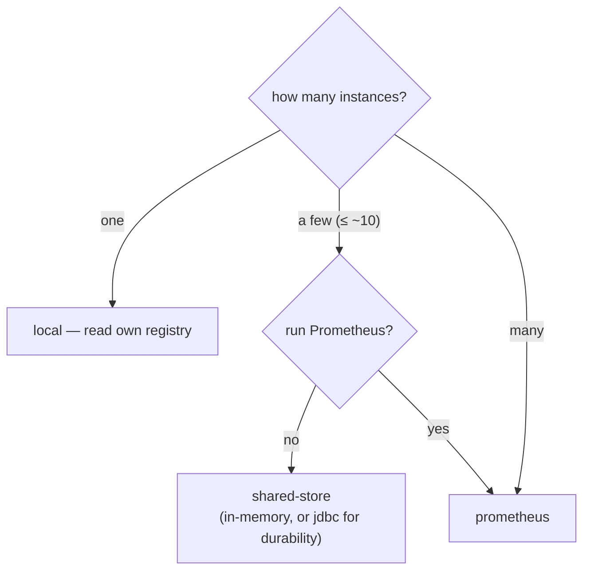
```mermaid
flowchart TB
    Q{how many instances?} -->|one| L["local — read own registry"]
    Q -->|"a few (≤ ~10)"| S{run Prometheus?}
    Q -->|many| P["prometheus"]
    S -->|no| SH["shared-store<br/>(in-memory, or jdbc for durability)"]
    S -->|yes| P
```

| Mode           | Source                             | Infra                      | Per-instance view           |
|----------------|------------------------------------|----------------------------|-----------------------------|
| `local`        | in-process registry                | none                       | n/a (single JVM)            |
| `shared-store` | pushed snapshots, in-app aggregate | none, or a DB table (jdbc) | yes (snapshot per instance) |
| `prometheus`   | PromQL across scraped instances    | Prometheus/TSDB            | yes (`instance` label)      |

### Pairing the read axis with your write-axis backend

The read axis has **only these three sources** — it does **not** read every metrics backend. So the dashboard's
`cluster.mode` does not always mirror the Micrometer registry you export
with ([Observability → choosing a registry](observability.md#choosing-a-micrometer-registry)). Map it like this:

| Write axis (export registry)                                                     | Dashboard read axis                                 | Cluster view comes from                                                                                                                                                                                          |
|----------------------------------------------------------------------------------|-----------------------------------------------------|------------------------------------------------------------------------------------------------------------------------------------------------------------------------------------------------------------------|
| **Prometheus** (scrape)                                                          | `cluster.mode=prometheus` (+ `prometheus.base-url`) | the embedded dashboard, via PromQL — **1:1 pairing**                                                                                                                                                             |
| **OTLP / Elastic / Datadog / New Relic / CloudWatch / Influx / Graphite** (push) | `cluster.mode=shared-store` **or** none             | the **vendor's own UI** (Grafana / Kibana / Datadog…) for those exported meters; **or** the embedded dashboard via `shared-store` (peers push KPI snapshots straight to it — independent of the metrics backend) |
| **none / SimpleMeterRegistry** (single JVM)                                      | `cluster.mode=local` (default)                      | this instance only                                                                                                                                                                                               |

Key point: **`shared-store` is independent of the metrics backend.** Its peers POST snapshots directly to the
dashboard (`/api/cluster/snapshot`), so you get a cluster view in the embedded UI **regardless of
which `micrometer-registry-*` you use** (or even with none). The only registry the dashboard *itself* reads back is
Prometheus. There is **no** `MetricsSource` for OTLP/Elastic/Datadog/etc. — for those, either read the cluster picture
in that vendor's UI, or run `shared-store` alongside.

Examples:

- **Prometheus everywhere:** apps export `micrometer-registry-prometheus`; dashboard `cluster.mode=prometheus`. One
  pairing, full cluster view + p95/p99 in the embedded UI.
- **OTLP to Datadog, but still want the embedded dashboard clustered:** apps export `micrometer-registry-otlp` *and* set
  `cluster.snapshot.publish-url`; dashboard `cluster.mode=shared-store`. Datadog gets the meters; the dashboard gets
  snapshots — two parallel paths.
- **OTLP to your APM, no embedded cluster view needed:** dashboard left at `local` (or not deployed) — use the APM's
  dashboards.

---

## Distributed Deployment: Scenarios

The dashboard reads the `failover.*` **meters**; `cluster.mode` chooses *where it reads them from*. Everything else (UI,
KPIs, health, security) is identical across modes. The scenarios below are complete, copy-pasteable configs for each.

| Mode              | Reads from                               | Infra                     | When                                 |
|-------------------|------------------------------------------|---------------------------|--------------------------------------|
| `local` (default) | this instance's in-process registry      | none                      | single JVM, dev                      |
| `shared-store`    | peers push snapshots → in-memory or JDBC | none, or a small DB table | small cluster (≤ ~10), no Prometheus |
| `prometheus`      | Prometheus HTTP API across all instances | Prometheus/TSDB           | large cluster                        |

Each scenario below is a complete, copy-pasteable example.

### Scenario A — Single JVM (default)

Nothing to configure beyond enabling the dashboard; `cluster.mode` defaults to `local`.

```yaml title="application.yml — the app that has @Failover methods"
failover:
  dashboard:
    enabled: true            # secure-by-default: off unless set
```

Open `http://<app>:<port>/failover-dashboard`. Behind a load balancer this shows only the node that answered (a "this
instance only" badge makes that explicit) — use one of the cluster modes below for a true aggregate.

### Scenario B — Cluster via Prometheus (large clusters)

Each instance exposes `/actuator/prometheus`; Prometheus scrapes them; the dashboard aggregates with PromQL (`sum`,
`rate`, `histogram_quantile` → cluster-wide p95/p99). Falls back to `local` if Prometheus is unreachable, so it never
goes dark.

```yaml title="every app instance"
management:
  endpoints.web.exposure.include: prometheus,health
failover:
  dashboard:
    enabled: true
    cluster:
      mode: prometheus
      prometheus:
        base-url: http://prometheus:9090
        # token: <bearer>      # optional
        # timeout-seconds: 5
```

```yaml title="prometheus.yml (scrape config)"
scrape_configs:
  - job_name: my-service
    metrics_path: /actuator/prometheus
    static_configs:
      - targets: [ 'app-1:8080', 'app-2:8080', 'app-3:8080' ]
```

Prometheus adds the `instance` label at scrape time, so the dashboard's per-instance grouping works automatically — you
do **not** need the `failover.observable.instance` tag here (that tag is for push backends;
see [Observability](observability.md)). The **Instances tab** then breaks the cluster down per node (
`sum by (name, instance)`).

### Scenario C — Cluster via shared-store, in-memory (small clusters, no Prometheus)

Each instance **pushes** its local KPI snapshot to the dashboard; the dashboard aggregates them in memory with the same
KPI math. Production-supported for ≤ ~10 instances. **Consistency over durability**: one (latest) snapshot per instance
plus a reset-aware carried-forward baseline (totals never shrink on peer restart, ADR 67), stale peers flagged by a
liveness window, reset-aware monotonic trend, age + size retention, and bounded instance retirement under pod churn.

```yaml title="the dashboard host (aggregator + UI)"
failover:
  dashboard:
    enabled: true
    cluster:
      mode: shared-store
      shared-store:
        store: inmemory          # default
        max-instances: 10        # supported ceiling (warning beyond)
        instance-retention: 7d   # retire unseen instances (counts stay in the aggregate; 0 = never)
        sample-interval-seconds: 30   # cluster trend sampling cadence
        retention:
          max-age: 7d            # trend history age bound
          max-entries: 100000    # trend history size bound (oldest truncated)
```

```yaml title="every peer (including non-UI instances)"
failover:
  dashboard:
    enabled: true
    cluster:
      snapshot:
        publish-url: http://dashboard-host:8080/failover-dashboard
        interval-seconds: 15
```

The push endpoint sits behind the dashboard's access gate, so peers authenticate with the configured role (basic auth) —
see **Security** below. Lost on dashboard restart (it's in memory); use Scenario D for restart-survival.

Each pushed snapshot is retained per instance, so the **Instances tab** lists every reporting node; the **Health tab**
shows the cluster roll-up. To classify instances as `LIVE` / `DOWN` based on a lightweight heartbeat rather than
snapshot age, see [Instance Live Tracking (2.8)](#28-instance-live-tracking-heartbeat).

### Scenario D — Cluster via shared-store, JDBC durable

Same as C, but snapshots — including each instance's reset-aware carried baseline (`BASELINE_JSON`, ADR 67) — persist to
a database, so the aggregate *and* the restart-correction history survive a dashboard restart. Add the optional module
and flip one property.

```xml title="dashboard host pom.xml"

<dependency>
    <groupId>com.societegenerale.failover</groupId>
    <artifactId>failover-dashboard-snapshotstore-jdbc</artifactId>
</dependency>
```

```yaml title="dashboard host"
failover:
  dashboard:
    enabled: true
    cluster:
      mode: shared-store
      shared-store:
        store: jdbc
        max-instances: 10
        jdbc:
          table-prefix: ""       # prepended to the base table name; "" ⇒ FAILOVER_DASHBOARD_SNAPSHOT
```

Requires a `DataSource` in the dashboard app (the usual `spring.datasource.*`), **and the snapshot table already
created** (see DDL below) — the module never creates or alters it; that is the consuming service's responsibility.
Peers are configured exactly as in Scenario C (`cluster.snapshot.publish-url`).

!!! question "Is multi-tenancy required for the snapshot store?"
**No.** The snapshot store holds only **aggregate, non-sensitive failover metrics** (counts, rates, latency
means/percentiles) — never business data, payloads, keys or PII. So the per-tenant data-isolation / compliance reasons
that drive the *failover store's* multi-tenancy (`failover.store.multitenant`) **do not apply here**. One shared table
is correct and simplest.

    If you need to **namespace** the table — e.g. several environments or several independent dashboards sharing one database — use `table-prefix` (validated: letters/digits/underscore only). If you genuinely want per-tenant *dashboards*, run separate dashboard instances each with its own `table-prefix` (or its own schema); the snapshot store itself stays single-table and tenant-agnostic by design.

**Table name.** `table-prefix` + the base `FAILOVER_DASHBOARD_SNAPSHOT` (e.g. prefix `DEMO_` →
`DEMO_FAILOVER_DASHBOARD_SNAPSHOT`). The prefix is validated as a safe SQL identifier fragment (no injection).

**DDL.** The failover module never creates or alters this table — create it yourself with the dialect-appropriate
type for the JSON columns before starting the dashboard:

`RECEIVED_AT` (and, below, `LAST_SEEN`) is a time-zone-aware timestamp — the store reads/writes it as
`OffsetDateTime` (always UTC) via JDBC 4.2 `setObject`/`getObject`, converting to/from epoch-millis at that
boundary (the rest of the codebase, e.g. `InstanceMetrics.lastSeenEpochMs`, stays in epoch-millis). Declared
precision is capped per dialect below — PostgreSQL and H2 differ, and MySQL/MariaDB have no `WITH TIME ZONE`
syntax at all (their `TIMESTAMP` always stores/converts via the session time zone; since the store always
writes UTC, this is lossless in practice):

```sql title="PostgreSQL"
CREATE TABLE FAILOVER_DASHBOARD_SNAPSHOT
(
    INSTANCE_ID   VARCHAR(255) PRIMARY KEY,
    RECEIVED_AT   TIMESTAMP(6) WITH TIME ZONE NOT NULL, -- Postgres caps fractional precision at 6
    SUMMARY_JSON  TEXT   NOT NULL, -- or JSONB
    BASELINE_JSON TEXT,            -- reset-aware carried baseline (ADR 67); nullable
    CONFIG_JSON   TEXT             -- pushed @Failover config entries; nullable
);
```

```sql title="MySQL / MariaDB"
CREATE TABLE FAILOVER_DASHBOARD_SNAPSHOT
(
    INSTANCE_ID   VARCHAR(255) PRIMARY KEY,
    RECEIVED_AT   TIMESTAMP(6) NOT NULL, -- no WITH TIME ZONE syntax; max fractional precision is 6
    SUMMARY_JSON  LONGTEXT NOT NULL,
    BASELINE_JSON LONGTEXT,
    CONFIG_JSON   LONGTEXT
);
```

```sql title="Oracle"
CREATE TABLE FAILOVER_DASHBOARD_SNAPSHOT
(
    INSTANCE_ID   VARCHAR2(255) PRIMARY KEY,
    RECEIVED_AT   TIMESTAMP(9) WITH TIME ZONE NOT NULL,
    SUMMARY_JSON  CLOB NOT NULL,
    BASELINE_JSON CLOB,
    CONFIG_JSON   CLOB
);
```

```sql title="H2 / generic"
CREATE TABLE FAILOVER_DASHBOARD_SNAPSHOT
(
    INSTANCE_ID   VARCHAR(255) PRIMARY KEY,
    RECEIVED_AT   TIMESTAMP(9) WITH TIME ZONE NOT NULL,
    SUMMARY_JSON  CLOB NOT NULL,
    BASELINE_JSON CLOB,
    CONFIG_JSON   CLOB
);
```

Prepend your `table-prefix` to the table name if you set one. One row per instance (upserted on each push).
`SUMMARY_JSON` holds the latest raw snapshot; `BASELINE_JSON` (nullable) accumulates the pre-restart totals folded in
when a counter reset is detected — the dashboard serves `baseline + raw` per instance. Every row contributes its
last-known counts to the aggregate; the liveness window only drives the `LIVE`/`DOWN` status shown in the Instances tab.

**Heartbeat durability.** When [liveness tracking](#28-instance-live-tracking-heartbeat) is on
(`cluster.shared-store.liveness.enabled=true`), `store=jdbc` also swaps the heartbeat store from
`HeartbeatStoreInmemory` to a JDBC-backed one, on the same `DataSource`. This matters beyond restart-survival:
it's what keeps `LIVE`/`DOWN` status correct when the dashboard is **embedded in more than one `@Failover`
instance** pointed at the same database (rather than run standalone, Scenario E) — each peer's heartbeat push
normally lands on whichever single dashboard it's configured to push to, so an in-memory store on each embedded
dashboard would only ever see its *own* loopback heartbeat and show every other peer stuck at `UNKNOWN`. The
JDBC table makes liveness visible to every embedded dashboard, not just the one that received the ping. If you
plan to use liveness tracking, create this table alongside the snapshot table up front:

```sql title="PostgreSQL"
CREATE TABLE FAILOVER_DASHBOARD_HEARTBEAT
(
    INSTANCE_ID VARCHAR(255) PRIMARY KEY,
    LAST_SEEN   TIMESTAMP(6) WITH TIME ZONE NOT NULL
);
```

```sql title="MySQL / MariaDB"
CREATE TABLE FAILOVER_DASHBOARD_HEARTBEAT
(
    INSTANCE_ID VARCHAR(255) PRIMARY KEY,
    LAST_SEEN   TIMESTAMP(6) NOT NULL
);
```

```sql title="Oracle"
CREATE TABLE FAILOVER_DASHBOARD_HEARTBEAT
(
    INSTANCE_ID VARCHAR2(255) PRIMARY KEY,
    LAST_SEEN   TIMESTAMP(9) WITH TIME ZONE NOT NULL
);
```

```sql title="H2 / generic"
CREATE TABLE FAILOVER_DASHBOARD_HEARTBEAT
(
    INSTANCE_ID VARCHAR(255) PRIMARY KEY,
    LAST_SEEN   TIMESTAMP(9) WITH TIME ZONE NOT NULL
);
```

Same `table-prefix` as the snapshot table (e.g. `DEMO_` → `DEMO_FAILOVER_DASHBOARD_HEARTBEAT`).

!!! note "Only required when `cluster.shared-store.liveness.enabled=true`"
    This table (and the `HeartbeatStore` bean, and the `/api/cluster/heartbeat` ingest endpoint) only exist
    when the dashboard-side `cluster.shared-store.liveness.enabled` toggle (default **`false`**, ADR 66) is
    explicitly turned on — see [Instance Live Tracking](#28-instance-live-tracking-heartbeat). With `store=jdbc`
    and liveness left off (the default), the dashboard never queries this table at all, so it does **not**
    need to exist. Turning liveness on without creating the table first fails every dashboard read with
    `BadSqlGrammarException` / `Table "...FAILOVER_DASHBOARD_HEARTBEAT" not found` — create it before setting
    `liveness.enabled=true`, not after.

### Scenario D2 — Cluster via shared-store, JDBC direct (no ingest endpoint)

Same durable `store=jdbc` backend as Scenario D, but peers **write straight to the table** instead of POSTing to
`/api/cluster/snapshot`. Trades the ingest endpoint — and its HTTP auth gate — for a DB credential/network
dependency: worth it only when peers already share the dashboard's database (e.g. both point
`failover.store.type=jdbc` / `cluster.shared-store.store=jdbc` at the same schema). Not a fit when peers sit on
a different network segment than the DB but can reach the dashboard over HTTP — use Scenario D instead.

```
  @Failover Service(s)                       Dashboard Host
 ┌────────────────────────────┐              ┌───────────────────────────┐
 │  ClusterSnapshotPublisher  │              │  (no ClusterSnapshot-     │
 │  JdbcSnapshotPushClient    │─┐            │   Controller mapped)      │
 └────────────────────────────┘ │            │  SnapshotStore (JDBC)     │
                                 │            │  /failover-dashboard      │
                                 ▼            └─────────────┬─────────────┘
                     ┌─────────────────────────┐            │
                     │  Database               │◄───────────┘
                     │  FAILOVER_DASHBOARD_     │
                     │  SNAPSHOT (shared table) │
                     └─────────────────────────┘
```

**Dashboard host YAML:**

```yaml title="dashboard-host/application.yml"
spring:
  datasource:
    url: jdbc:postgresql://db:5432/dashboard
    username: dashboard
    password: secret

failover:
  dashboard:
    enabled: true
    cluster:
      mode: shared-store
      shared-store:
        store: jdbc
        max-instances: 10
        jdbc:
          table-prefix: ""
      snapshot:
        ingest:
          enabled: false   # no POST /api/cluster/snapshot mapped — nothing to secure
```

**`@Failover` service YAML (every peer, own DataSource pointed at the same DB):**

```yaml title="peer-service/application.yml"
spring:
  datasource:
    url: jdbc:postgresql://db:5432/dashboard   # same DB the dashboard host uses
    username: peer_writer
    password: secret

failover:
  dashboard:
    enabled: false           # this peer doesn't need to serve its own dashboard UI
    cluster:
      snapshot:
        jdbc:
          enabled: true
          table-prefix: ""   # MUST match the dashboard's shared-store.jdbc.table-prefix
```

No `publish-url`, `username`/`password`, or `oauth2-client-registration-id` on the peer — setting `jdbc.enabled`
and `publish-url` together fails fast at startup (`FailoverClusterPublisherProperties`), since the two transports
are mutually exclusive. The reset-aware baseline carry-forward (ADR 67) is identical to Scenario D — same table,
same upsert logic, applied by whichever side wrote last.

!!! tip "DDL and credentials"
Same table as Scenario D — see the DDL there. Grant the peer's DB user `INSERT`/`UPDATE`/`SELECT` on
`FAILOVER_DASHBOARD_SNAPSHOT` (it reads its own previous row to compute the baseline before writing).

### Scenario E — Standalone dashboard (its own app)

Run the dashboard as its own small Spring Boot app pointed at a backend, so a cluster has **one** dashboard rather than
one embedded per instance. The `@Failover` library is **not** on its classpath.

```yaml title="standalone dashboard app"
spring:
  application.name: failover-dashboard
failover:
  dashboard:
    enabled: true
    cluster:
      mode: prometheus          # or shared-store (then peers push to this app)
      prometheus:
        base-url: http://prometheus:9090
```

The app needs `spring-boot-starter-web`, `spring-boot-starter-security`, a `MeterRegistry`, and the
`failover-dashboard` (or its starter) dependency. With no failover library there are no `@Failover` methods to discover,
so the **Config view is empty** while all metrics/health/trend views work from the backend — a no-op `FailoverScanner`
is supplied automatically. (For `shared-store` mode, also add `failover-dashboard-snapshotstore-jdbc` if you want
durability.)

## Configuration How-To

Complete, copy-pasteable YAML for every deployment shape. Each scenario shows **two YAML blocks** —
one for the `@Failover` microservice (the app that uses `@Failover` methods) and one for the dashboard
service (which may be the same process). Sub-scenarios 2.x cover the snapshot ingest authentication options.

### 1. Single JVM

All-in-one: the same process runs the `@Failover` methods **and** serves the dashboard.
`cluster.mode` defaults to `local` (reads the in-process `MeterRegistry`); no cluster config is needed.

```
┌────────────────────────────────────────────────────┐
│  Single JVM                                        │
│                                                    │
│  ┌─────────────────┐    ┌──────────────────────┐   │
│  │ @Failover beans │───►│  MeterRegistry       │   │
│  └─────────────────┘    └──────────┬───────────┘   │
│                                    │               │
│                          ┌─────────▼────────────┐  │
│                          │  Dashboard (local)   │  │
│                          │  /failover-dashboard │  │
│                          └──────────────────────┘  │
└────────────────────────────────────────────────────┘
```

#### 1.1 Minimal — Basic Enable

```yaml title="application.yml"
failover:
  dashboard:
    enabled: true    # everything else defaults; store = whatever failover.store.type is set to
```

With no `security.allow-insecure`, the dashboard requires Spring Security (bundled by the starter).
Grant the `FAILOVER_ADMIN` role to your admin user or override the filter chain.

#### 1.2 With InMemory Failover Store (Dev / Test)

No extra deps; store is cleared on restart.

```yaml title="application.yml"
failover:
  store:
    type: inmemory
  dashboard:
    enabled: true
```

#### 1.3 With Caffeine Store (Single-Node Cache)

```yaml title="application.yml"
failover:
  store:
    type: caffeine
  dashboard:
    enabled: true
```

#### 1.4 With JDBC Failover Store (Production)

Persistence across restarts; shared by all methods in this JVM.

```yaml title="application.yml"
spring:
  datasource:
    url: jdbc:postgresql://db:5432/myapp
    username: myapp
    password: secret

failover:
  store:
    type: jdbc
  dashboard:
    enabled: true
```

#### 1.5 With Trend History (Reload-Surviving Charts)

Enables the server-side ring buffer; trend charts survive a browser reload.

```yaml title="application.yml"
failover:
  dashboard:
    enabled: true
    history:
      enabled: true
      samples: 120
      sample-interval-seconds: 15   # retains ~30 min with these defaults
```

#### 1.6 With Prometheus Registry

`failover.*` meters flow to Prometheus. The dashboard still reads `local` (in-process registry) — use
`cluster.mode=prometheus` only when the **dashboard** needs to aggregate meters **across multiple instances**.

```yaml title="application.yml"
management:
  endpoints:
    web:
      exposure:
        include: prometheus,health

failover:
  dashboard:
    enabled: true
```

#### 1.7 With OTLP / Elastic / Datadog Registry

Same as 1.6: add the Micrometer registry to export meters to your APM; the dashboard reads `local`.
For push registries, auto-tagging adds an instance identity (useful when you later scale out).

```yaml title="application.yml"
management:
  otlp:
    metrics:
      export:
        url: http://otel-collector:4318/v1/metrics
        enabled: true

failover:
  observable:
    instance:
      mode: auto                  # auto-tags push registries; skips Prometheus
      id: ${HOSTNAME:my-service}  # readable stable id on k8s/Docker
  dashboard:
    enabled: true
```

---

### 2. Cluster / Distributed

Multiple JVMs emit `failover.*` metrics; the dashboard must aggregate them.
**Choose a mode:**

```
Is Prometheus already in the infra?
   Yes → cluster.mode=prometheus (large clusters, p95/p99 available)
   No  → cluster.mode=shared-store (small clusters ≤ ~10, no extra infra)

For shared-store — does the aggregate need to survive a dashboard restart?
   Yes → store=jdbc (durable)
   No  → store=inmemory (simple)

For store=jdbc — do peers already share the dashboard's database?
   Yes → snapshot.jdbc.enabled=true on peers (no ingest endpoint, Scenario D2 / 2.9)
   No  → snapshot.publish-url on peers (HTTP push, Scenario D / 2.4-2.5)
```

In cluster mode the **dashboard host** aggregates metrics from all **peers** (the `@Failover` services).
They may be the same process (each instance runs the dashboard and pushes to the others) or a dedicated
standalone app (see scenario 2.7).

The POST endpoint that receives peer snapshots is `/api/cluster/snapshot`; it can be secured with
**Basic Auth**, **OAuth2 Bearer**, or left **open** (dev only). See
the [peer ingest access control](#peer-ingest-access-control) below.

---

#### 2.1 In-Memory Shared-Store — Open Ingest (Dev / Trusted Network)

Simplest cluster setup. No auth on the ingest endpoint; peers push without credentials.

```
  @Failover Service 1          @Failover Service 2
 ┌───────────────────┐         ┌───────────────────┐
 │ @Failover beans   │         │ @Failover beans   │
 │ MeterRegistry     │         │ MeterRegistry     │
 │ SnapshotPublisher │         │ SnapshotPublisher │
 └────────┬──────────┘         └────────┬──────────┘
          │ POST /api/cluster/snapshot  │
          │ (no credentials)            │
          └────────────┬────────────────┘
                       ▼
          ┌─────────────────────────────┐
          │  Dashboard Host             │
          │  SnapshotStore (inmemory)   │
          │  SharedStoreMetricsSource   │
          │  /failover-dashboard        │
          └─────────────────────────────┘
```

**`@Failover` service YAML (every peer):**

```yaml title="peer-service/application.yml"
failover:
  dashboard:
    enabled: true
    cluster:
      snapshot:
        publish-url: http://dashboard-host:8080/failover-dashboard
        interval-seconds: 15
        allow-insecure-ingest: true   # suppresses the publisher-side no-auth startup WARN
        # no username / password / oauth2 (matches open ingest on dashboard)
```

**Dashboard host YAML:**

```yaml title="dashboard-host/application.yml"
failover:
  dashboard:
    enabled: true
    cluster:
      mode: shared-store
      shared-store:
        store: inmemory
        max-instances: 10
      snapshot:
        allow-insecure-ingest: true   # ⚠ dev / trusted-network only — logs startup WARN
        # refused under the 'prod' profile
```

!!! warning "Open ingest"
`allow-insecure-ingest: true` creates a permit-all `POST` endpoint. Use only on a trusted internal
network or in development. Refused under the `prod` Spring profile.

---

#### 2.2 In-Memory Shared-Store — Basic Auth (Production, No IdP)

Adds HTTP Basic Auth to the ingest endpoint. Password is plain text on both sides (the dashboard applies
`{noop}` internally; the publisher sends it as-is in the `Authorization: Basic` header).

```
  @Failover Service(s)
 ┌──────────────────────────────────┐
 │  MeterRegistry                   │
 │  SnapshotPublisher               │──► POST /api/cluster/snapshot
 │  (Authorization: Basic user:pwd) │    Authorization: Basic base64(u:p)
 └──────────────────────────────────┘
                  │
                  ▼
 ┌────────────────────────────────────────┐
 │  Dashboard Host                        │
 │  dashboardIngestBasicFilterChain       │── validates username + {noop}password
 │  SnapshotStore (inmemory)              │
 │  /failover-dashboard                   │
 └────────────────────────────────────────┘
```

**`@Failover` service YAML (every peer):**

```yaml title="peer-service/application.yml"
failover:
  dashboard:
    enabled: true
    cluster:
      snapshot:
        publish-url: http://dashboard-host:8080/failover-dashboard
        interval-seconds: 15
        username: ingest-user   # must match dashboard's snapshot.username
        password: s3cr3t        # plain text — sent as HTTP Basic
```

**Dashboard host YAML:**

```yaml title="dashboard-host/application.yml"
failover:
  dashboard:
    enabled: true
    cluster:
      mode: shared-store
      shared-store:
        store: inmemory
        max-instances: 10
      snapshot:
        username: ingest-user   # creates dashboardIngestBasicFilterChain
        password: s3cr3t        # plain text — {noop} applied internally
```

!!! warning "Password must be plain text"
Do **not** use Spring Security encoded strings (`{bcrypt}…`) as the password. The publisher sends
the value as-is in the `Authorization: Basic` header; a `{bcrypt}` hash would be sent literally and
never match.

---

#### 2.3 In-Memory Shared-Store — OAuth2 Bearer (Production, Existing IdP)

Uses the consumer's **existing** `OAuth2AuthorizedClientManager`; no new dependencies when the app
already has `spring-security-oauth2-client`. The dashboard validates the Bearer token via JWT
(`spring-security-oauth2-resource-server`). Tokens rotate automatically — no shared secret to manage.

```
  @Failover Service(s)          Identity Provider (IdP)
 ┌────────────────────────┐     ┌─────────────────────┐
 │  OAuth2Authorized      │────►│  /token (client_    │
 │  ClientManager         │◄────│   credentials flow) │
 │  SnapshotPublisher     │     └─────────────────────┘
 │  Bearer: <jwt>         │
 └──────────┬─────────────┘
            │ POST /api/cluster/snapshot
            │ Authorization: Bearer <jwt>
            ▼
 ┌─────────────────────────────────────────┐
 │  Dashboard Host                         │
 │  dashboardIngestOAuth2FilterChain       │── JWT validation (issuer-uri)
 │  SnapshotStore (inmemory)               │
 │  /failover-dashboard                    │
 └─────────────────────────────────────────┘
```

**`@Failover` service YAML (every peer):**

```yaml title="peer-service/application.yml"
spring:
  security:
    oauth2:
      client:
        registration:
          failover-dashboard: # registration id (your choice)
            provider: my-idp
            client-id: failover-peer
            client-secret: <secret>
            authorization-grant-type: client_credentials
            scope: failover:ingest
        provider:
          my-idp:
            token-uri: https://idp.example.com/realms/myrealm/protocol/openid-connect/token

failover:
  dashboard:
    enabled: true
    cluster:
      snapshot:
        publish-url: http://dashboard-host:8080/failover-dashboard
        interval-seconds: 15
        oauth2-client-registration-id: failover-dashboard   # matches the registration above
```

Add to `peer-service/pom.xml`:

```xml

<dependency>
    <groupId>org.springframework.security</groupId>
    <artifactId>spring-security-oauth2-client</artifactId>
</dependency>
```

**Dashboard host YAML:**

```yaml title="dashboard-host/application.yml"
spring:
  security:
    oauth2:
      resourceserver:
        jwt:
          issuer-uri: https://idp.example.com/realms/myrealm

failover:
  dashboard:
    enabled: true
    cluster:
      mode: shared-store
      shared-store:
        store: inmemory
        max-instances: 10
      # no snapshot.username needed — OAuth2 chain activates from the classpath dep below
```

Add to `dashboard-host/pom.xml`:

```xml

<dependency>
    <groupId>org.springframework.security</groupId>
    <artifactId>spring-security-oauth2-resource-server</artifactId>
</dependency>
<dependency>
<groupId>org.springframework.security</groupId>
<artifactId>spring-security-oauth2-jose</artifactId>
</dependency>
```

!!! info "Auth priority on the publisher"
When `oauth2-client-registration-id` is set **and** `OAuth2AuthorizedClientManager` is in the Spring
context, OAuth2 Bearer takes priority over Basic Auth (even if `username`/`password` are also set).
If the `OAuth2AuthorizedClientManager` bean is absent, the publisher falls back to Basic Auth.

---

#### 2.4 JDBC Shared-Store — Basic Auth (Durable, Production)

Same as 2.2 but snapshots persist to a database; the cluster aggregate survives a dashboard restart.

```
  @Failover Service(s)
 ┌───────────────────────────┐
 │  SnapshotPublisher        │──► POST /api/cluster/snapshot
 │  (Authorization: Basic)   │    Authorization: Basic base64(u:p)
 └───────────────────────────┘
                 │
                 ▼
 ┌──────────────────────────────────────────┐
 │  Dashboard Host                          │
 │  dashboardIngestBasicFilterChain         │
 │  SnapshotStore (JDBC)                    │──► FAILOVER_DASHBOARD_SNAPSHOT table
 │  /failover-dashboard                     │
 └──────────────────────────────────────────┘
                 │
                 ▼
 ┌──────────────────────────┐
 │  Database                │
 │  (PostgreSQL / MySQL /   │
 │   MariaDB / Oracle / H2) │
 └──────────────────────────┘
```

**`@Failover` service YAML:** identical to scenario 2.2 (just `publish-url` + `username` + `password`).

**Dashboard host YAML:**

```yaml title="dashboard-host/application.yml"
spring:
  datasource:
    url: jdbc:postgresql://db:5432/dashboard
    username: dashboard
    password: secret

failover:
  dashboard:
    enabled: true
    cluster:
      mode: shared-store
      shared-store:
        store: jdbc
        max-instances: 10
        jdbc:
          table-prefix: ""    # "" → FAILOVER_DASHBOARD_SNAPSHOT (table must already exist — see Scenario D)
      snapshot:
        username: ingest-user
        password: s3cr3t
```

Add to `dashboard-host/pom.xml`:

```xml

<dependency>
    <groupId>com.societegenerale.failover</groupId>
    <artifactId>failover-dashboard-snapshotstore-jdbc</artifactId>
</dependency>
```

---

#### 2.5 JDBC Shared-Store — OAuth2 Bearer (Durable, Production, Existing IdP)

Combine JDBC durability (2.4) with OAuth2 auth (2.3).

**`@Failover` service YAML:** identical to scenario 2.3 (OAuth2 client credentials + `oauth2-client-registration-id`).

**Dashboard host YAML:**

```yaml title="dashboard-host/application.yml"
spring:
  datasource:
    url: jdbc:postgresql://db:5432/dashboard
    username: dashboard
    password: secret
  security:
    oauth2:
      resourceserver:
        jwt:
          issuer-uri: https://idp.example.com/realms/myrealm

failover:
  dashboard:
    enabled: true
    cluster:
      mode: shared-store
      shared-store:
        store: jdbc
        max-instances: 10
        jdbc:
          table-prefix: ""
```

Dependencies: `failover-dashboard-snapshotstore-jdbc` + `spring-security-oauth2-resource-server` +
`spring-security-oauth2-jose`.

---

#### 2.6 Prometheus Mode (Large Clusters, Prometheus in Infra)

No snapshot push from peers. Prometheus scrapes every instance; the dashboard aggregates with PromQL.
Per-instance view and p95/p99 latency are available. Falls back to `local` if Prometheus is unreachable.

```
  @Failover Service 1       @Failover Service 2      @Failover Service 3
 ┌──────────────────┐      ┌──────────────────┐      ┌──────────────────┐
 │ @Failover beans  │      │ @Failover beans  │      │ @Failover beans  │
 │ MeterRegistry    │      │ MeterRegistry    │      │ MeterRegistry    │
 │ /actuator/       │      │ /actuator/       │      │ /actuator/       │
 │  prometheus      │      │  prometheus      │      │  prometheus      │
 └────────┬─────────┘      └────────┬─────────┘      └────────┬─────────┘
          │ scrape                  │ scrape                   │ scrape
          └────────────────┬────────┘──────────────────────────┘
                           ▼
                ┌─────────────────────┐
                │  Prometheus         │
                └──────────┬──────────┘
                           │ PromQL (sum / rate / histogram_quantile)
                           ▼
                ┌──────────────────────────┐
                │  Dashboard Host          │
                │  PrometheusMetricsSource │
                │  /failover-dashboard     │
                └──────────────────────────┘
```

**`@Failover` service YAML (every instance) — no `cluster.snapshot` needed:**

```yaml title="peer-service/application.yml"
management:
  endpoints:
    web:
      exposure:
        include: prometheus,health

# failover config as normal — no dashboard cluster settings required on peers
```

**Dashboard host YAML:**

```yaml title="dashboard-host/application.yml"
failover:
  dashboard:
    enabled: true
    cluster:
      mode: prometheus
      prometheus:
        base-url: http://prometheus:9090
        # token: <bearer>          # optional, when Prometheus is secured
        # timeout-seconds: 5
```

**Prometheus scrape config:**

```yaml title="prometheus.yml"
scrape_configs:
  - job_name: my-failover-service
    metrics_path: /actuator/prometheus
    static_configs:
      - targets:
          - app-1:8080
          - app-2:8080
          - app-3:8080
```

!!! tip "No snapshot.publish-url on peers"
In `prometheus` mode peers **do not** configure `cluster.snapshot.publish-url`. The dashboard reads
directly from Prometheus via PromQL; peers only need to expose `/actuator/prometheus`.

!!! tip "Per-instance label in the Instances tab"
Prometheus adds the `instance` label at scrape time; the dashboard's **Instances** tab groups by it
automatically. You do **not** need `failover.observable.instance.*` here — that property tags push
registries (OTLP, Elastic, Datadog) which Prometheus doesn't use.

---

#### 2.7 Standalone Dashboard (Dedicated App, No @Failover on Dashboard Classpath)

The dashboard runs as its own Spring Boot app; `@Failover` services push snapshots to it.
The `failover-spring-boot-starter` is **not** required in the dashboard app; a no-op `FailoverScanner`
is provided automatically (Config view is empty — no `@Failover` methods to discover).

```
  @Failover Service 1      @Failover Service 2
 ┌──────────────────┐      ┌──────────────────┐
 │ @Failover beans  │      │ @Failover beans  │
 │ SnapshotPublisher│      │ SnapshotPublisher│
 └────────┬─────────┘      └────────┬─────────┘
          │ POST /api/cluster/snapshot
          └──────────────┬───────────────────
                         ▼
          ┌──────────────────────────────────────┐
          │  Standalone Dashboard App            │
          │  (no failover library required)      │
          │  Config view: empty (no @Failover)   │
          │  Metrics / Health / Instances: live  │
          │  /failover-dashboard                 │
          └──────────────────────────────────────┘
```

**Standalone dashboard YAML:**

```yaml title="dashboard-app/application.yml"
spring:
  application.name: failover-dashboard
  # datasource only needed when store=jdbc:
  datasource:
    url: jdbc:postgresql://db:5432/dashboard
    username: dashboard
    password: secret

failover:
  dashboard:
    enabled: true
    cluster:
      mode: shared-store        # or prometheus
      shared-store:
        store: inmemory         # or jdbc (add failover-dashboard-snapshotstore-jdbc)
      snapshot:
        username: ingest-user   # or use oauth2, or allow-insecure-ingest for dev
        password: s3cr3t
```

**`@Failover` service YAML (same as scenario 2.2):**

```yaml title="peer-service/application.yml"
failover:
  dashboard:
    enabled: true
    cluster:
      snapshot:
        publish-url: http://dashboard-app:8080/failover-dashboard
        interval-seconds: 15
        username: ingest-user
        password: s3cr3t
```

---

#### 2.8 Instance Live Tracking (Heartbeat)

By default the dashboard knows an instance pushed a snapshot but does **not** actively track whether that instance is
still running. If a service crashes after its last snapshot push, the dashboard has no way to distinguish "still alive
but idle" from "crashed" — both look the same.

**Instance live tracking** adds a dedicated lightweight heartbeat: each peer sends `{"instanceId":"..."}` to the
dashboard on a short fixed interval (no metrics payload, ~10 bytes). The dashboard records the receive time and
classifies instances as `LIVE` or `DOWN`. The dot colour in the Instances tab changes accordingly, and the topbar shows
`instance live tracking · on`. When disabled, the dot reflects snapshot age only and the topbar shows
`instance live tracking · off`.

**Key design decisions:**

- **Off by default on both sides, independently** (ADR 66) — zero overhead unless you opt in on *both*: peers
  won't push unless `cluster.snapshot.heartbeat.enabled=true`, and the dashboard won't create a `HeartbeatStore`,
  map `/api/cluster/heartbeat`, or query liveness at all unless `cluster.shared-store.liveness.enabled=true`.
  These are deliberately separate flags on separate processes — the dashboard usually runs as its own
  deployment (Scenario E) and has no way to read a peer's configuration, and one peer's setting can't speak
  for the whole cluster's. Both need to be `true` for the feature to do anything: peer-only leaves pushes
  landing nowhere useful; dashboard-only leaves every instance at `UNKNOWN` forever.
- **Metrics of DOWN instances are preserved** — last-known values still contribute to the cluster aggregate. Only the
  dot turns red; the numbers are not zeroed.
- **Liveness ≠ snapshot freshness** — a healthy instance with no upstream calls (quiet period) keeps its heartbeat green
  even if no snapshots arrive.
- **Heartbeat URL is auto-derived** — `/api/cluster/snapshot` → `/api/cluster/heartbeat`; override only for non-standard
  paths.
- **`store=jdbc` never requires the heartbeat table unless liveness is on** — with `liveness.enabled=false` (the
  default), the dashboard never touches `FAILOVER_DASHBOARD_HEARTBEAT` even if `store=jdbc`; see the note in
  Scenario D.

**Recommended timing rule:** set `liveness-seconds` ≥ 3 × `heartbeat.interval-seconds` so an instance must miss three
pings before it is classified as DOWN.

```
  @Failover Service                    Dashboard Host
 ┌─────────────────────────────────┐   ┌──────────────────────────────────┐
 │  ClusterSnapshotPublisher       │──►│  POST /api/cluster/snapshot      │
 │  (every 15s, event-driven)      │   │  → SnapshotStore                 │
 │                                 │   │                                  │
 │  HeartbeatPublisher             │──►│  POST /api/cluster/heartbeat     │
 │  (every 60s, fixed schedule)    │   │  → HeartbeatStore                │
 └─────────────────────────────────┘   │                                  │
                                       │  instances() enriched with       │
                                       │  LIVE / DOWN from heartbeat age  │
                                       └──────────────────────────────────┘
```

**Step 1 — Enable heartbeat on each `@Failover` service peer:**

```yaml title="peer-service/application.yml"
failover:
  dashboard:
    enabled: true
    cluster:
      snapshot:
        publish-url: http://dashboard-host:8080/failover-dashboard
        interval-seconds: 15
        username: ingest-user   # same auth as snapshot push
        password: s3cr3t
        heartbeat:
          enabled: true           # off by default — opt in explicitly
          interval-seconds: 60    # ping cadence (default); keep well below liveness-seconds on dashboard
```

The heartbeat uses the **same auth** as the snapshot endpoint (Basic Auth or OAuth2 — whichever is configured). The
heartbeat URL is always derived as `{publish-url}/api/cluster/heartbeat`.

**Step 2 — Enable liveness tracking on the dashboard:**

```yaml title="dashboard-host/application.yml"
failover:
  dashboard:
    enabled: true
    cluster:
      mode: shared-store
      shared-store:
        store: inmemory
        liveness-seconds: 180    # heartbeat age threshold: DOWN after 180s without a ping (= 3 × peer interval-seconds of 60s)
        liveness:
          enabled: true          # off by default — without this, no HeartbeatStore bean, no ingest endpoint, no queries
      snapshot:
        username: ingest-user
        password: s3cr3t
```

!!! tip "Sizing the liveness window"
Set `liveness-seconds` = 3 × peer `heartbeat.interval-seconds`. With `heartbeat.interval-seconds: 60` (default), use
`liveness-seconds: 180` — an instance must miss three consecutive pings before it flips to DOWN, tolerating transient
hiccups without false positives. Do not use `liveness-seconds` ≤ `heartbeat.interval-seconds`; the instance would be
marked DOWN before its first ping arrives.

**What you see in the UI:**

| Instance state                                                   | Dot colour             | Topbar badge                          |
|--------------------------------------------------------------------|-----------------------|----------------------------------------|
| `shared-store.liveness.enabled=false` (dashboard-side, default)     | light green (unknown) | `instance live tracking · disabled`   |
| Dashboard-side enabled, but no peer has sent a heartbeat yet        | light green (unknown) | `instance live tracking · waiting`    |
| Dashboard-side enabled, peer heartbeat fresh                        | green pulse           | `instance live tracking · on`         |
| Dashboard-side enabled, peer heartbeat expired                      | red                   | `instance live tracking · on`         |

The topbar badge's tooltip names the exact property to set for the `disabled`/`waiting` states, so there's no
need to cross-reference this table from the running dashboard.

!!! note "Heartbeat endpoint security"
`POST /api/cluster/heartbeat` is gated by the **same** filter chain as `POST /api/cluster/snapshot`. No extra security
config is needed; peers authenticate identically to snapshot pushes.

---

#### 2.9 JDBC Shared-Store — Direct Write (No Ingest Endpoint)

See [Scenario D2](#scenario-d2--cluster-via-shared-store-jdbc-direct-no-ingest-endpoint) above for the full
picture. Same durable `store=jdbc` backend as 2.4/2.5, but peers write straight into
`FAILOVER_DASHBOARD_SNAPSHOT` instead of POSTing — no ingest endpoint, no ingest auth config, no
`ClusterSnapshotController` mapped at all.

**Dashboard host YAML:**

```yaml title="dashboard-host/application.yml"
spring:
  datasource:
    url: jdbc:postgresql://db:5432/dashboard
    username: dashboard
    password: secret

failover:
  dashboard:
    enabled: true
    cluster:
      mode: shared-store
      shared-store:
        store: jdbc
        jdbc:
          table-prefix: ""
      snapshot:
        ingest:
          enabled: false
```

**`@Failover` service YAML (every peer):**

```yaml title="peer-service/application.yml"
spring:
  datasource:
    url: jdbc:postgresql://db:5432/dashboard   # same DB as the dashboard host
    username: peer_writer
    password: secret

failover:
  dashboard:
    cluster:
      snapshot:
        jdbc:
          enabled: true
          table-prefix: ""   # must match shared-store.jdbc.table-prefix above
```

!!! warning "Mutually exclusive with publish-url"
`cluster.snapshot.jdbc.enabled=true` and `cluster.snapshot.publish-url` cannot both be set on a peer — the
context fails fast at startup (`FailoverClusterPublisherProperties`). Pick one transport per peer.

## Exporting Metrics Elsewhere (OTLP / Elastic)

The dashboard reads `failover.*` **meters**; how those meters leave each instance is a plain Micrometer concern — **no
failover module is required**. Add the matching Micrometer registry to the application and the `failover.*` meters flow
with everything else:

- **OTLP** (vendor-neutral → Prometheus / Elastic / Datadog / …): add `micrometer-registry-otlp`.
- **Elastic**: add `micrometer-registry-elastic`.

For these push backends, per-instance attribution is automatic: `failover.observable.instance.mode` defaults to `auto`,
which tags push registries (and skips Prometheus). Set `failover.observable.instance.id=${HOSTNAME}` on k8s/Docker for a
readable identity. See [Observability](observability.md).

For a metrics **read** source over Elasticsearch (or a log drill-down view), implement the `MetricsSource` SPI in an
optional `failover-dashboard-source-elastic` module gated by `@ConditionalOnClass`/`@ConditionalOnProperty` — the same
extension pattern as the Prometheus and shared-store sources.

## Next Steps

- [Observability](observability.md) — the meters the dashboard consumes
- [Properties Reference](../configuration/properties-reference.md) — `failover.dashboard.*`
- [Security](../support/security.md) — data-minimisation and the access gate
