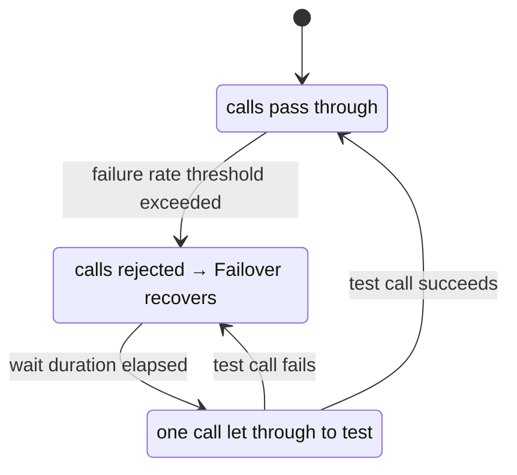

# Execution Resilience Module

`failover-execution-resilience` integrates the Failover framework with [Resilience4j](https://resilience4j.readme.io/) circuit breakers. Instead of a simple try/catch, the upstream call is wrapped in a circuit breaker that trips after repeated failures and rejects calls during the open state.

## Dependency

```xml
<dependency>
    <groupId>com.societegenerale.failover</groupId>
    <artifactId>failover-execution-resilience</artifactId>
    <version>3.0.0</version>
</dependency>
```

Also requires Resilience4j via Spring Cloud Circuit Breaker:

```xml
<dependency>
    <groupId>org.springframework.cloud</groupId>
    <artifactId>spring-cloud-starter-circuitbreaker-resilience4j</artifactId>
</dependency>
```

## Configuration

```yaml
failover:
  type: resilience
```

## How It Works

`ResilienceFailoverExecution` wraps each `@Failover` method call in a Resilience4j circuit breaker identified by the `@Failover(name)`. When the circuit is open, calls are immediately rejected without reaching the upstream — Failover recovery is triggered at that point.



## Resilience4j Configuration

Configure the circuit breaker via standard Resilience4j properties, using the `@Failover(name)` as the circuit breaker instance name:

```yaml
resilience4j:
  circuitbreaker:
    instances:
      country-by-code:                    # matches @Failover(name = "country-by-code")
        registerHealthIndicator: true
        slidingWindowSize: 10
        minimumNumberOfCalls: 5
        permittedNumberOfCallsInHalfOpenState: 3
        automaticTransitionFromOpenToHalfOpenEnabled: true
        waitDurationInOpenState: 10s
        failureRateThreshold: 50
```

## When to Use

Use `type: resilience` when:

- Upstream failures are bursty and you want to stop hammering the failing service during the open state.
- You need circuit state exposed via Spring Boot Actuator health indicators.
- You want integration with Resilience4j's metric and event listeners.

Use `type: basic` (default) when the upstream's own retry/timeout mechanisms are sufficient, or when the added Resilience4j complexity is not justified.
