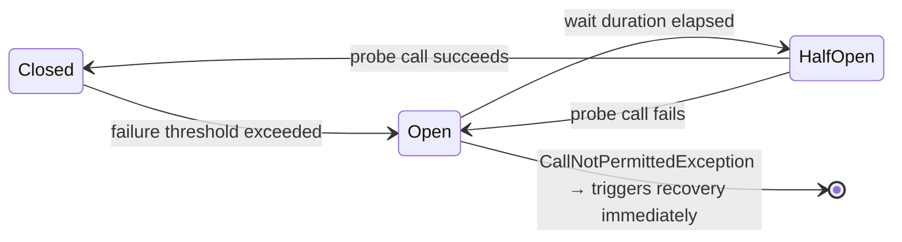

# Execution Resilience

`failover-execution-resilience` wraps upstream calls in a Resilience4j circuit-breaker, providing fast-fail behaviour when an upstream service is repeatedly failing.

---

## Dependency

```xml
<dependency>
    <groupId>com.societegenerale.failover</groupId>
    <artifactId>failover-execution-resilience</artifactId>
    <version>3.0.0</version>
</dependency>
```

!!! warning "Add the Resilience4j starter"
    `failover-execution-resilience` does **not** bundle Resilience4j. Add the Spring Cloud Circuit Breaker starter — it provides the Resilience4j circuit-breaker on the classpath:

    ```xml
    <dependency>
        <groupId>org.springframework.cloud</groupId>
        <artifactId>spring-cloud-starter-circuitbreaker-resilience4j</artifactId>
    </dependency>
    ```

---

## Enable

```yaml title="application.yml"
failover:
  type: resilience
```

With `type: resilience`, `FailoverAspect` uses `ResilienceFailoverExecution` instead of `BasicFailoverExecution`. The circuit-breaker wraps the upstream call before the try/catch handoff to `FailoverHandler`.

---

## Circuit Breaker Behaviour



When the circuit is **Open**, the upstream call is not attempted. `CallNotPermittedException` is thrown immediately and `FailoverHandler.recover` is called — serving the last stored result without hitting the upstream at all.

---

## Resilience4j Configuration

Configure circuit-breaker properties via Spring Cloud's standard configuration:

```yaml title="application.yml"
resilience4j:
  circuitbreaker:
    instances:
      failover:                               # instance name used by the module
        slidingWindowSize: 10
        failureRateThreshold: 50
        waitDurationInOpenState: 30s
        permittedNumberOfCallsInHalfOpenState: 3
```

The default instance name is `failover`. Override by declaring a custom `CircuitBreakerRegistry` bean.

---

## Next Steps

- [Quickstart](../getting-started/quickstart.md) — add the starter dependency
- [Properties Reference](../configuration/properties-reference.md) — `failover.type` configuration
