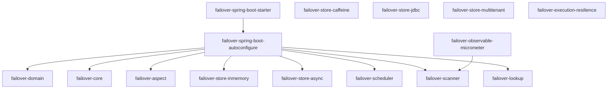

# Modules

Failover is composed of focused modules. The starter pulls everything in — declare individual modules only when you need fine-grained dependency control.

-   :material-cube-outline:{ .lg .middle } **Core Modules**

    ---

    `failover-domain` · `failover-core` · `failover-aspect` — annotation, interfaces, and the AOP interceptor.

    [:octicons-arrow-right-24: Core internals](core.md)

-   :material-database:{ .lg .middle } **JDBC Store**

    ---

    Production-grade persistence — H2, PostgreSQL, MySQL, MariaDB, Oracle, SQL Server.

    [:octicons-arrow-right-24: JDBC store](store-jdbc.md)

-   :material-lightning-bolt:{ .lg .middle } **Caffeine Store**

    ---

    Fast in-process cache backed by Caffeine — ideal for single-node deployments.

    [:octicons-arrow-right-24: Caffeine store](store-caffeine.md)

-   :material-rocket-launch-outline:{ .lg .middle } **Async Store**

    ---

    Non-blocking write decorator using virtual-thread executor — zero read-path latency.

    [:octicons-arrow-right-24: Async store](store-async.md)

-   :material-office-building-outline:{ .lg .middle } **Multi-Tenant Store**

    ---

    `TABLE_PREFIX` or `SCHEMA` strategy routes each request to the correct tenant store.

    [:octicons-arrow-right-24: Multi-tenant](store-multitenant.md)

-   :material-shield-check-outline:{ .lg .middle } **Resilience**

    ---

    Resilience4j circuit-breaker wraps upstream calls. Trips fast on repeated failures.

    [:octicons-arrow-right-24: Resilience integration](execution-resilience.md)

-   :material-clock-outline:{ .lg .middle } **Scheduler**

    ---

    Expiry-cleanup (hourly) and observable-report (daily) scheduled tasks.

    [:octicons-arrow-right-24: Scheduler](scheduler.md)

-   :material-chart-line:{ .lg .middle } **Observability**

    ---

    Startup scanner, Micrometer counters, and health indicator — zero extra config.

    [:octicons-arrow-right-24: Observability](observability.md)

??? note "Full module reference table"

    | Module | Purpose |
    |---|---|
    | `failover-domain` | `@Failover` annotation, `Referential`, `ReferentialAware`, `Metadata` |
    | `failover-core` | All interfaces + default implementations |
    | `failover-aspect` | Spring AOP `@Around` interceptor |
    | `failover-store-inmemory` | `ConcurrentHashMap` store — dev/test only |
    | `failover-store-caffeine` | Caffeine-backed in-process store |
    | `failover-store-jdbc` | JDBC store — H2, PostgreSQL, MySQL, Oracle, MariaDB |
    | `failover-store-async` | Non-blocking write decorator (virtual-thread executor) |
    | `failover-store-multitenant` | TABLE_PREFIX / SCHEMA per-tenant routing |
    | `failover-execution-resilience` | Resilience4j circuit-breaker integration |
    | `failover-scheduler` | Expiry-cleanup + observable-report schedulers |
    | `failover-scanner` | Startup scanner for `@Failover` methods |
    | `failover-lookup` | Spring `BeanFactory` lookups for named `KeyGenerator` / `ExpiryPolicy` / `PayloadSplitter` beans |
    | `failover-observable-micrometer` | Micrometer counters + health indicator |

---

## Next Steps

- [Core](core.md) — key interfaces and the default handler chain
- [Store Types](../configuration/store-types.md) — choosing a backing store
