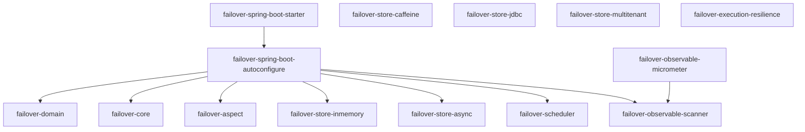

# Modules

Failover is composed of focused modules. The starter pulls everything in — declare individual modules only when you need fine-grained dependency control.

---

| Module | Purpose |
|---|---|
| [failover-domain](core.md) | `@Failover` annotation, `Referential`, `ReferentialAware`, `Metadata` |
| [failover-core](core.md) | All interfaces + default implementations |
| [failover-aspect](core.md) | Spring AOP `@Around` interceptor |
| [failover-store-inmemory](core.md) | `ConcurrentHashMap` store — dev/test only |
| [failover-store-caffeine](store-caffeine.md) | Caffeine-backed in-process store |
| [failover-store-jdbc](store-jdbc.md) | JDBC store — H2, PostgreSQL, MySQL, Oracle, MariaDB |
| [failover-store-async](store-async.md) | Non-blocking write decorator (virtual-thread executor) |
| [failover-store-multitenant](store-multitenant.md) | TABLE_PREFIX / SCHEMA per-tenant routing |
| [failover-execution-resilience](execution-resilience.md) | Resilience4j circuit-breaker integration |
| [failover-scheduler](scheduler.md) | Expiry-cleanup + observable-report schedulers |
| [failover-observable-scanner](observability.md) | Startup scanner for `@Failover` methods |
| [failover-observable-micrometer](observability.md) | Micrometer counters + health indicator |

---

## Next Steps

- [Core](core.md) — key interfaces and the default handler chain
- [Store Types](../configuration/store-types.md) — choosing a backing store
