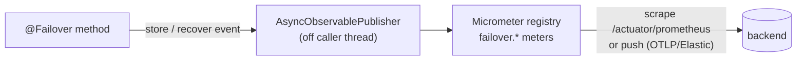
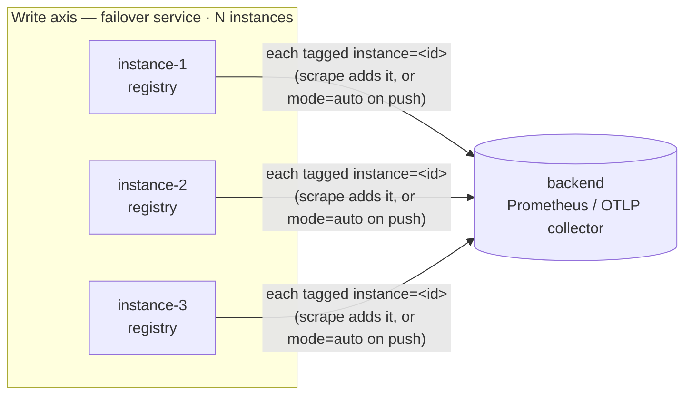
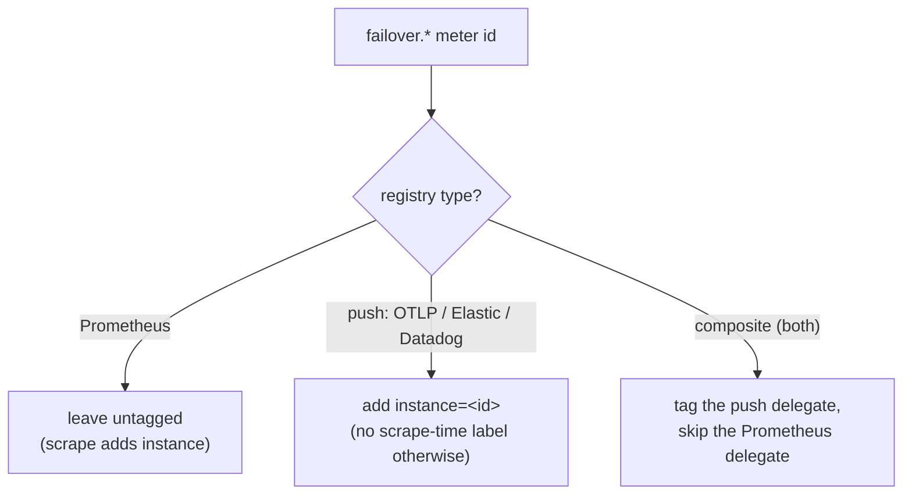

# Observability

Two modules provide observability: `failover-scanner` discovers `@Failover` methods at startup; `failover-observable-micrometer` adds Micrometer counters and a health indicator.

---

## failover-scanner

Walks the Spring `ApplicationContext` at startup, finds all `@Failover`-annotated methods, and registers them with the `ObservablePublisher`.

```xml
<dependency>
    <groupId>com.societegenerale.failover</groupId>
    <artifactId>failover-scanner</artifactId>
    <version>3.0.0</version>
</dependency>
```

At startup, the scanner logs a summary:

```
INFO  FailoverScanner: Discovered 5 @Failover methods:
  - country-by-code    (domain=country, expiry=24h)
  - all-countries      (domain=country, expiry=24h)
  - product-by-id      (expiry=6h)
  - exchange-rates     (expiry=1h)
  - client-profile     (expiry=12h)
```

The scanner also warns when two `@Failover` annotations share a domain but have mismatched expiry configurations.

---

## failover-observable-micrometer

Extends the scanner with Micrometer counters and a Spring Boot Actuator health indicator.

```xml
<dependency>
    <groupId>com.societegenerale.failover</groupId>
    <artifactId>failover-observable-micrometer</artifactId>
    <version>3.0.0</version>
</dependency>
```

Includes `failover-scanner` transitively.

### Micrometer Counter

Counters: `failover.store.total{name, stored}` (one per store) and
`failover.recover.total{name, recovered, recovery_failed}` (one per recover attempt). A `Timer`
`failover.operation.duration{name, action}` records wall time.

Counter name: `failover.recovery.outcome.total` — one event **per intercepted method call**; the
source for the failover / recovery / non-recovery rates. See
[Observability how-to](../how-to/observability.md#failover-recovery-non-recovery-rate-per-method).

| Tag | Values |
|---|---|
| `name` | The `@Failover(name=...)` value |
| `domain` | The `@Failover(domain=...)`, falling back to `name` |
| `method` | The intercepted method as `SimpleClass#method` |
| `outcome` | `recovered`, `not_recovered`, `error` |

Counter name: `failover.store.async.failed` — incremented when an async write fails inside the
executor (the async store layer is otherwise visible only in logs).

| Tag | Values |
|---|---|
| `name` | The `@Failover(name=...)` value |
| `operation` | `store`, `delete`, `cleanByExpiry` |
| `exception_type` | The failure's class name |

### Full meter catalog

All `failover.*` meters (counters keep the `_total` suffix in Prometheus; timers export `_sum`/`_count`/`_max` in seconds; gauges export the bare name). An `instance` tag for cluster attribution is added automatically by `failover.observable.instance.mode` (default **`auto`** — tags push registries like OTLP/Elastic, skips a Prometheus registry since the scrape adds `instance` itself; `always`/`never` override). Configure it on the `@Failover` service; on k8s/Docker set `failover.observable.instance.id=${HOSTNAME}`.

| Meter | Type | Key tags | Meaning |
|---|---|---|---|
| `failover.call.total` | counter | `name`, `domain`, `result` (`success`\|`failover`) | Per-call volume — clean upstream success vs failover triggered. |
| `failover.user.impact.total` | counter | `name`, `domain`, `impact` (`unblocked`\|`blocked`) | **Business signal** — caller got a value (fresh or recovered) vs got nothing. |
| `failover.recovery.outcome.total` | counter | `name`, `domain`, `method`, `outcome` | Recovery breakdown (`recovered`/`not_recovered`/`error`); source of the rates. |
| `failover.recovery.partial.total` | counter | `name`, `method` | Scatter/gather recoveries where some slices were missing. |
| `failover.exception.total` | counter | `name`, `exception_type`, `cause_type`, `final_cause_type` | Which exception (and root cause) triggered failover. |
| `failover.store.total` | counter | `name`, `stored` | Store attempts. |
| `failover.store.async.failed` | counter | `name`, `operation`, `exception_type` | Async store-layer failures. |
| `failover.operation.duration` | timer (+percentile histogram) | `name`, `action` (`store`\|`recover`) | Store/recover path latency → p50/p95/p99. |
| `failover.upstream.duration` | timer (+percentile histogram) | `name`, `result` (`success`\|`failure`) | Latency of the protected upstream call itself. |
| `failover.api.health` | gauge | `name`, `domain` | Recent fraction of calls where the caller got a value (1.0 healthy; lower = users blocked). |
| `failover.stale.served.ratio` | gauge | `name`, `domain` | Recent fraction of calls served from stored (stale) data. |
| `failover.live.entries` | gauge | `name`, `domain` | Current stored entry count (cache footprint). In-memory/Caffeine stores only — absent for JDBC/multi-tenant. |
| `failover.metrics.dropped.total` | counter | — | Metrics dropped because the non-blocking publish queue was full (see [non-blocking](#non-blocking-by-construction)). Active only when async publishing is on. |
| `failover.registered.total` | gauge | — | Number of discovered `@Failover` methods. |
| `failover.config.expiry.seconds` | gauge | `name`, `domain`, `unit` | Configured expiry per failover point. |

**Cardinality:** `name`/`domain`/`action`/`result`/`impact`/`outcome` are low-cardinality enums; exception tags use class names. Never tag with the raw store key or exception messages. A guard (`failover.observable.cardinality`) caps distinct `name` values.

### Health Indicator

Registered at `/actuator/health` under the `failover` component:

```json
{
  "failover": {
    "status": "UP",
    "details": {
      "enabled": "true",
      "type": "BASIC",
      "store.type": "JDBC",
      "store.jdbc.table-prefix": "MYAPP_",
      "scheduler.enabled": "true"
    }
  }
}
```

---

## ObservablePublisher SPI

`AdvancedFailoverHandler` calls `ObservablePublisher.publish(Metrics)` after every store and recover event. Implement this interface to route metrics to any custom sink:

```java
@Component
public class MyPublisher implements ObservablePublisher {
    @Override
    public void publish(Metrics metrics) {
        log.info("failover event: name={} action={} duration={}ns",
            metrics.getName(),
            metrics.get("action"),
            metrics.get("duration-ns"));
    }
}
```

`Metrics.toMap()` returns all key/value pairs collected during the operation.

### Non-blocking by construction

Every `ObservablePublisher` — the built-in ones **and your custom bean** — runs **off the caller's thread**, so publishing can never block or slow the `@Failover` business call. You get this for free; no async code in your publisher.

How: all `ObservablePublisher` beans are gathered into a single `CompositeObservablePublisher`, which is wrapped in an `AsyncObservablePublisher`. The `@Failover` path only ever calls that wrapper — it does a bounded, non-blocking hand-off to a virtual-thread drain worker, and your `publish(...)` runs there. A full queue **drops** the metric (counted as `failover.metrics.dropped.total`) rather than back-pressuring the caller.

Implications for a custom publisher:

- Do **not** assume `publish(...)` runs on the request thread — no `ThreadLocal`/request-scoped state, no MDC unless you set it yourself.
- A slow or failing publisher cannot stall the business call; an exception is logged and the drain loop continues.
- Disable globally for deterministic tests with `failover.observable.async.enabled=false` (publishes synchronously). Tune the buffer with `failover.observable.async.queue-capacity`.

---

## The Write Axis (failover service) — how meters leave the app

The **write axis = the failover service** (the app with `@Failover`). It *emits* `failover.*` meters; it never reads them back. (The **read axis = the dashboard service**, covered in [Dashboard](dashboard.md#the-read-axis-dashboard-service-how-the-dashboard-collects-metrics).) Two stages: (1) the framework records the meter in the local Micrometer registry off the caller thread; (2) a Micrometer exporter ships it to a backend (or Prometheus scrapes it).

### Single instance



One JVM, one registry. The numbers are complete for that JVM. Nothing to attribute — `instance` doesn't matter.

### Multiple instances

Each instance has its **own** registry and emits its **own** `failover.*`. To tell them apart downstream, every series needs an `instance` label — supplied either by Prometheus (scrape) or by the app (push). `failover.observable.instance.mode=auto` does the right thing per backend (tags push, skips Prometheus).



**`mode=auto` per backend:**



### Choosing a Micrometer registry

The framework adds **no** exporter — you choose the backend by putting a Micrometer **registry** on the classpath; Spring Boot auto-configures it and the `failover.*` meters flow through automatically (`failover.observable.instance.mode=auto` adds the per-instance label on push registries, skips it on Prometheus — §The Write Axis). Pick by how the backend ingests metrics:

| Use case | Registry dependency | Model | Notes |
|---|---|---|---|
| Local Prometheus / Grafana | `io.micrometer:micrometer-registry-prometheus` | **scrape** (`/actuator/prometheus`) | Most common; Prometheus adds `instance` at scrape. The dashboard `cluster.mode=prometheus` reads it back via PromQL. |
| Vendor-neutral, one exporter for many backends | `io.micrometer:micrometer-registry-otlp` | **push** (OTLP) | Recommended for multi-backend: app → OpenTelemetry Collector → fan-out to Prometheus / Elastic / Datadog / Grafana Cloud. `mode=auto` tags `instance`. |
| Elastic / ELK | `io.micrometer:micrometer-registry-elastic` | **push** | Metrics into Elasticsearch; pairs with Kibana. |
| Datadog | `io.micrometer:micrometer-registry-datadog` | **push** | Direct to the Datadog API (or via OTLP). |
| New Relic | `io.micrometer:micrometer-registry-new-relic` | **push** | Direct to New Relic. |
| AWS CloudWatch | `io.micrometer:micrometer-registry-cloudwatch2` | **push** | For AWS-native dashboards/alarms. |
| InfluxDB | `io.micrometer:micrometer-registry-influx` | **push** | Time-series DB; Grafana on top. |
| Graphite | `io.micrometer:micrometer-registry-graphite` | **push** (hierarchical) | Legacy/StatsD-style stacks. |
| Dev / tests / embedded dashboard `local` | `SimpleMeterRegistry` (in `micrometer-core`, always present) | in-memory | No export; the dashboard's `local` mode reads this registry directly. |

Notes:

- **No failover module is needed for any of these** — they're plain Micrometer registries the consumer adds. The dashboard's *read* side (`cluster.mode`) is separate from the *write* side (which registry you export with) — and they don't pair 1:1: only Prometheus is read back by the embedded dashboard; for other push backends use the vendor's UI or `shared-store`. See [Pairing the read axis with your backend](dashboard.md#pairing-the-read-axis-with-your-write-axis-backend).
- **Multiple at once:** add several registries and Spring Boot creates a `CompositeMeterRegistry` — `failover.*` is published to all; `mode=auto` tags only the push delegates.
- **Versions** are managed by `spring-boot-dependencies` — declare the `micrometer-registry-*` artifact without a version.
- Spring Boot exposes registry settings under `management.<registry>.metrics.export.*` (e.g. `management.otlp.metrics.export.url`, `management.prometheus.metrics.export.enabled`).

See the Micrometer docs for the full list, configuration, and capabilities of each registry: <https://docs.micrometer.io/micrometer/reference/implementations.html> (and Spring Boot's [metrics export](https://docs.spring.io/spring-boot/reference/actuator/metrics.html#actuator.metrics.export) reference).

---

## Next Steps

- [Observability How-to](../how-to/observability.md) — Prometheus/Grafana setup
- [Dashboard](dashboard.md) — the read axis (single vs cluster) over these meters
- [Scheduler](scheduler.md) — daily report publisher
