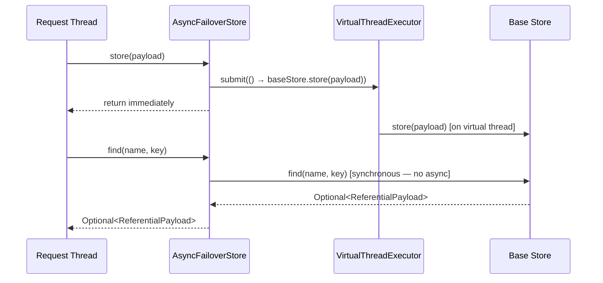

# Async Store

`AsyncFailoverStore` is a transparent decorator that offloads write operations to a virtual-thread executor, keeping the request thread free.

---

## How It Works



**Write operations** (`store`, `delete`, `cleanByExpiry`) run asynchronously on a virtual-thread executor.
**Read operations** (`find`) are always synchronous — they execute on the calling thread.

---

## Configuration

Async mode is enabled by default:

```yaml title="application.yml"
failover:
  store:
    async: true    # default
```

Set `async: false` to make all operations synchronous. Required when:

- Using the `SCHEMA` multi-tenant strategy (thread-local context is lost on executor threads).
- Integration tests that assert on stored state immediately after the annotated method returns.

---

## Virtual Thread Executor

`AsyncFailoverStore` uses a Spring `TaskExecutor` configured with virtual threads (Java 21). The executor is injected by auto-configuration. Override by declaring your own `TaskExecutor` bean named `failoverTaskExecutor`.

---

## Bounding the Executor (back-pressure)

By default the executor is **unbounded** — every submitted write spawns a virtual thread immediately. Under a failure storm (upstream down ⇒ every failed call enqueues an async write) this can spawn unbounded tasks, each potentially holding a pooled JDBC connection, exhausting the pool and the heap.

Set a positive `concurrency-limit` to cap the number of concurrently in-flight writes. Accepted tasks still run on virtual threads — the bound is a `BoundedTaskExecutor` admission guard, not a thread-pool swap. When the limit is reached, `rejection-policy` decides what happens:

```yaml title="application.yml"
failover:
  store:
    async: true
    async-executor:
      concurrency-limit: 256       # 0 (default) = unbounded
      rejection-policy: discard    # discard | caller_runs | abort
```

| Policy | Behaviour at the limit |
|---|---|
| `discard` (default) | Drop the write, log a `WARN`. Non-blocking; stored data is regenerable cache. |
| `caller_runs` | Run the write on the calling thread (back-pressure). Never loses data, but **does not** use a virtual thread and adds latency to the caller. |
| `abort` | Throw `RejectedExecutionException`. |

The scatter/gather executor has the same knobs under `failover.scatter.concurrency-limit` / `failover.scatter.rejection-policy`.

---

## Failure Visibility

Because writes run on a background thread, a failure inside the executor (e.g. DB down, connection
pool exhausted) is caught and logged — it never propagates to the business call. To stop such a
failure from being invisible, `FailoverStoreAsync` also publishes a metric on every executor-side
failure via the `ObservablePublisher`:

- Micrometer counter `failover.store.async.failed{name, operation, exception_type}`.

Alert on any increase — it means failover data is silently not being persisted. See
[Observability](../how-to/observability.md#async-store-failure-counter).

---

## Dependency

`failover-store-async` is included in the starter. It is activated automatically when `failover.store.async=true`.

---

## Next Steps

- [Store Types](../configuration/store-types.md) — choose a backing store
- [Multi-Tenant Store](store-multitenant.md) — async + multitenant interaction
