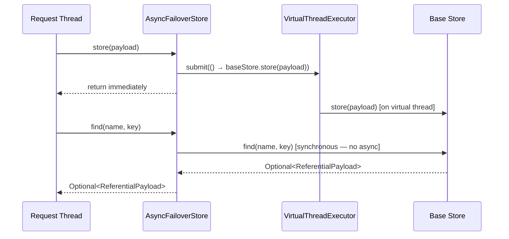

# Async Store

`AsyncFailoverStore` is a transparent decorator that offloads write operations to a virtual-thread executor, keeping the request thread free.

---

## How It Works



**Write operations** (`store`, `delete`, `cleanByExpiry`) run asynchronously on a virtual-thread executor.
**Read operations** (`find`) are always synchronous — they execute on the calling thread.

---

## Configuration

Async mode is enabled by default:

```yaml title="application.yml"
failover:
  store:
    async: true    # default
```

Set `async: false` to make all operations synchronous. Required when:

- Using the `SCHEMA` multi-tenant strategy (thread-local context is lost on executor threads).
- Integration tests that assert on stored state immediately after the annotated method returns.

---

## Virtual Thread Executor

`AsyncFailoverStore` uses a Spring `TaskExecutor` configured with virtual threads (Java 21). The executor is injected by auto-configuration. Override by declaring your own `TaskExecutor` bean named `failoverTaskExecutor`.

---

## Dependency

`failover-store-async` is included in the starter. It is activated automatically when `failover.store.async=true`.

---

## Next Steps

- [Store Types](../configuration/store-types.md) — choose a backing store
- [Multi-Tenant Store](store-multitenant.md) — async + multitenant interaction
