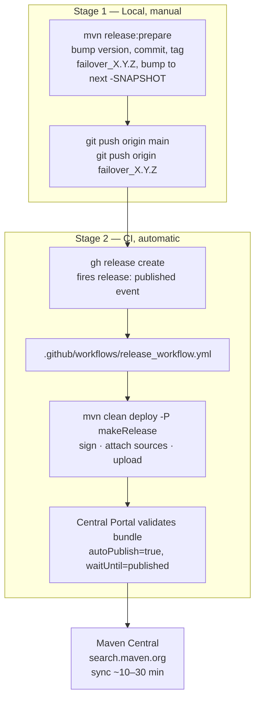
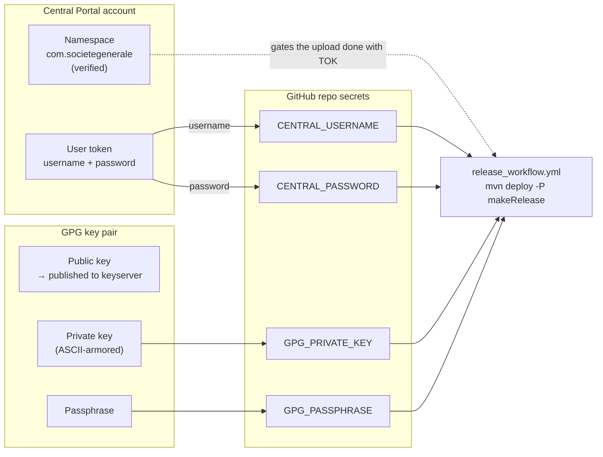
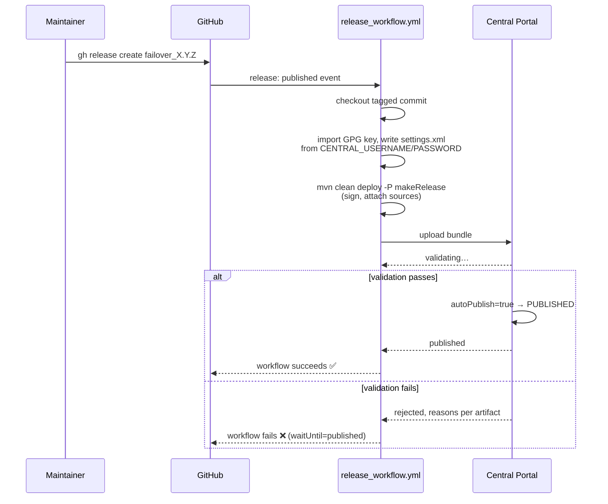

# Release Management

How maintainers cut and publish a new version of Failover to Maven Central.

!!! note "On screenshots"
    This page uses **diagrams** (rendered from Mermaid, native to this site) and **explicit
    click-by-click navigation paths** (`Page → Menu → Button`) everywhere a screenshot would
    otherwise go. Actual screenshots of the Central Portal / GitHub UI aren't included here —
    those are pages on your private accounts, they change their layout over time, and a stale
    screenshot is worse than none. The navigation paths below are kept accurate to the current
    (2026) Central Portal and GitHub UI; if a menu has moved, the surrounding text tells you what
    you're looking for so you can find its new home.

---

## Overview

Releases are a two-stage process, fully decoupled:



**Key fact: pushing the tag does nothing by itself.** Nothing is built or published until a
GitHub Release is *created/published* from that tag — that's the only thing
`release_workflow.yml` listens for (`on: release: types: [published]`).

**Central Portal artifacts are immutable** once they sync to Maven Central. There is no
"unpublish" — a bad release means cutting a new patch version, not fixing the old one in place.

!!! warning "Migrated off OSSRH"
    Publishing used to go through Sonatype OSSRH (`s01.oss.sonatype.org`) with
    `nexus-staging-maven-plugin`. Those hosts are decommissioned and now answer `HTTP 402`, so that
    path can no longer publish anything. The build uses
    [`central-publishing-maven-plugin`](https://central.sonatype.org/publish/publish-portal-maven/)
    against the [Central Portal](https://central.sonatype.com) instead (`extensions=true`, no
    `<distributionManagement>` needed or wanted — one would be ignored at best).

    A Portal **user token** is a distinct credential — old `OSSRH_USERNAME` / `OSSRH_TOKEN`
    values will not authenticate against it, even though the namespace itself was migrated
    automatically. The signing key itself is unchanged; its passphrase secret is `GPG_PASSPHRASE`.

---

## 1. Build verification (do this first, every time)

Before touching version numbers, confirm `main` actually builds clean with acceptable coverage.
Releasing a version that only "mostly" passed CI is how a bad artifact becomes a permanent,
immutable one on Central.

```bash
mvn clean install
```

This runs the full reactor build: compile → unit tests (Surefire) → integration tests (Failsafe,
`*IT.java`, real H2) → the `failover-test-report` coverage aggregation and **gate**.

### What "acceptable coverage" means here

`failover-test-report` runs a JaCoCo `check` goal (`phase=verify`, `haltOnFailure=true`) against
the merged coverage data of every module (`element=BUNDLE`), with four independent minimums —
**the build fails if any one of them drops below 0.95**:

| Counter | Minimum |
|---|---|
| `LINE` | 0.95 |
| `BRANCH` | 0.95 |
| `METHOD` | 0.95 |
| `INSTRUCTION` | 0.95 |

Current levels run around ~99% line / ~97% branch — this gate is a regression floor with
headroom, not a stretch target. If `mvn clean install` fails here, it means a change genuinely
dropped coverage, not that the gate is being pedantic.

The human-readable report lands at:

```
failover-test-report/target/site/jacoco-aggregate/index.html
```

Open that in a browser to see exactly which classes/branches are uncovered before deciding
whether to add a test or accept the drop consciously.

### Quick reference

```bash
# Full build: compile, unit + integration tests, coverage gate
mvn clean install

# Just the aggregate coverage report, without a full reinstall
mvn verify -pl failover-test-report

# Confirm CI is green on main before relying on a local build alone
gh run list --branch main --limit 5
gh run view --branch main   # or open the Actions tab
```

Do not proceed to §3 (prepare the release) on a red or uncertain build.

---

## 2. Prerequisites

Three external systems need to be configured before a release can publish: your **Central
Portal account** (namespace + token), a **GPG signing key**, and the **GitHub repository
secrets** that hand both of those to CI. These are one-time setup, not per-release — but verify
they're still current before every release, since tokens expire and namespace grants can lapse.



### 2.1 Maven Central account & user token

**Signing in.** The Central Portal account for an official org namespace like
`com.societegenerale` should be a **shared/organizational account** (its email + password, not
an individual maintainer's personal Sonatype account) — whoever generates the token in §2.1.3
must be signed into *that* account, since the token and the namespace verification both live on
the account, not on the repo.

> **Navigate:** open <https://central.sonatype.com> → click **Sign In** (top-right) → enter the
> organization's Central Portal email and password (create the account first via **Sign Up** if
> it doesn't exist yet — this is a one-time step done long before any release).

**2.1.1 — Verify the namespace (one-time, do this before anything else in this section)**

> **Navigate:** central.sonatype.com → **Namespaces** (left sidebar, once signed in) → **Add
> Namespace** → enter `com.societegenerale` → submit.

- For a reverse-DNS `com.*` namespace, verification is either:
  - a **DNS TXT record** proving domain ownership of `societegenerale.com` (Central Portal shows
    the exact TXT value to add once you start the request), or
  - Sonatype's **manual review** queue (can take a business day or more — not instantaneous even
    after you submit).
- Check the **status column** in the Namespaces list actually reads **Verified**, not "Pending"
  or "Submitted". A pending request produces exactly this error on deploy, for every module:

  ```
  Namespace 'com.societegenerale.failover' is not allowed
  ```

- Confirm the verified namespace belongs to the **same account** whose token ends up in
  `CENTRAL_USERNAME` / `CENTRAL_PASSWORD` (§2.3). Verifying on a different account than the one
  CI authenticates as fails with the identical error message — easy to mistake for "verification
  hasn't propagated yet" when it's actually the wrong account.

**2.1.2 — Generate a user token**

The Portal uses **user tokens**, not your login password, not old OSSRH/JIRA credentials.

> **Navigate:** central.sonatype.com (signed in) → click your **profile icon** (top-right) →
> **View Account** → **Generate User Token** button.

Copy the generated `<server>` block. It looks like this (values below are placeholders — never
reuse a sample token, always generate your own):

```xml
<server>
  <id>central</id>
  <username>token-username</username>
  <password>token-password</password>
</server>
```

- You will **not** be able to view the password again after leaving the page — regenerate if
  lost, don't try to recover it.
- Store `username` as the `CENTRAL_USERNAME` GitHub secret and `password` as `CENTRAL_PASSWORD`
  (navigation for that is §2.3).

**2.1.3 — Configure Maven locally (only if you'll ever run `mvn deploy -P makeRelease` from your
own machine — CI does this automatically and doesn't need this step)**

Add the same block to `~/.m2/settings.xml`:

```xml
<settings>
  <servers>
    <server>
      <id>central</id>
      <username>token-username</username>
      <password>token-password</password>
    </server>
  </servers>
</settings>
```

The `id` must be exactly `central` — it must match
`<publishingServerId>central</publishingServerId>` in the `makeRelease` profile in `pom.xml`. In
CI, `actions/setup-java` writes this same block into `settings.xml` from the two secrets, so
nobody hand-edits `settings.xml` there.

### 2.2 GPG signing key

Every artifact must be GPG-signed (`maven-gpg-plugin`, bound to the `verify` phase) before
upload — the Portal rejects unsigned bundles.

If the project doesn't already have a signing key, generate one (do this once, reuse across
every release — don't generate a fresh key per release):

```bash
gpg --full-generate-key
# choose RSA and RSA, 4096 bits, key does not expire (or a long expiry — track renewal)

gpg --list-secret-keys --keyid-format=long
# note the key id, e.g. sec   rsa4096/ABCD1234EFGH5678

# publish the public key so Central can verify signatures against it
gpg --keyserver keyserver.ubuntu.com --send-keys ABCD1234EFGH5678

# export the private key as ASCII-armored text — this is what goes in the GitHub secret
gpg --armor --export-secret-keys ABCD1234EFGH5678 > private-key.asc
```

| Output | Goes into | Notes |
|---|---|---|
| Public key | Published to `keyserver.ubuntu.com` | Central's validator fetches it from there to check signatures |
| `private-key.asc` contents | `GPG_PRIVATE_KEY` secret | Raw ASCII-armored text, **not** base64 |
| Key passphrase | `GPG_PASSPHRASE` secret | Whatever you set at key creation |

Delete `private-key.asc` locally once it's in GitHub Secrets — don't leave it on disk or commit
it:

```bash
rm -f private-key.asc
```

Before a release, sanity-check the key hasn't expired and is still resolvable:

```bash
gpg --list-secret-keys --keyid-format=long          # check the expiry date shown
gpg --keyserver keyserver.ubuntu.com --recv-keys <KEYID>   # should succeed from a clean machine
```

In CI, `actions/setup-java`'s `gpg-private-key` input imports the key into the runner's keyring;
`gpg-passphrase: MAVEN_GPG_PASSPHRASE` names the env var the passphrase is exposed under, and the
deploy step sets `MAVEN_GPG_PASSPHRASE` from the `GPG_PASSPHRASE` secret at run time — so the
passphrase is never a `-D` flag and never appears in the process argument list.

### 2.3 GitHub configuration — repository secrets

CI reads four secrets: the two halves of the Central Portal token (§2.1.2) and the two halves of
the GPG key (§2.2). All four are **repository secrets** (not environment or organization
secrets, unless your workflow setup says otherwise).

> **Navigate:** open the repo on GitHub → **Settings** tab (top of the repo, not your profile
> settings) → left sidebar **Secrets and variables** → **Actions** → **Repository secrets** tab
> → **New repository secret** button.

Create each of the following (name must match exactly — these are what
`release_workflow.yml` reads via `${{ secrets.<NAME> }}`):

| Secret name | Value | Source |
|---|---|---|
| `CENTRAL_USERNAME` | Token username | §2.1.2 — Central Portal user token |
| `CENTRAL_PASSWORD` | Token password | §2.1.2 — Central Portal user token |
| `GPG_PRIVATE_KEY` | Contents of `private-key.asc` | §2.2 — GPG key export |
| `GPG_PASSPHRASE` | The key's passphrase | §2.2 — whatever you chose at key creation |

For each: click **New repository secret** → paste the **Name** exactly as above → paste the
**Value** → **Add secret**. GitHub never shows a secret's value again after saving — if you're
unsure a value was pasted correctly, regenerate it at the source (§2.1.2 / §2.2) rather than
guessing, since there's no way to verify it after the fact except by running the workflow.

Requires **admin** (or at least secret-management) access on the repo — not just push access.

### 2.4 Other prerequisites

- **Push access to `main`**, and permission to create GitHub Releases.
- If `main` is a protected/locked branch (rulesets requiring PRs), the account doing the release
  needs **bypass permission** for that ruleset — otherwise `git push origin main` for the release
  commits will be rejected outright. Check under repo **Settings → Rules → Rulesets**.
- **`gh` CLI installed and authenticated** as an account with the above permissions:
  ```bash
  gh auth status
  ```
- **CI green on `main`** — see §1.
- Everything in §2.1–§2.3 already configured and still current — a token can expire, a namespace
  grant can lapse, a GPG key can expire.

---

## 3. Pre-release checklist

Run through **all** of these before `mvn release:prepare`. Most of these are Central Portal
*validation* rules — a failure here doesn't corrupt anything (see §9 Rollback), but it does burn
a release cycle and, if caught late, means rolling back a pushed tag/GitHub Release.

- [ ] **`mvn clean install` passes locally, and CI is green on `main`** (§1).
- [ ] **Namespace verified** on the Central Portal account behind `CENTRAL_USERNAME` (§2.1.1) —
      status is literally "Verified" in the Portal UI, not "Pending".
- [ ] **GPG key not expired**, and its public key is still resolvable from a keyserver Central
      queries (§2.2).
- [ ] **Every module POM has `<name>` and `<description>`.** The root POM's `<name>` does
      **not** inherit to submodules — Maven inheritance skips `<name>`/`<description>`, so each
      submodule `pom.xml` needs its own. Missing this produces `Project name is missing` per
      artifact on deploy. Quick check:

      ```bash
      for d in failover-*/; do
        grep -q "<name>" "$d/pom.xml" || echo "MISSING <name>: $d"
      done
      ```

- [ ] **Root POM has, and every published artifact inherits:**
  - [ ] `<url>` — project URL
  - [ ] `<licenses>` — at least one `<license>` with `<name>`/`<url>`/`<distribution>`
  - [ ] `<developers>` — at least one `<developer>` with `<id>`/`<name>`/`<email>`
  - [ ] `<scm>` — `<url>`, `<connection>`, `<developerConnection>`
  - These four *are* inherited fine from the root POM (unlike `<name>`/`<description>`), but
        confirm no submodule overrides them incorrectly.
- [ ] **No `-SNAPSHOT` dependencies** anywhere in the dependency tree of a module that will be
      published — Central rejects releases that depend on snapshots.
- [ ] **`failover-test-report` is excluded from publish** — it's a coverage aggregator, not a
      consumable artifact (already handled by `<excludeArtifacts>` in the `makeRelease`
      profile's `central-publishing-maven-plugin` config — just confirm it's still there if you
      touch that config).
- [ ] **Working tree is clean**, on `main`, up to date with `origin/main`.
- [ ] Decide the **release version** and **next development version** ahead of time (e.g.
      `3.0.0` → `3.0.1-SNAPSHOT`) so you're not guessing at the `release:prepare` prompt.

---

## 4. Step 1 — Prepare the release

The root `pom.xml` is currently on a `-SNAPSHOT` version. Use the `maven-release-plugin`, already
configured in `pom.xml`:

```bash
mvn release:prepare
```

Prompts for:

- **Release version** — e.g. `1.0.0`
- **SCM tag** — defaults to `failover_1.0.0` (from `tagNameFormat` in `pom.xml`)
- **Next development version** — e.g. `1.0.1-SNAPSHOT`

Because `autoVersionSubmodules=true`, every submodule is bumped together — you're only asked
once, not per module.

Because `pushChanges=false`, this step only commits and tags **locally**. Nothing is pushed to
`origin` yet. Verify before going further:

```bash
git log --oneline -3      # two new [maven-release-plugin] commits
git tag -l "*<version>*"  # tag exists locally
git status --short        # clean
```

Non-interactive, when you already know both versions:

```bash
mvn -B release:prepare \
  -DreleaseVersion=1.0.0 \
  -DdevelopmentVersion=1.0.1-SNAPSHOT \
  -Dtag=failover_1.0.0
```

Clean up the `*.releaseBackup` files the plugin leaves behind (harmless, just noise):

```bash
rm -f pom.xml.releaseBackup failover-*/pom.xml.releaseBackup release.properties
```

!!! tip "Manual alternative"
    If you'd rather not use the release plugin's interactive flow:

    ```bash
    mvn versions:set -DnewVersion=1.0.0 -DprocessAllModules=true
    mvn versions:commit
    git commit -am "release: 1.0.0"
    git tag failover_1.0.0

    mvn versions:set -DnewVersion=1.0.1-SNAPSHOT -DprocessAllModules=true
    mvn versions:commit
    git commit -am "chore: next dev version 1.0.1-SNAPSHOT"
    ```

If something goes wrong before pushing, roll back cleanly:

```bash
mvn release:rollback
```

---

## 5. Step 2 — Push the commits and tag

```bash
git push origin main
git push origin failover_1.0.0
```

The tag name must match the `failover_<version>` pattern — that's what `tagNameFormat` produces
and what release notes/automation expect. Nothing publishes yet — this only moves the tag and
commits to GitHub.

---

## 6. Step 3 — Create the GitHub Release (this is the actual trigger)

Creating a GitHub Release from the pushed tag is what actually triggers the publish workflow.

> **Navigate (UI path):** repo on GitHub → **Releases** (right sidebar of the repo home page, or
> `/releases`) → **Draft a new release** → **Choose a tag** → select the tag just pushed
> (`failover_1.0.0`) → fill in release notes (or click **Generate release notes**) → **Publish
> release** (not "Save draft" — a draft does *not* fire the workflow).

Or via CLI:

```bash
gh release create failover_1.0.0 --generate-notes
```

This fires the `release: published` event, which `release_workflow.yml` listens for
(`on: release: types: [published]`). **This is the point of no return** for anything that
successfully validates — treat it as the irreversible step, not the tag push.

---

## 7. Step 4 — What CI does automatically



On `release: published`, [`release_workflow.yml`](https://github.com/societe-generale/failover/blob/main/.github/workflows/release_workflow.yml):

1. Checks out the tagged commit.
2. Sets up JDK 21 (Temurin) via `actions/setup-java`, which imports the GPG secret key
   (`GPG_PRIVATE_KEY`) and writes a `<server id="central">` block into `settings.xml` from the
   `CENTRAL_USERNAME` / `CENTRAL_PASSWORD` secrets. That id must match
   `<publishingServerId>central</publishingServerId>` in the `makeRelease` profile.
3. Runs:

   ```bash
   mvn --no-transfer-progress --batch-mode clean deploy -P makeRelease
   ```

   The GPG passphrase (`GPG_PASSPHRASE` secret) is passed as the `MAVEN_GPG_PASSPHRASE`
   environment variable rather than `-Dgpg.passphrase=…`, so it never appears in the process
   argument list.

The `makeRelease` Maven profile additionally:

- Attaches a `-sources` jar (`maven-source-plugin`) per module.
- GPG-signs every artifact during the `verify` phase (`maven-gpg-plugin`).
- Uploads the bundle to the Central Portal and **auto-publishes** it once validation passes
  (`central-publishing-maven-plugin`, `autoPublish=true`) — no manual step in the Portal UI is
  needed. `waitUntil=published` makes the build block on validation, so a rejected bundle
  **fails the workflow** instead of passing green with nothing actually published.

There is no `<distributionManagement>` in the POM: the plugin's `extensions=true` replaces the
default deploy target with the Portal upload. Adding one back would be ignored at best.

One release publish runs at a time (`concurrency: release-${{ github.ref }}`,
`cancel-in-progress: false`) — a re-triggered event won't race a run already in flight.

### Full workflow, for reference

```yaml
name: Publish package to the Maven Central Repository

on:
  release:
    types: [ published ]

# Least-privilege: deployment to Maven Central uses the Central Portal token + GPG secrets, not GITHUB_TOKEN,
# so the workflow only needs to read the repository contents.
permissions:
  contents: read

# Force JS actions onto Node.js 24 ahead of the Node 20 removal (Sep 2026).
env:
  FORCE_JAVASCRIPT_ACTIONS_TO_NODE24: true

# One release publish at a time: Central artifacts are immutable (see docs/support/release-management.md),
# so a stray concurrent run from a re-triggered release event would only race or duplicate work, never help.
concurrency:
  group: release-${{ github.ref }}
  cancel-in-progress: false

jobs:
  publish:
    runs-on: ubuntu-latest
    # makeRelease's waitUntil=published blocks on Central Portal validation; cap the hang instead of
    # letting a stalled Portal run out the default 6h job timeout.
    timeout-minutes: 30
    steps:
      - name: Checkout sources
        uses: actions/checkout@v5

      # server-id must match <publishingServerId>central</publishingServerId> in the root pom's
      # 'makeRelease' profile — setup-java writes the matching <server> block into settings.xml.
      # gpg-private-key imports the signing key into the runner's keyring directly (raw ASCII-armored
      # key, not base64 — GPG_PRIVATE_KEY must be stored that way, unlike the old OSSRH_GPG_SECRET_KEY).
      # gpg-passphrase names the env var maven-gpg-plugin reads the passphrase from at deploy time;
      # set as a real value only in the deploy step below, never inline here.
      - name: Set up JDK with GPG
        uses: actions/setup-java@v5
        with:
          distribution: temurin
          java-version: '21'
          gpg-private-key: ${{ secrets.GPG_PRIVATE_KEY }}
          gpg-passphrase: MAVEN_GPG_PASSPHRASE
          server-id: central
          server-username: CENTRAL_USERNAME
          server-password: CENTRAL_PASSWORD

      # CENTRAL_USERNAME / CENTRAL_PASSWORD hold a Central Portal *user token*, generated at
      # https://central.sonatype.com/account. The retired OSSRH credentials do not authenticate
      # against the Portal.
      - name: Build & Deploy
        run: mvn --no-transfer-progress --batch-mode clean deploy -P makeRelease
        env:
          CENTRAL_USERNAME: ${{ secrets.CENTRAL_USERNAME }}
          CENTRAL_PASSWORD: ${{ secrets.CENTRAL_PASSWORD }}
          # Passed as an env var rather than -Dgpg.passphrase so the passphrase never appears in the
          # process argument list; maven-gpg-plugin 3.x reads MAVEN_GPG_PASSPHRASE natively.
          MAVEN_GPG_PASSPHRASE: ${{ secrets.GPG_PASSPHRASE }}
```

Kept here so this doc is self-contained; if you edit the real workflow file, update this copy
too — the file in `.github/workflows/` always wins as source of truth.

Trigger note: this listens for `release: published`, not `created`. `gh release create` (no
`--draft`) publishes immediately, so it fires either way — but if you ever draft a release via
the UI and publish it later, the workflow fires on that later "Publish release" click, not on
draft creation.

---

## 8. Step 5 — Verify

- **Actions tab** — navigate: repo → **Actions** (top nav) → find the `Publish package to the
  Maven Central Repository` run → it must complete successfully (green).
- **Central Portal deployments view** — navigate:
  <https://central.sonatype.com/publishing/deployments> (signed into the same account as
  `CENTRAL_USERNAME`) — the bundle must reach status **PUBLISHED**, not stall in `VALIDATING` or
  land in `FAILED`.
- **Maven Central search** — <https://search.maven.org/> → search `com.societegenerale.failover`.
  Sync typically takes 10–30 minutes after publish.
- Confirm the GitHub Release notes and tag look correct (repo → **Releases**).

```bash
gh run list --workflow=release_workflow.yml --limit 3
gh run watch                          # follow the in-progress run
```

---

## 9. Rollback / troubleshooting

### 9a. Failed before push (Step 1 only ran)

```bash
mvn release:rollback
```

Reverts the version-bump commits with a new commit (does not rewrite history). Nothing was
pushed, so this is entirely local and safe.

### 9b. Failed after push, but before/during CI deploy (the common case — e.g. Central rejected
the bundle on namespace or POM metadata grounds)

Nothing is published to Central in this case — `waitUntil=published` means a rejected bundle
fails the workflow with nothing landing on Central. The GitHub Release and tag exist, but they
don't correspond to anything live. Roll all three of {local commits, pushed tag, GitHub Release}
back:

```bash
# 1. Revert version commits locally (adds a new commit, doesn't rewrite history)
mvn release:rollback

# 2. Push the rollback commit
git push origin main

# 3. Delete the now-meaningless remote tag
git push origin --delete failover_1.0.0

# 4. Delete the GitHub Release (it points at a deploy that never published)
gh release delete failover_1.0.0 --yes
```

Verify clean state afterward:

```bash
git log --oneline -3          # rollback commit on top
git tag -l "*1.0.0*"          # gone locally
git ls-remote --tags origin | grep 1.0.0   # gone remotely
gh release list --limit 5     # gone from GitHub
grep -m1 "<version>" pom.xml  # back to previous -SNAPSHOT
```

### 9c. Already synced to Maven Central

**Central artifacts are immutable.** There is no rollback. Cut a new patch version instead
(`1.0.1`, not a corrected `1.0.0`).

### 9d. Fix and retry

1. Diagnose using the table below.
2. Fix the root cause (POM metadata, secret, namespace, etc.) and **commit that fix to `main`
   first**, separately from the release commits — don't bundle a source fix into a
   `release:prepare` commit.
3. Re-run from §4 with the *same* release version if nothing of that version ever reached
   Central (safe to reuse — see §9b), or the next patch version if something did publish
   (§9c).

### Troubleshooting table

| Problem | Fix |
|---|---|
| `release:prepare` fails mid-way (before push) | `mvn release:rollback`, fix, retry |
| `Namespace '...' is not allowed` | Namespace not verified on the Central Portal account behind the CI token, or verification still pending manual review. Check status is literally "Verified" at central.sonatype.com → Namespaces (§2.1.1), on the *same account* whose token is in `CENTRAL_USERNAME`/`CENTRAL_PASSWORD`. Pending ≠ verified. |
| `Project name is missing` (per-artifact) | Submodule POM has no `<name>` — root's `<name>` doesn't inherit. Add `<name>` (and `<description>`) to every submodule `pom.xml` (§3 checklist). |
| Bundle uploads but validation fails on other POM metadata | Missing `-sources`/`-javadoc` jar, or missing `<licenses>`/`<developers>`/`<scm>`/`<url>`. Open the deployment in the [Portal](https://central.sonatype.com/publishing/deployments) for the exact per-artifact reason; cross-check against §3 checklist. |
| Workflow fails on GPG import/signing | `GPG_PRIVATE_KEY` expired, revoked, or malformed (must be raw ASCII-armored text, not base64). Regenerate/re-export the key (§2.2), update the secret (§2.3). |
| Workflow fails on deploy with `401`/`403` | Central Portal token wrong or expired. Regenerate the user token (§2.1.2), update `CENTRAL_USERNAME`/`CENTRAL_PASSWORD` (§2.3). An old OSSRH credential will never authenticate here. |
| Workflow fails on deploy with `402` | Something still points at the retired OSSRH hosts — grep the POM and workflow for `oss.sonatype.org`. |
| `git push origin main` rejected | Account lacks bypass permission on a protected `main` (§2.4). |
| Wrong version pushed, not yet published | Typo'd version, wrong tag. Delete the GitHub Release and tag, fix, re-tag, re-release (§9b). |
| Already synced to Central | Immutable; cut a new patch version (§9c). |

---

## 10. All commands, start to finish

Copy/paste reference. Set `VERSION` and `NEXT_VERSION` once at the top and every later command
just works. Covers the full happy path plus the rollback branch — skip the rollback block unless
something actually failed.

```bash
# ============================================================
# 0. SETUP — one-time per machine/account, not per release
# ============================================================

# Central Portal user token (browser, not a command — see §2.1):
#   https://central.sonatype.com/account -> "Generate User Token"
#   -> copy the <server> block it gives you, store as GitHub repo secrets:
#      CENTRAL_USERNAME = <username from token>
#      CENTRAL_PASSWORD = <password from token>

# Verify the namespace this project publishes under (browser, §2.1.1):
#   https://central.sonatype.com -> Namespaces -> com.societegenerale
#   Status column must read "Verified", not "Pending" — check this EVERY time
#   before a release, verification can silently lapse or the wrong account can
#   end up holding it.

# GPG signing key (generate once, reuse across releases — §2.2):
gpg --full-generate-key                                    # RSA 4096, no/long expiry
gpg --list-secret-keys --keyid-format=long                 # note the key id
gpg --keyserver keyserver.ubuntu.com --send-keys <KEYID>    # publish public key
gpg --armor --export-secret-keys <KEYID> > private-key.asc  # for the GitHub secret

# Store as GitHub repo secrets (§2.3), then delete the local file:
#   GPG_PRIVATE_KEY = <contents of private-key.asc>
#   GPG_PASSPHRASE  = <the passphrase you set>
rm -f private-key.asc


# ============================================================
# 1. BUILD VERIFICATION + PRE-RELEASE CHECKLIST — every time (§1, §3)
# ============================================================

# full build, tests, coverage gate (0.95 line/branch/method/instruction)
mvn clean install

# CI green on main?
gh run list --branch main --limit 5

# every submodule pom.xml has <name>? (root's <name> does NOT inherit to children)
for d in failover-*/; do
  grep -q "<name>" "$d/pom.xml" || echo "MISSING <name>: $d"
done

# working tree clean, on main, up to date with origin
git status --short
git fetch origin
git log origin/main..HEAD --oneline   # should be empty
git log HEAD..origin/main --oneline   # should be empty


# ============================================================
# 2. PREPARE — local only, nothing pushed yet (§4)
# ============================================================

VERSION=1.0.0
NEXT_VERSION=1.0.1-SNAPSHOT

mvn -B release:prepare \
  -DreleaseVersion="$VERSION" \
  -DdevelopmentVersion="$NEXT_VERSION" \
  -Dtag="failover_$VERSION"

# sanity check before pushing anything
git log --oneline -3                  # two new [maven-release-plugin] commits on top
git tag -l "*$VERSION*"               # tag exists locally
git status --short                    # clean

# release plugin leaves harmless backup files behind — clean them up
rm -f pom.xml.releaseBackup failover-*/pom.xml.releaseBackup release.properties


# ============================================================
# 3. PUSH — commits and tag go to GitHub (still not published to Central) (§5)
# ============================================================

git push origin main
git push origin "failover_$VERSION"


# ============================================================
# 4. PUBLISH TRIGGER — creating the GitHub Release fires CI deploy (§6)
#    (this is the actual point of no return, not the tag push)
# ============================================================

gh release create "failover_$VERSION" --generate-notes


# ============================================================
# 5. VERIFY — watch it land (§8)
# ============================================================

gh run list --workflow=release_workflow.yml --limit 3
gh run watch                          # follow the in-progress run
# then check:
#   https://central.sonatype.com/publishing/deployments   -> status = PUBLISHED
#   https://search.maven.org/  search "com.societegenerale.failover"  (10-30 min sync delay)


# ============================================================
# 6. ROLLBACK — only if something failed (validation error, wrong version, etc.) (§9)
#    Safe as long as the deployment never reached PUBLISHED on Central.
# ============================================================

# 6a. failed during `release:prepare`, nothing pushed yet
mvn release:rollback

# 6b. failed after push / after CI deploy rejected the bundle
mvn release:rollback                              # new commit reverting the version bump
git push origin main                              # push the rollback commit
git push origin --delete "failover_$VERSION"      # remove the now-meaningless tag
gh release delete "failover_$VERSION" --yes        # remove the GitHub Release, if created

# confirm clean state
git log --oneline -3
git tag -l "*$VERSION*"                            # gone locally
git ls-remote --tags origin | grep "$VERSION"      # gone remotely
gh release list --limit 5                          # gone from GitHub
grep -m1 "<version>" pom.xml                       # back to previous -SNAPSHOT

# 6c. already PUBLISHED on Central — do NOT try to roll back or delete.
#     Central artifacts are immutable. Bump VERSION to the next patch and
#     start again from section 2.
```

---

## 11. Reference

- Release trigger workflow: `.github/workflows/release_workflow.yml`
- Version/tag/profile config: root `pom.xml` — `maven-release-plugin` config (`tagNameFormat`,
  `autoVersionSubmodules`, `pushChanges`) and the `makeRelease` profile
- Coverage gate config: `failover-test-report/pom.xml` — `jacoco-maven-plugin`,
  `check-overall-coverage` execution
- Tag naming convention: `failover_<version>` (e.g. `failover_1.0.0`)
- Central Portal: <https://central.sonatype.com>
- Central Portal deployments view: <https://central.sonatype.com/publishing/deployments>
- Maven Central search: <https://search.maven.org/>

---

## Incident log

Real attempts against this repo, kept here as worked examples of §9.

**Attempt 1 — `failover_3.0.0`, first try.** Deploy failed Central Portal validation on *every*
module with both `Namespace 'com.societegenerale.failover' is not allowed` and `Project name is
missing`. Nothing published. Rolled back per §9b (`release:rollback`, push, delete remote tag —
no GitHub Release had been created yet at that point). Root-caused: none of the 19 submodule
POMs had `<name>`/`<description>` (root's doesn't inherit), and the Central Portal namespace had
never been verified.

**Fix applied**: added `<name>`/`<description>` to all 19 submodule POMs (commit
`fix: add missing <name>/<description> to submodule POMs`), pushed to `main`.

**Attempt 2 — `failover_3.0.0`, retry after namespace "verified".** `Project name is missing`
errors gone (confirms the POM fix worked). `Namespace ... is not allowed` still fired on every
module, despite the namespace having been reported as verified. Nothing published — rolled back
again per §9b, including deleting the GitHub Release this time since one had been created.
Working theory: verification was still pending Sonatype's review queue rather than fully
approved, or the verified account differs from the account behind `CENTRAL_USERNAME`. Needs
confirmation directly in the Central Portal UI (§2.1.1) before a third attempt.