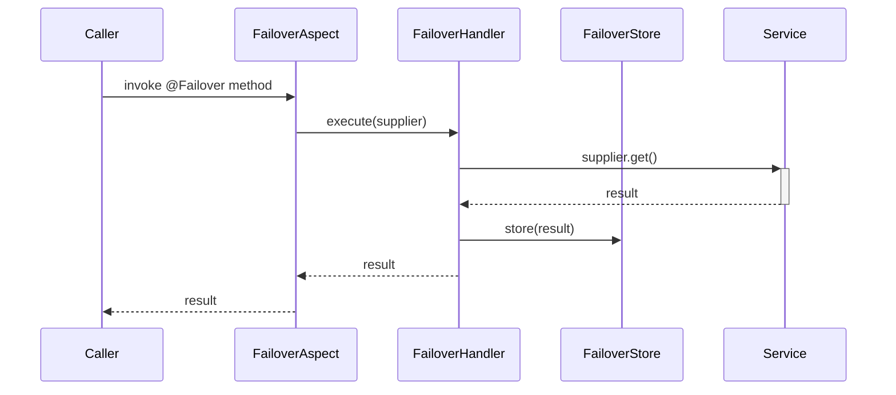

# Documentation Revamp Plan

## Recommended Stack: MkDocs + Material for MkDocs + Aggregate Javadoc

Best fit for a multi-module Java library: beautiful Material Design, instant search, dark/light mode,
versioning, zero JS framework overhead. Used by FastAPI, SQLAlchemy, Pydantic, and hundreds of major OSS projects.

---

## Phase 0 — Foundation Setup
- analyze the current codebase and come up with a clean and detail documentations.
- do not refer existing documentation (refer only for code snippets) and write the documentation as if you are writing for the first time.
- Only if you need any additional context, or for ADR - you can refer the existing documentation. but always verify it with the latest code base before writing the documentation.
- Use nice icons , graphical representations, and code snippets to make the documentation more engaging and easier to understand wherever possible.
- Make sure to cover all the important aspects of the codebase, including architecture, design decisions, and usage examples.
- Make sure to write the documentation in a clear and concise manner, avoiding technical jargon and using simple language that can be easily understood by developers of all levels.
- Make sure to include a section on how to contribute to the project, including guidelines for submitting pull requests and reporting issues.
- Make sure to include a section on how to get help, including links to the project's support channels and documentation resources.
- Make sure to include a section on how to stay up-to-date with the project, including links to the project's social media channels and mailing list.
- Make sure to include a section on how to report security vulnerabilities, including guidelines for responsible disclosure and contact information for the project's security team.
- Make sure to include a section on how to license the project, including information on the project's license and how to comply with it.


## Phase 1 — Foundation Setup

### 1.1 Install toolchain

```bash
pip install mkdocs-material mkdocs-minify-plugin mkdocs-git-revision-date-localized-plugin
```

### 1.2 Root `mkdocs.yml`

```yaml
site_name: Failover
site_url: https://societegenerale.github.io/failover
repo_url: https://github.com/societegenerale/failover
repo_name: societegenerale/failover

theme:
  name: material
  palette:
    - scheme: default
      toggle: { icon: material/brightness-7, name: Dark mode }
    - scheme: slate
      toggle: { icon: material/brightness-4, name: Light mode }
  features:
    - navigation.tabs
    - navigation.sections
    - navigation.indexes
    - navigation.top
    - search.highlight
    - search.suggest
    - content.code.copy
    - content.tabs.link

plugins:
  - search
  - minify
  - git-revision-date-localized

markdown_extensions:
  - admonition
  - pymdownx.details
  - pymdownx.superfences
  - pymdownx.tabbed: { alternate_style: true }
  - pymdownx.highlight: { anchor_linenums: true }
  - attr_list
  - md_in_html
  - tables
```

### 1.3 `docs/` directory layout

```
docs/
├── index.md                        # Landing page
├── getting-started/
│   ├── index.md                    # Overview
│   ├── installation.md             # Maven/Gradle deps
│   └── quickstart.md               # 5-minute example
├── concepts/
│   ├── index.md
│   ├── how-it-works.md             # Store/recover lifecycle diagram
│   ├── expiry.md                   # Expiry policies
│   ├── key-generation.md
│   └── scatter-gather.md           # ADR-23 feature
├── configuration/
│   ├── index.md
│   ├── properties-reference.md     # All failover.* properties
│   ├── store-types.md              # INMEMORY/CAFFEINE/JDBC/CUSTOM
│   └── multi-tenant.md
├── modules/
│   ├── core.md
│   ├── store-jdbc.md
│   ├── store-caffeine.md
│   ├── store-async.md
│   ├── store-multitenant.md
│   ├── execution-resilience.md
│   └── scheduler.md
├── guides/
│   ├── custom-key-generator.md
│   ├── custom-expiry-policy.md
│   ├── custom-payload-enricher.md
│   ├── context-propagation.md      # TenantContext / MDC / Micrometer
│   └── reporting.md
├── adr/                            # Architecture Decision Records (single file, immutable)
│   ├── index.md                    # Single file — copy of docs/documentation/ADR.md with upgraded headings
│   └── adr.md
├── api/
│   └── index.md                    # Links into generated Javadoc
├── contributing.md                 # How to contribute
├── about.md                        # About the project and team
├── support.md                      # Queries, issues, discussions
└── changelog.md
```

---

---

## Phase 2 — ADR Integration

### 2.1 Source file

ADRs live in `docs-old/documentation/ADR.md`. This file is **immutable** — content is never edited,
only appended. Copy it verbatim into the MkDocs tree as a single page:

```
├── adr/                            # Architecture Decision Records (single file, immutable)
│   ├── index.md                    # Single file — copy of docs/documentation/ADR.md with upgraded headings
│   └── adr.md
```

No splitting, no scripting. One file, one nav entry.

### 2.2 Upgrade headings for MkDocs navigation

The only change permitted: promote each numbered ADR heading one level so MkDocs generates
in-page anchor links and a right-side table-of-contents panel.

Current:
```markdown
## 1. Build a failover lib
#### Status
#### Context
```

After (heading levels +1 for ADR titles only):
```markdown
# Architecture Decision Records

## ADR 1 — Build a failover lib
### Status
### Context
```

This produces a clean right-panel TOC with all 25 ADRs visible when the page is open,
and `#adr-1-build-a-failover-lib` anchor URLs for deep-linking.
All body content — context, decision, consequences, code blocks — is preserved exactly.

### 2.3 Editorial policy (add as callout at top of `docs/adr.md`)

```markdown
!!! info "Immutable history"
    ADRs are append-only. Once accepted, content is never changed.
    Superseded decisions are marked **Deprecated** with a cross-reference.
    New decisions always get the next sequential number.
```

### 2.4 `mkdocs.yml` nav entry

```yaml
nav:
  - Home: index.md
  - Getting Started: ...
  - Concepts: ...
  - Configuration: ...
  - Modules: ...
  - Guides: ...
  - Architecture Decisions: adr.md
  - API Reference: api/index.md
  - Changelog: changelog.md
```

---

## Phase 4 — Javadoc Integration

### 2.1 Aggregate Javadoc via Maven

Add to root `pom.xml`:

```xml
<plugin>
  <groupId>org.apache.maven.plugins</groupId>
  <artifactId>maven-javadoc-plugin</artifactId>
  <executions>
    <execution>
      <id>aggregate</id>
      <goals><goal>aggregate</goal></goals>
      <phase>site</phase>
    </execution>
  </executions>
  <configuration>
    <outputDirectory>${project.basedir}/docs/api/javadoc</outputDirectory>
    <reportOutputDirectory>${project.basedir}/docs/api/javadoc</reportOutputDirectory>
    <stylesheetfile>${project.basedir}/docs/assets/javadoc.css</stylesheetfile>
  </configuration>
</plugin>
```

### 2.2 Modern Javadoc theme

Override the built-in Java 21 Javadoc stylesheet (`docs/assets/javadoc.css`) to match the
Material theme visually — same font (Inter), same colour tokens, same code block style.

### 2.3 `docs/api/index.md`

```markdown
# API Reference

The full Javadoc for all modules is available in the embedded reference below.

[Open full-screen Javadoc](javadoc/index.html){ .md-button .md-button--primary }

<iframe src="javadoc/index.html" style="width:100%;height:800px;border:none;"></iframe>
```

---

## Phase 5 — Content Writing (Priority Order)

| Priority | Page | Notes |
|---|---|---|
| P0 | `getting-started/quickstart.md` | Working `@Failover` example end-to-end |
| P0 | `concepts/how-it-works.md` | Sequence diagram (store → recover flow) |
| P0 | `configuration/properties-reference.md` | Auto-generated from `@ConfigurationProperties` |
| P1 | `concepts/scatter-gather.md` | New feature, poorly documented elsewhere |
| P1 | `modules/*.md` | Dep coordinates + configuration per module |
| P1 | `guides/context-propagation.md` | Tenant / MDC / Micrometer patterns |
| P2 | All remaining guides | |

### Diagrams with Mermaid

Enable Mermaid in `mkdocs.yml`:

```yaml
markdown_extensions:
  - pymdownx.superfences:
      custom_fences:
        - name: mermaid
          class: mermaid
          format: !!python/name:pymdownx.superfences.fence_code_format
```

Example sequence diagram for `concepts/how-it-works.md`:

````markdown

````

---

## Phase 6 — Properties Reference Auto-Generation

Use `spring-configuration-metadata.json` (generated by Spring's annotation processor) plus a small
Python script to render the properties table into Markdown automatically on every build:

```python
# scripts/gen_properties.py
import json

with open("failover-spring-boot-autoconfigure/target/classes/META-INF/spring-configuration-metadata.json") as f:
    data = json.load(f)

lines = ["| Property | Type | Default | Description |", "|---|---|---|---|"]
for prop in sorted(data["properties"], key=lambda p: p["name"]):
    lines.append(
        "| `{}` | `{}` | `{}` | {} |".format(
            prop["name"],
            prop.get("type", ""),
            prop.get("defaultValue", ""),
            prop.get("description", ""),
        )
    )
print("\n".join(lines))
```

Plug into MkDocs via `mkdocs-gen-files` plugin so it runs on every `mkdocs serve` and `mkdocs build`.

---

## Phase 7 — CI/CD (GitHub Actions)

Create `.github/workflows/docs.yml`:

```yaml
name: Publish Docs
on:
  push:
    branches: [main]
jobs:
  deploy:
    runs-on: ubuntu-latest
    steps:
      - uses: actions/checkout@v4
        with: { fetch-depth: 0 }
      - uses: actions/setup-java@v4
        with: { java-version: '21', distribution: temurin }
      - name: Generate aggregate Javadoc
        run: mvn javadoc:aggregate -q
      - uses: actions/setup-python@v5
        with: { python-version: '3.x' }
      - run: pip install mkdocs-material mkdocs-minify-plugin mkdocs-git-revision-date-localized-plugin
      - run: mkdocs gh-deploy --force
```

---

## Phase 8 — Search Enhancement

Material's built-in search covers all Markdown content.
For Javadoc search, two options:

| Option | Description | Effort |
|---|---|---|
| **A — iframe** | Keep Javadoc iframe with its own built-in search | Zero |
| **B — Algolia DocSearch** | Free for open source; crawls deployed site; surfaces Javadoc pages in same search box as guides | Low — submit form at docsearch.algolia.com |

Recommendation: start with Option A, migrate to B after site is live and indexed.

---

---

## Phase 9 — Community Pages

### 9.1 `docs/contributing.md` — How to Contribute

Content:

```markdown
# Contributing

## Prerequisites
- JDK 21+
- Maven 3.9+

## Build

```bash
mvn clean verify
```

## Run tests

```bash
mvn test
```

## Submitting a change

1. Fork the repository.
2. Create a branch: `git checkout -b feat/my-change`.
3. Make changes — keep scope small and focused.
4. Add or update tests for the changed behaviour.
5. Run `mvn verify` — all tests and Javadoc must pass with zero errors.
6. Open a pull request against `main`. Fill in the PR template.

## Coding conventions
- Java 21, Spring Boot 3.x idioms.
- Every public type and method must have a Javadoc description.
- New architecture decisions → append a new ADR to `docs/documentation/ADR.md`.
- No breaking changes to public API without a deprecation cycle and a new ADR.

## Reporting a bug
Open a [GitHub Issue](https://github.com/societegenerale/failover/issues/new?template=bug_report.md)
with steps to reproduce, expected vs actual behaviour, and your Spring Boot / Java version.

## Proposing a feature
Open a [GitHub Issue](https://github.com/societegenerale/failover/issues/new?template=feature_request.md)
describing the use case. Large changes should start as a discussion before any code is written.
```

### 9.2 `docs/about.md` — About

Content:

```markdown
# About

**Failover** is an open-source Spring Boot library built at [Société Générale](https://www.societegenerale.com)
to provide transparent failover for referential data — services that depend on external APIs or
internal referentials that change slowly and where brief service degradation is preferable to
complete unavailability.

## Origins
The library was born from a recurring resilience problem across Société Générale's platforms:
dozens of services share dependencies on the same small set of referential systems, and a single
unavailability event cascades into widespread impact. Rather than solve this N times with
bespoke try/catch logic, the team built a reusable, annotation-driven solution. See
[ADR 1](adr.md#1-build-a-failover-lib) for the founding decision.

## Maintainers
| Name | Role |
|---|---|
| Anand Manissery | Creator & Lead Maintainer |

## License
Apache License 2.0 — see [LICENSE](https://github.com/societegenerale/failover/blob/main/LICENSE).
```

### 9.3 `docs/support.md` — Queries & Support

Content:

```markdown
# Support

## Bug reports
Use [GitHub Issues](https://github.com/societegenerale/failover/issues) with the **bug** label.
Include:
- Spring Boot version
- Java version
- Minimal reproducible example (a test or config snippet)
- Expected vs actual behaviour
- Stack trace if applicable

## Feature requests
Use [GitHub Issues](https://github.com/societegenerale/failover/issues) with the **enhancement** label.
Describe the use case, not just the solution — this helps evaluate fit with the library's scope.

## Questions & discussions
Use [GitHub Discussions](https://github.com/societegenerale/failover/discussions) for:
- "How do I…" questions
- Architectural advice
- Sharing how you use the library

Do **not** use Issues for questions — they will be converted to Discussions.

## Security vulnerabilities
Do **not** open a public issue. Email the maintainers directly (see the `SECURITY.md` in the
repository root) or use GitHub's private vulnerability reporting.

## Response time
This is a community-maintained open-source project. Response times are best-effort.
PRs with tests are the fastest path to getting a fix or feature landed.
```

### 9.4 `mkdocs.yml` nav update

Add these three pages to the nav:

```yaml
nav:
  ...
  - Architecture Decisions: adr.md
  - API Reference: api/index.md
  - Changelog: changelog.md
  - Contributing: contributing.md
  - Support: support.md
  - About: about.md
```

---

## Delivery Milestones

| Week | Deliverable |
|---|---|
| 1 | MkDocs scaffold + CI/CD → site live on GitHub Pages (skeleton only) |
| 2 | Quickstart + concepts + properties reference |
| 3 | All module guides + Javadoc iframe integration |
| 4 | All advanced guides (context propagation, scatter/gather, custom extensions) |
| 5 | ADR page + Contributing + Support + About |
| 6 | Algolia search + theme polish + changelog |

---

## Why Not Alternatives?

| Tool | Reason to skip |
|---|---|
| Docusaurus | React build chain overhead; MDX less natural for Java devs |
| Antora | AsciiDoc only; steeper setup; overkill for single-repo |
| VitePress | Vue ecosystem; no Maven integration story |
| Raw Javadoc | Navigation UX weak; no narrative docs; no search across guides |
