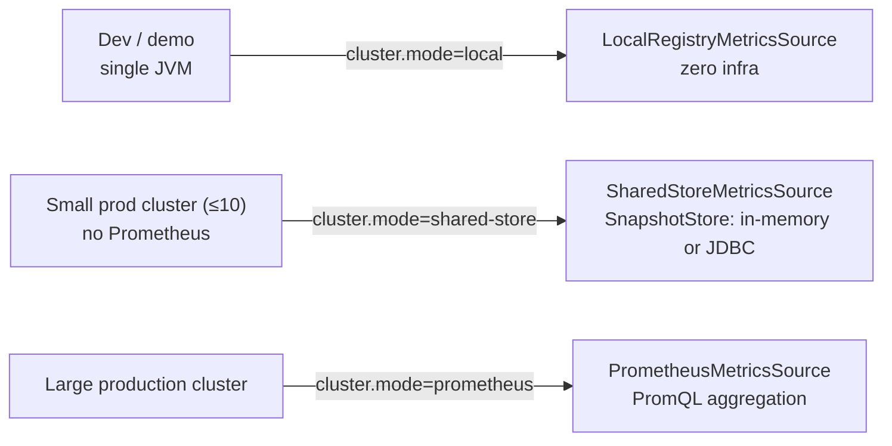
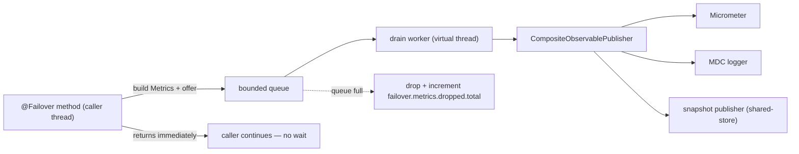
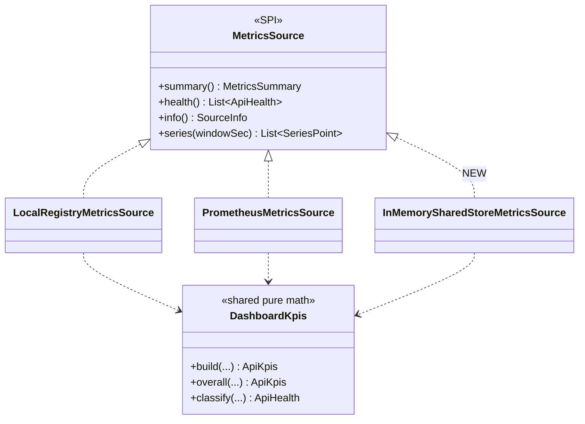
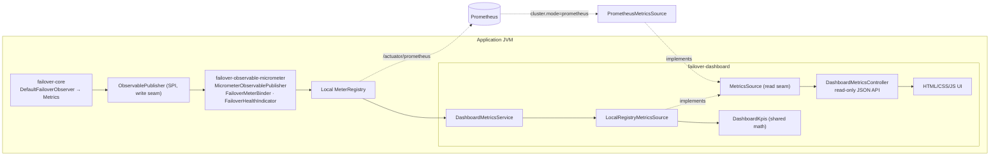
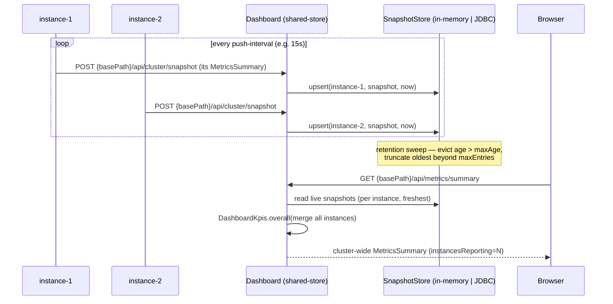
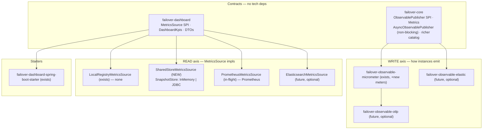
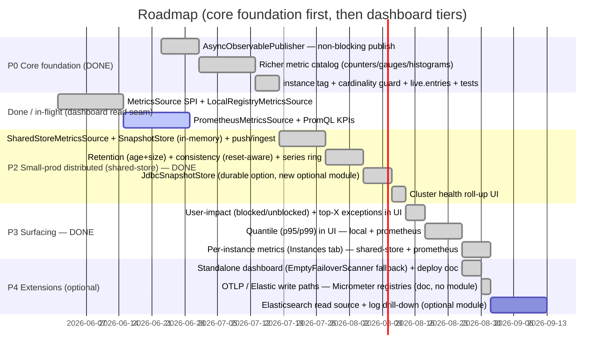

# Proposal — Redesign of Observability & Dashboard for Distributed Failover

> Response to [`redesign-observability-dashboard.md`](redesign-observability-dashboard.md)
> Status: **Phase P0 (core foundation) DELIVERED** ✅ · remaining phases draft for review · Scope: observability pipeline + dashboard, single-JVM → distributed
> Decision: **start at the core** (richer metrics + non-blocking publish, §2 — now implemented), then **align with the in-flight `MetricsSource` work** (it is the right abstraction) and add the small-prod `shared-store` tier.

---

## 1. Executive summary

The redesign does **not** start from scratch. The branch already introduced the correct seam — a `MetricsSource` SPI that decouples the dashboard UI/API from *where the numbers come from*. We keep it and build on it.

Two orthogonal extension axes, meeting only at a backend (never each other):

- **WRITE axis** — how each instance emits metrics. Today: `failover-observable-micrometer` → `/actuator/prometheus`. Future-optional: OTLP, ELK.
- **READ axis** — how the dashboard sources figures. This is the `MetricsSource` SPI. Three tiers, mirroring the failover *store* strategy ladder:

| Failover **store** analogy | Dashboard `MetricsSource` (`cluster.mode`) | Infra needed | Use case |
|---|---|---|---|
| `inmemory` | **`local`** — `LocalRegistryMetricsSource` | **none** | single JVM, dev, demo |
| `caffeine` | `local` + opt-in history ring (`DashboardHistoryService`) | **none** | single JVM with trend chart |
| *(new)* `inmemory` / `caffeine` | **`shared-store`** + in-memory snapshot store | **none** | **small prod cluster (≤10 instances)**, dev, demo |
| *(new)* `jdbc` | **`shared-store`** + JDBC snapshot store | small DB table | small prod cluster needing durability |
| `jdbc` (prod, large) | **`prometheus`** — `PrometheusMetricsSource` | Prometheus/TSDB | large production cluster |

The headline gap this proposal fills: a **self-contained distributed mode** (`shared-store`) — the dashboard analogue of the failover store strategy ladder. Spin up N instances, get cluster-correct aggregate KPIs **without standing up Prometheus**. It is **production-ready for small deployments (≤10 instances)**: a pluggable `SnapshotStore` (in-memory by default, JDBC for durability), bounded retention (age + size eviction), and **data quality/consistency as the priority over durability**. Larger clusters graduate to `prometheus`.

---

## 1b. Two answers to the distributed challenge

The same `MetricsSource` seam serves both — swap by one config line, no code change.

| | **Basic / small-prod** — distributed without Prometheus | **Robust** — large production |
|---|---|---|
| `cluster.mode` | `shared-store` | `prometheus` |
| Source impl | `SharedStoreMetricsSource` (NEW) over a `SnapshotStore` | `PrometheusMetricsSource` (in-flight) |
| Infra to stand up | **nothing** (in-memory) or a **small DB table** (JDBC) | Prometheus / TSDB |
| How instances share | peers POST their snapshot to the dashboard | Prometheus scrapes each `/actuator/prometheus` |
| Where aggregation happens | in dashboard (bounded dataset, ≤10 instances) | pushed down to PromQL (`sum`/`rate`/`quantile`) |
| State on restart | in-memory: lost · JDBC: durable | durable (TSDB) |
| Retention | **age + size eviction** (e.g. 5–10 days, configurable; oldest truncated) | TSDB retention |
| Priority | **data quality & consistency** over durability | durability + scale |
| Scale ceiling | **~10 instances** (production-supported) | unbounded |
| Trend / history | snapshots in the store (in-memory ring or DB rows) | `query_range`, survives restarts |
| Intended for | small prod clusters, dev, demo | large production |
| Failure behaviour | falls back to `local` if store unavailable | falls back to `local`, never goes dark |



Path: start `local` (single JVM) → flip to `shared-store` for a small prod cluster with **no Prometheus** (in-memory, or JDBC for durability) → flip to `prometheus` when the cluster outgrows ~10 instances. One property, three rungs, identical UI and KPI math throughout.

---

## 2. START HERE — core observability foundation (build this first)

> ✅ **DELIVERED.** Implemented, unit + integration tested, javadoc clean, backward compatible. **No new core dependencies** (JDK + existing lombok/jspecify only); micrometer-specific code lives in `failover-observable-micrometer` / `failover-spring-boot-autoconfigure`. See the [delivery summary](#2a-p0-delivery-summary) in §2a.

**Everything downstream can only display what the core emits.** Micrometer, Prometheus, the `shared-store` tier and the dashboard are all just *transports and views* over the metric stream produced in `failover-core`. So the redesign **starts in the core**, with two non-negotiable goals:

1. **Richer, more insightful metrics** — the current set (store/recover counters + one timer) is too shallow to answer "which API is degrading, on which instance, with what exceptions, and is the user actually impacted?".
2. **Publishing must never block or slow the caller's API.** Observability is invisible to the business call, always.

### 2.1 Non-blocking publish — the core contract (do this first)

Today `observablePublisher.publish(metrics)` runs **synchronously on the caller's thread** inside the handler chain (`AdvancedFailoverHandler` → … → publisher). Micrometer counter increments are cheap, but the same SPI also fans out to the MDC logger — and will fan out to remote/snapshot publishers in this proposal. **Any** of those can block or add latency to the protected business call. Not acceptable.

Solution — an `AsyncObservablePublisher` decorator in `failover-core`, mirroring the proven `failover-store-async` virtual-thread pattern:



Guarantees:

- **Caller thread does only**: build the small `Metrics` bag + a non-blocking `offer()` onto a **bounded** queue. No I/O, no lock contention, no waiting.
- A single drain worker (virtual thread) performs the real fan-out **off the hot path**.
- **Bounded + drop-on-full**: a full queue drops the metric (never blocks the caller) and increments `failover.metrics.dropped.total`, so loss is observable rather than silent. Backpressure can never reach the business call.
- Wraps the **composite**, so the non-blocking guarantee holds for every publisher — present and future.
- `@ConditionalOnMissingBean` + `failover.observable.async.{enabled,queue-capacity}`; **default on**. A sync mode (`enabled=false`) keeps integration tests deterministic — exactly the `failover.store.async=false` trick already used in the codebase.
- Hot-path cost target: O(1), allocation-light.

### 2.2 Metric catalog — emitted by core, recorded by micrometer

> Legend: *(exists)* current meter · *(extend)* add tags/buckets · *(new)* add in this redesign.

**Counters — volume & scenarios**

| Meter | Tags | Captures |
|---|---|---|
| `failover.call.total` *(new)* | `name, domain, instance, result=success\|failover` | every observed call: clean success vs failover triggered |
| `failover.recovery.outcome.total` *(extend +instance)* | `name, domain, instance, outcome=recovered\|partial\|not_recovered\|error` | the recovery scenario breakdown — full / partial / non-recovery / recover-path error |
| `failover.recovery.partial.total` *(exists)* | `name, instance, method` | scatter/gather recoveries with some slices missing |
| `failover.user.impact.total` *(new)* | `name, instance, impact=unblocked\|blocked` | **user-facing result** — *unblocked* = caller got a value (fresh or stale/recovered); *blocked* = caller got an exception. The single most business-meaningful signal |
| `failover.exception.total` *(extend +instance)* | `name, instance, exception_type, cause_type, final_cause_type` | which exception type, from which API, on which instance |
| `failover.store.async.failed.total` *(exists)* | `name, instance, operation, exception_type` | async store-layer failures inside the executor |

**Gauges — live state / "guard"**

| Meter | Tags | Captures |
|---|---|---|
| `failover.api.health` *(new)* | `name, instance` | `1.0` healthy / `0.5` degraded / `0.0` unhealthy from the rolling recovery ratio — "each API health as a guard" |
| `failover.live.entries` *(new)* | `name, domain, instance` | current stored entry count (cache footprint) |
| `failover.stale.served.ratio` *(new)* | `name, instance` | fraction of recent calls served stale |

**Timers / distributions — performance (percentiles)**

| Meter | Tags | Captures |
|---|---|---|
| `failover.operation.duration` *(extend: enable histogram)* | `name, action=store\|recover, instance` | store/recover path wall time → **p50/p95/p99** |
| `failover.upstream.duration` *(new)* | `name, instance, result=success\|failure` | latency of the protected upstream call itself, split success vs failure |
| `failover.failure.latency` *(new)* | `name, instance` | distribution of time-to-failover |

**Derived — query-time, no new meter** (keeps cardinality bounded)

- **Top-X exceptions**: `topk(N, sum by (final_cause_type, name, instance) (failover_exception_total))` — a query, never a tag.
- failover / recovery / non-recovery **rates**: ratios over the counters above (already computed by `DashboardKpis`).

### 2.3 Cardinality discipline (must hold)

- `instance` is bounded by cluster size; `name`/`domain`/`action`/`outcome`/`result`/`impact` are low-cardinality enums.
- Exception tags use **class names** (bounded). **Never** tag with exception *messages* or the **raw store key**. Top-X stays a query, not a tag.

### 2.4 Emission changes (small, additive)

- The `Metrics` bag gains a few keys (`instance`, `result`, `impact`, `upstream-duration-ns`, `live-entries`); collectors set them at the existing handler-chain call sites — the observer already centralizes emission.
- `instance` is resolved **once** at startup (e.g. `${spring.application.name}:${HOSTNAME}`, or a Micrometer common tag), never per call.
- `failover.upstream.duration` is measured around the protected call in the aspect/handler; everything else derives from data the chain already has.

This core layer is the foundation; the dashboard read tiers (§3, §5) and module layout (§6) are transports and views over it.

---

## 2a. P0 delivery summary

**Status: shipped.** What landed against the §2 plan:

**Non-blocking publish (§2.1)** — `AsyncObservablePublisher` (failover-core): bounded queue + virtual-thread drain, drop-on-full, `close()` flush. Wired as `failoverObservablePublisher` (autowire-candidate=false, resolved by name) decorating the composite; per-call handler + execution layer route through it. Toggle `failover.observable.async.enabled` (default `true`); tests force `false` for determinism.

**Metric catalog (§2.2)** — emitted from existing store/recover events (no new core handler emission, except upstream timing):

| Meter | Type | Where implemented | Status |
|---|---|---|---|
| `failover.call.total{name,domain,result}` | counter | `MicrometerObservablePublisher` | ✅ |
| `failover.user.impact.total{name,domain,impact}` | counter | `MicrometerObservablePublisher` | ✅ |
| `failover.upstream.duration{name,result}` | timer + histogram | `BasicFailoverExecution` (emit) → `MicrometerObservablePublisher` | ✅ |
| `failover.operation.duration` + percentile histogram | timer | `MicrometerObservablePublisher` | ✅ |
| `failover.api.health{name,domain}` | gauge | `FailoverApiHealthTracker` + publisher | ✅ |
| `failover.stale.served.ratio{name,domain}` | gauge | `FailoverApiHealthTracker` + publisher | ✅ |
| `failover.live.entries{name,domain}` | gauge | `FailoverStoreSizeAware` + `FailoverMeterBinder` | ✅ (in-memory/Caffeine; not JDBC/multi-tenant by design) |
| `failover.metrics.dropped.total` | counter | drop-meter binder (autoconfigure) | ✅ |
| `instance` tag (`mode: auto`) | tag | `failoverInstanceMeterRegistryCustomizer` (in `FailoverMicrometerAutoConfiguration`) | ✅ default `auto` — tags push registries, skips Prometheus (§8.3) |
| cardinality guard | MeterFilter | `failoverCardinalityMeterFilter` | ✅ default on |

**Config added:** `failover.observable.async.{enabled,queue-capacity}`, `failover.observable.instance.{mode,id}` (mode: auto|always|never), `failover.observable.cardinality.{enabled,max-apis}`.

**Modules impacted (7):** `failover-core` (no new deps), `failover-store-inmemory`, `failover-store-caffeine`, `failover-store-async`, `failover-execution-resilience`, `failover-observable-micrometer`, `failover-spring-boot-autoconfigure`. No new dependency added to any module — every framework type used was already that module's dependency.

**Key SPIs (kept in core, dependency-light):** `ObservablePublisher` (write), `FailoverStoreSizeAware` (optional capability). Per the extension rule, future framework-bound backends (OTLP, Elasticsearch) remain **separate optional modules**, gated by `@ConditionalOnClass`/`@ConditionalOnProperty` — none were needed for P0.

**Tests:** unit (`AsyncObservablePublisherTest`, `FailoverApiHealthTrackerTest`, store size-count, binder gauge, publisher catalog, execution upstream-emission) + integration (autoconfigure 267, multitenant ITs 52); javadoc clean.

---

## 3. Why align (not redo) — the dashboard read seam

The in-flight code is already the design this document would have proposed:



Three facts make this the right foundation:

1. **The seam is narrow and correct.** `MetricsSource` exposes exactly four read methods; controllers and UI never know the backend.
2. **The math is already shared.** `DashboardKpis` (pure, source-agnostic) means every tier produces identical KPI/health shapes from the same formulas — no per-backend drift.
3. **The extension slot already exists.** `DashboardProperties.Cluster.mode` accepts `local | prometheus | shared-store`, with `shared-store` documented as "arrives in a later phase". The auto-config wires the source `@ConditionalOnMissingBean`, with a graceful fallback to `local` for unknown/unreachable modes.

Redoing this would throw away a clean, tested abstraction. **Align.**

---

## 4. Current dashboard architecture (as-is, after the in-flight branch)



Works today: clean write seam, clean read seam, secure-by-default (`enabled=false`), every bean `@ConditionalOnMissingBean`. `prometheus` mode gives cluster-correct figures and **falls back to `local`** if Prometheus is unreachable, so the dashboard never goes dark.

The only missing rung: a distributed mode that needs **no external metrics infra** — and is still production-supportable for small clusters.

---

## 5. The `shared-store` mode — production-ready for small clusters (≤10 instances)

### 5.1 Problem

`local` mode behind a load balancer shows only the node that answered — "random single-instance figures". `prometheus` mode is correct but forces every team to deploy and operate Prometheus before they can see distributed aggregation at all. Many real deployments are **small** (a handful of instances) and do not want to run a TSDB just for the failover dashboard. They need a distributed view that is **correct and operable**, not just a demo.

### 5.2 Solution — peer snapshot push + pluggable `SnapshotStore`

Each instance periodically pushes its **own local KPI snapshot** (the small `MetricsSummary` it already computes) to the dashboard's ingest endpoint. The dashboard persists the latest snapshot per instance in a **`SnapshotStore`** and aggregates them on read with the **same `DashboardKpis` math**. The store is pluggable, mirroring the failover store strategy:

- **in-memory** (default) — `ConcurrentHashMap`, zero infra; consistency over durability.
- **JDBC** — a single small table, when durability across dashboard restarts is wanted; reuses the failover JDBC datasource conventions.

No Prometheus, no scrape config. Production-supported up to ~10 instances.



### 5.3 Data quality & consistency first (the priority for this tier)

Durability is explicitly **secondary**; correctness of what is shown is **primary**. Rules:

- **One row per instance = the freshest snapshot.** Upsert by `instanceId`; a late/duplicate push never double-counts. Aggregation reads at most one snapshot per instance.
- **Liveness window.** A snapshot older than `liveness-seconds` is excluded from the aggregate (peer considered silent) and surfaced in `SourceInfo` so the UI flags it — stale data is dropped, never silently summed.
- **Atomic read.** Aggregation snapshots the store once per request (point-in-time), so a concurrent push can't produce a half-merged figure.
- **Cumulative-reset awareness.** Counters are cumulative since process start; a restarted peer resets its own. The store keeps the last-known value and marks a detected reset so trend deltas don't go negative.
- **Bounded by design.** `maxInstances` (default 10) rejects/evicts beyond the supported size with a clear warning, keeping the dataset small enough that in-memory aggregation stays exact and fast.

### 5.4 Retention & eviction (bounded memory, configurable)

Two independent bounds, swept periodically and on write:

- **Age** — drop snapshots/rows older than `retention.max-age` (default e.g. `7d`; configurable 5–10 days+).
- **Size** — cap retained history at `retention.max-entries`; **oldest truncated first** when exceeded.

For the in-memory store this caps heap; for the JDBC store it caps table growth (a scheduled `DELETE WHERE timestamp < now - maxAge` plus a top-N trim). Same `RetentionPolicy` applied by both `SnapshotStore` impls — identical semantics regardless of backend.

### 5.5 New components (small, additive)

| Component | Module | Role |
|---|---|---|
| `SharedStoreMetricsSource` | `failover-dashboard` | `MetricsSource` reading the store; aggregates via `DashboardKpis` |
| `SnapshotStore` (SPI) | `failover-dashboard` | `upsert(instanceId, snapshot)` · `liveSnapshots()` · `evict(RetentionPolicy)` |
| `InMemorySnapshotStore` | `failover-dashboard` | default — `ConcurrentHashMap`, zero infra |
| `JdbcSnapshotStore` | `failover-dashboard` (JDBC gated) | durable — single table, reuses failover JDBC conventions |
| `RetentionPolicy` | `failover-dashboard` | age + size bounds, shared by both stores |
| `ClusterSnapshotController` | `failover-dashboard` | `POST {basePath}/api/cluster/snapshot` ingest (behind the existing access gate) |
| `ClusterSnapshotPublisher` | `failover-dashboard` (peer side) | scheduled `POST` of this instance's `summary()` to the dashboard URL |

`SnapshotStore` is `@ConditionalOnMissingBean` — a consumer can supply Redis/Hazelcast/etc. without touching the source or UI.

### 5.6 Config (extends the existing `Cluster` record)

```yaml
failover:
  dashboard:
    enabled: true
    cluster:
      mode: shared-store              # local | shared-store | prometheus
      shared-store:
        store: inmemory               # inmemory (default) | jdbc
        max-instances: 10             # supported small-cluster ceiling
        liveness-seconds: 45          # snapshot older than this is excluded from the aggregate
        retention:
          max-age: 7d                 # evict data older than this (5–10d typical, configurable)
          max-entries: 100000         # hard cap; oldest truncated first
        jdbc:                         # used only when store=jdbc
          table-prefix: ""
      # peer side (every instance, including non-UI nodes):
      snapshot:
        publish-url: http://dashboard-host:8080/failover-dashboard/api/cluster/snapshot
        interval-seconds: 15
```

Slots into `DashboardProperties.Cluster` next to the existing `Prometheus` sub-record — add `SharedStore` (with `Retention`, `Jdbc`) and `Snapshot` records, mirroring `Prometheus`. Auto-config: when `mode=shared-store`, wire `SharedStoreMetricsSource` over the selected `SnapshotStore`, with `local` as the same runtime fallback used for `prometheus` if the store is unavailable. Per the config-namespace convention, store-specific keys live under `shared-store.jdbc.*` (not generic `store`).

### 5.7 Honest limits (stated in the UI)

- **Supported to ~10 instances.** Beyond that, in-memory aggregation and push fan-in lose their guarantees — graduate to `prometheus`. `max-instances` enforces this with a warning.
- **in-memory store ⇒ lost on dashboard restart.** Acceptable when consistency > durability; choose `store=jdbc` when restart-survival matters.
- **Not a TSDB.** Retention is bounded history for trends, not long-term analytics. For long retention / quantiles / large fleets, use `prometheus`.

---

## 6. Module separation (full picture)



**Boundary rules (must hold):**
- READ axis never depends on WRITE axis; they meet only at a backend.
- `failover-dashboard` core depends on **no** specific backend client. Heavy backends (Elasticsearch client, etc.) go in optional sub-modules / classpath-gated beans. `local` and the in-memory `shared-store` add zero dependencies; the JDBC `SnapshotStore` is gated on a `DataSource` being present, the Elasticsearch source on its client — both optional.
- Every source bean stays `@ConditionalOnMissingBean` + `@ConditionalOnProperty(cluster.mode)` so consumers swap by config or override entirely.

---

## 7. Feedback on the original proposal

**Agree:**
- YAML-driven publish target per instance — already the `@ConditionalOnProperty` pattern. ✅
- YAML-driven dashboard source — this *is* `cluster.mode`. ✅
- Richer metrics (gauges/histograms) — strongly recommend; the full catalog is §2. ✅
- A self-contained distributed mode — **yes**, that's §5 (`shared-store`), now hardened into a small-prod tier. ✅
- **Start at the core** — agreed and made the first phase (§2, §9 P0): richer metrics + non-blocking publish before any new view. ✅

**Refine / push back:**
1. **Match aggregation locus to scale.** For large clusters (`prometheus`), push aggregation down to PromQL (`sum`, `rate`, `histogram_quantile`) — already done in `PrometheusMetricsSource`. In-dashboard aggregation is sound for `shared-store` **because** the dataset is bounded (≤10 instances, retention-capped) and reads are point-in-time — not a tryout shortcut, a deliberate small-scale design.
2. **Prometheus ≠ ELK.** Prometheus = metrics/TSDB (KPIs, rates, quantiles). ELK = events/logs (drill-down, audit, "show failures for key X"). Different questions — support both for different *views*, don't treat as swappable equals. Defer ELK to a later phase.
3. **Prefer OTLP as the strategic write path.** One vendor-neutral exporter reaches Prometheus/Elastic/Datadog — avoids a per-backend write-module matrix.
4. **Standalone dashboard.** In a cluster, embedding the UI in every instance is wasteful. The module already avoids a `failover-core` runtime dependency, so it can run as its own small Boot app pointed at a backend (or as the snapshot sink in `shared-store` mode). Recommend documenting this deployment shape.
5. **Cluster health roll-up.** The per-instance `FailoverHealthIndicator` stays for liveness, but the dashboard should show an N-healthy / M-degraded roll-up sourced via `MetricsSource.health()` — already supported across all three tiers.

---

## 8. Write-axis & backend export

The metric catalog lives in §2 (core). This section covers how `failover.*` meters **leave the JVM** to reach a backend (the *write* axis), and the naming contract.

### 8.1 Backend naming (Micrometer → Prometheus)

- Counters keep their `_total` suffix; dots → underscores: `failover.call.total` → `failover_call_total`.
- Timers/distributions export `_sum` / `_count` / `_max` in seconds; histogram buckets enable `histogram_quantile(0.95, ...)`.
- Gauges export the bare name: `failover_api_health`, `failover_live_entries`.
- Meters carry `name`/`domain` (+ `instance` per `mode` — see §8.3); the dashboard PromQL groups by these. **Never** tag with the raw store key or exception messages (§2.3).

### 8.2 No write-axis module needed (resolves open question #6)

`failover.*` are plain Micrometer meters, so **any `MeterRegistry` on the classpath auto-exports them** — no failover code is required for *any* backend. A consumer reaches Prometheus / OTLP / Elastic / Datadog by adding the matching `micrometer-registry-*` + its `management.*.metrics.export.*` config. Zero module debt; this is what ships.

**Decision: doc-only write axis. No OTLP starter, no per-backend modules.**

The only thing a starter could have added was auto-correct per-instance attribution on push backends — and that is now handled **in core** by `failover.observable.instance.mode=auto` (§8.3), with zero config. So:

- **No `failover-observable-otlp` starter** — its sole value-add (auto-enable the instance tag) is now the default behaviour; bringing `micrometer-registry-otlp` is a one-liner the consumer adds anyway, and OTel resource attributes are generic Boot/OTel config, not failover-specific.
- **Never per-backend modules** (`…-prometheus`, `…-elastic`, …) — near-empty wrappers over an existing Micrometer registry; they'd re-introduce a maintenance matrix for almost no code.

OTLP remains the **recommended** consumer choice for multi-backend setups (one vendor-neutral exporter → an OpenTelemetry Collector → fan-out to Prometheus/Elastic/Datadog), but that's a deployment recommendation, not a module we ship.

### 8.3 The `instance` tag — automatic by backend (`mode`)

The per-instance `instance` tag is governed by `failover.observable.instance.mode` (default **`auto`**). It's a mode, not a boolean, because *who supplies the tag depends on the backend* — and `auto` decides correctly **per registry** with no config:

| Backend / path | Who adds `instance`? | `auto` behaviour |
|---|---|---|
| **Prometheus scrape** (`/actuator/prometheus`) | Prometheus (the scrape target `host:port`) | **skips** the Prometheus registry → no `exported_instance` collision |
| **Push (OTLP / Elastic / Datadog / Graphite)** | nobody (no scrape target) | **tags** it → pods distinguishable |
| **Composite (Prometheus + OTLP at once)** | mixed | tags the OTLP delegate, leaves the Prometheus delegate clean — impossible with a global flag |
| **Dashboard `shared-store`** | the dashboard keys by `ClusterSnapshot.instanceId` (separate mechanism) | irrelevant to the tag |

**How it works (code):** in `auto`, a `MeterRegistryCustomizer` (in `FailoverMicrometerAutoConfiguration`, micrometer-gated) installs a `MeterFilter` on each registry **whose class name is not `*Prometheus*`**; the filter appends `instance=<id>` to `failover.*` meter ids only. `always` forces the tag on every registry (incl. Prometheus → `exported_instance`); `never` disables it.

Example — 3 pods → OTel Collector, **`auto` (default)** → three distinct series, zero config:
```
failover_call_total{name="country", result="failover", instance="orders:pod-7f3"}
failover_call_total{name="country", result="failover", instance="orders:pod-9a1"}
failover_call_total{name="country", result="failover", instance="orders:pod-c52"}
```
```yaml
failover:
  observable:
    instance:
      # mode: auto        # default — nothing to set; tags push backends, skips Prometheus
      id: ${HOSTNAME}      # optional; blank ⇒ spring.application.name + hostname (set on k8s/Docker)
```
**Configured on the `@Failover` service** (where the meters are emitted), per instance — not on the dashboard. **Caveat:** if the app already adds a global Micrometer common tag named `instance`, set `mode: never` to avoid a double tag.

---

## 9. Implementation plan (phased)



| Phase | Milestone | Exit criteria |
|---|---|---|
| **P0** ✅ **DONE** | **Core foundation (first)** | `AsyncObservablePublisher` non-blocking publish (drop-on-full + `metrics.dropped`); richer catalog (call/impact/health+stale gauges/upstream-duration/live.entries + percentile histograms); `instance` tag with `mode: auto` (per-registry, skips Prometheus — §8.3); cardinality guard; sync mode for tests. No new core deps. See §2a. |
| **P1a** ✅ **DONE** | Read seam | `MetricsSource` SPI + `LocalRegistryMetricsSource`; local mode shipped |
| **P1b** ✅ **DONE** | Prometheus tier | Cluster-correct KPIs via PromQL; p95/p99 via `histogram_quantile`; per-instance via `sum by(name,instance)`; falls back to local; `@ConditionalOnMissingBean` tests |
| **P2** ✅ **DONE** | **Small-prod distributed** | `shared-store` mode: ≤10 instances aggregate without Prometheus; in-memory + JDBC stores (JDBC in new optional module `failover-dashboard-snapshotstore-jdbc`); age+size retention; reset-aware consistency; cluster series ring; cluster health roll-up UI; tests green |
| **P3** ✅ **DONE** | Surfacing | user-impact (blocked/unblocked) KPI + top-X exceptions + API-health roll-up in UI; p95/p99 in the latency chart for **local + Prometheus** (timer publishes percentiles / `histogram_quantile` over buckets), shared-store keeps mean/max; **per-instance Instances tab** (roll-up + table + drill-down) via `MetricsSource.instances()` for **shared-store** (`SnapshotStore.liveInstances()`) and **Prometheus** (`sum by(name, instance)`) — answers "one bad node vs all"; tab hidden in `local` |
| **P4** 🟢 **mostly done** | Extensibility | ✅ standalone dashboard (no-op `FailoverScanner` fallback + deploy doc); ✅ OTLP/Elastic write paths documented as Micrometer-registry config (no failover module needed — `failover.*` meters flow with the registry). ⏳ optional `failover-dashboard-source-elastic` read source + log drill-down (deferred; needs an ES client + live ES to test) |

### Delivery log (post-plan)

- **Dashboard package refactor** — flat `dashboard.*` → `config` / `web` / `service` / `metrics` (was `dto`) / `metrics.source` / `metrics.source.prometheus` / `metrics.source.sharedstore`. Convention: each metric source in its own `metrics.source.<component>` package; promote to an optional module only when a new framework dep is required.
- **Naming aligned with failover stores** — `SnapshotStoreInmemory` / `SnapshotStoreJdbc` (not `InMemory…`/`Jdbc…`).
- **JDBC snapshot store** — table-**prefix** strategy (`shared-store.jdbc.table-prefix` + base `FAILOVER_DASHBOARD_SNAPSHOT`, prefix validated); per-dialect DDL documented. **Multi-tenancy intentionally not used** — snapshots hold only aggregate non-sensitive metrics (no business data), so one shared table; prefix handles namespacing.
- **Non-blocking publish — universal** — documented that *every* `ObservablePublisher` (built-in + custom) runs off the caller thread via the composite→`AsyncObservablePublisher` wrap; consumer note added to `observability.md`.
- **Per-instance Instances tab** — `InstanceMetrics` DTO + `MetricsSource.instances()` + `/api/instances`; UI tab (hidden in `local`) with roll-up + table + drill-down.
- **UI bug fixes** (found via preview) — Health-tab cluster roll-up now populates on direct-land (quiet `loadMetrics` on the Health view, no false "metrics unavailable" notice without Micrometer); Instances provenance/Total fixed (re-render once `SourceInfo` arrives).
- **Docs** — `docs/modules/dashboard.md`: distributed-deployment scenarios A–E, Instances + Health-rollup views, `/api/instances` + exposure `instances`/`cluster`; screenshots regenerated (overview/health) + added (instances, dark+light).
- **Code quality** — `List.get(0)` → `getFirst()` swept across both dashboard modules (JsonNode indexing left as-is); removed dead `OVERALL` field in `DashboardMetricsService`; `JsonNode.fields()` → `properties()` in `PrometheusClient` (deprecation).
- **Coverage** — added unit tests across the new cluster code (PrometheusClient range/parse, PrometheusMetricsSource series/instances edges, FailoverApiHealthTracker eviction, SnapshotStoreInmemory liveInstances, SharedStoreMetricsSource series/info/health, ClusterSeriesSampler reset/failure, RetentionPolicy, FailoverStoreAsync/DefaultFailoverStore live-count forwarding) to clear the aggregate JaCoCo gate (branch ratio **0.9524 ≥ 0.95**).

**Build status: `mvn clean verify` → BUILD SUCCESS (all 19 modules)**; aggregate branch coverage 0.9524.

P0 was the prerequisite for everything — the richer metrics and the non-blocking guarantee are now in core, so the new dashboard views have data to show. Every phase is independently shippable and backward compatible — single-JVM users keep `local` with zero config change.

### Remaining tasks

- **P4c — Elasticsearch read source** — optional `failover-dashboard-source-elastic` module implementing `MetricsSource` over Elasticsearch + a log drill-down view. Deferred: needs an ES client dependency + a live ES (or Testcontainers) to integration-test; no contrived stub worth shipping.
- **OTLP / Elastic write paths** — **closed (§8.2): no module.** Any Micrometer registry auto-exports `failover.*`; per-instance attribution on push backends is handled in core by `failover.observable.instance.mode=auto` (§8.3). No OTLP starter, no per-backend modules; OTLP is a deployment recommendation only.
- **Standalone dashboard artifact** — currently a documented deployment pattern (works via the existing module + `EmptyFailoverScanner`). Open question: ship a runnable Boot app artifact (open question #5) — not yet decided.
- **Live deltas not coverable cheaply** — a few defensive/threaded branches remain uncovered by design (e.g. `AsyncObservablePublisher` drop-log-every-Nth, scheduler timeouts, `FailoverFailureAnalyzer` unreachable bean-description fallbacks); aggregate gate is met without them.
- **Optional polish** — `failover.metrics.dropped.total` alerting guidance in docs; per-instance Prometheus trend (Instances tab currently shows per-instance KPIs, not per-instance time series).

---

## 10. How the design meets the stated requirements

| Requirement | How |
|---|---|
| **Scalable** | Small clusters: bounded `shared-store` (≤10, retention-capped); large clusters: `prometheus` pushes aggregation to TSDB; dashboard stateless; standalone deploy |
| **Performant (caller)** | **Non-blocking publish** — `AsyncObservablePublisher` keeps metric emission off the caller thread; bounded queue + drop-on-full so the `@Failover` API is never blocked or slowed |
| **Extendable** | Core `ObservablePublisher` write SPI + read `MetricsSource` SPI + pluggable `SnapshotStore` (in-memory/JDBC/custom); new tier/backend = one bean |
| **Flexible** | `cluster.mode` (`local`/`shared-store`/`prometheus`) selects read source; `shared-store.store` selects durability; write target by `@ConditionalOnProperty` — all independent |
| **User-friendly** | Secure-by-default embedded UI; distributed view with **no Prometheus** for small teams; roll-up + drill-down; provenance/freshness badges |
| **Performant** | No in-app aggregation at large scale; `shared-store` bounded by instance cap + age/size retention; point-in-time reads; bounded tag cardinality |
| **Modular** | Read ⟂ write; zero-dep tiers in core dashboard, heavy backends in optional modules; shared `DashboardKpis` math + shared `RetentionPolicy` |

---

## 11. Open questions for review

Most original questions are now resolved by the implementation (marked ✅ with the decision taken); the rest remain open.

1. ✅ Non-blocking publish — **drop-on-full** chosen, with a visible `failover.metrics.dropped.total` counter.
2. ✅ `failover.upstream.duration` — measured in `BasicFailoverExecution` (covers the Resilience subclass); success/failure as a **tag**.
3. ✅ `shared-store` — **push-based** (peers POST snapshots); no peer discovery needed.
4. ✅ JDBC `SnapshotStore` — **reuses** the failover JDBC datasource conventions, separate table with validated `table-prefix`.
5. ✅ Default retention — `max-age=7d`, `max-entries=100000` for the small-cluster profile.
6. ✅ Write-axis modules — **decided (§8.2): no module at all.** `failover.*` are plain Micrometer meters auto-exported by any registry; the only failover-specific concern (per-instance attribution on push backends) is now handled in core by `failover.observable.instance.mode=auto` (§8.3). No OTLP starter, no per-backend modules. OTLP stays the *recommended* consumer deployment, not shipped code.
7. ⏳ Standalone dashboard — ship a runnable Boot artifact, or keep the documented pattern? (Not yet decided.)
8. ⏳ ELK — defer to **P4c** (optional read-source module + log drill-down); not yet built.
